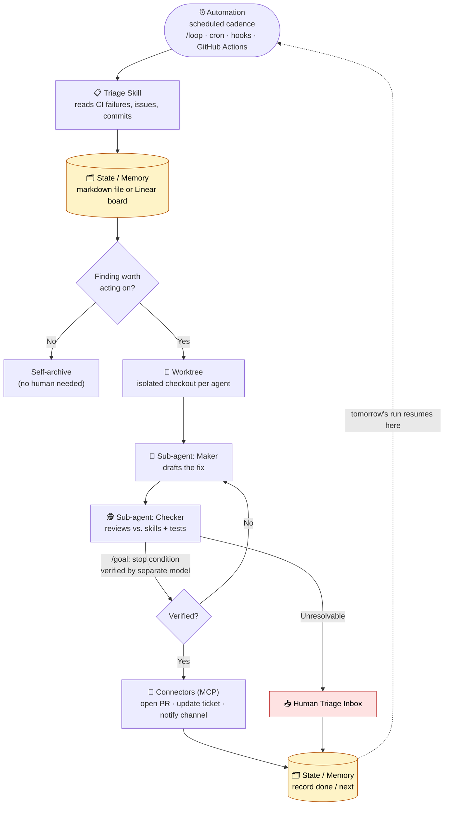

# Loop Engineering

## Overview

Loop engineering is the practice of designing a system that prompts a coding agent on your behalf, rather than prompting the agent yourself turn by turn. Where [harness engineering](./harness-engineering.md) is about building the guides and sensors a single agent run operates inside, loop engineering sits one layer above it: a harness that runs on a timer, spawns its own helpers, and feeds itself work — without a human typing the next instruction.

The framing comes from two practitioners close to the major coding-agent products. Peter Steinberger: "You shouldn't be prompting coding agents anymore. You should be designing loops that prompt your agents." Boris Cherny, head of Claude Code at Anthropic: "I don't prompt Claude anymore. I have loops running that prompt Claude and figuring out what to do. My job is to write loops."

For roughly two years, getting value from a coding agent meant a human held the tool the entire time — write a prompt, read the output, write the next prompt, one turn at a time. Loop engineering replaces that posture with a small system that finds the work, hands it to an agent, checks the result, records what happened, and decides the next action — and the human reviews the system's output rather than driving every turn.

A notable shift: a year prior, building a loop meant writing and maintaining a pile of custom bash scripts. As of this writing, the primitives a loop needs ship inside the agent products themselves (OpenAI's Codex app and Claude Code expose nearly identical capability sets), so the design question is no longer "which tool" but "how do I compose a loop that still works regardless of which tool I'm sitting in."

## The Six Pieces of a Loop

A loop needs five capability primitives plus one place to remember state:

| # | Primitive | Job in the Loop |
|---|---|---|
| 1 | Automations | Run discovery and triage on a schedule, without a human present |
| 2 | Worktrees | Isolate parallel agents so they don't collide on the same files |
| 3 | Skills | Codify project knowledge the agent would otherwise have to guess |
| 4 | Plugins / connectors | Plug the agent into the tools the team already uses (trackers, APIs, chat) |
| 5 | Sub-agents | Split the agent that proposes work from the agent that checks it |
| 6 | State / memory | A markdown file, Linear board, or similar store outside the conversation that records what's done and what's next |

The sixth piece is the one that makes the other five durable: a model forgets everything between runs, so the memory has to live on disk, not in context — "the agent forgets, the repo doesn't." This is the same constraint that governs any long-running agent design: state must be externalized because the context window is not persistent storage.

### Primitive Mapping: Codex App vs. Claude Code

| Primitive | Job in the Loop | Codex App | Claude Code |
|---|---|---|---|
| Automations | Discovery + triage on a schedule | Automations tab: pick project, prompt, cadence, environment; results land in a Triage inbox; `/goal` for run-until-done | Scheduled tasks and cron, `/loop`, `/goal`, hooks, GitHub Actions |
| Worktrees | Isolate parallel features | Built-in worktree per thread | `git worktree`, `--worktree` flag, `isolation: worktree` setting on a subagent |
| Skills | Codify project knowledge | Agent Skills (`SKILL.md`), invoked with `$name` or implicitly by description match | Agent Skills (`SKILL.md`), same convention |
| Plugins / connectors | Connect the agent to real tools | Connectors (MCP) plus plugins for distribution | MCP servers plus plugins |
| Sub-agents | Ideate and verify | Subagents defined as TOML in `.codex/agents/` | Task subagents in `.claude/agents/`, agent teams |
| State | Track what's done | Markdown or Linear via a connector | Markdown (AGENTS.md, progress files) or Linear via MCP |

The names differ slightly between products, but the underlying capability is the same in each row — which is why a loop designed against the shape of the primitives, rather than against a specific tool's API, survives a tool switch.

## Automations — the Heartbeat

Automations are what turn a loop into an actual loop rather than a single run executed once.

**Codex app**: an Automations tab lets you pick the project, the prompt to run, the cadence, and whether it runs against your local checkout or a background worktree. Runs that find something land in a Triage inbox; runs that find nothing archive themselves automatically. OpenAI reports using automations internally for daily issue triage, summarizing CI failures, writing commit briefings, and hunting bugs introduced the prior week. An automation can call a skill, so the recurring job stays maintainable — firing `$skill-name` instead of pasting a large wall of instructions into a schedule definition nobody will update.

**Claude Code**: reaches the same outcome through scheduling and hooks rather than a dedicated automations tab. `/loop` re-runs a prompt or command on an interval; cron-scheduled tasks run independently; hooks fire shell commands at defined points in the agent lifecycle; GitHub Actions keeps the loop running after the local session ends.

### `/loop` vs. `/goal`

Both products expose a second, in-session primitive that is closer to the core idea of loop engineering than scheduling alone:

- **`/loop`** re-runs on a fixed cadence.
- **`/goal`** keeps the agent working across turns until a condition the user wrote is actually true. After every turn, a separate, smaller model checks whether the stopping condition holds — the agent that wrote the work is not the one that grades it. A typical goal: "all tests in `test/auth` pass and lint is clean," after which the human walks away. Codex's `/goal` is functionally identical: it keeps working across turns until a verifiable stopping condition holds, with pause, resume, and clear controls.

This maker/checker split applied to the *stop condition itself* is the same structural pattern used for sub-agent verification (below) — it is the mechanism that makes "the loop says it's done" mean something more than the agent's own self-assessment.

## Worktrees — Parallel Without Chaos

The moment more than one agent runs against a repository, file collisions become the dominant failure mode — the same problem as two engineers committing to the same lines without coordinating. A git worktree resolves this structurally: it is a separate working directory on its own branch that shares the same repository history, so one agent's edits cannot physically touch another agent's checkout.

- **Codex** builds worktree support in natively — several threads can hit the same repository concurrently without colliding.
- **Claude Code** provides the same isolation via `git worktree`, a `--worktree` flag to open a session in its own checkout, and an `isolation: worktree` setting that gives a subagent a fresh, self-cleaning checkout.

Worktrees remove the *mechanical* collision problem, but they do not raise the ceiling on how many agents a team can productively run — human review bandwidth remains the limiting factor (the "orchestration tax"). Parallelizing agents is not the same as parallelizing the review capacity needed to safely merge their output.

## Skills — Stop Re-Explaining the Project

A skill is the mechanism for not re-explaining the same project context every session. Both products use the same authoring format: a folder containing a `SKILL.md` with instructions and metadata, plus optional scripts, references, and assets. Codex runs a skill when invoked with `$name` or `/skills`, or automatically when a task matches the skill's description — which is why a precise, boring description outperforms a clever one. Claude Code follows the identical pattern.

Skills are where the cost of unstated intent stops compounding every session. An agent starts each session cold and will fill any gap in stated intent with a confident guess; a skill is that intent written down externally — conventions, build steps, the reasons a particular approach is avoided — read by the agent on every run instead of re-derived from nothing. Without skills, a loop re-derives the entire project context from zero each cycle; with skills, that knowledge compounds across cycles instead.

**Skill vs. plugin**: the skill is the authoring format; the plugin is the distribution mechanism. To share a skill across repositories, or bundle several together, package them as a plugin. This distinction holds in both Codex and Claude Code.

## Plugins and Connectors — Reaching Real Tools

A loop that can only see the filesystem is a narrow loop. Connectors, built on [MCP](../Standards/mcp.md), let the agent read an issue tracker, query a database, hit a staging API, or post to a chat channel. Both Codex and Claude Code speak MCP, so a connector built for one product generally works unmodified in the other. Plugins bundle connectors and skills together so a teammate can install an entire setup in one step instead of rebuilding it from memory.

Connectors are the difference between an agent that reports "here is the fix" and a loop that opens the pull request, links the tracking ticket, and posts to the team channel once CI passes — autonomously. Without connectors, the loop can only describe what it would do; with them, it acts inside the team's actual environment.

## Sub-agents — Separate the Maker from the Checker

The single most useful structural choice in a loop is splitting the agent that writes the work from the agent that checks it. A model grading its own output is too lenient on itself; a second agent, with different instructions and sometimes a different model, catches failure modes the first agent talked itself into.

- **Codex** spawns subagents only on request, runs them concurrently, and folds the results back into one answer. Subagents are defined as TOML files in `.codex/agents/`, each with a name, description, instructions, and optional model/reasoning-effort overrides — so a security-reviewer subagent can run a strong model at high reasoning effort while an explorer subagent runs a fast, read-only model.
- **Claude Code** provides the same pattern via subagents in `.claude/agents/` and agent teams that pass work between sessions.

The common split is: one agent explores, one implements, one verifies against the spec. This matters specifically inside a loop because the loop runs unattended — a verifier the operator trusts is the only reason it is safe to walk away. Sub-agents burn more tokens, since each spawns its own model and tool calls, so the split is worth paying for where a second opinion has measurable value, not applied uniformly. `/goal`'s separate grading model (above) is this exact pattern applied to the stopping condition rather than to a deliverable.

## Composed Example

A representative loop, combining all six pieces:

1. An automation runs every morning against the repository.
2. Its prompt invokes a triage skill that reads the prior day's CI failures, open issues, and recent commits, and writes findings to a markdown file or Linear board.
3. For each finding worth acting on, the loop opens an isolated worktree and dispatches a sub-agent to draft a fix.
4. A second sub-agent reviews that draft against the project's skills and existing tests.
5. Connectors open the pull request and update the tracking ticket.
6. Anything the loop cannot resolve lands in a triage inbox for a human.
7. The state file is the spine: it records what was tried, what passed, and what remains open, so the next morning's run resumes where the previous run stopped.

The operator designed this system once and did not prompt any individual step — the practical realization of "design loops that prompt your agents." The same loop design transfers between Codex and Claude Code because the underlying primitives are the same.

The diagram makes the structural point of the article visible: the only two places a human necessarily appears are the **Triage Inbox** (unresolved findings) and as the designer of the loop itself — every other arrow is the system prompting itself. The **State / Memory** store (amber) is what closes the loop across days; without it, each scheduled run would re-discover the same findings from zero.

## What the Loop Still Does Not Do

The loop changes the shape of the work; it does not remove the human from it. Three problems get *sharper*, not easier, as the loop improves:

| Problem | Why It Persists |
|---|---|
| Verification is still on the operator | An unattended loop is also a loop making unattended mistakes. The maker/checker split exists to make the loop's "it's done" mean something, but "done" remains a claim, not a proof — the operator's job is still to ship code they have confirmed works. |
| Understanding rot | The faster a loop ships code the operator did not write, the larger the gap between what exists in the repository and what the operator actually comprehends — a gap that compounds the smoother the loop runs, unless the output is actually read. |
| Cognitive surrender | An unattended, well-running loop makes it tempting to stop forming an opinion about the work and accept whatever the loop returns. Designing a loop with judgment is a force multiplier; designing the same loop to avoid thinking is an accelerant toward the same failure — identical action, opposite outcome. |

Two operators can build the structurally identical loop and arrive at opposite outcomes: one uses it to move faster on work they understand deeply; the other uses it to avoid understanding the work at all. The loop itself cannot distinguish the two cases — only the operator can. This is why loop design is harder than prompt engineering rather than easier: the work did not get simpler, the point of leverage moved from the individual prompt to the system that generates prompts, and the judgment required to use that leverage well did not disappear.

## Example Implementations

Cobus Greyling's [loop-engineering examples repository](https://github.com/cobusgreyling/loop-engineering/tree/main/examples/claude-code) provides concrete Claude Code loop definitions that put the six-primitive model into practice as ready-to-run automation prompts:

| Example | Loop Purpose |
|---|---|
| `changelog-drafter` | Generates a draft changelog entry from recent merged commits/PRs |
| `ci-sweeper` | Scans recent CI run failures and proposes fixes or flags flaky tests |
| `daily-triage` | Daily scheduled scan of new issues and CI failures, writing findings to a triage state file |
| `dependency-sweeper` | Checks for outdated or vulnerable dependencies and drafts update PRs |
| `issue-triage` | Classifies and labels incoming issues against project conventions |
| `post-merge-cleanup` | Runs housekeeping tasks (stale branch removal, follow-up TODOs) after a PR merges |
| `pr-babysitter` | Watches an open PR, responds to review comments, and re-runs CI until green |

Each example is a self-contained prompt/skill that maps onto the automations + state primitives described above — `daily-triage` and `pr-babysitter` in particular mirror the Composed Example's "automation runs, writes to state, hands off to a human inbox when unresolved" shape. They serve as a practical starting point for teams designing their own loop rather than building automation prompts from a blank file.

## Best Practices

| Challenge / Area | Description | Solution / Recommendation |
|---|---|---|
| Treating loop design as tool-specific | Building bespoke bash automation tied to one product's API | Design against the six primitives (automations, worktrees, skills, connectors, sub-agents, state), not a specific product's surface — the same shape transfers between Codex and Claude Code |
| Parallel agents colliding on files | Two agents editing the same files without coordination | Always isolate parallel agent work in worktrees, one branch/checkout per agent |
| Re-deriving project context every cycle | Loop quality stagnates because the agent re-guesses conventions each run | Encode project knowledge as skills so intent compounds across cycles instead of resetting |
| Agent self-grading its own output | The loop accepts its own work as "done" with no independent check | Apply a maker/checker split — separate sub-agent or model for verification, including for the stop condition itself (`/goal`) |
| Loop that can only describe, not act | Agent reports what it would do but cannot execute | Add connectors (MCP) so the loop can open PRs, update trackers, and notify channels directly |
| Unattended scaling without review capacity | Running more parallel loops than the team can review | Recognize human review bandwidth, not tooling, as the ceiling on safe parallelism (orchestration tax) |
| Treating "loop ran successfully" as proof of correctness | Operator stops reviewing once the loop reports success | Verification remains a human responsibility; "done" from the loop is a claim, not a guarantee |
| Losing comprehension of a fast-shipping loop | Code volume grows faster than the operator's understanding of it | Read what the loop produces; do not let shipping velocity outpace comprehension |

## See Also

- [Harness Engineering](./harness-engineering.md) — the per-run guides/sensors discipline that loop engineering builds on top of
- [Agent Harness](./agent-harness.md) — core harness components (hooks, orchestration, memory) referenced by loop primitives
- [Claude Code Orchestration Primitives — Decision Guide](../WorkflowBuilders/claude-orchestration-guide.md) — decision framework for Skills, Subagents, Agent Teams, MCP within a single Claude Code session
- [AI Coding Agents](../AgenticFrameworks/ai-coding-agents.md) — full comparison of Claude Code, OpenAI Codex, and other coding agent products
- [Model Context Protocol (MCP)](../Standards/mcp.md) — the connector standard underlying plugins/connectors
- [Agent Skills Standard](../Standards/skills.md) — SKILL.md authoring convention
- [Production Best Practices: Deployment](../ProductionBestPractices/deployment.md) — goal-like loops, step budgets, and scheduling patterns
- [Production Best Practices: State & Memory](../ProductionBestPractices/state-memory.md) — externalized state patterns for long-running agents
- [AllThingsAnthropic](../AllThingsAnthropic/README.md)
- [AllThingsOpenAI](../AllThingsOpenAI/README.md)

## References

- [Loop Engineering — Addy Osmani](https://addyosmani.com/blog/loop-engineering/) — source for the five-plus-one primitive framework, the Codex app/Claude Code comparison table, and the verification/comprehension-rot/cognitive-surrender risks of unattended loops
- [cobusgreyling/loop-engineering — Claude Code examples](https://github.com/cobusgreyling/loop-engineering/tree/main/examples/claude-code) — example loop prompts (changelog-drafter, ci-sweeper, daily-triage, dependency-sweeper, issue-triage, post-merge-cleanup, pr-babysitter)
