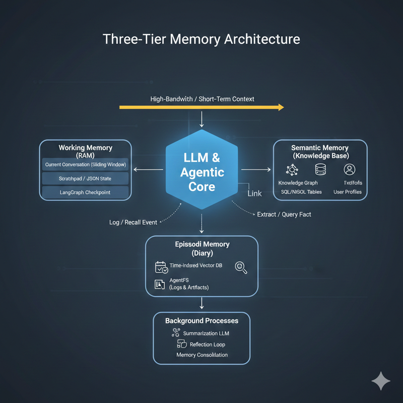

# Agent Memory Management

Memory management is the "engine" that enables an AI agent to move from a one-shot calculator to a persistent entity. It is essentially the art of deciding what to keep in the expensive, high-speed Context Window and what to offload to External Storage.

## Overview

Agent memory management encompasses the strategies, techniques, and architectures that enable AI agents to maintain state, learn from experience, and accumulate knowledge over time. Effective memory management is crucial for building agents that can handle complex, multi-session interactions while maintaining performance and coherence.

## Core Concepts of Memory Management

| Concept | Description | Analogy |
|---|---|---|
| Statefulness | The ability to track where an agent is in a multi-step workflow. | A saved game in a video game. |
| Paging / Swapping | Moving data between the "Active Context" and "Long-term Storage" as needed. | RAM vs. Hard Drive. |
| Context Engineering | Curating the prompt dynamically so only the most relevant 1% of data is sent to the LLM. | A desk where you only keep the files for your current task. |
| Reflection | A background process where the agent "thinks" about past logs to update its own memory. | Journaling before bed to remember lessons learned. |

## The Three Functional Tiers

### Short-term (Working Memory)
- **Purpose**: Stores contextual information generated during the current task
- **Logic**: Managed via Checkpointers or Sliding Windows
- **Goal**: Maintain the flow of the current conversation thread
- **Cleanup**: When it gets too full, it is either summarized or truncated

### Episodic Memory (Experience)
- **Logic**: A searchable log of specific events, often stored in Vector DBs or AgentFS
- **Goal**: Answering "What did we do last time?" or "Why did that tool fail yesterday?"
- **Storage**: High-fidelity logs with timestamps and outcome metadata

### Long-term or Semantic Memory (Knowledge)
- **Purpose**: Persists across sessions to accumulate reusable knowledge and experience
- **Logic**: Abstracted facts and rules (e.g., "The user hates Python"). Often stored in Knowledge Graphs
- **Goal**: Provide a consistent "personality" and set of core beliefs that don't change based on the current thread

*Agent Memory Architecture - The three functional tiers working together*

## Management Techniques in 2025

### Explicit Management
The agent uses a tool (e.g., save_memory("user prefers dark mode")) to consciously store a fact.

### Implicit Management
A separate, smaller LLM monitors the conversation in the background, extracts key insights, and updates the memory database automatically.

### Just-In-Time (JIT) Context
Instead of giving the agent a massive prompt, the agent uses tools to "lookup" what it needs (e.g., searching its own AgentFS files) only when a question requires it.

## Long-Term Memory (LTM) Strategies

| Strategy | Mechanism | Best For | Storage Type |
|---|---|---|---|
| Vector RAG | Text is embedded into numerical vectors; retrieved based on mathematical "closeness" to a query. | Fuzzy matching, semantic search, and general knowledge retrieval. | Vector DB (Pinecone, Chroma) |
| Knowledge Graphs | Maps data as nodes (entities) and edges (relationships), e.g., "User" -> "owns" -> "Macbook." | Relational reasoning, factual rigor, and multi-hop questions (e.g., "Who approved X's budget?"). | Graph DB (Neo4j, FalkorDB) |
| Entity Extraction | LLM extracts specific facts (names, dates, preferences) into structured tables. | Personalization and fixed attributes (e.g., "The user is allergic to peanuts"). | SQL / NoSQL (Postgres, Redis) |
| Incremental Summary | Periodically condenses old interaction logs into a running "narrative" or profile. | Long-term context without keeping every message word-for-word. | Text / Markdown files |
| Reflection / Consolidation | A background loop where the agent reviews its own logs to extract "learnings" or success patterns. | Continuous improvement and self-correction (e.g., "Method A failed twice; use Method B next time"). | AgentFS / Specialized DB |
| Episodic Memory | Stores specific past events as discrete "episodes" with timestamps. | Temporal reasoning and recalling "What exactly happened last Tuesday?" | Structured Logs / Metadata |

## Research Papers & Technical White Papers

| **Resource Title** | **Source / Authors** | **Format** | **Link** |
|---|---|---|---|
| MemGPT: Towards LLMs as Operating Systems | Packer et al. (UC Berkeley) | ArXiv Paper | https://arxiv.org/abs/2310.08560 |
| Generative Agents: Interactive Simulacra | Park et al. (Stanford/Google) | ArXiv Paper | https://arxiv.org/abs/2304.03442 |
| Cognitive Architectures for Language Agents (CoALA) | Sumers et al. (Princeton) | ArXiv Paper | https://arxiv.org/abs/2309.02427 |
| MemoryBank: Enhancing LLMs with Long-Term Memory | Zhong et al. | ArXiv Paper | https://arxiv.org/abs/2305.10250 |
| AgentFS: The Missing Abstraction | Turso | White Paper | https://turso.tech/blog/agentfs-the-missing-abstraction-for-the-agent-ic-world |
| The Mem0 Memory Layer Architecture | Mem0.ai | Technical Blog | https://docs.mem0.ai/overview |
| Graphiti: Temporal Knowledge Graphs | Zep | GitHub Docs | https://github.com/getzep/graphiti |
| LangMem: Long-term Learning Specs | LangChain | Technical Blog | https://blog.langchain.dev/langmem/ |
| Awesome-LLM-Memory (Curated List) | GitHub Community | Repo | https://github.com/mshumer/Awesome-LLM-Memory |

## Short-term Memory Management Solutions

| **Category** | **Solution / Technique** | **Memory Philosophy** | **Best For** |
|---|---|---|---|
| Frameworks | LangGraph Checkpoints | Stateful Threads | Saving the exact "snapshot" of a multi-step workflow. |
| Frameworks | LangChain Window | Sliding Buffer | Keeping only the last N interactions to save tokens. |
| Frameworks | Letta (MemGPT) | Virtual Context | Dynamically swapping info in/out of the context window. |
| In-Memory | Redis / Upstash | Ephemeral Cache | Low-latency session storage for high-speed chat apps. |
| Managed | OpenAI Threads | Stateful API | Hands-off management of current conversation history. |
| Technique | Summarization | Recursive Compression | Condensing old messages into a brief "recap" to save space. |
| Technique | Scratchpad | Working Draft | Agent-written notes used only for the current task logic. |

## Long-term Memory Management Solutions

### Mem0

[Mem0](https://mem0.ai/) is an Apache License, fully supported memory model for agents that pioneered sharing initial research in the field. It provides a universal, self-improving memory layer that semantically extracts and stores user preferences and past interaction facts across sessions to provide highly personalized AI experiences.

*Mem0 Memory Architecture*

**Key Features**:
- Automatic extraction and refinement of user facts and preferences
- Cross-session memory persistence
- Self-improving memory capabilities
- Apache License with full community support

**Research Foundation**: [Research Paper on Long-term Memory](https://arxiv.org/abs/2504.19413)

### MemMachine

[MemMachine](https://github.com/MemMachine/MemMachine) is an open source solution that supports three distinct memory types:
- **Working (Short Term)**: Current task and conversation context
- **Persistent (Long Term)**: Cross-session knowledge and facts
- **Personalized (Profile)**: User-specific preferences and characteristics

### Zep

[Zep](https://www.getzep.com/) is a context engineering platform that uses a temporal knowledge graph to help AI agents remember, summarize, and retrieve relevant facts and conversation history across long-term user sessions. Zep is powered by Graphiti, an open-source temporal knowledge graph framework.

**Key Features**:
- Temporal knowledge graph architecture
- Conversation history summarization
- Fact extraction and relationship mapping
- Community edition available (note: no longer actively supported)

## Short-term Memory Techniques

| Technique | Logic | Primary Benefit |
|---|---|---|
| Sliding Window | Retains only a fixed number of the most recent messages, discarding the oldest once the limit is reached. | Prevents "out of memory" errors and maintains low latency. |
| Token Trimming | Dynamically calculates and removes the minimum number of tokens from the start of the history to fit the model's limit. | Maximizes the use of the available context window without crashing. |
| Recursive Summarization | Periodically condenses older parts of the conversation into a short paragraph while keeping the recent messages in full. | Preserves long-term narrative context while saving significant token space. |
| Message Selection | Uses a "supervisor" model to retrieve only the past messages that are relevant to the current user query. | Highly efficient for complex, non-linear tasks where only specific historical facts matter. |
| Scratchpad / Working Memory | Provides a dedicated space (like a file or hidden block) for the agent to store intermediate thoughts and calculations. | Offloads technical complexity from the main chat history to keep the conversation clean. |
| Context Pinning | Locks vital information (like system instructions or core user preferences) so they are never discarded by trimming. | Ensures the agent never forgets its primary persona or mission. |

## Working Memory (Filesystem)

### AgentFS

[AgentFS](https://github.com/tursodatabase/agentfs) is a portable, SQLite-backed virtual filesystem that acts as a persistent "hard drive" for AI agents, allowing them to manage files, key-value state, and tool logs in a structured way that complements orchestration frameworks.

**Key Features**:
- Portable SQLite-backed storage
- Virtual filesystem interface
- Tool log management
- Framework-agnostic design
- Single movable .db file architecture

## Comparative View of Memory Solutions

| Solution | Provider | Memory Philosophy | Core Technology | Key Strength |
|---|---|---|---|---|
| AgentFS | Turso | The Hard Drive | Portable SQLite | Filesystem-like persistence in a single, movable .db file. |
| Mem0 | Independent | The Assistant | Vector / Graph | Automatically extracts and refines user facts/preferences. |
| Zep | Independent | The Historian | Temporal Graph | Tracks how facts and knowledge evolve over a timeline. |
| Letta | Independent | The OS | Virtual Memory | Self-managed "RAM" and "Disk" for autonomous context. |
| LangMem | LangChain | The Brain | Managed SaaS | Deeply integrated long-term learning for LangGraph nodes. |
| Bedrock Memory | AWS | Enterprise Store | Managed AWS | Seamless scaling and compliance for Bedrock agents. |
| Vertex Memory | Google | Managed Bank | Google Cloud | Native "evolving" memory for the Gemini ecosystem. |
| Foundry Memory | Azure | Managed State | Microsoft Cloud | Enterprise-grade state management within Azure OpenAI. |

## Implementation Best Practices

### Memory Architecture Design

1. **Tiered Approach**: Implement all three memory tiers (short-term, episodic, long-term) for comprehensive coverage
2. **Appropriate Storage**: Match storage technology to memory type and access patterns
3. **Efficient Retrieval**: Design indexing and search strategies for fast memory access
4. **Memory Lifecycle**: Implement clear policies for memory creation, update, and deletion

### Performance Optimization

1. **Caching Strategies**: Cache frequently accessed memory elements
2. **Lazy Loading**: Load memory content only when needed
3. **Compression**: Use appropriate compression for long-term storage
4. **Indexing**: Maintain efficient indexes for fast retrieval

### Privacy and Security

1. **Access Control**: Implement proper permissions for memory access
2. **Encryption**: Encrypt sensitive memory content
3. **Isolation**: Ensure memory isolation between different users/sessions
4. **Audit Trails**: Maintain logs of memory access and modifications

## Future Directions

### Emerging Trends

- **Adaptive Memory Management**: AI-driven optimization of memory strategies
- **Cross-Agent Memory Sharing**: Standardized protocols for memory exchange
- **Federated Memory**: Distributed memory systems across multiple agents
- **Memory Compression**: Advanced techniques for efficient memory storage

### Research Opportunities

- **Memory Quality Metrics**: Standardized measures for memory effectiveness
- **Automated Memory Optimization**: Self-tuning memory management systems
- **Memory Interoperability**: Standards for memory sharing across platforms
- **Cognitive Memory Models**: Brain-inspired memory architectures for AI agents

## Related Topics

- [Context Engineering](../ContextEngineering/README.md): For context management strategies
- [Self-Learning Agents](../ReferenceArchitecture/self-learning-agents.md): For adaptive memory systems
- [RAG Architecture](../ReferenceArchitecture/rag-architecture.md): For retrieval-based memory patterns

## See Also

- **[Context Engineering](../ContextEngineering/README.md)**: Context management strategies
- **[Agent Development Frameworks](../AgenticFrameworks/README.md)**: Framework support for memory management
- **[Reference Architecture](../ReferenceArchitecture/README.md)**: Memory architectures and patterns
- **[Evaluation Frameworks](../EvaluationFrameworks/Readme.md)**: Testing memory system performance
