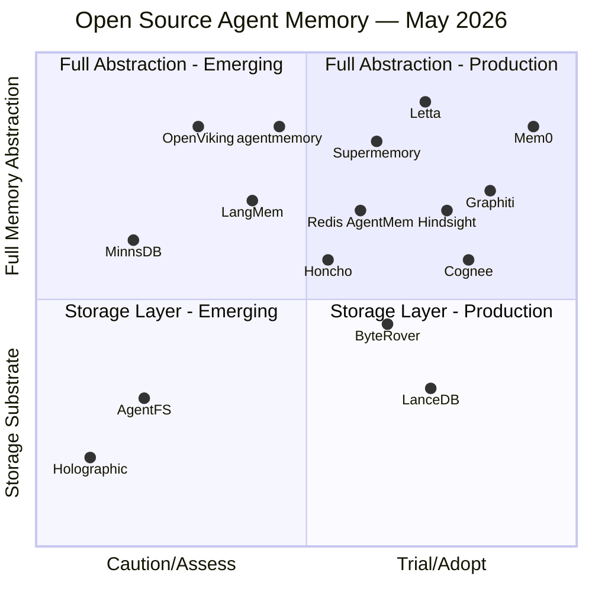
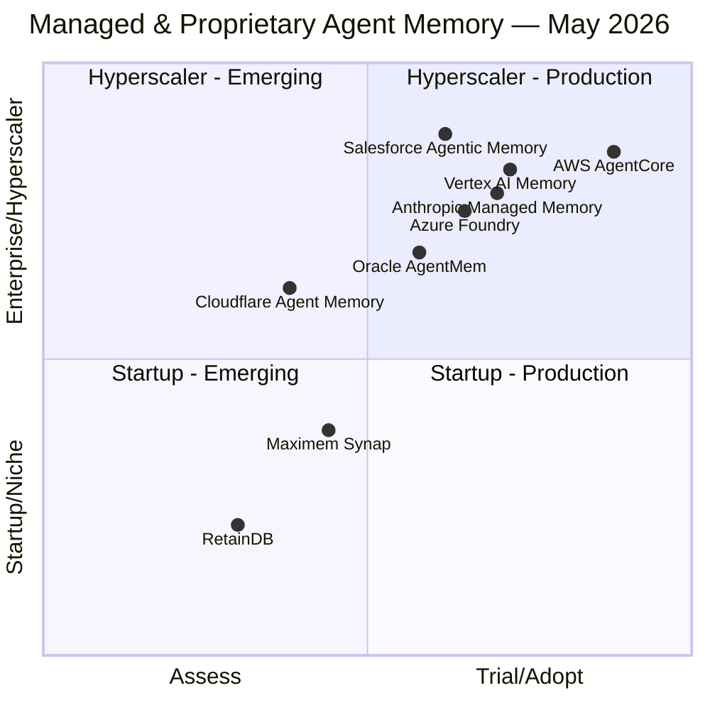

# Agent Memory Solutions

## Overview

This page consolidates all memory solutions — open-source libraries, managed cloud services, and specialized platforms — and maps them to a **Technology Radar** adapted from the [Thoughtworks Radar](https://www.thoughtworks.com/radar) methodology. Each solution is assessed across five dimensions: research backing, industry adoption, GitHub community signal, production readiness, and open-source availability.

The four radar rings:

| Ring | Meaning |
|---|---|
| **Adopt** | Proven in production. Strong community signal. Recommended as the default choice for new projects. |
| **Trial** | Worth using on projects that can tolerate some risk. Actively growing adoption. Evaluate for your use case. |
| **Assess** | Interesting and worth understanding. Not yet proven at scale. Monitor before committing. |
| **Caution** | Use with care. May be early-stage, deprecated, narrowly scoped, or vendor-locked in ways that limit flexibility. |

---

## Technology Radar

Solutions are split across two charts to avoid label clutter. Both share the same x-axis (ring position: Caution → Adopt). The y-axis differs per chart and is labelled on each.

**How to read:**
- **Right side** (x > 0.5) = Trial or Adopt — production-ready, recommended for evaluation
- **Left side** (x < 0.5) = Assess or Caution — early-stage or narrowly scoped
- Quadrant labels indicate the combination of ring position and the chart-specific y-axis dimension

### Chart 1 — Open Source & Source-Available Solutions

Y-axis: narrow/storage-only (bottom) → broad full-stack memory abstraction (top)

### Chart 2 — Managed / Proprietary Solutions

Y-axis: startup / niche (bottom) → enterprise hyperscaler (top)

### 🟢 Adopt

These solutions have demonstrated production readiness, strong community adoption, and clear fit for the agent memory problem.

#### Mem0
**Type**: Open-source memory layer (Apache 2.0) + managed cloud API
**Memory types served**: Semantic, Episodic
**GitHub**: [mem0ai/mem0](https://github.com/mem0ai/mem0) — ~54K stars, ~14M downloads
**Funding**: $24M Series A (2025)

The most widely adopted dedicated agent memory library. Mem0 automatically extracts user preferences and facts from conversations, stores them in a hybrid vector + graph store, and retrieves relevant memories for future interactions. API call volume grew from 35M (Q1 2025) to 186M (Q3 2025), indicating strong production uptake.

**Why Adopt**: Largest community in the dedicated memory space, framework-agnostic (works with LangChain, LangGraph, CrewAI, custom agents), self-improving memory through contradiction resolution, well-documented, actively maintained.

**Best for**: Personalization use cases — user preference tracking, cross-session continuity, customer-facing agents.

**Limitations**: Primarily semantic/episodic; procedural memory requires separate handling. Managed API introduces vendor dependency.

| Dimension | Signal |
|---|---|
| Research | [arXiv:2504.19413](https://arxiv.org/abs/2504.19413) |
| GitHub stars | ~54K |
| Downloads | 14M+ |
| Open source | Yes (Apache 2.0) |
| Production readiness | GA — managed API + self-hosted |
| Funding | $24M Series A |

---

#### Graphiti (by Zep)
**Type**: Open-source temporal knowledge graph framework (Apache 2.0)
**Memory types served**: Semantic (relational), Episodic (temporal)
**GitHub**: [getzep/graphiti](https://github.com/getzep/graphiti) — ~25K stars

Graphiti is the open-source engine behind Zep's memory platform. It builds a real-time, bi-temporal knowledge graph from agent interactions — tracking not just *what* is true but *when* it became true and when it changed. This makes it uniquely suited for agents that need to reason about evolving facts over time.

**Why Adopt**: Strongest solution for relational and temporal reasoning. Bi-temporal data model (valid time + transaction time) is a genuine differentiator. Large and active community. Framework-agnostic.

**Best for**: Agents that need to track how facts evolve — CRM agents, research agents, long-running autonomous agents.

**Limitations**: Higher operational complexity than vector-only solutions. Requires a graph database (Neo4j or compatible). Zep's hosted platform (which wraps Graphiti) has had community edition support changes.

| Dimension | Signal |
|---|---|
| Research | Temporal KG methodology |
| GitHub stars | ~25K |
| Open source | Yes (Apache 2.0) |
| Production readiness | GA — self-hosted + Zep Cloud |
| Backing | Zep (VC-backed) |

---

#### AWS AgentCore Memory
**Type**: Fully managed cloud service (AWS)
**Memory types served**: Working (session), Semantic, Episodic
**Docs**: [AWS AgentCore Memory](https://docs.aws.amazon.com/bedrock-agentcore/latest/devguide/memory.html)

Announced at AWS Summit NYC 2025, AgentCore Memory is a fully managed service that eliminates memory infrastructure management for agents built on AWS. Supports both short-term session memory and long-term memory with configurable retention (1–365 days). Integrates natively with Bedrock Agents, Strands, and the broader AWS ecosystem.

**Why Adopt**: Zero-ops for AWS-native teams. Enterprise SLAs, IAM integration, compliance coverage. No infrastructure to manage.

**Best for**: Enterprise teams already on AWS who want managed memory without building and operating their own vector/graph infrastructure.

**Limitations**: AWS lock-in. Not portable to other clouds or self-hosted environments. Pricing at scale needs evaluation.

| Dimension | Signal |
|---|---|
| Research | AWS internal |
| GitHub stars | N/A (managed service) |
| Open source | No |
| Production readiness | GA (announced AWS Summit NYC 2025) |
| Backing | AWS |

---

### 🔵 Trial

These solutions are worth using on projects that can tolerate some risk. Actively growing, with real production usage, but not yet the default choice.

#### Cognee (topoteretes)
**Type**: Open-source knowledge graph memory engine (Apache 2.0) + managed cloud
**Memory types served**: Working (session memory), Semantic (knowledge graph + vector embeddings), Episodic (interaction traces), Procedural (derived relationships and ontologies)
**GitHub**: [topoteretes/cognee](https://github.com/topoteretes/cognee) — ~12K stars
**Docs**: [cognee.ai](https://cognee.ai) · [docs.cognee.ai](https://docs.cognee.ai)
**Funding**: $7.5M Seed (2025)

Cognee builds agent memory as a *knowledge graph*, not a flat vector store. Its ECL pipeline (Extract → Cognify → Load) ingests data from 38+ sources, automatically extracts entities and relationships, generates ontologies, and stores the result as a graph with co-embedded vector representations. This enables multi-hop reasoning — agents can answer "how do these facts relate?" not just "what is similar?" — which flat RAG cannot do. Memory is split into two layers: *session memory* (short-term working context for the current interaction) and *permanent memory* (durable knowledge graph that persists and improves across sessions).

Graduated from the GitHub Secure Open Source Program. Pipeline volume grew from ~2,000 runs to over 1 million (500× in 2025) across 70+ production companies including Bayer (scientific research workflows). Featured in the Microsoft AI Agents for Beginners course.

**Why Trial**: 12K stars, $7.5M seed, 70+ companies in production, and 500× pipeline growth in a single year put Cognee at the top of the Trial ring approaching Adopt. The knowledge-graph + vector hybrid approach offers richer relational reasoning than pure vector solutions. Multi-source ingestion (38+ connectors) and auto-ontology generation reduce integration effort significantly. Apache 2.0 with a managed cloud option gives full deployment flexibility.

**Best for**: Agents that need relational/multi-hop memory — research agents, document understanding workflows, knowledge-intensive enterprise agents. Ideal when the memory must represent *how facts connect*, not just surface similar text.

**Limitations**: Knowledge graph construction is more computationally expensive than flat vector embedding. The ECL pipeline adds latency at ingest time. For simple single-session conversational memory, Mem0 or Honcho are lighter-weight alternatives.

| Dimension | Signal |
|---|---|
| Research | ECL pipeline; knowledge graph + vector hybrid; auto-ontology |
| GitHub stars | ~12K |
| Open source | Yes (Apache 2.0) |
| Production readiness | GA — self-hosted + Cognee Cloud |
| Backing | topoteretes ($7.5M seed, 2025) |

---

#### Letta (formerly MemGPT)
**Type**: Open-source stateful agent runtime (Apache 2.0)
**Memory types served**: Working (virtual context), Semantic, Episodic
**GitHub**: [letta-ai/letta](https://github.com/letta-ai/letta) — ~21K stars

Letta is not just a memory library — it is a full agent runtime built around OS-inspired memory management. Agents running on Letta manage their own context window like an operating system manages RAM, using explicit memory functions (`core_memory_append`, `archival_memory_search`) to move data between active context and archival storage. Founded by the MemGPT research team at UC Berkeley.

**Why Trial**: Strongest theoretical foundation (MemGPT paper, UC Berkeley). The OS-inspired model is the most principled approach to working memory management. Active development and growing ecosystem.

**Best for**: Autonomous long-running agents where the agent itself needs to manage what it remembers. Research and experimental deployments.

**Limitations**: Higher complexity than bolt-on memory libraries. Requires adopting the Letta runtime, not just adding memory to an existing agent. Less framework-agnostic than Mem0.

| Dimension | Signal |
|---|---|
| Research | [MemGPT arXiv:2310.08560](https://arxiv.org/abs/2310.08560) (UC Berkeley) |
| GitHub stars | ~21K |
| Open source | Yes (Apache 2.0) |
| Production readiness | Beta/GA — self-hosted + Letta Cloud |
| Backing | VC-backed startup |

---

#### Vertex AI Memory Bank (Google Cloud)
**Type**: Fully managed cloud service (Google Cloud)
**Memory types served**: Semantic (user preferences, long-term facts)
**Docs**: [Vertex AI Agent Engine Memory Bank](https://cloud.google.com/vertex-ai/generative-ai/docs/agent-engine/memory-bank/overview)

Google's managed memory service for agents built on Vertex AI Agent Engine. Dynamically generates long-term memories from user conversations, scoped per user and accessible across sessions. Designed for personalization at scale within the Google Cloud ecosystem.

**Why Trial**: Native integration with ADK, Gemini, and Vertex AI Agent Engine. Managed service with Google Cloud SLAs. Good fit for teams already on GCP.

**Best for**: GCP-native teams building personalized agents on Vertex AI / ADK.

**Limitations**: GCP lock-in. Less flexible than open-source alternatives. Memory Bank is focused on semantic/personalization memory — not a general-purpose memory solution.

| Dimension | Signal |
|---|---|
| Research | Google internal |
| GitHub stars | N/A (managed service) |
| Open source | No |
| Production readiness | GA (Vertex AI Agent Engine) |
| Backing | Google Cloud |

---

#### Oracle AI Agent Memory (Unified Agent Memory Core)
**Type**: Managed memory layer on Oracle AI Database (proprietary)
**Memory types served**: Working (short-term threads), Semantic, Episodic
**Docs**: [oracle.com/database/ai-agent-memory](https://www.oracle.com/database/ai-agent-memory/)
**SDK**: `oracleagentmemory` on PyPI

Oracle's enterprise memory solution, announced April 2026. The Unified Agent Memory Core sits on top of Oracle AI Database and provides a single governed substrate for all four memory concerns: short-term conversation threads with summaries and context cards, long-term durable memories with vector search, automatic LLM-based memory extraction, and user/agent isolation for multi-tenant production deployments.

The key differentiator is Oracle AI Database's converged engine — hybrid retrieval combines Oracle Text (lexical), vector similarity, metadata filters, and `GRAPH_TABLE` (relationship-aware graph queries) in a single query. This eliminates the need to bolt together separate vector, graph, and relational stores.

**Why Trial**: Strong enterprise governance story — ACID transactions, row-level security, and compliance controls that purpose-built memory startups cannot match. Framework-agnostic Python SDK. Credible for teams already running Oracle infrastructure. However, it is very new (April 2026) with no independent community signal yet.

**Best for**: Enterprise teams with existing Oracle Database investments who need governed, multi-tenant agent memory with compliance requirements (financial services, healthcare, regulated industries).

**Limitations**: Requires Oracle AI Database — not portable to other infrastructure. No open-source option. No independent GitHub community signal. Very early — limited production case studies available as of May 2026.

| Dimension | Signal |
|---|---|
| Research | Oracle internal (blog series, April–May 2026) |
| GitHub stars | N/A (proprietary SDK) |
| Open source | No |
| Production readiness | GA (PyPI: `oracleagentmemory`) |
| Backing | Oracle Corporation |

---

#### Azure AI Foundry Memory

**Type**: Fully managed cloud service (Microsoft Azure)
**Memory types served**: Working (session state), Semantic
**Docs**: [Azure AI Foundry](https://learn.microsoft.com/en-us/azure/ai-foundry/)

Microsoft's managed state and memory layer within Azure AI Foundry. Provides enterprise-grade session state management and cross-session memory for agents built on Azure OpenAI and the Semantic Kernel framework.

**Why Trial**: Native integration with Azure OpenAI, Semantic Kernel, and enterprise Azure compliance controls. Good fit for Microsoft-stack enterprises.

**Best for**: Enterprise teams on Azure with existing Microsoft AI investments.

**Limitations**: Azure lock-in. Tightly coupled to the Microsoft AI stack. Less community visibility than open-source alternatives.

| Dimension | Signal |
|---|---|
| Research | Microsoft internal |
| GitHub stars | N/A (managed service) |
| Open source | No |
| Production readiness | GA (Azure AI Foundry) |
| Backing | Microsoft |

---

#### Anthropic Claude Managed Agents — Memory
**Type**: Fully managed memory feature within Claude Managed Agents (Anthropic)
**Memory types served**: Working (mounted memory-store filesystem), Semantic, Episodic, Procedural (curated via Dreaming)
**Docs**: [Using agent memory — Claude API Docs](https://platform.claude.com/docs/en/managed-agents/memory)

Anthropic's first-party memory layer for agents built on Claude Managed Agents, in public beta since April 23, 2026. A **memory store** is a workspace-scoped collection of text documents mounted as a directory (`/mnt/memory/`) inside the agent's container, read and written with ordinary file tools rather than a separate memory API. Every mutation creates an immutable, auditable version (30-day retention). The companion **Dreaming** feature (research preview) runs between sessions to deduplicate, de-conflict, and consolidate memory — Anthropic's production implementation of the Reflection/Consolidation LTM strategy. Pilot customer Harvey reported roughly a 6× jump in task completion rates using the combined Memory + Dreaming + Outcomes loop for legal-drafting workflows. Full architecture, API, and best practices are documented on the dedicated [Claude Managed Agents](../AgentPlatforms/claude-managed-agents.md) page.

**Why Trial**: Backed by Anthropic's own infrastructure and model roadmap, with a filesystem-native design that avoids inventing a bespoke memory query language. The Dreaming consolidation loop is a differentiated, research-grounded approach to memory curation not offered by other hyperscaler memory products. Real production evidence (Harvey) strengthens the signal. Held at Trial rather than Adopt because Memory and Multiagent Orchestration are public beta and Dreaming remains a request-gated research preview, and the platform is explicitly not eligible for Zero Data Retention or HIPAA BAA coverage.

**Best for**: Teams already building on Claude Managed Agents who want memory, self-grading (Outcomes), and multiagent orchestration as part of the same managed harness rather than bolting on a separate memory vendor.

**Limitations**: Anthropic/Claude lock-in — not portable to other model providers. Filesystem-mounted memory defaults to read-write access, which creates a prompt-injection risk if untrusted content reaches the store (Anthropic recommends `read_only` for reference material). Per-file size capped at 100 kB. Dreaming requires a separate beta request.

| Dimension | Signal |
|---|---|
| Research | Reflection/Consolidation LTM strategy (CoALA); hippocampal-consolidation analogy |
| GitHub stars | N/A (managed service) |
| Open source | No |
| Production readiness | Public beta (Memory, Outcomes, Multiagent); research preview (Dreaming) |
| Backing | Anthropic |

---

#### Salesforce Agentic Memory (Agentforce)
**Type**: Governed memory layer within Agentforce (proprietary, Salesforce)
**Memory types served**: Working (session-scoped context), Semantic (persistent profile graph), Episodic (cross-channel interaction history)
**Docs**: [How Agentic Memory Enables Reliable AI Agents Across Enterprise Users — Salesforce Engineering Blog](https://engineering.salesforce.com/how-agentic-memory-enables-durable-reliable-ai-agents-across-millions-of-enterprise-users/)

Salesforce's enterprise memory core for Agentforce agents, designed to serve millions of concurrent enterprise users without degrading into noisy or stale context. Short-term memory stays tethered to the active session; long-term memory is linked to a persistent **profile graph** that endures across sessions and across communication channels (chat, email, voice). Salesforce engineering describes the accuracy problem as a governance problem: a **Write Validation Gate** acts as a truth-maintenance system, checking new facts against established core facts and rejecting writes that contradict them, while a **Read Filtering** path enforces access scopes and temporal relevance at retrieval time. Confidence scoring and hybrid semantic validation let the system represent uncertainty (e.g., a conflict between a CRM record and a conversational signal) rather than asserting false certainty. A related but narrower capability, **Agentforce Variables** (April 2025), gives developers structured short-term memory for deterministic action invocation within a single session.

**Why Trial**: The write/read gate architecture and confidence-scored profile graph are a more rigorously governed design than most dedicated memory startups publish, and Salesforce's "millions of enterprise users" scale claim is credible given Agentforce's existing CRM install base. Held at Trial rather than Adopt because it is a built-in platform capability rather than an independently adoptable product — there is no standalone SDK, no GitHub presence, and no public API reference outside the Agentforce platform itself.

**Best for**: Enterprises already standardized on Salesforce/Agentforce that need governed, audit-friendly memory tied to existing CRM identity and profile data, particularly where conflicting signals between systems of record and live conversation must be reconciled rather than silently overwritten.

**Limitations**: Fully proprietary and Agentforce-only — not usable outside the Salesforce platform, no self-hosting, no open-source component. No independent GitHub or community signal to evaluate. Architecture details are disclosed via engineering blog rather than formal documentation or benchmarks.

| Dimension | Signal |
|---|---|
| Research | Salesforce Engineering blog (write/read gates, confidence scoring, hybrid semantic validation) |
| GitHub stars | N/A (platform capability) |
| Open source | No |
| Production readiness | GA within Agentforce |
| Backing | Salesforce |

---

#### Supermemory
**Type**: Open-source memory engine (MIT) + managed cloud API
**Memory types served**: Semantic, Episodic
**GitHub**: [supermemoryai/supermemory](https://github.com/supermemoryai/supermemory) — ~9K+ stars
**Docs**: [supermemory.ai](https://supermemory.ai)

A fast, scalable memory API built for the AI era. Supermemory provides semantic memory storage and retrieval with sub-300ms recall latency, a Memory Router proxy (sits between your app and LLM provider to inject context transparently), MCP server support, and connectors for ingesting documents and external data sources alongside conversation history. Claims #1 on LoCoMo and ConvoMem benchmarks and 85.4% accuracy on LongMemEval. Processes 100B+ tokens monthly across its managed API.

**Why Trial**: Strong benchmark performance and a differentiated Memory Router pattern (zero-code context injection). Growing community. Self-hostable on Cloudflare Workers with Durable Objects. However, primarily a managed API — self-hosting requires Cloudflare infrastructure, and the enterprise governance story is less developed than Mem0 or the cloud-provider solutions.

**Best for**: Teams that want fast, benchmark-validated semantic/episodic memory with minimal integration code. Particularly useful when you want transparent context injection without modifying agent code (Memory Router pattern).

**Limitations**: Cloudflare-dependent self-hosting. Less mature enterprise governance (multi-tenancy, compliance controls) compared to cloud-provider offerings. Community smaller than Mem0 or Graphiti.

| Dimension | Signal |
|---|---|
| Research | Internal benchmarks (LongMemEval 85.4%, #1 LoCoMo/ConvoMem) |
| GitHub stars | ~9K+ |
| Open source | Yes (MIT) |
| Production readiness | GA — managed API + self-hosted |
| Backing | Supermemory AI (VC-backed) |

---

#### Redis Agent Memory Server
**Type**: Open-source memory server (MIT)
**Memory types served**: Working (session), Semantic, Episodic
**GitHub**: [redis/agent-memory-server](https://github.com/redis/agent-memory-server)
**Docs**: [redis.github.io/agent-memory-server](https://redis.github.io/agent-memory-server/)

The official Redis project for agent memory. Provides two distinct memory tiers: working memory (session-scoped conversation context with automatic token-limit management) and long-term memory (persistent storage with semantic, keyword, and hybrid search). Memories are automatically promoted from working to long-term storage. Exposes both a REST API and an MCP server interface, with Python and TypeScript SDKs. Supports namespacing for multi-tenant isolation.

**Why Trial**: Redis is already ubiquitous infrastructure — teams running Redis get agent memory without adding a new data store. MCP + REST dual interface covers both agentic and traditional integration patterns. Official Redis project with active maintenance. However, it is relatively new with modest community signal compared to Mem0 or Graphiti.

**Best for**: Teams already running Redis who want to add agent memory without introducing a new dependency. Also a strong fit when you need both low-latency session state (working memory) and persistent semantic search in a single system.

**Limitations**: Requires Redis Stack (vector search module). Newer project — limited production case studies. No managed cloud offering; self-hosted only.

| Dimension | Signal |
|---|---|
| Research | Redis engineering |
| GitHub stars | Early-stage (official Redis project) |
| Open source | Yes (MIT) |
| Production readiness | Beta — active development |
| Backing | Redis Ltd. |

---

#### Hindsight (Vectorize)
**Type**: Open-source memory library (MIT) + managed cloud platform
**Memory types served**: Semantic (world facts), Episodic (experiences), Conceptual (mental models)
**GitHub**: [vectorize-io/hindsight](https://github.com/vectorize-io/hindsight) — ~14.4K stars
**Docs**: [vectorize.io](https://vectorize.io)

Hindsight takes a biomimetic approach to agent memory, organizing knowledge into three structures modeled on human cognition: a *World* layer (persistent factual beliefs about users and entities), an *Experiences* store (episodic event records), and *Mental Models* (conceptual frameworks that shape inference). An LLM wrapper enables two-line integration — drop it in front of any existing agent without restructuring the codebase. Reports SOTA performance on LongMemEval. Adopted by Fortune 500 enterprises and AI startups via Hindsight Cloud (managed) or self-hosted deployment.

**Why Trial**: 14.4K stars and credible enterprise adoption make it one of the better-validated open-source memory libraries outside of Mem0 and Graphiti. The three-layer biomimetic model covers semantic, episodic, and a distinct conceptual tier not found in most competitors. MIT license with a managed cloud option gives flexibility.

**Best for**: Agents that need human-like recall across all three knowledge types. Particularly effective when conceptual reasoning (mental model updates) is as important as raw fact retrieval.

**Limitations**: Vectorize.io is the primary backer — community breadth is smaller than Mem0 or Graphiti. The managed cloud creates vendor dependency for teams not self-hosting.

| Dimension | Signal |
|---|---|
| Research | Biomimetic memory (World / Experiences / Mental Models) |
| GitHub stars | ~14.4K |
| Open source | Yes (MIT) |
| Production readiness | GA — managed cloud + self-hosted |
| Backing | Vectorize.io |

---

#### LanceDB
**Type**: Open-source embedded vector database used as agent memory storage substrate (Apache 2.0) + managed cloud (LanceDB Cloud)
**Memory types served**: Semantic (vector similarity), Episodic (metadata-filtered event retrieval), Working (via session-scoped tables)
**GitHub**: [lancedb/lancedb](https://github.com/lancedb/lancedb) — ~8.8K stars
**Docs**: [lancedb.com](https://lancedb.com) · [docs.lancedb.com](https://docs.lancedb.com)

LanceDB is an embedded, serverless vector database built on the Lance columnar format (Rust). Unlike most vector stores that run as a separate server, LanceDB runs in-process — no infrastructure to deploy. It stores vectors, metadata, and multimodal data (text, images, point clouds) together, supports hybrid retrieval (vector similarity + full-text BM25 + SQL filters via DuckDB), automatic versioning (Git-style branching), and zero-copy reads. It integrates natively with LangChain, LlamaIndex, and other agent frameworks as the persistence layer for semantic and episodic memory.

For dedicated agent memory use, the community-built **[memory-lancedb-pro](https://github.com/CortexReach/memory-lancedb-pro)** plugin (~4.4K stars) wraps LanceDB with cross-encoder reranking, multi-scope isolation (user / session / global), and a management CLI — providing a full memory abstraction layer on top of the LanceDB storage engine, targeted at OpenClaw agents.

**Why Trial**: Production-ready vector store with strong ecosystem adoption (LangChain, LlamaIndex), zero-server embedded deployment, and multimodal support that most dedicated memory solutions cannot match. The memory-lancedb-pro plugin extends it into a first-class agent memory layer. Combined GitHub signal (~8.8K core + ~4.4K plugin) reflects genuine traction.

**Best for**: Teams that want a lightweight, embedded memory substrate with no separate server — local-first agent deployments, edge/on-device agents, or any project where spinning up a dedicated vector DB is overhead. Also the natural choice for OpenClaw agent stacks via memory-lancedb-pro.

**Limitations**: LanceDB itself is a storage layer, not a full memory abstraction — it does not provide automatic memory extraction, contradiction resolution, or cross-session personalization out of the box. Those require wrapping it with a higher-level framework (memory-lancedb-pro, LangMem, or custom code). The memory-lancedb-pro plugin is currently OpenClaw-specific.

| Dimension | Signal |
|---|---|
| Research | Lance columnar format; DuckDB/Arrow ecosystem |
| GitHub stars | ~8.8K (core) + ~4.4K (memory-lancedb-pro plugin) |
| Open source | Yes (Apache 2.0) |
| Production readiness | GA — embedded + LanceDB Cloud |
| Backing | LanceDB Inc. (VC-backed) |

---

#### Honcho (Plastic Labs)
**Type**: Open-source memory server (AGPL-3.0) + managed cloud API
**Memory types served**: Working (session/message history), Semantic (peer representations), Episodic (event logs)
**GitHub**: [plastic-labs/honcho](https://github.com/plastic-labs/honcho) — ~3.6K stars
**Docs**: [api.honcho.dev](https://api.honcho.dev)

Honcho is built around a *peer-centric* memory model — rather than treating memory as a flat key-value or vector store, it organizes context around the relationships between the agent and the people it interacts with. Every user is a "peer" with stored message history, session context, and natural-language insight queries (e.g., "What does this user prefer about Python?"). The FastAPI backend can be self-hosted or accessed via managed cloud. Acts as a memory middleware layer that other agent frameworks can call, rather than replacing them.

**Why Trial**: Peer-centric architecture is a differentiated model that fits personalization and relationship-aware agents well. Production-ready with managed cloud, reasonable community growth, and an MIT-compatible approach (AGPL for self-hosted, managed API terms for cloud). Framework-agnostic.

**Best for**: Conversational agents where the quality of understanding individual users or stakeholders is the primary value driver — coaching agents, customer relationship agents, personal assistants.

**Limitations**: AGPL-3.0 license requires open-sourcing derivative works if deployed as a service, which may not suit commercial closed-source products. Community is smaller than Mem0 or Graphiti. Primarily semantic/episodic — procedural memory handled externally.

| Dimension | Signal |
|---|---|
| Research | Peer-centric memory model (Plastic Labs) |
| GitHub stars | ~3.6K |
| Open source | Yes (AGPL-3.0) |
| Production readiness | GA — managed cloud + self-hosted FastAPI |
| Backing | Plastic Labs |

---

#### ByteRover (Campfire)
**Type**: Source-available memory layer (Elastic License 2.0) + managed cloud platform
**Memory types served**: Working (hierarchical context trees), Semantic (curated project knowledge), Episodic (tool call and interaction logs)
**GitHub**: [campfirein/byterover-cli](https://github.com/campfirein/byterover-cli) — ~4.6K stars
**Docs**: [byterover.dev](https://byterover.dev)

ByteRover (formerly Cipher) is a portable memory layer optimized for coding agents. Its key design choice is replacing vector databases with a *hierarchical context tree* — structured knowledge organized into project-scoped tiers, retrieved via fuzzy text search followed by LLM-driven relevance ranking. Runs locally by default with no external dependencies; ByteRover Cloud enables team-level memory sharing. Claims 92.2% on the LoCoMo leaderboard, outperforming most general-purpose memory solutions in code-aware retrieval tasks.

**Why Trial**: Strongest benchmark signal for coding-agent memory use cases. The hierarchical tree approach avoids the embedding/vector infrastructure cost while delivering high retrieval accuracy on code and project knowledge. Production-ready with both local and cloud deployment. 4.6K stars indicate meaningful community traction.

**Best for**: Coding agents, developer tooling, and IDE-integrated agents where the memory domain is structured project knowledge rather than open-ended conversation history. Particularly useful for team-shared context (via ByteRover Cloud).

**Limitations**: Elastic License 2.0 is source-available, not true open source — commercial use without a separate license from Campfire may be restricted. Design is optimized for code/project knowledge; less suited to general-purpose conversational memory. Newer project with limited non-coding-agent case studies.

| Dimension | Signal |
|---|---|
| Research | Internal benchmarks (LoCoMo 92.2%) |
| GitHub stars | ~4.6K |
| Open source | Source-available (Elastic License 2.0) |
| Production readiness | GA — local + ByteRover Cloud |
| Backing | Campfire (campfirein) |

---

### 🟡 Assess

Interesting solutions worth understanding and monitoring. Not yet proven at scale or too narrowly scoped for general recommendation.

#### OpenViking (Volcano Engine / ByteDance)
**Type**: Open-source context database / hierarchical filesystem memory (Apache 2.0)
**Memory types served**: Working (session), Semantic, Episodic, Procedural (skills)
**GitHub**: [volcengine/OpenViking](https://github.com/volcengine/OpenViking) — ~15K+ stars (Jan 2026 release)
**Docs**: [openviking.ai](https://openviking.ai/)

OpenViking is a context database from ByteDance's Volcano Engine that replaces fragmented vector stores with a unified **filesystem paradigm**. Every piece of context — memories, resources, and skills — is stored and addressed like a file in a directory tree. On write, each item is automatically processed into three levels of detail: L0 (one-sentence abstract, <100 tokens), L1 (overview with structure and usage, <2K tokens), and L2 (full content, loaded on demand via URI). Retrieval uses vector similarity to identify the right directory, then recurses into subdirectories — hierarchical drill-down rather than flat nearest-neighbor search. This architecture is what drives the reported 80%+ reduction in input token consumption when paired with the OpenClaw agent (task completion also rose from 35.65% to 52.08%).

**Why Assess**: Impressive early benchmark results and rapid community growth (15K+ stars in under five months) signal real interest. ByteDance/Volcano Engine is a credible engineering backer. The filesystem framing unifies memory *and* skills under one substrate — a broader scope than any other tool in this radar. However, it is less than six months old, has limited independent production case studies, and the primary reference implementation targets the OpenClaw agent stack.

**Best for**: Teams experimenting with hierarchical context management who want to reduce token costs while preserving rich context across sessions. Especially useful as a complement to multi-agent systems where skills (procedural memory) and resources need structured retrieval alongside conversation history.

**Limitations**: Very new (January 2026). Primary integration is OpenClaw; broader framework support is in early development. No managed cloud offering — self-hosted only. Limited production evidence outside ByteDance's own systems.

| Dimension | Signal |
|---|---|
| Research | [MarkTechPost writeup](https://www.marktechpost.com/2026/03/15/meet-openviking-an-open-source-context-database-that-brings-filesystem-based-memory-and-retrieval-to-ai-agent-systems-like-openclaw/) |
| GitHub stars | ~15K+ (as of May 2026) |
| Open source | Yes (Apache 2.0) |
| Production readiness | Beta — self-hosted |
| Backing | Volcano Engine / ByteDance |

---

#### agentmemory (rohitg00)
**Type**: Open-source persistent memory server for coding agents (Apache 2.0)
**Memory types served**: Working (session capture), Semantic (knowledge graph), Episodic (session history, daily logs)
**GitHub**: [rohitg00/agentmemory](https://github.com/rohitg00/agentmemory) — 24K+ stars
**Docs**: npm [`@agentmemory/agentmemory`](https://www.npmjs.com/package/@agentmemory/agentmemory)

A persistent memory runtime built on the `iii-engine` (Worker/Function/Trigger) primitives, purpose-built for coding agents rather than general-purpose conversational memory. A local server (REST on `:3111`, streaming on `:3112`, a viewer UI on `:3113`) silently captures agent activity — file edits, tool calls, decisions — compresses it into searchable memory, and injects relevant context at the start of the next session. The bundled MCP server exposes 53 tools (falling back to a 7-tool local set when no server is reachable) plus 8 invocable and 7 reference skills (`/recall`, `/remember`, `/handoff`, etc.). Twelve lifecycle hooks integrate natively with Claude Code (SessionStart, PreCompact, SubagentStop, and others), with additional native or MCP-based integrations for Codex CLI, GitHub Copilot CLI, Cursor, Gemini CLI, Hermes, OpenClaw, and other MCP clients — all sharing one memory server. Hybrid retrieval combines vector embeddings with BM25 keyword search; the project reports 95.2% on an internal retrieval benchmark and a 92% reduction in tokens needed to restore context, backed by 1,400+ passing tests.

**Why Assess**: The breadth of agent integrations (16+), the MCP tool surface, and the hybrid retrieval design are genuinely capable, and the npm package and CI signal indicate real engineering behind it. However, the repository is only a few months old (created February 2026) and its 24K+ star count grew unusually fast even by this radar's standards — faster than OpenViking's already-rapid growth — which warrants verification before treating star count as a reliable adoption signal. Internal-only benchmarks (no independent LongMemEval/LoCoMo results) and a narrow focus on coding-agent workflows (rather than general conversational/personalization memory) further argue for monitoring rather than committing.

**Best for**: Teams using coding agents (Claude Code, Cursor, Codex CLI, OpenClaw) who want session-to-session continuity and cross-tool shared memory without standing up a separate vector/graph database.

**Limitations**: Very young project — production track record and independent benchmark validation are limited. Reported growth metrics are not independently verified. Scope is coding-agent-specific, not a general-purpose semantic/episodic memory layer. Requires running and maintaining a local `iii-engine`-based server.

| Dimension | Signal |
|---|---|
| Research | Internal benchmarks (95.2% retrieval, 92% token reduction); extends a public design-gist pattern |
| GitHub stars | 24K+ (as of June 2026; very rapid growth since Feb 2026 creation) |
| Open source | Yes (Apache 2.0) |
| Production readiness | GA — npm package, self-hosted only |
| Backing | Independent maintainer |

---

#### Cloudflare Agent Memory
**Type**: Managed cloud service, private beta (Cloudflare)
**Memory types served**: Working (conversation extraction), Semantic (durable facts), Episodic (events), Procedural (extracted instructions/tasks)
**Docs**: [developers.cloudflare.com/agent-memory](https://developers.cloudflare.com/agent-memory/)

Announced during Cloudflare's Agents Week (April 12–17, 2026) and currently in private beta (waitlist), Agent Memory extracts structured memories — facts, events, instructions, and tasks — from agent conversations rather than retaining raw transcripts, then retrieves and injects only the relevant items at inference time. It is positioned explicitly as a fix for context rot in long-running agents. Access is via a binding from any Cloudflare Worker, or a REST API for agents running outside Workers. Agents interact with memory through an ingest/recall/forget profile-based API. Cloudflare emphasizes data portability — every memory is exportable — and is not currently billing during the beta period.

**Why Assess**: Cloudflare's existing edge network and Workers/Durable Objects ecosystem (also the substrate behind Supermemory's self-hosted option, elsewhere on this radar) give the service credible infrastructure backing, and the extract-don't-replay design mirrors the architecture used by more mature competitors like Mem0 and Salesforce Agentic Memory. It is held at Assess rather than Trial because it is private beta only, pricing is undisclosed, and there is no public production case study yet.

**Best for**: Teams already running agents on Cloudflare Workers who want managed memory without adding a separate vector/graph database vendor, once the service exits private beta.

**Limitations**: Private beta — requires waitlist access. No disclosed pricing. Cloudflare-platform-coupled (Workers binding is the primary integration path). No independent production evidence yet.

| Dimension | Signal |
|---|---|
| Research | Cloudflare engineering blog |
| GitHub stars | N/A (managed service) |
| Open source | No |
| Production readiness | Private beta (announced April 2026) |
| Backing | Cloudflare |

---

#### Maximem (Synap + Vity)
**Type**: Managed cloud memory platform (proprietary)
**Memory types served**: Working (short-term session context), Semantic (knowledge graph + vector), Episodic (interaction traces), Organizational (shared knowledge pipelines)
**GitHub**: [maximem-ai](https://github.com/maximem-ai)
**Docs**: [maximem.ai](https://www.maximem.ai) · [maximem.ai/product](https://www.maximem.ai/product)

Maximem ships two distinct products under the same platform:

**Synap** (launched April 2026) is the agent-facing memory layer. It provides persistent short- and long-term memory, retrieval, evaluation, and organizational knowledge pipelines. Scored 90.2% on LongMemEval at 15ms P50 retrieval latency — among the strongest published benchmark combinations in the space. Integrates natively with LangChain, LlamaIndex, CrewAI, Google ADK, AutoGen, OpenAI Agents SDK, Semantic Kernel, Haystack, and Pydantic AI (nine frameworks at launch). Private by design with end-to-end encryption.

**Vity** is the personal memory vault aimed at power users rather than developers. It listens to AI sessions (including OpenClaw), extracts context into a semantic graph (code decisions, architectural choices, user preferences, project state), and injects relevant memory before each response via a plugin. Cross-platform: works with ChatGPT, Claude, Gemini, Slack, Telegram, WhatsApp, and Discord. Supports `/remember` and `/recall` slash commands and bookmark intelligence for saving repos and docs.

**Why Assess**: The combination of the broadest framework support (9 integrations at launch) and a compelling LongMemEval score makes Synap worth monitoring. However, Maximem is very new (April 2026) with no independent community signal or disclosed GitHub stars. Both products are fully proprietary with no self-hosting option. Vity targets end users, not agent infrastructure engineers. Evaluate once independent adoption evidence emerges.

**Best for**: Teams wanting a managed, privacy-first memory layer across multiple frameworks without building retrieval infrastructure. Vity suits individual practitioners who want persistent memory bridged across multiple AI tools and communication channels.

**Limitations**: Fully proprietary — no open-source code, no self-hosting. Very new with no independent production case studies as of May 2026. No disclosed funding or community size. Vendor viability risk similar to RetainDB.

| Dimension | Signal |
|---|---|
| Research | LongMemEval 90.2% at 15ms P50 (internal benchmark) |
| GitHub stars | Not disclosed |
| Open source | No |
| Production readiness | GA — Synap (April 2026) + Vity |
| Backing | Maximem AI (undisclosed funding) |

---

#### RetainDB
**Type**: Managed cloud memory service (proprietary)
**Memory types served**: Episodic (conversation history), Semantic (vector + BM25 hybrid search)
**GitHub**: N/A (cloud service)
**Docs**: [retaindb.com](https://retaindb.com)

RetainDB is a cloud-only persistent memory service that uses delta compression for efficient conversation history storage and a hybrid retrieval pipeline (vector similarity + BM25 keyword + reranking) for high-accuracy recall. Memory extraction is handled server-side via Claude Sonnet. Integrates with the Hermes Agent framework and other agent runtimes through a REST API. Pricing starts at $20/month.

**Why Assess**: The delta-compression + hybrid retrieval combination is technically interesting for cost-efficient long-term storage. Claims competitive LongMemEval performance. However, there is no open-source component, no disclosed backing company, no GitHub community, and no independent validation available as of May 2026. Vendor viability risk is non-trivial.

**Best for**: Teams that want a fully managed, zero-infrastructure memory API and are comfortable with an early-stage proprietary service. Evaluate after the vendor establishes more transparency and track record.

**Limitations**: Cloud-only — no self-hosting option. No open-source code. No disclosed company identity. No independent community signal. Vendor lock-in with no migration path documented.

| Dimension | Signal |
|---|---|
| Research | Internal claims (LongMemEval, not independently verified) |
| GitHub stars | N/A |
| Open source | No |
| Production readiness | GA (cloud API) |
| Backing | Undisclosed |

---

#### LangMem
**Type**: Open-source memory library for LangGraph (MIT)
**Memory types served**: Semantic, Episodic, Procedural
**GitHub**: [langchain-ai/langmem](https://github.com/langchain-ai/langmem) — ~1.5K stars

LangChain's dedicated memory library for LangGraph agents. Supports all three long-term memory types (semantic, episodic, procedural) and integrates natively with LangGraph's state management. Relatively new (2025) with a small but growing community.

**Why Assess**: The only library with explicit first-class support for procedural memory alongside semantic and episodic. Deep LangGraph integration is a genuine advantage for teams already on that stack. But the small community and early-stage maturity warrant caution before committing.

**Best for**: Teams already using LangGraph who want tightly integrated memory without adding a separate service.

**Limitations**: Small community (~1.5K stars). Tightly coupled to LangChain/LangGraph ecosystem. Less battle-tested than Mem0 or Graphiti.

| Dimension | Signal |
|---|---|
| Research | LangChain internal |
| GitHub stars | ~1.5K |
| Open source | Yes (MIT) |
| Production readiness | Beta |
| Backing | LangChain (VC-backed) |

---

### 🔴 Caution

Use with care. These solutions are either early-stage/experimental, narrowly scoped, or have characteristics that limit general applicability.

#### AgentFS (Turso)
**Type**: Open-source SQLite-backed virtual filesystem (MIT)
**Memory types served**: Working (filesystem/scratchpad), Episodic (tool logs)
**GitHub**: [tursodatabase/agentfs](https://github.com/tursodatabase/agentfs) — ~2.5K stars

AgentFS provides a portable, SQLite-backed virtual filesystem for agents — a "hard drive" abstraction for managing files, key-value state, and tool logs. Useful as a working memory scratchpad and episodic log store, but not a general-purpose memory solution.

**Why Caution**: Self-described as alpha/experimental. Narrow scope (filesystem abstraction, not semantic or procedural memory). Small community. Best used as a complement to a full memory solution, not a replacement.

**Best for**: Agents that need structured file and log management as a complement to a primary memory system.

**Limitations**: Alpha quality. Not a complete memory solution — no semantic retrieval, no knowledge graph, no cross-session personalization. Requires Turso/libSQL.

| Dimension | Signal |
|---|---|
| Research | Turso blog post |
| GitHub stars | ~2.5K |
| Open source | Yes (MIT) |
| Production readiness | Alpha |
| Backing | Turso (VC-backed) |

---

#### MinnsDB
**Type**: Multi-modal memory database, single Rust binary (license unconfirmed)
**Memory types served**: Semantic (temporal knowledge graph, vector store, claim store), Episodic (episodic recall), Working (structured/temporal tables)

MinnsDB is described as a single-binary memory database combining a temporal knowledge graph, vector store, BM25 index, claim store, temporal tables, and structured memory, with no external database dependencies (embedded `redb` storage). Every fact is stored as a graph edge with a validity window (`valid_from`/`valid_until`); an OWL/RDFS ontology layer drives cascade invalidation, so a new fact (e.g., "I moved to New York") automatically invalidates contradicted and dependent facts (e.g., "lives in London", "visits the British Museum on weekends"). Claimed retrieval fuses seven sources via Reciprocal Rank Fusion (BM25, node/edge vector similarity, confidence-scored verified claims, one-hop entity resolution, DRIFT community search, episodic recall), and a "MinnsDB Connect" component claims 49 source connectors (Slack, Gmail, Jira, Salesforce, GitHub, etc.).

**Why Caution**: The architecture description (if accurate) is one of the more sophisticated temporal-graph designs covered on this radar, comparable in ambition to Graphiti. However, at the time of writing no independent GitHub repository, company identity, license, or production deployment could be located beyond a single third-party comparison article — the same evidence gap that places RetainDB and Maximem in this radar with caution flags. Treat all architectural claims as unverified until a primary source (repo, docs site, or vendor page) is found.

**Best for**: Not currently recommended for adoption. Worth a closer look once a verifiable source (repository, official docs, or company page) becomes available — the temporal cascade-invalidation design is relevant for agents tracking state that changes over time (CRM, deal pipelines, personalization).

**Limitations**: No verified GitHub repository, license, or vendor identity found as of this assessment. All technical claims trace to a single third-party listicle rather than primary documentation or benchmarks. Treat star count, performance, and connector claims as unverified.

| Dimension | Signal |
|---|---|
| Research | Third-party comparison article only — no primary source located |
| GitHub stars | Unverified — no repository located |
| Open source | Unconfirmed |
| Production readiness | Unverified |
| Backing | Unconfirmed |

---

#### Holographic Memory (via Nuggets)
**Type**: Open-source local memory module (individual project)
**Memory types served**: Working (active context), Semantic (holographic vector memory)
**GitHub**: [NeoVertex1/nuggets](https://github.com/NeoVertex1/nuggets) — ~200 stars

An experimental personal AI assistant module that uses Holographic Reduced Representations (HRR) — complex-valued vectors that encode facts as superpositions, enabling sub-millisecond recall with no external database. Facts are promoted from temporary to permanent context after three or more recalls, mimicking human memory consolidation. Runs fully locally with zero external dependencies.

**Why Caution**: The HRR approach is academically interesting and the zero-dependency local design has appeal for privacy-sensitive deployments. However, this is an early-stage individual project with ~200 stars, no production track record, and no disclosed license. The implementation scope is narrow (no episodic or procedural memory). Not suitable for production use in its current state.

**Best for**: Research exploration of holographic/neurosymbolic memory representations. Local prototyping where zero external dependencies is a hard requirement.

**Limitations**: ~200 stars, individual maintainer, no production deployments documented. Narrow scope — no episodic, procedural, or multi-tenant support. License not clearly specified.

| Dimension | Signal |
|---|---|
| Research | Holographic Reduced Representations (HRR) — academic concept |
| GitHub stars | ~200 |
| Open source | Likely (unspecified license) |
| Production readiness | Experimental |
| Backing | Individual (NeoVertex1) |

---

## Framework-Native Memory

The radar above covers dedicated, standalone memory products. Most agent frameworks also ship a built-in memory subsystem — not radar-rated here since they are framework features rather than independently adoptable products, but they are the realistic default for teams that have not yet decided to bring in a dedicated memory vendor.

| Framework | Built-in Memory Mechanism | Notes |
|---|---|---|
| **LangGraph** (LangChain) | `Checkpointer` (thread-scoped working memory / state persistence) + `Store` (cross-thread long-term memory, typically backed by a vector store) | The lowest-level, most composable option — checkpointers and stores are pluggable (in-memory, Postgres, Redis), making LangGraph a common substrate teams wrap with LangMem or Mem0 rather than relying on the bare primitives in production |
| **LlamaIndex** | `Memory` module — chat-history buffer plus pluggable long-term memory blocks (static facts, fact-extraction, vector-backed retrieval) composed per agent | Tightly coupled to LlamaIndex's retrieval-first design; most natural fit when memory and document/RAG retrieval should share the same indexing layer |
| **CrewAI** | Unified `Memory` class — a single intelligent API that replaces the framework's earlier separate short-term, long-term, entity, and external memory types | *(Updated: earlier CrewAI releases exposed separate short-term/long-term/entity memory types enabled via `memory=True`; current docs describe these as consolidated into one `Memory` class)* — designed around CrewAI's multi-agent crew/task model rather than general-purpose conversational memory |

**Why this matters for the radar**: teams evaluating Mem0, Graphiti, Letta, or the other dedicated solutions above are usually choosing between "use the framework's native memory" and "bring in a dedicated memory layer." The framework-native option has zero additional infrastructure cost and is sufficient for simple session continuity; the dedicated solutions earn their place on this radar where multi-hop relational reasoning (Graphiti, Cognee), cross-framework portability (Mem0), or production-scale governance (cloud-provider and enterprise offerings) are required.

See [LangChain](../AgenticFrameworks/langchain.md), [LlamaIndex](../AgenticFrameworks/llamaindex.md), and [CrewAI](../AgenticFrameworks/crewai.md) for full framework profiles.

---

## Radar Summary Table

| Solution | Ring | Memory Types | Open Source | GitHub Stars | Provider |
|---|---|---|---|---|---|
| **Mem0** | 🟢 Adopt | Semantic, Episodic | Yes (Apache 2.0) | ~54K | Independent |
| **Graphiti (Zep)** | 🟢 Adopt | Semantic, Episodic | Yes (Apache 2.0) | ~25K | Zep |
| **AWS AgentCore Memory** | 🟢 Adopt | Working, Semantic, Episodic | No | N/A | AWS |
| **Letta (MemGPT)** | 🔵 Trial | Working, Semantic, Episodic | Yes (Apache 2.0) | ~21K | Letta AI |
| **Cognee** | 🔵 Trial | Working, Semantic, Episodic, Procedural | Yes (Apache 2.0) | ~12K | topoteretes |
| **Hindsight** | 🔵 Trial | Semantic, Episodic, Conceptual | Yes (MIT) | ~14.4K | Vectorize.io |
| **LanceDB** | 🔵 Trial | Semantic, Episodic, Working (storage substrate) | Yes (Apache 2.0) | ~8.8K (+4.4K plugin) | LanceDB Inc. |
| **Supermemory** | 🔵 Trial | Semantic, Episodic | Yes (MIT) | ~9K+ | Supermemory AI |
| **ByteRover** | 🔵 Trial | Working, Semantic, Episodic | Source-available (Elastic 2.0) | ~4.6K | Campfire |
| **Honcho** | 🔵 Trial | Working, Semantic, Episodic | Yes (AGPL-3.0) | ~3.6K | Plastic Labs |
| **Redis Agent Memory Server** | 🔵 Trial | Working, Semantic, Episodic | Yes (MIT) | Early-stage | Redis Ltd. |
| **Oracle AI Agent Memory** | 🔵 Trial | Working, Semantic, Episodic | No | N/A | Oracle |
| **Vertex AI Memory Bank** | 🔵 Trial | Semantic | No | N/A | Google Cloud |
| **Azure AI Foundry Memory** | 🔵 Trial | Working, Semantic | No | N/A | Microsoft |
| **Anthropic Managed Agents Memory** | 🔵 Trial | Working, Semantic, Episodic, Procedural | No | N/A | Anthropic |
| **Salesforce Agentic Memory** | 🔵 Trial | Working, Semantic, Episodic | No | N/A | Salesforce |
| **OpenViking** | 🟡 Assess | Working, Semantic, Episodic, Procedural | Yes (Apache 2.0) | ~15K+ | Volcano Engine / ByteDance |
| **agentmemory** | 🟡 Assess | Working, Semantic, Episodic | Yes (Apache 2.0) | 24K+ | Independent |
| **Cloudflare Agent Memory** | 🟡 Assess | Working, Semantic, Episodic, Procedural | No | N/A | Cloudflare |
| **Maximem (Synap + Vity)** | 🟡 Assess | Working, Semantic, Episodic, Organizational | No | N/A | Maximem AI |
| **RetainDB** | 🟡 Assess | Episodic, Semantic | No | N/A | Undisclosed |
| **LangMem** | 🟡 Assess | Semantic, Episodic, Procedural | Yes (MIT) | ~1.5K | LangChain |
| **AgentFS** | 🔴 Caution | Working, Episodic | Yes (MIT) | ~2.5K | Turso |
| **MinnsDB** | 🔴 Caution | Working, Semantic, Episodic | Unconfirmed | Unverified | Unconfirmed |
| **Holographic (Nuggets)** | 🔴 Caution | Working, Semantic | Unspecified | ~200 | Individual |

---

## Selection Guide

Use this to narrow down options based on your constraints.

| If you need… | Consider |
|---|---|
| Framework-agnostic semantic/episodic memory | **Mem0** |
| Temporal reasoning over evolving facts | **Graphiti (Zep)** |
| Managed memory on AWS, zero ops | **AWS AgentCore Memory** |
| OS-inspired working memory management | **Letta** |
| Biomimetic memory with World/Experiences/Mental Models | **Hindsight** |
| Fast memory API with transparent context injection | **Supermemory** |
| Knowledge graph memory with multi-hop relational reasoning | **Cognee** |
| Embedded vector memory substrate, no separate server | **LanceDB** |
| Coding-agent memory with hierarchical context trees | **ByteRover** |
| Peer-centric memory for relationship-aware agents | **Honcho** |
| Memory on existing Redis infrastructure | **Redis Agent Memory Server** |
| Enterprise Oracle DB with governed memory | **Oracle AI Agent Memory** |
| Managed memory on GCP | **Vertex AI Memory Bank** |
| Managed memory on Azure | **Azure AI Foundry Memory** |
| Memory + self-grading + multiagent orchestration in one managed harness | **Anthropic Claude Managed Agents Memory** |
| Governed memory tied to existing CRM/Agentforce identity | **Salesforce Agentic Memory** |
| Hierarchical filesystem context with 80%+ token savings | **OpenViking** |
| MCP-based shared memory across many coding-agent CLIs (Claude Code, Cursor, Codex) | **agentmemory** (verify adoption claims independently) |
| Managed memory on Cloudflare Workers, extract-not-replay design | **Cloudflare Agent Memory** (private beta) |
| Managed memory across 9 agent frameworks, privacy-first | **Maximem Synap** (evaluate vendor risk) |
| Personal memory vault across ChatGPT, Claude, Gemini, Slack | **Maximem Vity** |
| Managed memory API, zero infrastructure, hybrid retrieval | **RetainDB** (evaluate vendor risk) |
| Procedural memory + LangGraph integration | **LangMem** |
| Filesystem/scratchpad for tool logs | **AgentFS** (as complement) |
| Holographic vector memory, zero external dependencies | **Holographic / Nuggets** (experimental) |
| Temporal knowledge graph with cascade invalidation (unverified source) | **MinnsDB** (confirm primary source before adopting) |
| Already using LangGraph, LlamaIndex, or CrewAI and want zero added infrastructure | **Framework-native memory** (see below) |
| Open source only, no vendor dependency | **Mem0**, **Graphiti**, **Letta**, **Hindsight**, **Supermemory**, **Honcho**, **Redis**, **agentmemory** |
| Enterprise SLAs + compliance | **AWS AgentCore**, **Vertex**, **Azure**, **Oracle**, **Anthropic Managed Agents**, **Salesforce Agentic Memory** |

---

## Radar Assessment Criteria

Each solution was assessed on the following dimensions. Ratings are as of May–June 2026.

| Criterion | Weight | Notes |
|---|---|---|
| **Research backing** | High | Peer-reviewed papers, academic origin, or rigorous technical documentation |
| **Industry adoption** | High | Production deployments, API call volumes, download counts, enterprise customers |
| **GitHub community** | Medium | Stars, forks, contributor count, issue activity, release cadence |
| **Production readiness** | High | GA vs. beta vs. alpha; SLA availability; known production deployments |
| **Open source** | Medium | License type, self-hostability, vendor lock-in risk |
| **Memory type coverage** | Medium | Which of the four CoALA types (working/semantic/episodic/procedural) are supported |

*Radar positions are reassessed periodically. GitHub star counts and adoption signals are point-in-time as of the assessment date.*

---

## See Also

- [The Four Memory Types](functional-tiers.md)
- [Long-term Memory Strategies](ltm-strategies.md)
- [Working Memory Management](short-term.md)
- [Research Papers](research-papers.md)
- [Claude Managed Agents](../AgentPlatforms/claude-managed-agents.md) — full Memory + Dreaming + Outcomes architecture
- [LangChain](../AgenticFrameworks/langchain.md), [LlamaIndex](../AgenticFrameworks/llamaindex.md), [CrewAI](../AgenticFrameworks/crewai.md) — framework-native memory subsystems

## References

- [Mem0 Series A announcement](https://www.prnewswire.com/news-releases/mem0-raises-24m-series-a-to-build-memory-layer-for-ai-agents-302597157.html) — adoption metrics
- [Graphiti GitHub](https://github.com/getzep/graphiti) — temporal knowledge graph framework
- [Letta GitHub](https://github.com/letta-ai/letta) — stateful agent runtime
- [AWS AgentCore Memory](https://aws.amazon.com/blogs/machine-learning/amazon-bedrock-agentcore-memory-building-context-aware-agents/) — AWS Summit NYC 2025 announcement
- [Vertex AI Memory Bank](https://cloud.google.com/vertex-ai/generative-ai/docs/agent-engine/memory-bank/overview) — Google Cloud docs
- [Azure AI Foundry](https://learn.microsoft.com/en-us/azure/ai-foundry/) — Microsoft docs
- [Oracle AI Agent Memory](https://www.oracle.com/database/ai-agent-memory/) — Oracle product page
- [Oracle Unified Agent Memory Core blog](https://blogs.oracle.com/developers/unified-memory-core-for-ai-agents) — technical overview
- [Supermemory GitHub](https://github.com/supermemoryai/supermemory) — memory engine and API
- [Supermemory benchmarks](https://supermemory.ai/research/) — LongMemEval, LoCoMo, ConvoMem results
- [Redis Agent Memory Server](https://github.com/redis/agent-memory-server) — official Redis memory server
- [Redis Agent Memory Server docs](https://redis.github.io/agent-memory-server/) — architecture and API reference
- [LangMem GitHub](https://github.com/langchain-ai/langmem) — LangChain memory library
- [AgentFS GitHub](https://github.com/tursodatabase/agentfs) — Turso filesystem for agents
- [OpenViking GitHub](https://github.com/volcengine/OpenViking) — open-source context database by Volcano Engine / ByteDance
- [OpenViking site](https://openviking.ai/) — project homepage and docs
- [MarkTechPost: Meet OpenViking](https://www.marktechpost.com/2026/03/15/meet-openviking-an-open-source-context-database-that-brings-filesystem-based-memory-and-retrieval-to-ai-agent-systems-like-openclaw/) — overview and benchmark results
- [Red Hat Developer: Deploy OpenViking on OpenShift AI](https://developers.redhat.com/articles/2026/04/23/deploy-openviking-openshift-ai-improve-ai-agent-memory) — deployment guide
- [Cognee GitHub](https://github.com/topoteretes/cognee) — knowledge graph memory engine with ECL pipeline
- [Cognee site](https://cognee.ai) — product overview, 70+ company case studies, $7.5M seed announcement
- [Cognee memory architecture blog](https://www.cognee.ai/blog/fundamentals/how-cognee-builds-ai-memory) — ECL pipeline and session/permanent memory model
- [Microsoft AI Agents for Beginners — Agent Memory with Cognee](https://github.com/microsoft/ai-agents-for-beginners/blob/main/13-agent-memory/13-agent-memory-cognee.ipynb) — tutorial notebook
- [LanceDB GitHub](https://github.com/lancedb/lancedb) — embedded vector database used as agent memory storage substrate
- [LanceDB docs](https://docs.lancedb.com) — architecture, hybrid retrieval, and agent integration guides
- [memory-lancedb-pro GitHub](https://github.com/CortexReach/memory-lancedb-pro) — enhanced LanceDB memory plugin for OpenClaw with hybrid retrieval and reranking
- [LanceDB blog: OpenClaw memory layer](https://www.lancedb.com/blog/openclaw-lancedb-memory-layer) — LanceDB as agent memory substrate
- [Hindsight GitHub](https://github.com/vectorize-io/hindsight) — biomimetic agent memory library by Vectorize.io
- [Hindsight blog](https://vectorize.io/blog/introducing-hindsight-agent-memory-that-works-like-human-memory) — World / Experiences / Mental Models architecture overview
- [Honcho GitHub](https://github.com/plastic-labs/honcho) — peer-centric memory server by Plastic Labs
- [Honcho cloud API](https://api.honcho.dev) — managed memory service docs
- [ByteRover GitHub](https://github.com/campfirein/byterover-cli) — hierarchical context tree memory by Campfire
- [ByteRover benchmarks](https://www.byterover.dev/blog/benchmark-ai-agent-memory) — LoCoMo 92.2% leaderboard results
- [Maximem site](https://www.maximem.ai/) — Synap agent memory layer and Vity personal memory vault
- [Maximem product page](https://www.maximem.ai/product) — Synap and Vity product overview
- [Maximem GitHub org](https://github.com/maximem-ai) — npm plugins and SDKs
- [Maximem Synap comparison](https://www.maximem.ai/compare/maximem-synap-vs-mem0-vs-zep-vs-letta-vs-supermemory-vs-cognee-vs-evermind) — Synap vs. Mem0, Zep, Letta, Supermemory, Cognee, Evermind
- [RetainDB](https://www.retaindb.com/) — cloud-only delta-compressed memory API
- [Holographic memory (Nuggets)](https://github.com/NeoVertex1/nuggets) — HRR-based local memory module
- [Redis Agent Memory context engine docs](https://redis.io/docs/latest/develop/ai/context-engine/agent-memory/) — Redis agent memory architecture reference
- [Using agent memory — Claude API Docs](https://platform.claude.com/docs/en/managed-agents/memory) — Anthropic Claude Managed Agents Memory documentation
- [New in Claude Managed Agents: dreaming, outcomes, and multiagent orchestration](https://claude.com/blog/new-in-claude-managed-agents) — Anthropic official blog, May 2026
- [How Agentic Memory Enables Reliable AI Agents Across Enterprise Users](https://engineering.salesforce.com/how-agentic-memory-enables-durable-reliable-ai-agents-across-millions-of-enterprise-users/) — Salesforce Engineering blog, write/read gates and confidence scoring
- [Breaking the Memory Trilemma: How to Build AI Agents That Actually Remember](https://www.salesforce.com/blog/agentic-memory-agents/) — Salesforce blog, memory architecture overview
- [Agentforce Variables: A New Way to Structure Agent Memory](https://developer.salesforce.com/blogs/2025/04/agentforce-variables-a-new-way-to-structure-agent-memory) — Salesforce Developers blog, structured short-term memory
- [Agents that remember: introducing Agent Memory](https://blog.cloudflare.com/introducing-agent-memory/) — Cloudflare official blog, April 2026
- [Cloudflare Agent Memory docs](https://developers.cloudflare.com/agent-memory/) — official documentation
- [Cloudflare Announces Agent Memory, a Managed Persistent Memory Service for AI Agents](https://www.infoq.com/news/2026/04/cloudflare-agent-memory-beta/) — InfoQ coverage
- [agentmemory GitHub](https://github.com/rohitg00/agentmemory) — MCP-based persistent memory server for coding agents
- [agentmemory on npm](https://www.npmjs.com/package/@agentmemory/agentmemory) — package distribution
- [The 10 Best AI Memory Layers for Agents in 2026](https://dev.to/jonathanfarrow/the-10-best-ai-memory-layers-for-agents-in-2026-448e) — third-party comparison article; sole located source describing MinnsDB
- [LangGraph memory docs](https://docs.langchain.com/oss/python/langgraph/memory) — Checkpointer and Store memory primitives
- [LlamaIndex Memory module docs](https://docs.llamaindex.ai/en/stable/module_guides/deploying/agents/memory/) — chat-history buffer and long-term memory blocks
- [CrewAI Memory docs](https://docs.crewai.com/en/concepts/memory) — unified `Memory` class API
- [Thoughtworks Technology Radar](https://www.thoughtworks.com/radar) — radar methodology reference
- [Cognitive Architectures for Language Agents (CoALA)](https://arxiv.org/abs/2309.02427) — memory type taxonomy
