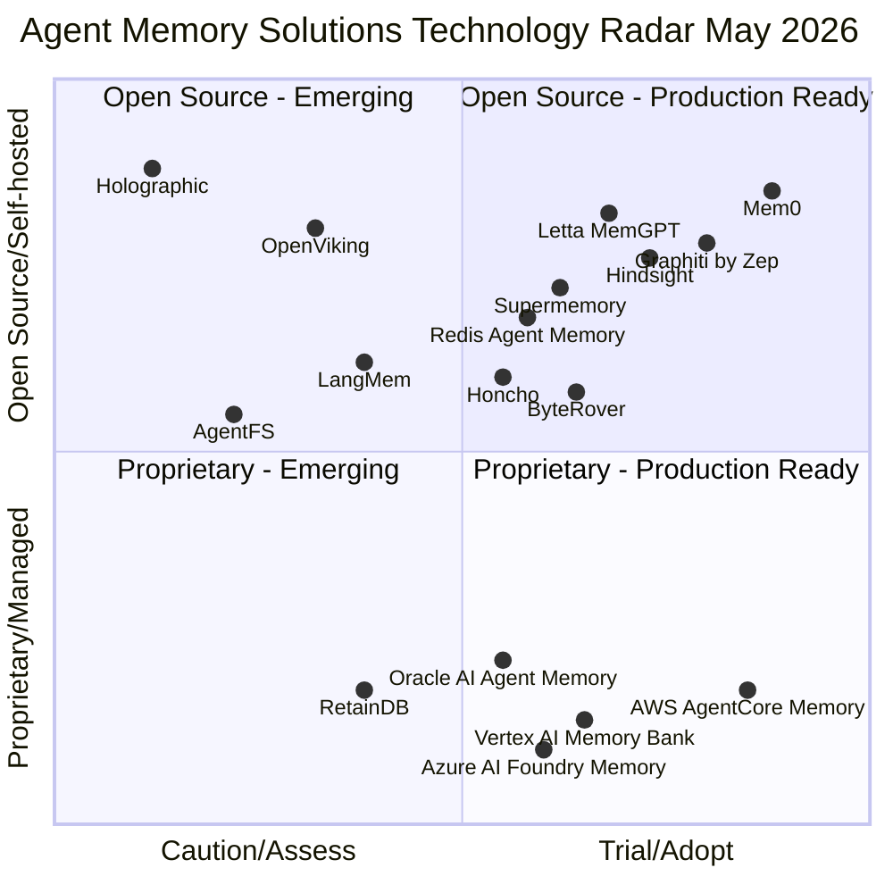

# Agent Memory Solutions

## Overview

This page consolidates all memory solutions — open-source libraries, managed cloud services, and specialized platforms — and maps them to a **Technology Radar** adapted from the [Thoughtworks Radar](https://www.thoughtworks.com/radar) methodology. Each solution is assessed across five dimensions: research backing, industry adoption, GitHub community signal, production readiness, and open-source availability.

The four radar rings:

| Ring | Meaning |
|---|---|
| **Adopt** | Proven in production. Strong community signal. Recommended as the default choice for new projects. |
| **Trial** | Worth using on projects that can tolerate some risk. Actively growing adoption. Evaluate for your use case. |
| **Assess** | Interesting and worth understanding. Not yet proven at scale. Monitor before committing. |
| **Caution** | Use with care. May be early-stage, deprecated, narrowly scoped, or vendor-locked in ways that limit flexibility. |

---

## Technology Radar

The chart below maps all solutions across two axes: **Adoption Readiness** (x-axis, left=Caution → right=Adopt) and **Open Source** (y-axis, bottom=Proprietary → top=Open Source). The four quadrants separate open-source solutions from managed/proprietary ones, and early-stage from production-ready. Ring position (distance from center) reflects the radar rating.

**How to read this chart:**
- **Right side** (x > 0.5) = Trial or Adopt — production-ready, recommended for evaluation
- **Left side** (x < 0.5) = Assess or Caution — early-stage or narrowly scoped
- **Top half** (y > 0.5) = Open source / self-hostable
- **Bottom half** (y < 0.5) = Proprietary / managed cloud service

### 🟢 Adopt

These solutions have demonstrated production readiness, strong community adoption, and clear fit for the agent memory problem.

#### Mem0
**Type**: Open-source memory layer (Apache 2.0) + managed cloud API
**Memory types served**: Semantic, Episodic
**GitHub**: [mem0ai/mem0](https://github.com/mem0ai/mem0) — ~54K stars, ~14M downloads
**Funding**: $24M Series A (2025)

The most widely adopted dedicated agent memory library. Mem0 automatically extracts user preferences and facts from conversations, stores them in a hybrid vector + graph store, and retrieves relevant memories for future interactions. API call volume grew from 35M (Q1 2025) to 186M (Q3 2025), indicating strong production uptake.

**Why Adopt**: Largest community in the dedicated memory space, framework-agnostic (works with LangChain, LangGraph, CrewAI, custom agents), self-improving memory through contradiction resolution, well-documented, actively maintained.

**Best for**: Personalization use cases — user preference tracking, cross-session continuity, customer-facing agents.

**Limitations**: Primarily semantic/episodic; procedural memory requires separate handling. Managed API introduces vendor dependency.

| Dimension | Signal |
|---|---|
| Research | [arXiv:2504.19413](https://arxiv.org/abs/2504.19413) |
| GitHub stars | ~54K |
| Downloads | 14M+ |
| Open source | Yes (Apache 2.0) |
| Production readiness | GA — managed API + self-hosted |
| Funding | $24M Series A |

---

#### Graphiti (by Zep)
**Type**: Open-source temporal knowledge graph framework (Apache 2.0)
**Memory types served**: Semantic (relational), Episodic (temporal)
**GitHub**: [getzep/graphiti](https://github.com/getzep/graphiti) — ~25K stars

Graphiti is the open-source engine behind Zep's memory platform. It builds a real-time, bi-temporal knowledge graph from agent interactions — tracking not just *what* is true but *when* it became true and when it changed. This makes it uniquely suited for agents that need to reason about evolving facts over time.

**Why Adopt**: Strongest solution for relational and temporal reasoning. Bi-temporal data model (valid time + transaction time) is a genuine differentiator. Large and active community. Framework-agnostic.

**Best for**: Agents that need to track how facts evolve — CRM agents, research agents, long-running autonomous agents.

**Limitations**: Higher operational complexity than vector-only solutions. Requires a graph database (Neo4j or compatible). Zep's hosted platform (which wraps Graphiti) has had community edition support changes.

| Dimension | Signal |
|---|---|
| Research | Temporal KG methodology |
| GitHub stars | ~25K |
| Open source | Yes (Apache 2.0) |
| Production readiness | GA — self-hosted + Zep Cloud |
| Backing | Zep (VC-backed) |

---

#### AWS AgentCore Memory
**Type**: Fully managed cloud service (AWS)
**Memory types served**: Working (session), Semantic, Episodic
**Docs**: [AWS AgentCore Memory](https://docs.aws.amazon.com/bedrock-agentcore/latest/devguide/memory.html)

Announced at AWS Summit NYC 2025, AgentCore Memory is a fully managed service that eliminates memory infrastructure management for agents built on AWS. Supports both short-term session memory and long-term memory with configurable retention (1–365 days). Integrates natively with Bedrock Agents, Strands, and the broader AWS ecosystem.

**Why Adopt**: Zero-ops for AWS-native teams. Enterprise SLAs, IAM integration, compliance coverage. No infrastructure to manage.

**Best for**: Enterprise teams already on AWS who want managed memory without building and operating their own vector/graph infrastructure.

**Limitations**: AWS lock-in. Not portable to other clouds or self-hosted environments. Pricing at scale needs evaluation.

| Dimension | Signal |
|---|---|
| Research | AWS internal |
| GitHub stars | N/A (managed service) |
| Open source | No |
| Production readiness | GA (announced AWS Summit NYC 2025) |
| Backing | AWS |

---

### 🔵 Trial

These solutions are worth using on projects that can tolerate some risk. Actively growing, with real production usage, but not yet the default choice.

#### Letta (formerly MemGPT)
**Type**: Open-source stateful agent runtime (Apache 2.0)
**Memory types served**: Working (virtual context), Semantic, Episodic
**GitHub**: [letta-ai/letta](https://github.com/letta-ai/letta) — ~21K stars

Letta is not just a memory library — it is a full agent runtime built around OS-inspired memory management. Agents running on Letta manage their own context window like an operating system manages RAM, using explicit memory functions (`core_memory_append`, `archival_memory_search`) to move data between active context and archival storage. Founded by the MemGPT research team at UC Berkeley.

**Why Trial**: Strongest theoretical foundation (MemGPT paper, UC Berkeley). The OS-inspired model is the most principled approach to working memory management. Active development and growing ecosystem.

**Best for**: Autonomous long-running agents where the agent itself needs to manage what it remembers. Research and experimental deployments.

**Limitations**: Higher complexity than bolt-on memory libraries. Requires adopting the Letta runtime, not just adding memory to an existing agent. Less framework-agnostic than Mem0.

| Dimension | Signal |
|---|---|
| Research | [MemGPT arXiv:2310.08560](https://arxiv.org/abs/2310.08560) (UC Berkeley) |
| GitHub stars | ~21K |
| Open source | Yes (Apache 2.0) |
| Production readiness | Beta/GA — self-hosted + Letta Cloud |
| Backing | VC-backed startup |

---

#### Vertex AI Memory Bank (Google Cloud)
**Type**: Fully managed cloud service (Google Cloud)
**Memory types served**: Semantic (user preferences, long-term facts)
**Docs**: [Vertex AI Agent Engine Memory Bank](https://cloud.google.com/vertex-ai/generative-ai/docs/agent-engine/memory-bank/overview)

Google's managed memory service for agents built on Vertex AI Agent Engine. Dynamically generates long-term memories from user conversations, scoped per user and accessible across sessions. Designed for personalization at scale within the Google Cloud ecosystem.

**Why Trial**: Native integration with ADK, Gemini, and Vertex AI Agent Engine. Managed service with Google Cloud SLAs. Good fit for teams already on GCP.

**Best for**: GCP-native teams building personalized agents on Vertex AI / ADK.

**Limitations**: GCP lock-in. Less flexible than open-source alternatives. Memory Bank is focused on semantic/personalization memory — not a general-purpose memory solution.

| Dimension | Signal |
|---|---|
| Research | Google internal |
| GitHub stars | N/A (managed service) |
| Open source | No |
| Production readiness | GA (Vertex AI Agent Engine) |
| Backing | Google Cloud |

---

#### Oracle AI Agent Memory (Unified Agent Memory Core)
**Type**: Managed memory layer on Oracle AI Database (proprietary)
**Memory types served**: Working (short-term threads), Semantic, Episodic
**Docs**: [oracle.com/database/ai-agent-memory](https://www.oracle.com/database/ai-agent-memory/)
**SDK**: `oracleagentmemory` on PyPI

Oracle's enterprise memory solution, announced April 2026. The Unified Agent Memory Core sits on top of Oracle AI Database and provides a single governed substrate for all four memory concerns: short-term conversation threads with summaries and context cards, long-term durable memories with vector search, automatic LLM-based memory extraction, and user/agent isolation for multi-tenant production deployments.

The key differentiator is Oracle AI Database's converged engine — hybrid retrieval combines Oracle Text (lexical), vector similarity, metadata filters, and `GRAPH_TABLE` (relationship-aware graph queries) in a single query. This eliminates the need to bolt together separate vector, graph, and relational stores.

**Why Trial**: Strong enterprise governance story — ACID transactions, row-level security, and compliance controls that purpose-built memory startups cannot match. Framework-agnostic Python SDK. Credible for teams already running Oracle infrastructure. However, it is very new (April 2026) with no independent community signal yet.

**Best for**: Enterprise teams with existing Oracle Database investments who need governed, multi-tenant agent memory with compliance requirements (financial services, healthcare, regulated industries).

**Limitations**: Requires Oracle AI Database — not portable to other infrastructure. No open-source option. No independent GitHub community signal. Very early — limited production case studies available as of May 2026.

| Dimension | Signal |
|---|---|
| Research | Oracle internal (blog series, April–May 2026) |
| GitHub stars | N/A (proprietary SDK) |
| Open source | No |
| Production readiness | GA (PyPI: `oracleagentmemory`) |
| Backing | Oracle Corporation |

---

**Type**: Fully managed cloud service (Microsoft Azure)
**Memory types served**: Working (session state), Semantic
**Docs**: [Azure AI Foundry](https://learn.microsoft.com/en-us/azure/ai-foundry/)

Microsoft's managed state and memory layer within Azure AI Foundry. Provides enterprise-grade session state management and cross-session memory for agents built on Azure OpenAI and the Semantic Kernel framework.

**Why Trial**: Native integration with Azure OpenAI, Semantic Kernel, and enterprise Azure compliance controls. Good fit for Microsoft-stack enterprises.

**Best for**: Enterprise teams on Azure with existing Microsoft AI investments.

**Limitations**: Azure lock-in. Tightly coupled to the Microsoft AI stack. Less community visibility than open-source alternatives.

| Dimension | Signal |
|---|---|
| Research | Microsoft internal |
| GitHub stars | N/A (managed service) |
| Open source | No |
| Production readiness | GA (Azure AI Foundry) |
| Backing | Microsoft |

#### Supermemory
**Type**: Open-source memory engine (MIT) + managed cloud API
**Memory types served**: Semantic, Episodic
**GitHub**: [supermemoryai/supermemory](https://github.com/supermemoryai/supermemory) — ~9K+ stars
**Docs**: [supermemory.ai](https://supermemory.ai)

A fast, scalable memory API built for the AI era. Supermemory provides semantic memory storage and retrieval with sub-300ms recall latency, a Memory Router proxy (sits between your app and LLM provider to inject context transparently), MCP server support, and connectors for ingesting documents and external data sources alongside conversation history. Claims #1 on LoCoMo and ConvoMem benchmarks and 85.4% accuracy on LongMemEval. Processes 100B+ tokens monthly across its managed API.

**Why Trial**: Strong benchmark performance and a differentiated Memory Router pattern (zero-code context injection). Growing community. Self-hostable on Cloudflare Workers with Durable Objects. However, primarily a managed API — self-hosting requires Cloudflare infrastructure, and the enterprise governance story is less developed than Mem0 or the cloud-provider solutions.

**Best for**: Teams that want fast, benchmark-validated semantic/episodic memory with minimal integration code. Particularly useful when you want transparent context injection without modifying agent code (Memory Router pattern).

**Limitations**: Cloudflare-dependent self-hosting. Less mature enterprise governance (multi-tenancy, compliance controls) compared to cloud-provider offerings. Community smaller than Mem0 or Graphiti.

| Dimension | Signal |
|---|---|
| Research | Internal benchmarks (LongMemEval 85.4%, #1 LoCoMo/ConvoMem) |
| GitHub stars | ~9K+ |
| Open source | Yes (MIT) |
| Production readiness | GA — managed API + self-hosted |
| Backing | Supermemory AI (VC-backed) |

---

#### Redis Agent Memory Server
**Type**: Open-source memory server (MIT)
**Memory types served**: Working (session), Semantic, Episodic
**GitHub**: [redis/agent-memory-server](https://github.com/redis/agent-memory-server)
**Docs**: [redis.github.io/agent-memory-server](https://redis.github.io/agent-memory-server/)

The official Redis project for agent memory. Provides two distinct memory tiers: working memory (session-scoped conversation context with automatic token-limit management) and long-term memory (persistent storage with semantic, keyword, and hybrid search). Memories are automatically promoted from working to long-term storage. Exposes both a REST API and an MCP server interface, with Python and TypeScript SDKs. Supports namespacing for multi-tenant isolation.

**Why Trial**: Redis is already ubiquitous infrastructure — teams running Redis get agent memory without adding a new data store. MCP + REST dual interface covers both agentic and traditional integration patterns. Official Redis project with active maintenance. However, it is relatively new with modest community signal compared to Mem0 or Graphiti.

**Best for**: Teams already running Redis who want to add agent memory without introducing a new dependency. Also a strong fit when you need both low-latency session state (working memory) and persistent semantic search in a single system.

**Limitations**: Requires Redis Stack (vector search module). Newer project — limited production case studies. No managed cloud offering; self-hosted only.

| Dimension | Signal |
|---|---|
| Research | Redis engineering |
| GitHub stars | Early-stage (official Redis project) |
| Open source | Yes (MIT) |
| Production readiness | Beta — active development |
| Backing | Redis Ltd. |

---

#### Hindsight (Vectorize)
**Type**: Open-source memory library (MIT) + managed cloud platform
**Memory types served**: Semantic (world facts), Episodic (experiences), Conceptual (mental models)
**GitHub**: [vectorize-io/hindsight](https://github.com/vectorize-io/hindsight) — ~14.4K stars
**Docs**: [vectorize.io](https://vectorize.io)

Hindsight takes a biomimetic approach to agent memory, organizing knowledge into three structures modeled on human cognition: a *World* layer (persistent factual beliefs about users and entities), an *Experiences* store (episodic event records), and *Mental Models* (conceptual frameworks that shape inference). An LLM wrapper enables two-line integration — drop it in front of any existing agent without restructuring the codebase. Reports SOTA performance on LongMemEval. Adopted by Fortune 500 enterprises and AI startups via Hindsight Cloud (managed) or self-hosted deployment.

**Why Trial**: 14.4K stars and credible enterprise adoption make it one of the better-validated open-source memory libraries outside of Mem0 and Graphiti. The three-layer biomimetic model covers semantic, episodic, and a distinct conceptual tier not found in most competitors. MIT license with a managed cloud option gives flexibility.

**Best for**: Agents that need human-like recall across all three knowledge types. Particularly effective when conceptual reasoning (mental model updates) is as important as raw fact retrieval.

**Limitations**: Vectorize.io is the primary backer — community breadth is smaller than Mem0 or Graphiti. The managed cloud creates vendor dependency for teams not self-hosting.

| Dimension | Signal |
|---|---|
| Research | Biomimetic memory (World / Experiences / Mental Models) |
| GitHub stars | ~14.4K |
| Open source | Yes (MIT) |
| Production readiness | GA — managed cloud + self-hosted |
| Backing | Vectorize.io |

---

#### Honcho (Plastic Labs)
**Type**: Open-source memory server (AGPL-3.0) + managed cloud API
**Memory types served**: Working (session/message history), Semantic (peer representations), Episodic (event logs)
**GitHub**: [plastic-labs/honcho](https://github.com/plastic-labs/honcho) — ~3.6K stars
**Docs**: [api.honcho.dev](https://api.honcho.dev)

Honcho is built around a *peer-centric* memory model — rather than treating memory as a flat key-value or vector store, it organizes context around the relationships between the agent and the people it interacts with. Every user is a "peer" with stored message history, session context, and natural-language insight queries (e.g., "What does this user prefer about Python?"). The FastAPI backend can be self-hosted or accessed via managed cloud. Acts as a memory middleware layer that other agent frameworks can call, rather than replacing them.

**Why Trial**: Peer-centric architecture is a differentiated model that fits personalization and relationship-aware agents well. Production-ready with managed cloud, reasonable community growth, and an MIT-compatible approach (AGPL for self-hosted, managed API terms for cloud). Framework-agnostic.

**Best for**: Conversational agents where the quality of understanding individual users or stakeholders is the primary value driver — coaching agents, customer relationship agents, personal assistants.

**Limitations**: AGPL-3.0 license requires open-sourcing derivative works if deployed as a service, which may not suit commercial closed-source products. Community is smaller than Mem0 or Graphiti. Primarily semantic/episodic — procedural memory handled externally.

| Dimension | Signal |
|---|---|
| Research | Peer-centric memory model (Plastic Labs) |
| GitHub stars | ~3.6K |
| Open source | Yes (AGPL-3.0) |
| Production readiness | GA — managed cloud + self-hosted FastAPI |
| Backing | Plastic Labs |

---

#### ByteRover (Campfire)
**Type**: Source-available memory layer (Elastic License 2.0) + managed cloud platform
**Memory types served**: Working (hierarchical context trees), Semantic (curated project knowledge), Episodic (tool call and interaction logs)
**GitHub**: [campfirein/byterover-cli](https://github.com/campfirein/byterover-cli) — ~4.6K stars
**Docs**: [byterover.dev](https://byterover.dev)

ByteRover (formerly Cipher) is a portable memory layer optimized for coding agents. Its key design choice is replacing vector databases with a *hierarchical context tree* — structured knowledge organized into project-scoped tiers, retrieved via fuzzy text search followed by LLM-driven relevance ranking. Runs locally by default with no external dependencies; ByteRover Cloud enables team-level memory sharing. Claims 92.2% on the LoCoMo leaderboard, outperforming most general-purpose memory solutions in code-aware retrieval tasks.

**Why Trial**: Strongest benchmark signal for coding-agent memory use cases. The hierarchical tree approach avoids the embedding/vector infrastructure cost while delivering high retrieval accuracy on code and project knowledge. Production-ready with both local and cloud deployment. 4.6K stars indicate meaningful community traction.

**Best for**: Coding agents, developer tooling, and IDE-integrated agents where the memory domain is structured project knowledge rather than open-ended conversation history. Particularly useful for team-shared context (via ByteRover Cloud).

**Limitations**: Elastic License 2.0 is source-available, not true open source — commercial use without a separate license from Campfire may be restricted. Design is optimized for code/project knowledge; less suited to general-purpose conversational memory. Newer project with limited non-coding-agent case studies.

| Dimension | Signal |
|---|---|
| Research | Internal benchmarks (LoCoMo 92.2%) |
| GitHub stars | ~4.6K |
| Open source | Source-available (Elastic License 2.0) |
| Production readiness | GA — local + ByteRover Cloud |
| Backing | Campfire (campfirein) |

---

### 🟡 Assess

Interesting solutions worth understanding and monitoring. Not yet proven at scale or too narrowly scoped for general recommendation.

#### OpenViking (Volcano Engine / ByteDance)
**Type**: Open-source context database / hierarchical filesystem memory (Apache 2.0)
**Memory types served**: Working (session), Semantic, Episodic, Procedural (skills)
**GitHub**: [volcengine/OpenViking](https://github.com/volcengine/OpenViking) — ~15K+ stars (Jan 2026 release)
**Docs**: [openviking.ai](https://openviking.ai/)

OpenViking is a context database from ByteDance's Volcano Engine that replaces fragmented vector stores with a unified **filesystem paradigm**. Every piece of context — memories, resources, and skills — is stored and addressed like a file in a directory tree. On write, each item is automatically processed into three levels of detail: L0 (one-sentence abstract, <100 tokens), L1 (overview with structure and usage, <2K tokens), and L2 (full content, loaded on demand via URI). Retrieval uses vector similarity to identify the right directory, then recurses into subdirectories — hierarchical drill-down rather than flat nearest-neighbor search. This architecture is what drives the reported 80%+ reduction in input token consumption when paired with the OpenClaw agent (task completion also rose from 35.65% to 52.08%).

**Why Assess**: Impressive early benchmark results and rapid community growth (15K+ stars in under five months) signal real interest. ByteDance/Volcano Engine is a credible engineering backer. The filesystem framing unifies memory *and* skills under one substrate — a broader scope than any other tool in this radar. However, it is less than six months old, has limited independent production case studies, and the primary reference implementation targets the OpenClaw agent stack.

**Best for**: Teams experimenting with hierarchical context management who want to reduce token costs while preserving rich context across sessions. Especially useful as a complement to multi-agent systems where skills (procedural memory) and resources need structured retrieval alongside conversation history.

**Limitations**: Very new (January 2026). Primary integration is OpenClaw; broader framework support is in early development. No managed cloud offering — self-hosted only. Limited production evidence outside ByteDance's own systems.

| Dimension | Signal |
|---|---|
| Research | [MarkTechPost writeup](https://www.marktechpost.com/2026/03/15/meet-openviking-an-open-source-context-database-that-brings-filesystem-based-memory-and-retrieval-to-ai-agent-systems-like-openclaw/) |
| GitHub stars | ~15K+ (as of May 2026) |
| Open source | Yes (Apache 2.0) |
| Production readiness | Beta — self-hosted |
| Backing | Volcano Engine / ByteDance |

---

#### RetainDB
**Type**: Managed cloud memory service (proprietary)
**Memory types served**: Episodic (conversation history), Semantic (vector + BM25 hybrid search)
**GitHub**: N/A (cloud service)
**Docs**: [retaindb.com](https://retaindb.com)

RetainDB is a cloud-only persistent memory service that uses delta compression for efficient conversation history storage and a hybrid retrieval pipeline (vector similarity + BM25 keyword + reranking) for high-accuracy recall. Memory extraction is handled server-side via Claude Sonnet. Integrates with the Hermes Agent framework and other agent runtimes through a REST API. Pricing starts at $20/month.

**Why Assess**: The delta-compression + hybrid retrieval combination is technically interesting for cost-efficient long-term storage. Claims competitive LongMemEval performance. However, there is no open-source component, no disclosed backing company, no GitHub community, and no independent validation available as of May 2026. Vendor viability risk is non-trivial.

**Best for**: Teams that want a fully managed, zero-infrastructure memory API and are comfortable with an early-stage proprietary service. Evaluate after the vendor establishes more transparency and track record.

**Limitations**: Cloud-only — no self-hosting option. No open-source code. No disclosed company identity. No independent community signal. Vendor lock-in with no migration path documented.

| Dimension | Signal |
|---|---|
| Research | Internal claims (LongMemEval, not independently verified) |
| GitHub stars | N/A |
| Open source | No |
| Production readiness | GA (cloud API) |
| Backing | Undisclosed |

---

#### LangMem
**Type**: Open-source memory library for LangGraph (MIT)
**Memory types served**: Semantic, Episodic, Procedural
**GitHub**: [langchain-ai/langmem](https://github.com/langchain-ai/langmem) — ~1.5K stars

LangChain's dedicated memory library for LangGraph agents. Supports all three long-term memory types (semantic, episodic, procedural) and integrates natively with LangGraph's state management. Relatively new (2025) with a small but growing community.

**Why Assess**: The only library with explicit first-class support for procedural memory alongside semantic and episodic. Deep LangGraph integration is a genuine advantage for teams already on that stack. But the small community and early-stage maturity warrant caution before committing.

**Best for**: Teams already using LangGraph who want tightly integrated memory without adding a separate service.

**Limitations**: Small community (~1.5K stars). Tightly coupled to LangChain/LangGraph ecosystem. Less battle-tested than Mem0 or Graphiti.

| Dimension | Signal |
|---|---|
| Research | LangChain internal |
| GitHub stars | ~1.5K |
| Open source | Yes (MIT) |
| Production readiness | Beta |
| Backing | LangChain (VC-backed) |

---

### 🔴 Caution

Use with care. These solutions are either early-stage/experimental, narrowly scoped, or have characteristics that limit general applicability.

#### AgentFS (Turso)
**Type**: Open-source SQLite-backed virtual filesystem (MIT)
**Memory types served**: Working (filesystem/scratchpad), Episodic (tool logs)
**GitHub**: [tursodatabase/agentfs](https://github.com/tursodatabase/agentfs) — ~2.5K stars

AgentFS provides a portable, SQLite-backed virtual filesystem for agents — a "hard drive" abstraction for managing files, key-value state, and tool logs. Useful as a working memory scratchpad and episodic log store, but not a general-purpose memory solution.

**Why Caution**: Self-described as alpha/experimental. Narrow scope (filesystem abstraction, not semantic or procedural memory). Small community. Best used as a complement to a full memory solution, not a replacement.

**Best for**: Agents that need structured file and log management as a complement to a primary memory system.

**Limitations**: Alpha quality. Not a complete memory solution — no semantic retrieval, no knowledge graph, no cross-session personalization. Requires Turso/libSQL.

| Dimension | Signal |
|---|---|
| Research | Turso blog post |
| GitHub stars | ~2.5K |
| Open source | Yes (MIT) |
| Production readiness | Alpha |
| Backing | Turso (VC-backed) |

---

#### Holographic Memory (via Nuggets)
**Type**: Open-source local memory module (individual project)
**Memory types served**: Working (active context), Semantic (holographic vector memory)
**GitHub**: [NeoVertex1/nuggets](https://github.com/NeoVertex1/nuggets) — ~200 stars

An experimental personal AI assistant module that uses Holographic Reduced Representations (HRR) — complex-valued vectors that encode facts as superpositions, enabling sub-millisecond recall with no external database. Facts are promoted from temporary to permanent context after three or more recalls, mimicking human memory consolidation. Runs fully locally with zero external dependencies.

**Why Caution**: The HRR approach is academically interesting and the zero-dependency local design has appeal for privacy-sensitive deployments. However, this is an early-stage individual project with ~200 stars, no production track record, and no disclosed license. The implementation scope is narrow (no episodic or procedural memory). Not suitable for production use in its current state.

**Best for**: Research exploration of holographic/neurosymbolic memory representations. Local prototyping where zero external dependencies is a hard requirement.

**Limitations**: ~200 stars, individual maintainer, no production deployments documented. Narrow scope — no episodic, procedural, or multi-tenant support. License not clearly specified.

| Dimension | Signal |
|---|---|
| Research | Holographic Reduced Representations (HRR) — academic concept |
| GitHub stars | ~200 |
| Open source | Likely (unspecified license) |
| Production readiness | Experimental |
| Backing | Individual (NeoVertex1) |

---

## Radar Summary Table

| Solution | Ring | Memory Types | Open Source | GitHub Stars | Provider |
|---|---|---|---|---|---|
| **Mem0** | 🟢 Adopt | Semantic, Episodic | Yes (Apache 2.0) | ~54K | Independent |
| **Graphiti (Zep)** | 🟢 Adopt | Semantic, Episodic | Yes (Apache 2.0) | ~25K | Zep |
| **AWS AgentCore Memory** | 🟢 Adopt | Working, Semantic, Episodic | No | N/A | AWS |
| **Letta (MemGPT)** | 🔵 Trial | Working, Semantic, Episodic | Yes (Apache 2.0) | ~21K | Letta AI |
| **Hindsight** | 🔵 Trial | Semantic, Episodic, Conceptual | Yes (MIT) | ~14.4K | Vectorize.io |
| **Supermemory** | 🔵 Trial | Semantic, Episodic | Yes (MIT) | ~9K+ | Supermemory AI |
| **ByteRover** | 🔵 Trial | Working, Semantic, Episodic | Source-available (Elastic 2.0) | ~4.6K | Campfire |
| **Honcho** | 🔵 Trial | Working, Semantic, Episodic | Yes (AGPL-3.0) | ~3.6K | Plastic Labs |
| **Redis Agent Memory Server** | 🔵 Trial | Working, Semantic, Episodic | Yes (MIT) | Early-stage | Redis Ltd. |
| **Oracle AI Agent Memory** | 🔵 Trial | Working, Semantic, Episodic | No | N/A | Oracle |
| **Vertex AI Memory Bank** | 🔵 Trial | Semantic | No | N/A | Google Cloud |
| **Azure AI Foundry Memory** | 🔵 Trial | Working, Semantic | No | N/A | Microsoft |
| **OpenViking** | 🟡 Assess | Working, Semantic, Episodic, Procedural | Yes (Apache 2.0) | ~15K+ | Volcano Engine / ByteDance |
| **RetainDB** | 🟡 Assess | Episodic, Semantic | No | N/A | Undisclosed |
| **LangMem** | 🟡 Assess | Semantic, Episodic, Procedural | Yes (MIT) | ~1.5K | LangChain |
| **AgentFS** | 🔴 Caution | Working, Episodic | Yes (MIT) | ~2.5K | Turso |
| **Holographic (Nuggets)** | 🔴 Caution | Working, Semantic | Unspecified | ~200 | Individual |

---

## Selection Guide

Use this to narrow down options based on your constraints.

| If you need… | Consider |
|---|---|
| Framework-agnostic semantic/episodic memory | **Mem0** |
| Temporal reasoning over evolving facts | **Graphiti (Zep)** |
| Managed memory on AWS, zero ops | **AWS AgentCore Memory** |
| OS-inspired working memory management | **Letta** |
| Biomimetic memory with World/Experiences/Mental Models | **Hindsight** |
| Fast memory API with transparent context injection | **Supermemory** |
| Coding-agent memory with hierarchical context trees | **ByteRover** |
| Peer-centric memory for relationship-aware agents | **Honcho** |
| Memory on existing Redis infrastructure | **Redis Agent Memory Server** |
| Enterprise Oracle DB with governed memory | **Oracle AI Agent Memory** |
| Managed memory on GCP | **Vertex AI Memory Bank** |
| Managed memory on Azure | **Azure AI Foundry Memory** |
| Hierarchical filesystem context with 80%+ token savings | **OpenViking** |
| Managed memory API, zero infrastructure, hybrid retrieval | **RetainDB** (evaluate vendor risk) |
| Procedural memory + LangGraph integration | **LangMem** |
| Filesystem/scratchpad for tool logs | **AgentFS** (as complement) |
| Holographic vector memory, zero external dependencies | **Holographic / Nuggets** (experimental) |
| Open source only, no vendor dependency | **Mem0**, **Graphiti**, **Letta**, **Hindsight**, **Supermemory**, **Honcho**, **Redis** |
| Enterprise SLAs + compliance | **AWS AgentCore**, **Vertex**, **Azure**, **Oracle** |

---

## Radar Assessment Criteria

Each solution was assessed on the following dimensions. Ratings are as of May 2026.

| Criterion | Weight | Notes |
|---|---|---|
| **Research backing** | High | Peer-reviewed papers, academic origin, or rigorous technical documentation |
| **Industry adoption** | High | Production deployments, API call volumes, download counts, enterprise customers |
| **GitHub community** | Medium | Stars, forks, contributor count, issue activity, release cadence |
| **Production readiness** | High | GA vs. beta vs. alpha; SLA availability; known production deployments |
| **Open source** | Medium | License type, self-hostability, vendor lock-in risk |
| **Memory type coverage** | Medium | Which of the four CoALA types (working/semantic/episodic/procedural) are supported |

*Radar positions are reassessed periodically. GitHub star counts and adoption signals are point-in-time as of the assessment date.*

---

## See Also

- [The Four Memory Types](functional-tiers.md)
- [Long-term Memory Strategies](ltm-strategies.md)
- [Working Memory Management](short-term.md)
- [Research Papers](research-papers.md)

## References

- [Mem0 Series A announcement](https://www.prnewswire.com/news-releases/mem0-raises-24m-series-a-to-build-memory-layer-for-ai-agents-302597157.html) — adoption metrics
- [Graphiti GitHub](https://github.com/getzep/graphiti) — temporal knowledge graph framework
- [Letta GitHub](https://github.com/letta-ai/letta) — stateful agent runtime
- [AWS AgentCore Memory](https://aws.amazon.com/blogs/machine-learning/amazon-bedrock-agentcore-memory-building-context-aware-agents/) — AWS Summit NYC 2025 announcement
- [Vertex AI Memory Bank](https://cloud.google.com/vertex-ai/generative-ai/docs/agent-engine/memory-bank/overview) — Google Cloud docs
- [Azure AI Foundry](https://learn.microsoft.com/en-us/azure/ai-foundry/) — Microsoft docs
- [Oracle AI Agent Memory](https://www.oracle.com/database/ai-agent-memory/) — Oracle product page
- [Oracle Unified Agent Memory Core blog](https://blogs.oracle.com/developers/unified-memory-core-for-ai-agents) — technical overview
- [Supermemory GitHub](https://github.com/supermemoryai/supermemory) — memory engine and API
- [Supermemory benchmarks](https://supermemory.ai/research/) — LongMemEval, LoCoMo, ConvoMem results
- [Redis Agent Memory Server](https://github.com/redis/agent-memory-server) — official Redis memory server
- [Redis Agent Memory Server docs](https://redis.github.io/agent-memory-server/) — architecture and API reference
- [LangMem GitHub](https://github.com/langchain-ai/langmem) — LangChain memory library
- [AgentFS GitHub](https://github.com/tursodatabase/agentfs) — Turso filesystem for agents
- [OpenViking GitHub](https://github.com/volcengine/OpenViking) — open-source context database by Volcano Engine / ByteDance
- [OpenViking site](https://openviking.ai/) — project homepage and docs
- [MarkTechPost: Meet OpenViking](https://www.marktechpost.com/2026/03/15/meet-openviking-an-open-source-context-database-that-brings-filesystem-based-memory-and-retrieval-to-ai-agent-systems-like-openclaw/) — overview and benchmark results
- [Red Hat Developer: Deploy OpenViking on OpenShift AI](https://developers.redhat.com/articles/2026/04/23/deploy-openviking-openshift-ai-improve-ai-agent-memory) — deployment guide
- [Hindsight GitHub](https://github.com/vectorize-io/hindsight) — biomimetic agent memory library by Vectorize.io
- [Hindsight blog](https://vectorize.io/blog/introducing-hindsight-agent-memory-that-works-like-human-memory) — World / Experiences / Mental Models architecture overview
- [Honcho GitHub](https://github.com/plastic-labs/honcho) — peer-centric memory server by Plastic Labs
- [Honcho cloud API](https://api.honcho.dev) — managed memory service docs
- [ByteRover GitHub](https://github.com/campfirein/byterover-cli) — hierarchical context tree memory by Campfire
- [ByteRover benchmarks](https://www.byterover.dev/blog/benchmark-ai-agent-memory) — LoCoMo 92.2% leaderboard results
- [RetainDB](https://www.retaindb.com/) — cloud-only delta-compressed memory API
- [Holographic memory (Nuggets)](https://github.com/NeoVertex1/nuggets) — HRR-based local memory module
- [Redis Agent Memory context engine docs](https://redis.io/docs/latest/develop/ai/context-engine/agent-memory/) — Redis agent memory architecture reference
- [Thoughtworks Technology Radar](https://www.thoughtworks.com/radar) — radar methodology reference
- [Cognitive Architectures for Language Agents (CoALA)](https://arxiv.org/abs/2309.02427) — memory type taxonomy
