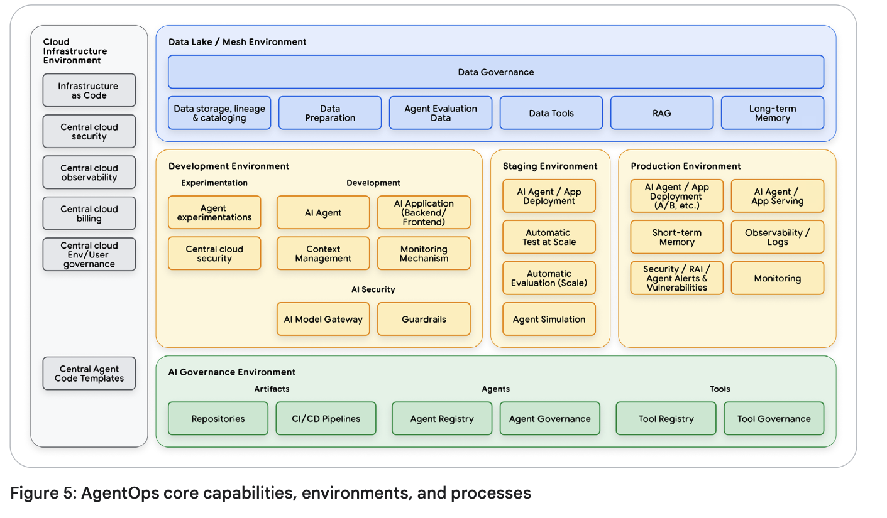
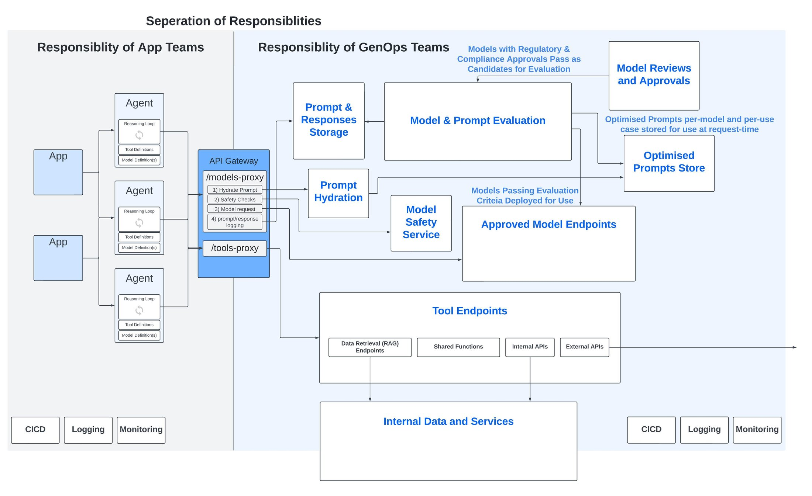
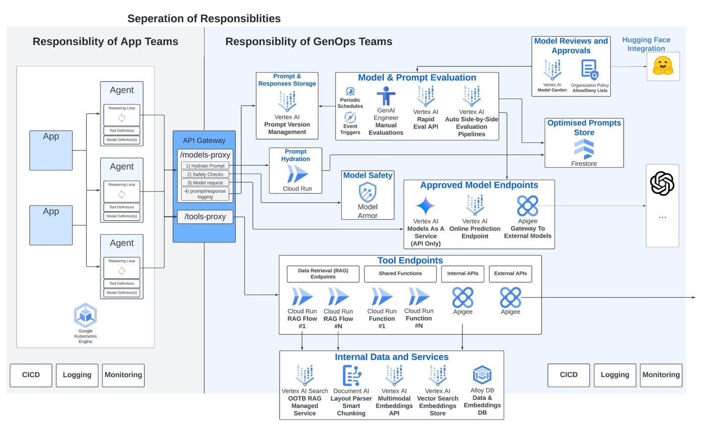

# Agentic AI Operations (AgentOps)

This section provides comprehensive coverage of operational practices, methodologies, and frameworks for managing agentic AI systems in production environments. From Google Cloud's GenOps evolution to operational best practices, this collection offers the essential guidance needed to successfully operate AI agents at scale.

## Overview

Agentic AI Operations (AgentOps) represents the evolution of traditional MLOps and DevOps practices to address the unique operational challenges of autonomous AI systems. This section covers:

- **Operational Frameworks**: Structured approaches to managing AI agent operations
- **Platform Perspectives**: Vendor-specific operational methodologies and tools
- **GenOps Evolution**: The transformation from MLOps to GenOps for generative AI
- **Best Practices**: Industry-proven approaches to agent operations
- **Lifecycle Management**: End-to-end operational considerations for AI agents

## Google Cloud Perspective

*Source: [Google Cloud AgentOps Video](https://www.youtube.com/watch?v=kJRgj58ujEk)*

Google Cloud's approach to AgentOps emphasizes the integration of traditional operational practices with AI-specific considerations, focusing on:

- **Autonomous System Management**: Operating systems that can make independent decisions
- **Human-AI Collaboration**: Balancing automation with human oversight
- **Scalable Operations**: Managing AI agents across distributed environments
- **Continuous Learning**: Incorporating feedback loops for operational improvement

### GenOps - Evolution of MLOps for GenAI

GenOps represents the natural evolution of MLOps (Machine Learning Operations) to address the unique challenges and opportunities presented by generative AI and agentic systems.

**Key Differences from Traditional MLOps:**

**Traditional MLOps Focus:**
- Model training and deployment pipelines
- Performance monitoring and drift detection
- Version control for models and data
- Automated retraining workflows

**GenOps Expansion:**
- **Agent Lifecycle Management**: Managing autonomous agents throughout their operational lifecycle
- **Dynamic Behavior Monitoring**: Tracking agent decision-making and adaptation
- **Multi-Agent Coordination**: Orchestrating interactions between multiple agents
- **Prompt and Context Management**: Versioning and optimizing agent instructions and context

#### Key Components of GenOps Platform

*Source: [Google Cloud GenOps Blog](https://cloud.google.com/blog/products/devops-sre/genops-learnings-from-microservices-and-traditional-devops/)*

**Core Platform Components:**

**1. Agent Development and Deployment**
- **Agent Authoring Tools**: IDEs and frameworks for agent development
- **Testing and Validation**: Comprehensive testing frameworks for agent behavior
- **Deployment Pipelines**: Automated deployment and rollback capabilities
- **Environment Management**: Staging, testing, and production environment orchestration

**2. Runtime Operations**
- **Agent Orchestration**: Managing agent execution and resource allocation
- **Load Balancing**: Distributing requests across agent instances
- **Auto-scaling**: Dynamic scaling based on demand and performance metrics
- **Health Monitoring**: Real-time health checks and failure detection

**3. Observability and Monitoring**
- **Behavior Analytics**: Understanding agent decision patterns and effectiveness
- **Performance Metrics**: Tracking response times, accuracy, and resource utilization
- **Cost Management**: Monitoring and optimizing operational costs
- **Security Monitoring**: Detecting and responding to security threats

**4. Data and Context Management**
- **Knowledge Base Management**: Maintaining and updating agent knowledge sources
- **Context Versioning**: Managing different versions of agent context and instructions
- **Data Pipeline Operations**: Ensuring data quality and availability for agents
- **Privacy and Compliance**: Maintaining data protection and regulatory compliance

**5. Continuous Improvement**
- **Feedback Integration**: Incorporating user and system feedback into agent improvement
- **A/B Testing**: Testing different agent configurations and behaviors
- **Performance Optimization**: Continuous optimization of agent performance
- **Learning Analytics**: Understanding how agents learn and adapt over time

## AgentOps Implementation Framework

### Operational Maturity Levels

**Level 1: Basic Operations**
- Manual agent deployment and configuration
- Basic monitoring and alerting
- Simple logging and error tracking
- Manual scaling and resource management

**Level 2: Automated Operations**
- Automated deployment pipelines
- Comprehensive monitoring and observability
- Automated scaling and resource optimization
- Basic performance analytics and reporting

**Level 3: Intelligent Operations**
- Self-healing and adaptive systems
- Predictive analytics and proactive optimization
- Advanced multi-agent coordination
- Continuous learning and improvement loops

**Level 4: Autonomous Operations**
- Fully autonomous operational decision-making
- Self-optimizing agent ecosystems
- Advanced AI-driven operational intelligence
- Seamless human-AI operational collaboration

### Key Operational Processes

#### 1. Agent Lifecycle Management

**Development Phase**
- Agent design and architecture planning
- Development environment setup and configuration
- Code development and version control
- Unit testing and integration testing

**Testing and Validation**
- Behavior testing and validation
- Performance benchmarking
- Security and compliance testing
- User acceptance testing

**Deployment and Release**
- Automated deployment pipelines
- Blue-green and canary deployment strategies
- Rollback and recovery procedures
- Release management and coordination

**Operations and Maintenance**
- Runtime monitoring and management
- Performance optimization and tuning
- Security monitoring and incident response
- Continuous improvement and updates

#### 2. Multi-Agent Coordination

**Agent Discovery and Registration**
- Service discovery mechanisms for agent ecosystems
- Agent capability registration and advertising
- Dynamic agent composition and orchestration
- Load balancing and request routing

**Communication and Collaboration**
- Inter-agent communication protocols
- Shared context and knowledge management
- Conflict resolution and consensus mechanisms
- Workflow coordination and task distribution

**Performance and Optimization**
- Multi-agent performance monitoring
- Resource allocation and optimization
- Bottleneck identification and resolution
- Scalability planning and implementation

#### 3. Operational Intelligence

**Data Collection and Analysis**
- Comprehensive operational data collection
- Real-time analytics and insights
- Historical trend analysis and reporting
- Predictive analytics and forecasting

**Decision Support**
- Operational decision automation
- Human-in-the-loop decision processes
- Risk assessment and mitigation
- Performance optimization recommendations

**Continuous Improvement**
- Operational feedback loops
- Process optimization and automation
- Best practice identification and sharing
- Innovation and experimentation frameworks

## Best Practices for AgentOps

### 1. Design for Operations

**Operational Considerations in Design**
- Build observability into agent architecture from the start
- Design for scalability and distributed operations
- Implement comprehensive error handling and recovery
- Plan for operational maintenance and updates

**Operational APIs and Interfaces**
- Provide comprehensive operational APIs for management
- Implement standardized health check and status endpoints
- Enable runtime configuration and parameter adjustment
- Support operational tooling integration

### 2. Monitoring and Observability

**Comprehensive Monitoring Strategy**
- Monitor both technical and business metrics
- Implement distributed tracing for multi-agent systems
- Track agent behavior and decision-making patterns
- Monitor resource utilization and cost optimization

**Alerting and Incident Response**
- Implement intelligent alerting with appropriate thresholds
- Develop comprehensive incident response procedures
- Create runbooks for common operational scenarios
- Establish escalation procedures and on-call rotations

### 3. Security and Compliance

**Operational Security**
- Implement comprehensive security monitoring
- Regular security assessments and penetration testing
- Secure operational access and authentication
- Incident response and forensic capabilities

**Compliance Management**
- Maintain compliance with relevant regulations
- Implement audit trails and documentation
- Regular compliance assessments and reporting
- Data protection and privacy controls

### 4. Performance and Scalability

**Performance Optimization**
- Continuous performance monitoring and optimization
- Resource allocation and capacity planning
- Load testing and performance validation
- Bottleneck identification and resolution

**Scalability Planning**
- Design for horizontal and vertical scaling
- Implement auto-scaling based on demand
- Plan for geographic distribution and edge deployment
- Optimize for cost-effective scaling

## Technology Stack for AgentOps

### Core Infrastructure

**Container Orchestration**
- Kubernetes for agent deployment and management
- Docker for containerization and portability
- Service mesh for inter-agent communication
- Load balancers for traffic distribution

**Cloud Platforms**
- Google Cloud Platform with Vertex AI integration
- AWS with Bedrock and SageMaker integration
- Microsoft Azure with Azure AI integration
- Multi-cloud and hybrid deployment strategies

### Monitoring and Observability Tools

**Application Performance Monitoring**
- Datadog, New Relic, or Dynatrace for comprehensive monitoring
- Prometheus and Grafana for metrics and visualization
- Jaeger or Zipkin for distributed tracing
- ELK stack or Splunk for log management

**AI-Specific Monitoring**
- LangSmith for LangChain-based agents
- Weights & Biases for experiment tracking
- MLflow for model lifecycle management
- Custom dashboards for agent-specific metrics

### Deployment and CI/CD

**Continuous Integration/Continuous Deployment**
- Jenkins, GitLab CI, or GitHub Actions for CI/CD pipelines
- ArgoCD or Flux for GitOps-based deployment
- Helm charts for Kubernetes deployment management
- Terraform for infrastructure as code

**Testing and Validation**
- Pytest or similar for unit and integration testing
- Locust or JMeter for load testing
- Custom frameworks for agent behavior testing
- Security scanning and compliance validation tools

## Future Trends in AgentOps

### Emerging Technologies

**AI-Powered Operations**
- AI-driven operational decision making
- Predictive maintenance and optimization
- Automated incident response and resolution
- Intelligent resource allocation and scaling

**Edge and Distributed Operations**
- Edge deployment of AI agents
- Distributed agent coordination and management
- Offline and intermittent connectivity support
- Edge-to-cloud operational integration

### Industry Evolution

**Standardization and Interoperability**
- Industry standards for agent operations
- Interoperable operational tooling and platforms
- Common operational APIs and interfaces
- Standardized operational metrics and KPIs

**Regulatory and Compliance Evolution**
- Evolving regulatory requirements for AI operations
- Compliance automation and validation tools
- Audit and governance frameworks
- Ethical AI operational practices

This comprehensive AgentOps framework provides the foundation for successfully operating agentic AI systems at scale, ensuring reliability, performance, security, and continuous improvement in production environments.

## See Also

- **[Observability](../Observability/Readme.md)**: Monitoring and observability practices
- **[Agent Platforms](../AgentPlatforms/README.md)**: Platform operational features
- **[Maturity Models](../MaturityModels/README.md)**: Operational maturity assessment
- **[Best Practices](../BestPractices/README.md)**: Operational best practices
