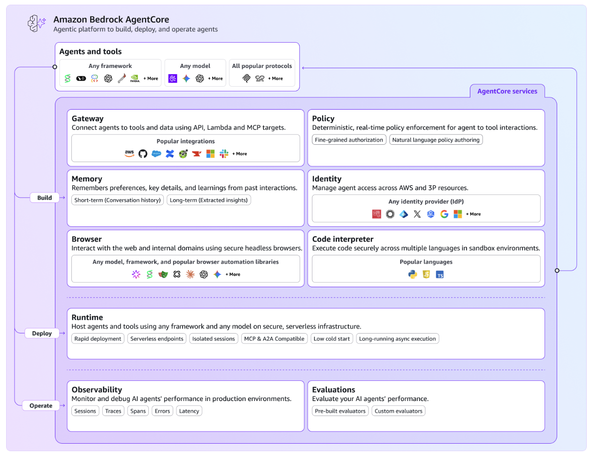
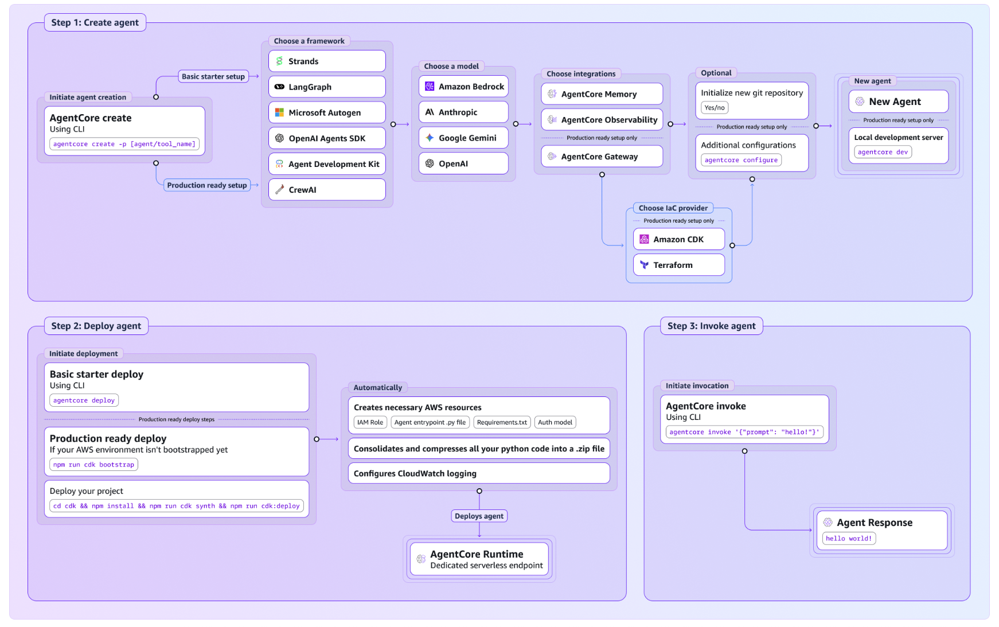

# AWS AgentCore

## Overview

Launched in July 2025, Amazon Bedrock AgentCore enables you to deploy and operate Enterprise AI agents securely, at scale. It provides a comprehensive agentic platform for building, deploying, and operating highly effective agents using any framework and foundation model.

*Source: [AWS Bedrock AgentCore Documentation](https://docs.aws.amazon.com/bedrock-agentcore/latest/devguide/what-is-bedrock-agentcore.html)*

## Key Components

### Core Services
- **AgentCore Runtime**: Scalable execution environment for agents
- **Memory Management**: Persistent and session-based memory systems
- **Observability**: Comprehensive monitoring and logging capabilities
- **Identity & Access Management**: Fine-grained security and permissions
- **Gateway**: API gateway for agent interactions
- **Browser Tool**: Web-based agent interactions and browser automation
- **Code Interpreter**: Secure code execution environment

AgentCore has 6 different capabilities (see [FAQ](https://aws.amazon.com/bedrock/agentcore/faqs/)) as **Runtime, Memory, Gateway, Browser Tool, Code Interpreter, Identity, and Observability**.

### Architecture Overview

*Source: AWS Bedrock AgentCore Documentation*

Amazon Bedrock AgentCore is an agentic platform for building, deploying, and operating highly effective agents securely at scale using any framework and foundation model. With AgentCore, you can:

- Enable agents to take actions across tools and data with the right permissions and governance
- Run agents securely at scale
- Monitor agent performance and quality in production
- Operate without any infrastructure management

## Framework Compatibility

AgentCore services work together or independently with any open-source framework:

### Supported Frameworks
- **CrewAI**: Multi-agent collaboration framework
- **LangGraph**: Graph-based agent workflows
- **LlamaIndex**: Data-focused agent development
- **Strands Agents**: AWS native agent framework
- **Custom Frameworks**: Support for any framework via standard APIs

### Model Flexibility
- **Any Foundation Model**: Not limited to AWS models
- **Multi-provider Support**: OpenAI, Anthropic, Google, and others
- **Custom Models**: Support for fine-tuned and custom models
- **Model Routing**: Intelligent routing based on task requirements

## Key Features

### Enterprise Security
- **IAM Integration**: Native AWS Identity and Access Management
- **VPC Support**: Deploy agents within your virtual private cloud
- **Encryption**: End-to-end encryption for data and communications
- **Audit Logging**: Comprehensive audit trails for compliance
- **Policy Enforcement**: Fine-grained policy controls

### Scalability and Performance
- **Auto-scaling**: Automatic scaling based on demand
- **Multi-region**: Deploy agents across multiple AWS regions
- **High Availability**: Built-in redundancy and failover
- **Performance Optimization**: Optimized for low-latency interactions

### Developer Experience
- **Framework Agnostic**: Use any development framework
- **API-first Design**: RESTful APIs for all operations
- **SDK Support**: SDKs for popular programming languages
- **Local Development**: Tools for local agent development and testing

## Use Cases

### Enterprise Applications
- **Customer Service Automation**: Scalable customer support agents
- **Process Automation**: Streamline business processes with intelligent agents
- **Data Analysis**: Automated data processing and insights generation
- **Compliance Monitoring**: Agents for regulatory compliance and monitoring

### Technical Scenarios
- **Multi-agent Systems**: Coordinate multiple specialized agents
- **Integration Projects**: Connect agents with existing AWS services
- **Batch Processing**: Large-scale automated processing tasks
- **Real-time Decision Making**: Low-latency agent responses

## Getting Started

### Prerequisites
- AWS Account with appropriate permissions
- Bedrock service access in your region
- Understanding of your chosen agent framework

### Setup Process
1. **Enable Bedrock AgentCore** in your AWS account
2. **Configure IAM Roles** for agent permissions
3. **Set up Agent Runtime** environment
4. **Deploy Your Agent** using your preferred framework
5. **Configure Monitoring** and observability

### Best Practices
- **Security First**: Implement least-privilege access patterns
- **Monitor Everything**: Set up comprehensive monitoring from the start
- **Test at Scale**: Use AWS testing tools for load and performance testing
- **Cost Optimization**: Implement cost monitoring and optimization strategies
- **Framework Selection**: Choose frameworks based on your specific use case

## Integration with AWS Services

### Native Integrations
- **Amazon Bedrock**: Foundation model access and management
- **AWS Lambda**: Serverless function integration
- **Amazon S3**: Data storage and retrieval
- **Amazon DynamoDB**: Fast, scalable database for agent state
- **Amazon CloudWatch**: Monitoring and logging
- **AWS Step Functions**: Workflow orchestration

### Security Services
- **AWS IAM**: Identity and access management
- **AWS KMS**: Key management for encryption
- **AWS CloudTrail**: Audit logging and compliance
- **Amazon VPC**: Network isolation and security

## Pricing Model

### Cost Components
- **Runtime Costs**: Based on agent execution time and resources
- **Model Usage**: Foundation model API calls and token usage
- **Storage Costs**: Agent memory and data storage
- **Data Transfer**: Network costs for agent communications
- **Additional Services**: Costs for integrated AWS services

### Cost Optimization
- **Right-sizing**: Choose appropriate instance types for your workload
- **Reserved Capacity**: Use reserved instances for predictable workloads
- **Monitoring**: Implement cost monitoring and alerting
- **Efficient Frameworks**: Choose frameworks optimized for your use case

## Documentation and Resources

- **Official Documentation**: [AWS Bedrock AgentCore](https://docs.aws.amazon.com/bedrock-agentcore/)
- **Getting Started**: [AgentCore Developer Guide](https://docs.aws.amazon.com/bedrock-agentcore/latest/devguide/)
- **API Reference**: [AgentCore API Documentation](https://docs.aws.amazon.com/bedrock-agentcore/latest/api/)
- **Best Practices**: [AWS Agent Development Best Practices](https://docs.aws.amazon.com/prescriptive-guidance/latest/agentic-ai-frameworks/)
- **Blog Announcement**: [Introducing Amazon Bedrock AgentCore](https://aws.amazon.com/blogs/aws/introducing-amazon-bedrock-agentcore-securely-deploy-and-operate-ai-agents-at-any-scale/)
- **AWS Builder Center**: [Agentic AI Design Patterns](https://builder.aws.com/content/2qlet7NAUR02ygnurN1O74CIwTN/agentic-ai-on-aws-the-design-patterns-and-considerations) - A framework with six key components: Perception, Cognitive, Action, Learning, Collaboration, and Security

## Related Sections

- **Section 4.4**: AWS Strands Agents Framework
- **Section 11.3**: AWS Security Perspective
- **Section 14.2**: AWS Maturity Model for Generative AI
- **Section 15.1**: AWS AI Agents Marketplace