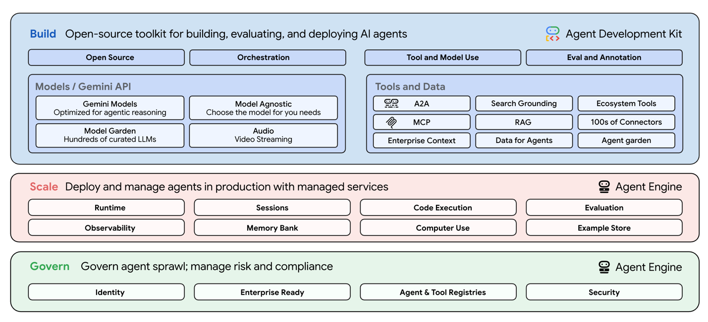

# Google Vertex AI Agent Builder

## Overview

Vertex AI Agent Builder is a suite of products that help developers build, scale, and govern AI agents in production. Vertex AI Agent Builder provides a full-stack, secure foundation that supports the entire agent lifecycle.

*Source: [Google Cloud Agent Builder Documentation](https://docs.cloud.google.com/agent-builder/overview)*

## Key Features

### Comprehensive Agent Lifecycle Support
- **Agent Development**: Visual and code-based agent creation tools
- **Testing and Validation**: Built-in testing frameworks and simulation environments
- **Deployment**: Managed deployment with auto-scaling capabilities
- **Monitoring**: Real-time agent performance and behavior monitoring
- **Governance**: Policy enforcement and compliance management

### Integration Capabilities
- **Native Google Cloud Integration**: Seamless integration with Google Cloud services
- **Gemini Model Integration**: Optimized for Google's Gemini model family
- **Third-party Connectors**: Support for external APIs and services
- **Data Source Integration**: Connect to various data sources and knowledge bases

### Enterprise Features
- **Security and Compliance**: Enterprise-grade security with IAM integration
- **Scalability**: Auto-scaling infrastructure for high-volume deployments
- **Multi-tenancy**: Support for multiple agent environments and teams
- **Audit and Logging**: Comprehensive audit trails and logging capabilities

## Architecture

The Vertex AI Agent Builder follows a layered architecture approach:

### Agent Runtime Layer
- **Execution Engine**: Handles agent reasoning and decision-making
- **Tool Integration**: Manages external tool and API interactions
- **State Management**: Maintains conversation and session state
- **Memory Systems**: Short-term and long-term memory management

### Platform Services Layer
- **Model Services**: Access to Gemini and other foundation models
- **Data Services**: Integration with Google Cloud data platforms
- **Security Services**: Authentication, authorization, and policy enforcement
- **Monitoring Services**: Performance metrics and observability

### Integration Layer
- **API Gateway**: RESTful APIs for agent interaction
- **Event Streaming**: Real-time event processing and notifications
- **Webhook Support**: Integration with external systems via webhooks
- **Protocol Support**: Support for standard protocols like MCP and A2A

## Use Cases

### Enterprise Applications
- **Customer Service Agents**: Automated customer support with escalation capabilities
- **Internal Process Automation**: Streamlining internal workflows and operations
- **Knowledge Management**: Intelligent information retrieval and synthesis
- **Decision Support**: Data-driven insights and recommendations

### Developer Scenarios
- **Rapid Prototyping**: Quick agent development and testing
- **Multi-agent Systems**: Coordinated agent workflows
- **Integration Projects**: Connecting agents with existing enterprise systems
- **Compliance-heavy Industries**: Regulated environments requiring audit trails

## Getting Started

### Prerequisites
- Google Cloud Project with billing enabled
- Vertex AI API enabled
- Appropriate IAM permissions for agent development

### Basic Setup
1. **Enable Vertex AI Agent Builder** in your Google Cloud project
2. **Create Agent Configuration** using the console or API
3. **Define Agent Behavior** through instructions and tool configurations
4. **Test Agent** using the built-in testing environment
5. **Deploy Agent** to production environment

### Best Practices
- **Start Simple**: Begin with basic agent capabilities and iterate
- **Use Templates**: Leverage pre-built agent templates for common use cases
- **Monitor Performance**: Implement comprehensive monitoring from day one
- **Security First**: Apply security best practices throughout development
- **Test Thoroughly**: Use simulation environments for comprehensive testing

## Pricing and Considerations

### Cost Factors
- **Model Usage**: Charges based on token consumption
- **Platform Services**: Additional charges for platform features
- **Data Processing**: Costs for data ingestion and processing
- **Storage**: Charges for agent state and memory storage

### Vendor Considerations
- **Google Cloud Ecosystem**: Optimized for Google Cloud environments
- **Model Dependency**: Primary optimization for Gemini models
- **Enterprise Focus**: Designed for enterprise-scale deployments
- **Managed Service**: Reduced operational overhead but less control

## Documentation and Resources

- **Official Documentation**: [Vertex AI Agent Builder Docs](https://docs.cloud.google.com/agent-builder/overview)
- **Getting Started Guide**: [Agent Builder Quickstart](https://cloud.google.com/vertex-ai/generative-ai/docs/agent-builder/create-agent)
- **API Reference**: [Agent Builder API](https://cloud.google.com/vertex-ai/generative-ai/docs/reference/rest)
- **Best Practices**: [Agent Development Best Practices](https://cloud.google.com/architecture/choose-agentic-ai-architecture-components)

## Related Sections

- **Section 4.3**: Google ADK (Agent Development Kit)
- **Section 6.3**: Agent2Agent (A2A) Protocol
- **Section 11.2**: Google Security Perspective
- **Section 16.2**: Google Best Practices