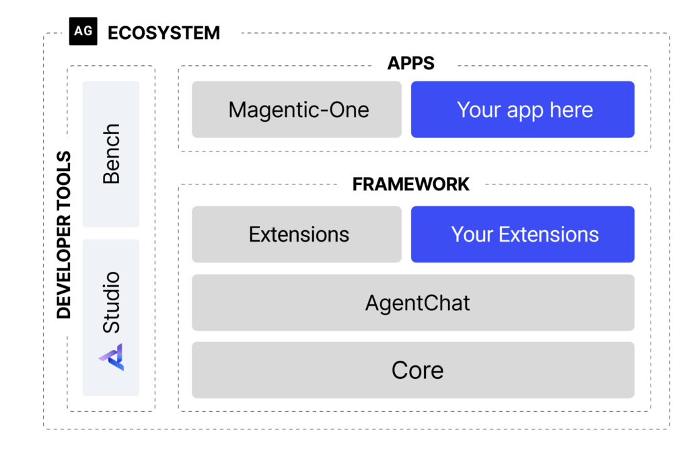

# AutoGen

## Overview

AutoGen is a programming framework, developed by Microsoft, for building Agentic AI agents and applications. It provides a multi-agent conversation framework as a high-level abstraction for building multi-agent conversational systems where multiple AI agents can collaborate, debate, and solve complex problems through structured conversations.

## High-level Architecture

*Source: [AutoGen (0.4)](https://www.microsoft.com/en-us/research/project/autogen/)*

## Key Features

- **Multi-agent conversation framework**: Provides a high-level abstraction for building agentic AI agents and applications
- **Asynchronous messaging**: Enables non-blocking communication between agents
- **Modular and extensible**: Flexible architecture for customization and extension
- **Observability and debugging**: Built-in tools for monitoring and troubleshooting agent interactions
- **Scalable and distributed**: Supports large-scale, distributed agent deployments
- **Built-in and community extensions**: Rich ecosystem of pre-built and community-contributed components
- **Cross-language support**: Works across different programming languages
- **Full-type support**: Strong typing for better development experience
- **Enhanced LLM inference APIs**: Improved inference performance and reduced cost
- **AutoGen Studio UI**: Low-code interface for prototyping and managing agents without writing code

## Suitable for (Pros)

- **When alignment with open-source and Microsoft ecosystems** is prevalent, AutoGen is a suitable solution for building agentic applications and AI agents
- **AutoGen offers an evolving ecosystem** to support a wide range of applications from various domains and complexities
- **AutoGen Studio UI application**: For prototyping and managing agents without writing code
- **Research and experimentation**: Ideal for researching complex agent interactions, prototyping new multi-agent systems, or experimenting with advanced AI agent designs
- **Multi-agent collaboration**: Excellent for scenarios requiring multiple agents to work together on complex problems

## Where other frameworks flare better (Cons)

- **AutoGen continues to be experimental** (not completely production-ready) and not production-ready for critical enterprise applications
- **While AutoGen is an open-source solution**, dependency on Microsoft solutions can be a consideration based on the organizational context. Magentic-One is a commercial solution, built on top of AutoGen, offering advanced capabilities such as a high-performing generalist agentic system for enterprises
- **The complexity of setting up AutoGen**, particularly within an enterprise has been observed as a key concern
- **Limited production readiness**: Better suited for research and prototyping rather than production deployments

## Resources

- **Official Documentation**: [AutoGen Documentation](https://microsoft.github.io/autogen/0.2/)
- **GitHub Repository**: [Microsoft AutoGen](https://github.com/microsoft/autogen)
- **AutoGen Studio**: [Low-code interface for building multi-agent workflows](https://www.microsoft.com/en-us/research/blog/introducing-autogen-studio-a-low-code-interface-for-building-multi-agent-workflows/)
- **Magentic-One**: [Generalist multi-agent system](https://www.microsoft.com/en-us/research/articles/magentic-one-a-generalist-multi-agent-system-for-solving-complex-tasks/)

## See Also
- [Microsoft Agent Framework](microsoft-framework.md)
- [Semantic Kernel](semantic-kernel.md)
- [Multi-Agent Systems](../Architecture/multi-agent-system.md)
- [Agent Development Frameworks](README.md)