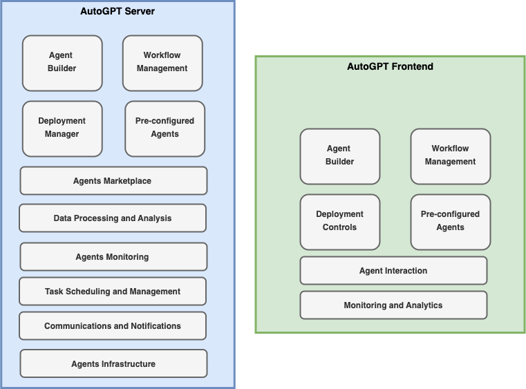

# AutoGPT

## Overview

[AutoGPT](https://github.com/Significant-Gravitas/AutoGPT), built by Significant Gravitas, is a powerful platform that allows you to create, deploy, and manage continuous AI agents that automate complex workflows. It was originally built on top of OpenAI's GPT but extended to support additional LLMs (Anthropic, Groq, Llama).

## High-level Architecture

*AutoGPT Platform Components*

## Key Features

- **Seamless Integration and Low-Code Workflows**: Drag-and-drop interface for building agent workflows without deep coding knowledge
- **Autonomous Operation and Continuous Agents**: Agents that run continuously and autonomously to complete complex tasks
- **Intelligent Automation and Maximum Efficiency**: Smart task decomposition and execution
- **Reliable Performance and Predictable Execution**: Consistent and repeatable agent behavior
- **Multi-LLM support**: Originally built on OpenAI's GPT, extended to support Anthropic, Groq, and Llama

## Suitable for (Pros)

- **No code or low-code-centric approach** for building agents is preferred with the ability to build the agents in the Cloud (while it offers a self-hosted solution, the setup complexity is higher)
- **Quick prototyping**: Rapid development of autonomous agent workflows
- **Simple autonomous workflows**: Well-suited for straightforward automation use cases

## Where other frameworks flare better (Cons)

- **Vendor dependency and lock-in** to access advanced features can be key concerns for enterprises. The cloud-hosted solution is in the roadmap and currently being offered to waitlist consumers
- **The complexity of licensing support**: Currently has dual licensing support while the majority is being offered as an MIT license
- **Additional LLM support** such as Google's Gemini and more will continue to be a key challenge along with community support

## Resources

- **GitHub Repository**: [AutoGPT](https://github.com/Significant-Gravitas/AutoGPT)

## See Also
- [Agent Development Frameworks](README.md)
- [Multi-Agent Systems](../Architecture/multi-agent-system.md)
- [CrewAI](crewai.md)
