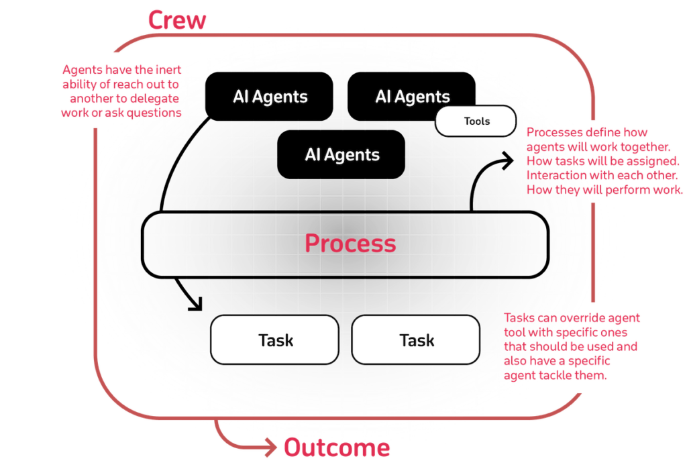

# CrewAI

## Overview

CrewAI is a framework for orchestrating role-playing, autonomous AI agents. CrewAI emerged as a promising multi-agent framework to build and deploy workflow-based applications with support from a wide array of LLMs and Cloud providers. It enables the creation of collaborative agent teams where each agent has specific roles, goals, and tools to accomplish complex tasks together.

## High-level Architecture

*Source: [CrewAI Documentation](https://docs.crewai.com/introduction)*

## Key Features

- **Multi-agent framework**: Emerged as a promising multi-agent framework to build and deploy workflow-based applications with support from a wide array of LLMs and Cloud providers
- **Multi-agent collaboration**: Structured collaboration between autonomous AI agents
- **Structured workflow design**: Well-defined workflows for complex task execution
- **User-friendly interface**: Intuitive interface for creating and managing agent teams
- **Integration flexibility**: Support for various LLMs and cloud providers
- **Community support**: Active community and ecosystem development
- **Role-based agents**: Each agent has specific roles, goals, and tools
- **Workflow orchestration**: Sophisticated orchestration of multi-agent workflows

## Suitable for (Pros)

- **CrewAI has emerged as the fastest growing AI agents ecosystem** and raised funding of $18M in Oct 2024. The simplicity of creating business-friendly agents has made it easy to understand realizing the value of GenAI quickly
- **Quicker time-to-market** with out-of-the-box customization and more suitable for building lightweight agents such as marketing agents
- **Business-friendly approach**: Simplified approach to creating practical business applications
- **Rapid development**: Quick setup and deployment of multi-agent systems
- **Growing ecosystem**: Fast-growing community and ecosystem support
- **Workflow-based applications**: Excellent for structured, workflow-driven use cases

## Where other frameworks flare better (Cons)

- **The ability to handle large enterprise-specific complex scenarios** with data integration has not been production-tested and will need to be assessed in the future
- **The vendor dependency and lock-in** have been a key consideration and the possibility of CrewAI to be acquired by one of the hyperscalers or other players remains an open question
- **Limited enterprise testing**: Less proven in large-scale enterprise deployments
- **Acquisition uncertainty**: Potential concerns about future ownership and direction

## Resources

- **Official Website**: [CrewAI](https://www.crewai.com/)
- **Documentation**: [CrewAI Documentation](https://docs.crewai.com/introduction)
- **GitHub Repository**: [CrewAI GitHub](https://github.com/joaomdmoura/crewAI)
- **Funding News**: [CrewAI raises $18M funding](https://siliconangle.com/2024/10/22/agentic-ai-startup-crewai-closes-18m-funding-round/)

## See Also
- [Agent Development Frameworks](README.md)
- [Multi-Agent Systems](../Architecture/multi-agent-system.md)
- [LangChain](langchain.md)
- [AutoGen](autogen.md)