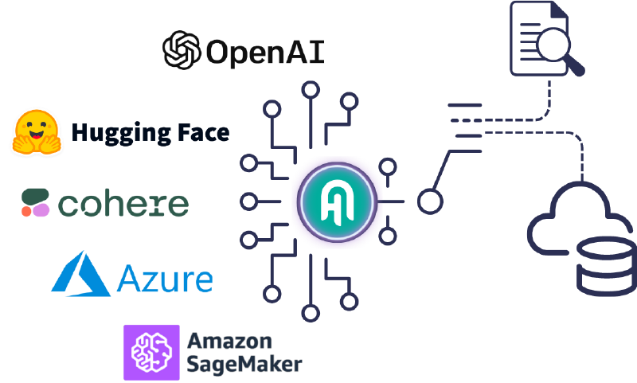

# Haystack

## Overview

[Haystack](https://haystack.deepset.ai/) (built by deepset) is an open-source framework for building production-ready LLM applications, RAG pipelines, and complex search applications for enterprises. It has been built applying modular architecture principles combining technology from OpenAI, Chroma, Marqo, and other open-source projects like Hugging Face's Transformers and Elasticsearch.

## High-level Architecture

*Source: [Haystack](https://haystack.deepset.ai/overview/intro)*

## Key Features

- **Production-ready LLM framework**: Built for enterprise-grade LLM applications and RAG pipelines
- **Modular architecture**: Combines technology from OpenAI, Chroma, Marqo, Hugging Face Transformers, and Elasticsearch
- **RAG pipeline support**: First-class support for Retrieval-Augmented Generation workflows
- **Complex search capabilities**: Advanced search and question-answering system construction
- **deepsetCloud**: An LLM AI platform providing in-built LLMOps capabilities
- **deepset Studio**: A free AI application development environment for Haystack that augments the development lifecycle
- **Jinja templates**: Custom RAG pipeline components using Jinja templates

## Suitable for (Pros)

- **Building LLM applications for any Cloud** with deepsetCloud as an LLM AI platform providing in-built LLMOps capabilities
- **Custom RAG pipelines** with Jinja templates for components
- **deepset Studio**: Free AI application development environment that augments the development lifecycle
- **Production deployments**: Well-suited for enterprise-grade search and QA systems

## Where other frameworks flare better (Cons)

- **Multi-agent capabilities are yet to be battle-tested** and the roadmap needs to be reflected to understand the bigger picture
- **Less focus on agentic orchestration**: Primarily a pipeline/search framework rather than a full agent orchestration platform
- **Complex setup**: Can require significant configuration for advanced use cases

## Resources

- **Official Website**: [Haystack by deepset](https://haystack.deepset.ai/)
- **deepsetCloud**: [LLMOps platform](https://www.deepset.ai/deepset-cloud)
- **GitHub Repository**: [Haystack GitHub](https://github.com/deepset-ai/haystack)

## See Also
- [Agent Development Frameworks](README.md)
- [RAG Reference Architecture](../ReferenceArchitecture/rag-architecture.md)
- [Multi-Agent Systems](../Architecture/multi-agent-system.md)
