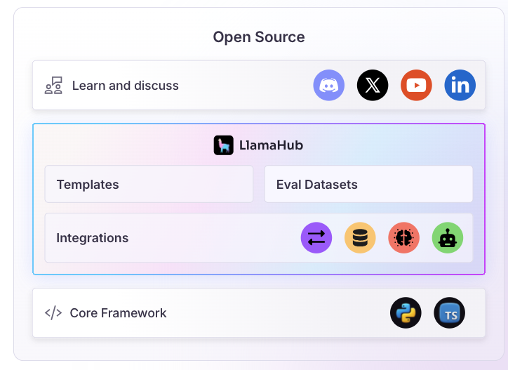

# LlamaIndex

## Overview

LlamaIndex is a data framework for connecting custom data sources to large language models. LlamaIndex started with data framework capabilities for LLM applications and has evolved to cover AI agents, document parsing & indexing, workflow, connectors-based integration, modularity & extensibility, and many more capabilities.

## High-level Architecture

*Source: [LlamaIndex Framework](https://www.llamaindex.ai/framework)*

## Key Features

- **Data framework capabilities**: Started with data framework capabilities for LLM applications and has evolved to cover AI agents, document parsing & indexing, workflow, connectors-based integration, modularity & extensibility
- **LlamaCloud**: Offers a SaaS capability as LlamaCloud as a knowledge management hub for AI Agents
- **LlamaParse**: A differentiated offering for transforming instructed data into LLM-optimized formats
- **LlamaHub**: A centralized place to explore Agents, LLMs, Vector Stores, Data Loaders, etc.
- **Document processing**: Efficient parsing and indexing of complex documents
- **Knowledge management**: Comprehensive knowledge management capabilities for AI systems
- **Multi-modal support**: Supports various data types and formats

## Suitable for (Pros)

- **As an alternative to LangChain**: LlamaIndex has evolved as a compelling alternative, particularly for data-intensive LLM applications
- **The ability to parse and index complex documents efficiently** with LlamaCloud makes it a compelling option for enterprises seeking quicker time-to-market
- **Building knowledge-intensive AI systems** like chatbots and question-answering systems
- **Data-centric applications**: Excellent for applications that require sophisticated data processing and retrieval
- **Enterprise knowledge management**: Strong capabilities for enterprise-scale knowledge management systems

## Where other frameworks flare better (Cons)

- **Primarily focused on data indexing and retrieval**, with less emphasis on complex agent behaviors and decision-making. However, the evolution of the framework towards building Agentic apps provides promising capabilities
- **Limited agent orchestration**: Less sophisticated agent coordination compared to specialized multi-agent frameworks
- **Learning curve**: Requires understanding of data indexing and retrieval concepts

## Resources

- **Official Website**: [LlamaIndex](https://www.llamaindex.ai/)
- **LlamaCloud**: [Knowledge management hub](https://cloud.llamaindex.ai/)
- **LlamaParse**: [Document parsing service](https://www.llamaindex.ai/llamaparse)
- **LlamaHub**: [Centralized resource hub](https://llamahub.ai/)
- **GitHub Repository**: [LlamaIndex GitHub](https://github.com/run-llama/llama_index)

## See Also
- [Agent Development Frameworks](README.md)
- [RAG Reference Architecture](../ReferenceArchitecture/rag-architecture.md)
- [Context Engineering](../ContextEngineering/README.md)