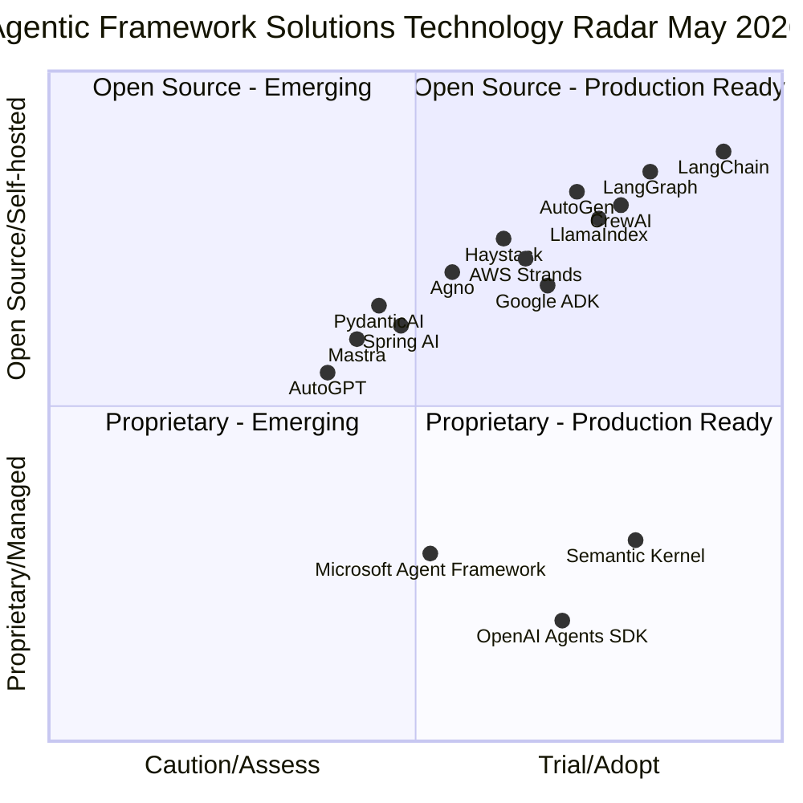

# Agentic Framework Solutions

## Overview

This page consolidates all agentic AI development frameworks — open-source libraries, managed cloud SDKs, and specialized platforms — and maps them to a **Technology Radar** adapted from the [Thoughtworks Radar](https://www.thoughtworks.com/radar) methodology. Each framework is assessed across five dimensions: research backing, industry adoption, GitHub community signal, production readiness, and open-source availability.

The four radar rings:

| Ring | Meaning |
|---|---|
| **Adopt** | Proven in production. Strong community signal. Recommended as the default choice for new projects. |
| **Trial** | Worth using on projects that can tolerate some risk. Actively growing adoption. Evaluate for your use case. |
| **Assess** | Interesting and worth understanding. Not yet proven at scale. Monitor before committing. |
| **Caution** | Use with care. May be early-stage, deprecated, narrowly scoped, or vendor-locked in ways that limit flexibility. |

---

## Technology Radar

The chart below maps all frameworks across two axes: **Adoption Readiness** (x-axis, left=Caution → right=Adopt) and **Open Source** (y-axis, bottom=Proprietary/Managed → top=Open Source/Self-hosted). Ring position reflects the radar rating.

**How to read this chart:**
- **Right side** (x > 0.5) = Trial or Adopt — production-ready, recommended for evaluation
- **Left side** (x < 0.5) = Assess or Caution — early-stage or narrowly scoped
- **Top half** (y > 0.5) = Open source / self-hostable
- **Bottom half** (y < 0.5) = Proprietary / managed cloud SDK

---

### 🟢 Adopt

These frameworks have demonstrated production readiness, strong community adoption, and clear fit for building agentic AI systems.

#### LangChain
**Type**: Open-source framework (MIT)
**Language(s)**: Python, TypeScript
**GitHub**: [langchain-ai/langchain](https://github.com/langchain-ai/langchain) — ~100K stars, 1M+ builders
**Deployment**: Self-hosted

The de facto standard for building LLM-powered applications. LangChain provides a unified interface for chains, agents, tools, memory, and vector store integrations. Its breadth of vendor integrations and the size of its community make it the most commonly referenced framework in enterprise GenAI projects.

**Why Adopt**: Largest ecosystem in the space. Extensive third-party integrations (vector DBs, LLM providers, tools). Proven in production across thousands of enterprise deployments. Comprehensive documentation and community knowledge.

**Best for**: Enterprise GenAI applications requiring broad vendor compatibility, teams building foundational agentic infrastructure, projects where community support and ecosystem breadth matter.

**Limitations**: Complex architecture with steep learning curve. Heavy dependency tree. Frequent breaking changes. Abstraction layers can introduce latency overhead.

| Dimension | Signal |
|---|---|
| Research | Broad academic and industry citation |
| GitHub stars | ~100K |
| Open source | Yes (MIT) |
| Production readiness | GA — widely deployed in enterprise |
| Backing | LangChain (VC-backed) |

---

#### LangGraph
**Type**: Open-source graph-based workflow framework (MIT) + commercial platform
**Language(s)**: Python, TypeScript
**GitHub**: [langchain-ai/langgraph](https://github.com/langchain-ai/langgraph) — ~8K stars
**Deployment**: SaaS (LangGraph Platform) + Self-hosted

LangGraph extends LangChain with a graph-based state machine model for building stateful, multi-actor agent workflows. Nodes represent agent steps; edges encode conditional routing. The commercial LangGraph Platform adds persistence, streaming, human-in-the-loop controls, and deployment infrastructure.

**Why Adopt**: The most principled open-source approach to stateful multi-agent orchestration. Native LangChain integration. LangSmith observability built in. Growing enterprise adoption for complex workflow orchestration.

**Best for**: Multi-agent systems requiring complex state management, conditional branching, and cycle detection. Teams already on the LangChain stack.

**Limitations**: Enterprise features (persistence, deployment, HITL) require the commercial platform. Steep learning curve for graph-based concepts. Dependency complexity inherited from LangChain.

| Dimension | Signal |
|---|---|
| Research | LangChain engineering + academic citations |
| GitHub stars | ~8K |
| Open source | Yes (MIT) |
| Production readiness | GA — open source + commercial platform |
| Backing | LangChain (VC-backed) |

---

#### CrewAI
**Type**: Open-source multi-agent framework (MIT) + SaaS platform
**Language(s)**: Python
**GitHub**: [crewAIInc/crewAI](https://github.com/joaomdmoura/crewAI) — ~25K stars
**Funding**: $18M (Oct 2024)
**Deployment**: SaaS + Self-hosted

CrewAI is a role-based multi-agent framework where agents are assigned specific roles, goals, and tools to collaborate on tasks. Its business-friendly abstraction and fast time-to-market have made it the fastest-growing framework in the agentic space. Supports a wide array of LLMs and cloud providers.

**Why Adopt**: Fastest-growing community in the multi-agent space. Simplest path to building collaborative agent teams. Strong business-use-case alignment. Active development and growing enterprise adoption.

**Best for**: Business-oriented multi-agent workflows, marketing and content agents, teams that need quick time-to-market with minimal framework complexity.

**Limitations**: Less proven for large-scale enterprise data integration scenarios. Vendor dependency and potential acquisition risk. Limited complex scenario testing compared to LangGraph.

| Dimension | Signal |
|---|---|
| Research | CrewAI engineering |
| GitHub stars | ~25K |
| Open source | Yes (MIT) |
| Production readiness | GA — SaaS + self-hosted |
| Funding | $18M (Oct 2024) |

---

#### AutoGen (Microsoft)
**Type**: Open-source multi-agent conversational framework (MIT)
**Language(s)**: Python (multi-language support)
**GitHub**: [microsoft/autogen](https://github.com/microsoft/autogen) — ~38K stars
**Deployment**: Self-hosted

Microsoft Research's framework for building multi-agent systems through asynchronous message passing. AutoGen agents communicate via structured conversations, enabling complex multi-agent collaboration patterns. AutoGen Studio provides a no-code UI for prototyping. The v0.4 rewrite introduced a fully async, event-driven architecture.

**Why Adopt**: Strong research pedigree (Microsoft Research). Large community. Async-first architecture well-suited for complex agent interactions. AutoGen Studio lowers the barrier for prototyping. Active development with significant Microsoft investment.

**Best for**: Research and prototyping of multi-agent systems, Microsoft ecosystem alignment, teams exploring conversational multi-agent patterns.

**Limitations**: Production maturity lags behind LangChain/LangGraph. Microsoft ecosystem dependency. Complex enterprise setup. The v0.4 rewrite introduced breaking changes from earlier versions.

| Dimension | Signal |
|---|---|
| Research | Microsoft Research — multiple papers |
| GitHub stars | ~38K |
| Open source | Yes (MIT) |
| Production readiness | Beta/GA — active development |
| Backing | Microsoft |

---

#### LlamaIndex
**Type**: Open-source data framework for LLM applications (MIT) + SaaS (LlamaCloud)
**Language(s)**: Python, TypeScript
**GitHub**: [run-llama/llama_index](https://github.com/run-llama/llama_index) — ~38K stars
**Deployment**: SaaS (LlamaCloud) + Self-hosted

LlamaIndex is the leading data-centric framework for LLM applications. It provides connectors, parsers, indexing, and retrieval primitives that form the foundation of RAG pipelines and knowledge-intensive agents. LlamaParse handles complex document parsing; LlamaHub centralizes community integrations.

**Why Adopt**: The strongest framework for data-intensive LLM applications and RAG pipelines. Modular architecture. Extensive connector ecosystem. LlamaCloud provides managed parsing and indexing at scale.

**Best for**: Knowledge-intensive agents, RAG systems, document-heavy applications, chatbots and QA systems requiring sophisticated retrieval.

**Limitations**: Less focused on agent decision-making and orchestration compared to LangGraph or CrewAI. Agentic features are evolving. Less suited for pure orchestration use cases.

| Dimension | Signal |
|---|---|
| Research | LlamaIndex engineering + RAG research |
| GitHub stars | ~38K |
| Open source | Yes (MIT) |
| Production readiness | GA — SaaS + self-hosted |
| Backing | LlamaIndex (VC-backed) |

---

### 🔵 Trial

These frameworks are worth using on projects that can tolerate some risk. Actively growing, with real production usage, but not yet the default choice.

#### Semantic Kernel (Microsoft)
**Type**: Production-ready SDK (MIT) — enterprise-grade
**Language(s)**: Python, C#, Java
**GitHub**: [microsoft/semantic-kernel](https://github.com/microsoft/semantic-kernel)
**Deployment**: SDK (enterprise) + Azure integration

Microsoft's production-ready SDK for integrating LLMs into enterprise applications. Semantic Kernel provides built-in Agent and Process Frameworks, plugin architecture, and deep Azure OpenAI integration. Multi-language support (Python, C#, Java) makes it uniquely suited for polyglot enterprise environments.

**Why Trial**: The only framework with first-class C# and Java support alongside Python. Strong enterprise integration story. Built-in process orchestration. Actively maintained by Microsoft with enterprise SLAs via Azure.

**Best for**: Enterprise teams on the Microsoft stack, polyglot environments requiring C# or Java agents, Azure OpenAI deployments.

**Limitations**: Microsoft vendor dependency. Evolving agent framework — features are still maturing. Java agent support is more limited than Python/C#. Less community visibility than LangChain.

| Dimension | Signal |
|---|---|
| Research | Microsoft internal |
| GitHub stars | Significant (enterprise SDK) |
| Open source | Yes (MIT) |
| Production readiness | GA — enterprise SDK |
| Backing | Microsoft |

---

#### AWS Strands Agents
**Type**: Open-source agent SDK (Apache 2.0)
**Language(s)**: Python
**GitHub**: [strands-agents/sdk-python](https://github.com/strands-agents/sdk-python)
**Deployment**: Self-hosted + AWS ecosystem

AWS's open-source agent SDK, launched July 2025. Strands takes a model-driven approach — the LLM itself drives the agentic loop rather than hard-coded orchestration logic. Lightweight and composable, with native integration into the AWS ecosystem (Bedrock, AgentCore, Lambda).

**Why Trial**: Model-driven approach reduces orchestration boilerplate. Native AWS integration for teams already on Bedrock. Apache 2.0 license. AWS backing provides long-term maintenance confidence.

**Best for**: AWS-native teams building agents on Bedrock, teams that prefer minimal framework abstraction, orchestration and agent collaboration use cases.

**Limitations**: Smaller community than LangChain/CrewAI. AWS ecosystem dependency for full feature set. Newer framework with limited production case studies outside AWS.

| Dimension | Signal |
|---|---|
| Research | AWS engineering |
| GitHub stars | Growing (launched July 2025) |
| Open source | Yes (Apache 2.0) |
| Production readiness | GA — AWS-backed |
| Backing | AWS |

---

#### Google ADK (Agent Development Kit)
**Type**: Open-source agent framework
**Language(s)**: Python, Java
**GitHub**: [google/adk-python](https://github.com/google/adk-python)
**Deployment**: Self-hosted + Google Cloud (Vertex AI Agent Engine)

Google's modular, model-agnostic agent framework, launched April 2025. ADK is optimized for multi-agent systems and integrates natively with Gemini and Vertex AI Agent Engine. Supports both Python and Java, with a focus on composable agent pipelines and tool use.

**Why Trial**: Strong multi-agent architecture. Platform-agnostic design despite GCP optimization. Python + Java support. Native Vertex AI integration for GCP teams. Active development with Google backing.

**Best for**: GCP-native teams, multi-agent systems requiring composable pipelines, enterprise or academic adaptation of Google's agent patterns.

**Limitations**: GCP-heavy for full feature set. Evolving documentation. Smaller community than LangChain. Less proven outside the Google ecosystem.

| Dimension | Signal |
|---|---|
| Research | Google Research + ADK documentation |
| GitHub stars | Growing (launched April 2025) |
| Open source | Yes |
| Production readiness | GA — Vertex AI Agent Engine |
| Backing | Google |

---

#### Haystack (deepset)
**Type**: Open-source production RAG/search pipeline framework (MIT) + deepsetCloud
**Language(s)**: Python
**GitHub**: [deepset-ai/haystack](https://github.com/deepset-ai/haystack)
**Deployment**: Self-hosted + deepsetCloud

Haystack is a production-ready framework for building RAG pipelines and search-augmented LLM applications. Its modular pipeline architecture supports Hugging Face models, Elasticsearch, OpenAI, and Chroma. deepsetCloud provides a managed deployment option.

**Why Trial**: Strong production track record for RAG and search use cases. Modular architecture enables cross-cloud deployments. LLMOps capabilities built in. Hugging Face and Elasticsearch integration are differentiators.

**Best for**: Cross-cloud RAG pipelines, production search-augmented LLM applications, teams needing LLMOps capabilities.

**Limitations**: Limited multi-agent testing. Complex setup for non-RAG use cases. Roadmap visibility has been a community concern. Less suited for pure orchestration scenarios.

| Dimension | Signal |
|---|---|
| Research | deepset engineering + NLP research |
| GitHub stars | Significant (established framework) |
| Open source | Yes (MIT) |
| Production readiness | GA — self-hosted + deepsetCloud |
| Backing | deepset (VC-backed) |

---

#### Agno
**Type**: Open-source full-stack multi-agent framework (MPL-2.0)
**Language(s)**: Python
**GitHub**: [agno-agi/agno](https://github.com/agno-agi/agno) — ~34K stars
**Deployment**: Self-hosted

Agno is a high-performance multi-agent framework with a full-stack design: built-in memory, knowledge, reasoning, and UI components. Claims ~2μs agent instantiation time and ~3.75 KiB memory per agent — making it suitable for high-volume, latency-sensitive deployments. Supports agent teams and composable workflows.

**Why Trial**: Exceptional performance characteristics for high-volume use cases. Full-stack design reduces the need to bolt together separate memory and knowledge components. Privacy-first (self-hosted). Growing community (~34K stars).

**Best for**: High-performance, high-volume agent deployments, privacy-first self-hosted environments, teams that want an integrated memory + knowledge + reasoning stack.

**Limitations**: Newer ecosystem with limited production proof outside early adopters. MPL-2.0 license has copyleft implications for some commercial use cases. Less community knowledge than LangChain.

| Dimension | Signal |
|---|---|
| Research | Agno engineering |
| GitHub stars | ~34K |
| Open source | Yes (MPL-2.0) |
| Production readiness | Beta/GA — self-hosted |
| Backing | Agno AGI |

---

#### OpenAI Agents SDK
**Type**: Proprietary SDK (OpenAI) — lightweight
**Language(s)**: Python, JavaScript
**Docs**: [platform.openai.com/docs/guides/agents](https://platform.openai.com/docs/guides/agents)
**Deployment**: SaaS + Self-hosted

OpenAI's production-ready upgrade of the experimental Swarm framework. The Agents SDK provides a lightweight, low-abstraction path to building agentic applications on OpenAI models. Includes built-in tool use, handoffs between agents, and tracing. Designed for simplicity over configurability.

**Why Trial**: Simplest path to production agents on OpenAI models. Minimal abstractions reduce complexity. Official OpenAI support. Good fit for teams already committed to the OpenAI ecosystem.

**Best for**: Teams building on OpenAI models who want minimal framework overhead, rapid prototyping, simple agentic workflows.

**Limitations**: OpenAI vendor lock-in. Limited low-level control. Less flexible than open-source alternatives for multi-provider or self-hosted deployments.

| Dimension | Signal |
|---|---|
| Research | OpenAI engineering |
| GitHub stars | N/A (proprietary SDK) |
| Open source | Mixed (SDK open, models proprietary) |
| Production readiness | GA |
| Backing | OpenAI |

---

### 🟡 Assess

Interesting frameworks worth understanding and monitoring. Not yet proven at scale or too narrowly scoped for general recommendation.

#### PydanticAI
**Type**: Open-source type-safe agent framework (MIT)
**Language(s)**: Python
**GitHub**: [pydantic/pydantic-ai](https://github.com/pydantic/pydantic-ai)
**Deployment**: Self-hosted

A FastAPI-style agent framework built on Pydantic's type system. PydanticAI brings dependency injection, structured output validation, and Pydantic Logfire observability to agent development. Supports multiple LLM providers and graph-based workflows.

**Why Assess**: Strong type-safety story for teams already using Pydantic/FastAPI. Logfire integration is a differentiator for observability. But it is still in beta with frequent breaking changes and limited production case studies.

**Best for**: Type-safe agent development in FastAPI-aligned projects, teams that prioritize structured output validation.

**Limitations**: Beta stage with frequent changes. Limited production testing. Early-stage ecosystem. Complex integration challenges for non-Pydantic stacks.

| Dimension | Signal |
|---|---|
| Research | Pydantic engineering |
| GitHub stars | Growing (early-stage) |
| Open source | Yes (MIT) |
| Production readiness | Beta |
| Backing | Pydantic (VC-backed) |

---

#### Spring AI
**Type**: Open-source LangChain-inspired framework for Java/Spring (MIT)
**Language(s)**: Java / Spring
**GitHub**: [spring-projects/spring-ai](https://github.com/spring-projects/spring-ai)
**Deployment**: Self-hosted (Spring ecosystem)

Spring AI brings LangChain-inspired patterns to the Java/Spring ecosystem. Provides LLM integration, RAG capabilities, an Advisors API for reusable patterns, and async processing. Native Spring Boot integration makes it the natural choice for Java enterprise teams.

**Why Assess**: The only mature option for Java/Spring enterprise teams building LLM applications. Spring ecosystem integration is a genuine differentiator. But it is a newer framework with limited complex-scenario testing.

**Best for**: Java/Spring enterprise applications, system integration projects requiring async processing, teams that cannot adopt Python-based frameworks.

**Limitations**: Newer framework with limited production proof. Feature gaps compared to Python-based alternatives. Limited community resources relative to LangChain.

| Dimension | Signal |
|---|---|
| Research | Spring engineering |
| GitHub stars | Growing |
| Open source | Yes (MIT) |
| Production readiness | Beta/GA — Spring ecosystem |
| Backing | VMware/Broadcom (Spring) |

---

#### Mastra
**Type**: Open-source TypeScript-first multi-agent framework (Apache 2.0)
**Language(s)**: TypeScript
**Docs**: [mastra.ai](https://mastra.ai)
**Deployment**: Self-hosted

Mastra is a TypeScript-first framework for building multi-agent systems with graph-based state machines. Designed to integrate with existing REST APIs and web services, making it a natural fit for web application teams. Supports workflow-centric hybrid architectures.

**Why Assess**: The strongest TypeScript-native option for web teams building agentic features. Graph-based state machines provide principled workflow control. But it is a newer framework with limited production proof and TypeScript-only scope.

**Best for**: Web applications and TypeScript projects, workflow-centric hybrid architectures, teams that cannot adopt Python-based frameworks.

**Limitations**: TypeScript-only — not suitable for Python-first teams. Newer framework with limited production case studies. Smaller community than LangChain or CrewAI.

| Dimension | Signal |
|---|---|
| Research | Mastra engineering |
| GitHub stars | Early-stage |
| Open source | Yes (Apache 2.0) |
| Production readiness | Beta |
| Backing | Mastra |

---

#### Microsoft Agent Framework
**Type**: Open-source unified SDK for .NET and Python (MIT)
**Language(s)**: .NET, Python
**GitHub**: [microsoft/agent-framework](https://github.com/microsoft/agent-framework)
**Deployment**: Self-hosted + Azure

Microsoft's unified SDK for orchestrating AI agents and workflows across .NET and Python. Designed to complement Semantic Kernel with higher-level orchestration primitives. Still early-stage with ecosystem tied to the Microsoft stack.

**Why Assess**: Potential to become the standard for .NET agent development. Microsoft backing provides long-term maintenance confidence. But it is still early-stage with limited community signal.

**Best for**: Enterprise teams on .NET who need agent orchestration beyond what Semantic Kernel provides.

**Limitations**: Early-stage — limited production proof. Ecosystem tied to Microsoft stack. Overlapping scope with Semantic Kernel creates confusion about which to use.

| Dimension | Signal |
|---|---|
| Research | Microsoft internal |
| GitHub stars | Early-stage |
| Open source | Yes (MIT) |
| Production readiness | Early-stage |
| Backing | Microsoft |

---

### 🔴 Caution

Use with care. These frameworks are either early-stage/experimental, narrowly scoped, or have characteristics that limit general applicability.

#### AutoGPT
**Type**: Open-source autonomous agent platform (MIT) + SaaS
**Language(s)**: Python
**GitHub**: [Significant-Gravitas/AutoGPT](https://github.com/Significant-Gravitas/AutoGPT) — ~171K stars
**Deployment**: SaaS + Self-hosted

AutoGPT was one of the earliest autonomous agent projects and remains the most-starred agent repository on GitHub. It supports low-code/no-code agent building, multiple LLMs, and continuous autonomous operation. However, the project has experienced community fragmentation, waitlist-based cloud hosting, and limited production maturity relative to its star count.

**Why Caution**: GitHub stars reflect historical interest rather than current production adoption. Community fragmentation and complex licensing structure. Waitlist-based cloud hosting limits accessibility. More mature alternatives (LangGraph, CrewAI) have overtaken it for production use cases.

**Best for**: Quick prototyping and simple autonomous workflows where production maturity is not required.

**Limitations**: Community fragmentation. Complex licensing. Waitlist-based cloud. Limited production case studies relative to star count. More mature alternatives available.

| Dimension | Signal |
|---|---|
| Research | Community-driven |
| GitHub stars | ~171K (historical signal) |
| Open source | Yes (MIT) |
| Production readiness | Limited — prototype/demo quality |
| Backing | Significant Gravitas |

---

## Radar Summary Table

| Framework | Ring | Language(s) | Open Source | GitHub Stars | Provider |
|---|---|---|---|---|---|
| **LangChain** | 🟢 Adopt | Python, TypeScript | Yes (MIT) | ~100K | LangChain |
| **LangGraph** | 🟢 Adopt | Python, TypeScript | Yes (MIT) | ~8K | LangChain |
| **CrewAI** | 🟢 Adopt | Python | Yes (MIT) | ~25K | CrewAI |
| **AutoGen** | 🟢 Adopt | Python | Yes (MIT) | ~38K | Microsoft |
| **LlamaIndex** | 🟢 Adopt | Python, TypeScript | Yes (MIT) | ~38K | LlamaIndex |
| **Semantic Kernel** | 🔵 Trial | Python, C#, Java | Yes (MIT) | Significant | Microsoft |
| **AWS Strands** | 🔵 Trial | Python | Yes (Apache 2.0) | Growing | AWS |
| **Google ADK** | 🔵 Trial | Python, Java | Yes | Growing | Google |
| **Haystack** | 🔵 Trial | Python | Yes (MIT) | Significant | deepset |
| **Agno** | 🔵 Trial | Python | Yes (MPL-2.0) | ~34K | Agno AGI |
| **OpenAI Agents SDK** | 🔵 Trial | Python, JS | Mixed | N/A | OpenAI |
| **PydanticAI** | 🟡 Assess | Python | Yes (MIT) | Growing | Pydantic |
| **Spring AI** | 🟡 Assess | Java | Yes (MIT) | Growing | VMware/Broadcom |
| **Mastra** | 🟡 Assess | TypeScript | Yes (Apache 2.0) | Early-stage | Mastra |
| **Microsoft Agent Framework** | 🟡 Assess | .NET, Python | Yes (MIT) | Early-stage | Microsoft |
| **AutoGPT** | 🔴 Caution | Python | Yes (MIT) | ~171K | Significant Gravitas |

---

## Selection Guide

Use this to narrow down options based on your constraints.

| If you need… | Consider |
|---|---|
| Broadest ecosystem and vendor compatibility | **LangChain** |
| Stateful multi-agent graph workflows | **LangGraph** |
| Fast time-to-market with role-based agents | **CrewAI** |
| Conversational multi-agent research/prototyping | **AutoGen** |
| Data-intensive RAG and knowledge pipelines | **LlamaIndex** |
| C# or Java agent development | **Semantic Kernel** |
| AWS-native agents on Bedrock | **AWS Strands** |
| GCP-native multi-agent systems | **Google ADK** |
| Production RAG pipelines with LLMOps | **Haystack** |
| High-performance, high-volume self-hosted agents | **Agno** |
| Minimal-abstraction agents on OpenAI models | **OpenAI Agents SDK** |
| Type-safe FastAPI-aligned agent development | **PydanticAI** |
| Java/Spring enterprise LLM integration | **Spring AI** |
| TypeScript-first web agent development | **Mastra** |
| .NET agent orchestration | **Microsoft Agent Framework** |
| Open source only, no vendor dependency | **LangChain**, **LangGraph**, **CrewAI**, **AutoGen**, **LlamaIndex**, **Haystack**, **Agno** |
| Enterprise SLAs + managed deployment | **Semantic Kernel (Azure)**, **Google ADK (Vertex)**, **AWS Strands (Bedrock)** |

---

## Radar Assessment Criteria

Each framework was assessed on the following dimensions. Ratings are as of May 2026.

| Criterion | Weight | Notes |
|---|---|---|
| **Research backing** | High | Peer-reviewed papers, academic origin, or rigorous technical documentation |
| **Industry adoption** | High | Production deployments, download counts, enterprise customers, community size |
| **GitHub community** | Medium | Stars, forks, contributor count, issue activity, release cadence |
| **Production readiness** | High | GA vs. beta vs. alpha; SLA availability; known production deployments |
| **Open source** | Medium | License type, self-hostability, vendor lock-in risk |
| **Language coverage** | Medium | Which languages are supported; polyglot enterprise fit |

*Radar positions are reassessed periodically. GitHub star counts and adoption signals are point-in-time as of the assessment date.*

---

## See Also

- [Agent Development Frameworks Overview](README.md)
- [LangChain](langchain.md)
- [LangGraph](langgraph.md)
- [CrewAI](crewai.md)
- [AutoGen](autogen.md)
- [LlamaIndex](llamaindex.md)
- [AWS Strands](aws-strands.md)
- [Google ADK](google-adk.md)
- [Multi-Agent Systems](../Architecture/multi-agent-system.md)
- [Agent Memory Solutions](../AgentMemory/solutions.md)
- [Observability Solutions](../Observability/solutions.md)

## References

- [LangChain GitHub](https://github.com/langchain-ai/langchain) — de facto standard framework
- [LangGraph GitHub](https://github.com/langchain-ai/langgraph) — graph-based stateful workflows
- [CrewAI GitHub](https://github.com/joaomdmoura/crewAI) — role-based multi-agent framework
- [CrewAI $18M funding](https://siliconangle.com/2024/10/22/agentic-ai-startup-crewai-closes-18m-funding-round/) — Oct 2024
- [AutoGen GitHub](https://github.com/microsoft/autogen) — Microsoft multi-agent framework
- [LlamaIndex GitHub](https://github.com/run-llama/llama_index) — data-centric LLM framework
- [Semantic Kernel GitHub](https://github.com/microsoft/semantic-kernel) — Microsoft enterprise SDK
- [AWS Strands launch blog](https://aws.amazon.com/blogs/opensource/introducing-strands-agents-an-open-source-ai-agents-sdk/) — July 2025
- [Google ADK launch blog](https://developers.googleblog.com/en/agent-development-kit-easy-to-build-multi-agent-applications/) — April 2025
- [Haystack GitHub](https://github.com/deepset-ai/haystack) — deepset RAG framework
- [Agno GitHub](https://github.com/agno-agi/agno) — high-performance multi-agent framework
- [OpenAI Agents SDK docs](https://platform.openai.com/docs/guides/agents) — OpenAI agent platform
- [PydanticAI GitHub](https://github.com/pydantic/pydantic-ai) — type-safe agent framework
- [Spring AI GitHub](https://github.com/spring-projects/spring-ai) — Java/Spring LLM framework
- [Mastra](https://mastra.ai) — TypeScript multi-agent framework
- [Microsoft Agent Framework GitHub](https://github.com/microsoft/agent-framework) — .NET/Python SDK
- [AutoGPT GitHub](https://github.com/Significant-Gravitas/AutoGPT) — autonomous agent platform
- [Thoughtworks Technology Radar](https://www.thoughtworks.com/radar) — radar methodology reference
