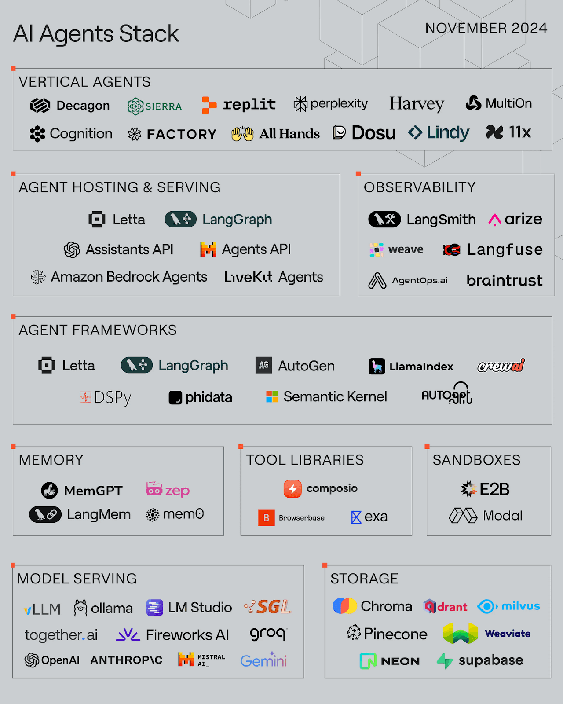

# Agent Technology Stack

## Overview

The Agent Technology Stack represents the comprehensive ecosystem of platforms, tools, and frameworks that enable the development, deployment, and operation of AI agents at scale. This section provides detailed coverage of the technology landscape from foundational platforms to specialized workflow engines and popular agent implementations.

## Agent Tech Stack References

*Source: [Letta AI Agent Stack](https://www.letta.com/blog/ai-agents-stack)*

The modern agent technology stack encompasses multiple layers:

- **Agent Platforms**: Cloud-native platforms providing comprehensive agent development and deployment capabilities
- **Workflow Engines**: Orchestration frameworks for building complex agent workflows
- **Development Frameworks**: Libraries and SDKs for agent development (covered in Section 4)
- **Infrastructure**: Runtime environments, memory systems, and observability tools
- **Integration Layer**: APIs, protocols, and connectors for external system integration

## Key Components

### Platform Layer
- **Google Vertex AI Agent Builder**: Enterprise-grade agent development platform
- **AWS AgentCore**: Scalable agent deployment and operation platform
- **Microsoft Azure AI Agent Service**: Integrated agent services within Azure ecosystem
- **Third-party SaaS Platforms**: Specialized agent platforms and marketplaces

### Infrastructure and Hosting
- **AWS**: [GenAI Foundation with AWS](https://aws.amazon.com/blogs/machine-learning/architect-a-mature-generative-ai-foundation-on-aws/) provides comprehensive infrastructure for generative AI applications

- **GPU Hosting**: [Lambda.ai](https://lambda.ai) offers NVIDIA H100, A100 & more Tensor Core GPUs available on-demand in a public cloud for high-performance agent workloads

### Caching and Performance
- **Semantic Caching**: [Redis LangCache](https://redis.io/langcache/) - A fully-managed semantic cloud caching service that reduces large language model (LLM) costs and improves response times for AI applications

### LLM (AI) Gateway
- **AISuite**: [AISuite by Andrew Ng](https://github.com/andrewyng/aisuite) - Simple, unified interface to multiple Generative AI providers
- **Arch Gateway**: [Arch Gateway](https://www.archgw.com/) - An AI-native Gateway built on top of Envoy providing request clarification, query routing, and data extraction

### Code Execution and Sandboxes
Agents' ability to spin up fully-isolated environments to safely execute AI-generated and untrusted code at scale.

#### Managed Sandboxes
- **Koyeb Sandbox**: [Koyeb Sandboxes](https://www.koyeb.com/blog/koyeb-sandboxes-fast-scalable-fully-isolated-environments-for-ai-agents) - Fast, scalable, fully isolated environments for AI agents and workflows, executing untrusted or user-generated code securely, prototyping applications quickly, testing APIs or libraries in clean environments

### Web Search and Data Extraction
- **AgentQL**: [AgentQL.com](https://www.agentql.com/) - Query language and Playwright integrations for interacting with elements and extracting data quickly

### Orchestration Layer
- **Open Source Workflow Engines**: MIT/Apache licensed orchestration frameworks
- **Self-hosted Solutions**: Enterprise-controlled workflow platforms
- **Business Process Integration**: Workflow engines designed for enterprise processes
- **No-code Solutions**: Visual workflow builders for non-technical users

### Agent Ecosystem
- **Coding Agents**: Specialized agents for software development tasks
- **Research Agents**: Agents focused on information gathering and analysis
- **Super Agents**: General-purpose agents capable of complex multi-domain tasks
- **Domain-specific Agents**: Agents tailored for specific industries or use cases

## Navigation

This section is organized into the following subsections:

- **5.2 Agentic AI Platforms**: Comprehensive coverage of major cloud platforms and SaaS solutions
- **5.3 Workflow Engine/Frameworks**: Detailed analysis of orchestration and workflow tools
- **5.4 Popular AI Agents**: Survey of notable agent implementations across different categories

Each subsection provides detailed technical analysis, architecture diagrams, and practical guidance for selecting and implementing the appropriate technology stack components for your agentic AI initiatives.

## Integration with Other Sections

The Agent Technology Stack closely integrates with:
- **Section 4**: Agent Development Frameworks (the development layer)
- **Section 6**: Industry Standards (protocols and interoperability)
- **Section 11**: Security (platform security considerations)
- **Section 12**: Observability (monitoring and operations)

## See Also

- **[Agent Development Frameworks](../AgenticFrameworks/README.md)**: Development tools and frameworks
- **[Agent Platforms](../AgentPlatforms/README.md)**: Cloud and SaaS platform options
- **[Observability](../Observability/Readme.md)**: Monitoring and observability solutions
- **[Security Frameworks](../SecurityFrameworks/Readme.md)**: Security considerations for tech stacks
