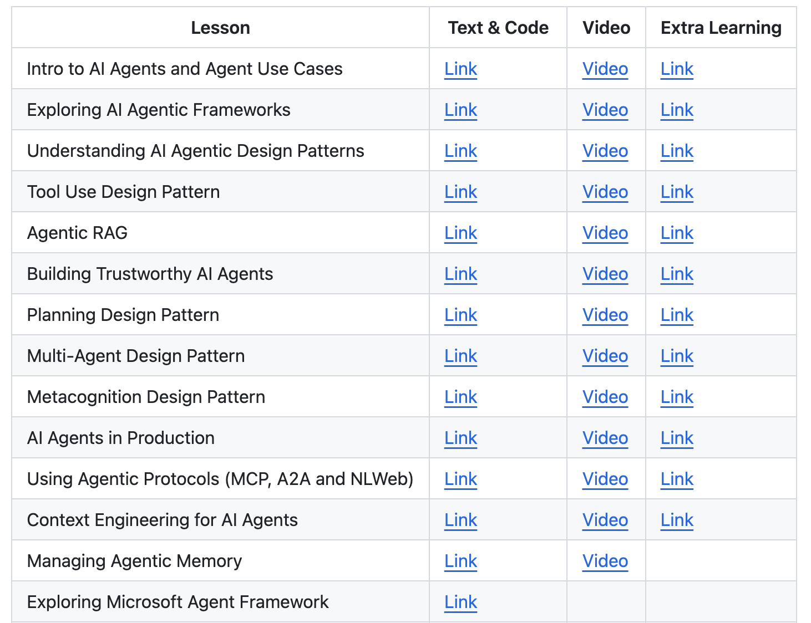

# Microsoft Best Practices for AI Agents

## Overview

Microsoft provides comprehensive guidance for building AI agents through structured learning approaches, practical frameworks, and hands-on educational resources. Their approach emphasizes systematic learning, enterprise-grade implementations, and integration with the broader Microsoft ecosystem.

## AI Agents for Beginners: 12 Lessons Framework

Microsoft's flagship educational resource, [AI Agents for Beginners](https://github.com/microsoft/ai-agents-for-beginners), provides a structured 12-lesson approach to learning AI agent development.

*Microsoft's comprehensive 12-lesson framework for learning AI agent development*

### Lesson Structure and Learning Path

#### Foundation Lessons (Lessons 1-4)
- **Lesson 1: Introduction to AI Agents**: Fundamental concepts and definitions
- **Lesson 2: Agent Architecture**: Understanding agent system architecture
- **Lesson 3: Planning and Reasoning**: Core agent planning and reasoning capabilities
- **Lesson 4: Tools and Function Calling**: Integrating tools and external functions

#### Framework Deep Dives (Lessons 5-8)
- **Lesson 5: AutoGen Framework**: Multi-agent systems with Microsoft AutoGen
- **Lesson 6: Semantic Kernel**: Enterprise-grade agent development with Semantic Kernel
- **Lesson 7: Azure AI Agents**: Cloud-native agent development on Azure
- **Lesson 8: Multi-Agent Systems**: Coordinating multiple agents effectively

#### Advanced Topics (Lessons 9-12)
- **Lesson 9: Memory and Context**: Advanced memory management and context engineering
- **Lesson 10: Evaluation and Testing**: Comprehensive testing and evaluation strategies
- **Lesson 11: Security and Ethics**: Responsible AI and security considerations
- **Lesson 12: Production Deployment**: Deploying agents to production environments

### Key Learning Outcomes

#### Technical Skills
- **Framework Proficiency**: Hands-on experience with AutoGen, Semantic Kernel, and Azure AI
- **Architecture Understanding**: Deep understanding of agent system architecture
- **Integration Capabilities**: Skills for integrating agents with existing systems
- **Production Readiness**: Knowledge for deploying agents in production environments

#### Best Practice Knowledge
- **Design Patterns**: Common patterns for agent system design
- **Security Considerations**: Comprehensive security and ethical AI practices
- **Testing Strategies**: Effective approaches to agent testing and validation
- **Performance Optimization**: Techniques for optimizing agent performance

## Microsoft Agent Framework Best Practices

### Unified Development Approach
Microsoft's [Agent Framework](https://github.com/microsoft/agent-framework) combines the strengths of AutoGen and Semantic Kernel:

#### Framework Integration
- **Unified API**: Consistent APIs across different agent capabilities
- **Cross-Framework Compatibility**: Seamless integration between AutoGen and Semantic Kernel
- **Enterprise Features**: Built-in enterprise-grade features and capabilities
- **Production Readiness**: Designed for production deployment from the start

#### Development Best Practices
- **Type Safety**: Strong typing for reliable agent development
- **Modular Design**: Clear separation of concerns and modular architecture
- **Testing Integration**: Built-in testing capabilities and frameworks
- **Observability**: Comprehensive monitoring and observability features

### AutoGen Best Practices

#### Multi-Agent System Design
- **Agent Roles**: Clear definition of agent roles and responsibilities
- **Communication Patterns**: Effective patterns for agent-to-agent communication
- **Coordination Strategies**: Approaches for coordinating multiple agents
- **Conflict Resolution**: Handling conflicts and disagreements between agents

#### Implementation Guidelines
- **Conversation Design**: Designing effective multi-agent conversations
- **Tool Integration**: Integrating external tools and services
- **Error Handling**: Robust error handling in multi-agent systems
- **Performance Optimization**: Optimizing multi-agent system performance

### Semantic Kernel Best Practices

#### Enterprise Integration
- **Plugin Architecture**: Modular plugin-based architecture for extensibility
- **Memory Management**: Effective memory management strategies
- **Security Integration**: Enterprise-grade security implementations
- **Scalability Design**: Designing for enterprise-scale deployments

#### Development Patterns
- **Skill Development**: Creating reusable skills and capabilities
- **Prompt Engineering**: Effective prompt engineering techniques
- **Chain of Thought**: Implementing reasoning chains and workflows
- **Function Calling**: Best practices for function calling and tool use

## Azure AI Agents Best Practices

### Cloud-Native Development
Microsoft's Azure AI platform provides comprehensive support for agent development:

#### Platform Services
- **Azure OpenAI**: Integration with OpenAI models and capabilities
- **Cognitive Services**: Pre-built AI services for common agent tasks
- **Bot Framework**: Comprehensive bot and agent development framework
- **Azure Functions**: Serverless compute for agent functions

#### Deployment Strategies
- **Container Deployment**: Containerized agent deployment strategies
- **Serverless Architecture**: Leveraging serverless computing for agents
- **Microservices**: Microservices-based agent architectures
- **Hybrid Deployment**: Hybrid cloud and on-premises deployment options

### Security and Compliance

#### Enterprise Security
- **Identity Integration**: Integration with Azure Active Directory
- **Access Controls**: Fine-grained access controls and permissions
- **Data Protection**: Comprehensive data protection and privacy controls
- **Compliance**: Meeting regulatory compliance requirements

#### Responsible AI
- **Bias Mitigation**: Strategies for identifying and mitigating bias
- **Transparency**: Ensuring transparency in agent decision-making
- **Accountability**: Establishing accountability for agent actions
- **Human Oversight**: Appropriate human oversight and intervention

## Implementation Methodologies

### Agile Development Approach
Microsoft recommends agile methodologies for agent development:

#### Development Practices
- **Iterative Development**: Short development cycles with frequent feedback
- **Continuous Integration**: Automated testing and integration pipelines
- **User-Centric Design**: Focus on user needs and experience
- **Feedback Loops**: Continuous feedback and improvement cycles

#### Team Structure
- **Cross-Functional Teams**: Teams with diverse skills and expertise
- **DevOps Integration**: Integration of development and operations teams
- **Stakeholder Engagement**: Regular engagement with business stakeholders
- **Knowledge Sharing**: Effective knowledge sharing and documentation

### Quality Assurance

#### Testing Strategies
- **Unit Testing**: Comprehensive unit testing of agent components
- **Integration Testing**: Testing agent interactions and integrations
- **Performance Testing**: Evaluating agent performance and scalability
- **User Acceptance Testing**: Validating agent functionality with end users

#### Quality Metrics
- **Functional Metrics**: Measuring agent functional correctness
- **Performance Metrics**: Evaluating response times and throughput
- **Reliability Metrics**: Assessing agent reliability and availability
- **User Experience Metrics**: Measuring user satisfaction and engagement

## Educational Resources and Learning Paths

### Structured Learning
Microsoft provides comprehensive educational resources:

#### Course Materials
- **Video Tutorials**: Step-by-step video tutorials and demonstrations
- **Hands-On Labs**: Practical exercises and coding challenges
- **Sample Code**: Complete sample applications and reference implementations
- **Documentation**: Comprehensive technical documentation and guides

#### Community Resources
- **Developer Community**: Active developer community and forums
- **Open Source Projects**: Open source projects and contributions
- **Conferences and Events**: Regular conferences and educational events
- **Certification Programs**: Professional certification programs for AI development

### Continuous Learning
- **Technology Updates**: Regular updates on new technologies and capabilities
- **Best Practice Evolution**: Continuous evolution of best practices and recommendations
- **Research Integration**: Integration of latest research findings into practical guidance
- **Industry Trends**: Staying current with industry trends and developments

## Cross-References

- **Section 4.5**: Microsoft Agent Framework - Technical framework details
- **Section 4.6**: AutoGen - Multi-agent system framework
- **Section 4.7**: Semantic Kernel - Enterprise agent development platform
- **Section 11**: Agentic AI Security - Security frameworks and considerations
- **Section 14**: Agentic AI Maturity Models - Organizational readiness assessment

## Resources

### Primary Educational Resources
- [AI Agents for Beginners - 12 Lessons](https://github.com/microsoft/ai-agents-for-beginners)
- [Microsoft Agent Framework](https://github.com/microsoft/agent-framework)
- [AutoGen Documentation](https://microsoft.github.io/autogen/)
- [Semantic Kernel Documentation](https://learn.microsoft.com/en-us/semantic-kernel/)

### Azure Platform Resources
- [Azure AI Documentation](https://docs.microsoft.com/en-us/azure/ai/)
- [Azure OpenAI Service](https://docs.microsoft.com/en-us/azure/cognitive-services/openai/)
- [Bot Framework Documentation](https://docs.microsoft.com/en-us/azure/bot-service/)
- [Azure Functions Documentation](https://docs.microsoft.com/en-us/azure/azure-functions/)
