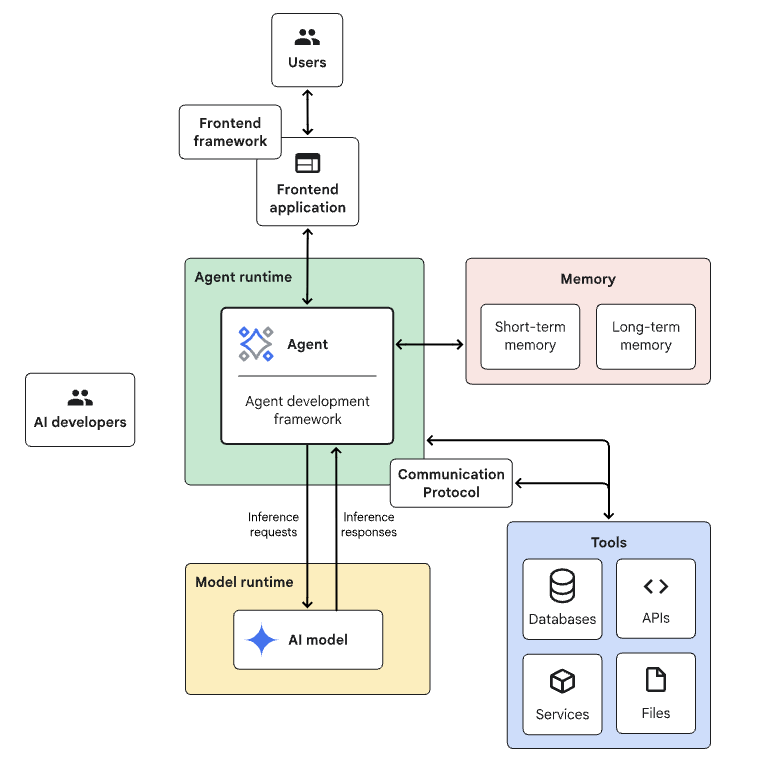

# Agentic Architecture Components Selection

## Overview

Selecting the right architectural components is crucial for building effective agentic AI systems. This [Guide by Google](https://www.kaggle.com/whitepaper-introduction-to-agents) provides a framework for choosing components based on your specific requirements and constraints.



## Core Components

### 1. Language Model Layer
**Purpose**: Provides reasoning and language understanding capabilities

**Options**:
- **Large Language Models (LLMs)**
  - OpenAI GPT-4/GPT-3.5
  - Anthropic Claude
  - Google Gemini
  - Open source alternatives (Llama, Mistral)

**Selection Criteria**:
- Task complexity requirements
- Latency constraints
- Cost considerations
- Privacy and security requirements

### 2. Agent Framework
**Purpose**: Orchestrates agent behavior and tool interactions

**Options**:
- **LangChain**: Comprehensive ecosystem with extensive integrations
- **LangGraph**: Graph-based workflow orchestration
- **AutoGen**: Multi-agent conversation systems
- **CrewAI**: Role-based agent collaboration
- **Semantic Kernel**: Microsoft's AI orchestration platform

**Selection Criteria**:
- Programming language preference
- Integration requirements
- Scalability needs
- Community support

### 3. Memory System
**Purpose**: Stores and retrieves context, experiences, and knowledge

**Components**:
- **Short-term Memory**: Conversation context, working memory
- **Long-term Memory**: Persistent knowledge, learned experiences
- **Vector Databases**: Semantic search and retrieval

**Options**:
- **Vector Stores**: Pinecone, Weaviate, Chroma, FAISS
- **Traditional Databases**: PostgreSQL, MongoDB
- **Specialized Solutions**: Mem0, Zep

### 4. Tool Integration Layer
**Purpose**: Enables agents to interact with external systems and APIs

**Components**:
- **API Connectors**: REST, GraphQL, gRPC interfaces
- **Function Calling**: Structured tool invocation
- **Plugin Systems**: Extensible tool ecosystems

**Standards**:
- **Model Context Protocol (MCP)**: Standardized tool integration
- **OpenAPI Specifications**: API documentation and discovery
- **Function Schemas**: Tool capability descriptions

### 5. Orchestration Engine
**Purpose**: Manages agent workflows and decision-making processes

**Patterns**:
- **Sequential Processing**: Linear task execution
- **Parallel Processing**: Concurrent task handling
- **Graph-based Workflows**: Complex dependency management
- **Event-driven Architecture**: Reactive system design

## Architecture Patterns

### Single-Agent Architecture
```
User Input → Agent → LLM → Tools → Response
```

**Use Cases**:
- Simple task automation
- Content generation
- Question answering

### Multi-Agent Architecture
```
User Input → Orchestrator → Agent Pool → Coordination → Response
```

**Use Cases**:
- Complex problem solving
- Specialized task distribution
- Collaborative workflows

### Hierarchical Architecture
```
User Input → Manager Agent → Specialist Agents → Task Execution
```

**Use Cases**:
- Enterprise workflows
- Structured problem decomposition
- Role-based task assignment

## Selection Framework

### 1. Requirements Analysis
- **Functional Requirements**: What tasks must the system perform?
- **Non-functional Requirements**: Performance, scalability, security
- **Integration Requirements**: Existing systems and APIs
- **Resource Constraints**: Budget, infrastructure, expertise

### 2. Component Evaluation Matrix

| Component | Criteria | Weight | Options | Score |
|-----------|----------|--------|---------|-------|
| LLM | Performance | High | GPT-4, Claude, Gemini | - |
| Framework | Ecosystem | Medium | LangChain, AutoGen | - |
| Memory | Scalability | High | Vector DB, Traditional | - |
| Tools | Integration | Medium | MCP, Custom APIs | - |

### 3. Architecture Decision Records (ADRs)
Document key architectural decisions including:
- Context and requirements
- Considered options
- Decision rationale
- Consequences and trade-offs

## Best Practices

### Component Integration
- **Loose Coupling**: Minimize dependencies between components
- **Standard Interfaces**: Use established protocols and APIs
- **Error Handling**: Implement robust failure recovery
- **Monitoring**: Track component performance and health

### Scalability Considerations
- **Horizontal Scaling**: Design for distributed deployment
- **Caching Strategies**: Optimize for performance
- **Load Balancing**: Distribute workload effectively
- **Resource Management**: Monitor and optimize resource usage

### Security and Privacy
- **Data Protection**: Encrypt sensitive information
- **Access Control**: Implement proper authentication/authorization
- **Audit Logging**: Track system access and changes
- **Compliance**: Meet regulatory requirements

## Agent Anatomy — Internal Building Blocks

Arsanjani & Bustos (2026) define seven internal components that form the continuous operational loop of any AI agent. These serve as the architectural building blocks behind every component selection decision:

| Component | Function | Architectural Role | Implementation |
|---|---|---|---|
| Goals | Objectives the agent seeks to achieve | Defines the agent's objective function; drives high-level planning | Configuration parameters or dynamic state |
| Sense (Perception) | Gathers data from environment (APIs, databases, sensors) | Input layer | API listeners, stream processors, MCP clients |
| Reason (Cognition) | Analyzes sensed information | Cognitive core — where the agent-ready LLM is integrated | LLM call with goals + context |
| Plan | Devises a sequence of actions | Tactical layer; breaks strategy into executable steps | LLM-generated task sequence |
| Act (Action) | Executes plan via tools | Output layer | External API calls, code execution, response generation |
| Memory | Stores knowledge, state, and past experience | State management | Short-term (in-context); long-term (vector databases, key-value stores) |
| Coordinate | Interacts with other agents (multi-agent systems only) | Inter-agent communication | A2A protocol; task lifecycle states (submitted → working → completed) |

**The agentic loop:** Sense → Reason → Plan → Act → (feedback) → Sense. Each iteration allows the agent to learn from outcomes.

**Hierarchy of autonomy** — distinguishing LLMs, automated workflows, and true agents:

| Level | Type | Characteristics |
|---|---|---|
| 1 | LLM / Model | Stateless, probabilistic, passive — responds to prompts only |
| 2 | Automated Workflow | Deterministic, rigid, scripted — if-this-then-that logic |
| 3 | AI Agent | Goal-oriented, stateful, adaptive — sense-reason-act-reflect loop |

**Technical considerations by component:**

| Technical Concern | Component(s) Affected |
|---|---|
| Data processing and integration | Sense, Memory |
| Knowledge representation | Reason, Memory |
| LLM integration and orchestration | Reason, Plan, Coordinate |
| Reliable tool use mechanisms | Act |
| State management and memory | Memory |
| Scalability of agent populations | Coordinate, overall architecture |
| Inter-agent communication efficiency | Coordinate |
| Security and governance | Reason (prompt injection), Act (sandboxing), Memory (privacy), Coordinate (AuthN/AuthZ) |

### Complementary Framing: Confluent's Nine-Component Anatomy

Confluent's *A Guide to Event-Driven Design for Agents and Multi-Agent Systems* (2025) describes agent anatomy with nine components rather than seven. Most map directly onto the Arsanjani & Bustos table above (Perception↔Sense, Reasoning↔Reason, Planning↔Plan, Action↔Act, Coordination↔Coordinate), but it breaks out two components the Arsanjani table folds elsewhere:

| Component | Function | Relation to Arsanjani Table |
|---|---|---|
| Persona (Job Function) | The agent's job description embedded in the system prompt, shaping behavior by influencing the model's token probability distribution | Not modeled separately above — sits upstream of Goals, configuring how Reason is invoked |
| Learning | Refining reasoning via dynamic in-context adjustment or reinforcement learning (rewards/penalties), distinct from simply storing state | Not modeled separately above — treated as a capability of Reason/Memory together rather than its own component |
| Tool Interface | Modular API handlers / plugin architecture extending the agent's reach into specialized capabilities | Corresponds to the implementation layer underneath Act |

Treat Persona and explicit Tool Interface as useful additions when designing system prompts and plugin architectures; treat Learning as a reminder that context-adaptation and RL-based refinement are architecturally distinct from static Memory storage.

## See Also
- [Multi-Agent Systems](multi-agent-system.md)
- [12-Factor Agents](12-factor-agents.md)
- [Agent Development Frameworks](../AgenticFrameworks/README.md)
- [Agent Technology Stack](../AgenticTechStack/README.md)
- [Agentic Architectural Patterns — Arsanjani & Bustos](../DesignPatterns/arsanjani-patterns.md)
- [Event-Driven Design Patterns for Multi-Agent Systems (Confluent)](../DesignPatterns/event-driven-patterns.md)
- [Arsanjani GenAI Maturity Model](../MaturityModels/arsanjani-genai-maturity.md)

## References
- Arsanjani, A., & Bustos, J.P. (2026). *Agentic Architectural Patterns for Building Multi-Agent Systems*. Packt Publishing. ISBN 978-1-80602-957-0. — Source for agent anatomy table and hierarchy of autonomy.
- Falconer, S. (2025). *A Guide to Event-Driven Design for Agents and Multi-Agent Systems*. Confluent, Inc. — Source for the nine-component agent anatomy framing.