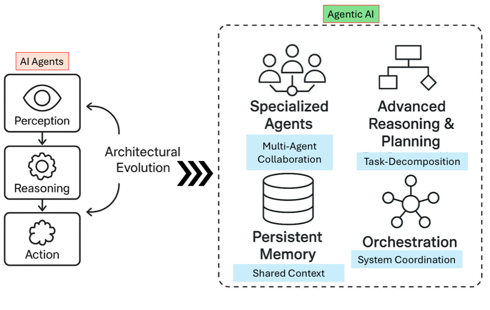

# Concepts

This section provides foundational definitions, terminology, and conceptual frameworks essential for understanding agentic AI systems. It covers agent definitions, types, and key references that form the basis for more advanced topics throughout this knowledge base.

## Agent Definition

*Comprehensive diagram illustrating the core components and characteristics that define an AI agent*

An AI agent is an autonomous system that can perceive its environment, make decisions, and take actions to achieve specific goals. Key characteristics include:

- **Autonomy**: Ability to operate independently without constant human intervention
- **Reactivity**: Capability to respond to environmental changes
- **Proactivity**: Taking initiative to achieve goals
- **Social Ability**: Interacting with other agents and humans
- **Learning**: Adapting behavior based on experience

### Key Definitions and Resources

- **[Agents Intro - a Google Whitepaper](https://www.kaggle.com/whitepaper-agents)**: Comprehensive introduction to agents from Google's perspective

- **[Definition by Harrison, LangChain Founder](https://blog.langchain.dev/what-is-an-agent/)**: Practical definition from the creator of LangChain framework

- **[Ambient Agents](https://blog.langchain.dev/introducing-ambient-agents/)**: Ambient agents listen to an event stream and act on it accordingly, potentially acting on multiple events at a time

- **[12-Factor Agents - Principles for building reliable LLM applications](https://github.com/humanlayer/12-factor-agents/)**: Methodology for building robust agent applications

- **[Building Effective Agents - Anthropic](https://www.anthropic.com/research/building-effective-agents)**: Research-backed approach to agent development

- **[Cohere - How enterprises can start building Agentic AI](https://cohere.com/blog/how-enterprises-can-start-building-agentic-ai)**: Enterprise-focused guidance for agentic AI adoption

- **[AI Agents vs. Agentic AI White paper](https://arxiv.org/abs/2505.10468)**: Academic distinction between different agent paradigms

- **[Intro to Agentic Workflows by N8N](https://blog.n8n.io/ai-agentic-workflows/)**: Workflow-centric perspective on agentic systems

## Agent Types

*Visual comparison of different agent types and their characteristics, showing the distinction between AI Agents and Agentic AI approaches*

### Classification by Functionality

#### **Reactive Agents**
- Respond to immediate environmental stimuli
- No internal state or memory
- Simple stimulus-response behavior
- Examples: Basic chatbots, simple automation scripts

#### **Deliberative Agents**
- Maintain internal models of the world
- Plan actions based on goals and beliefs
- Use reasoning to make decisions
- Examples: Strategic planning agents, complex problem solvers

#### **Hybrid Agents**
- Combine reactive and deliberative approaches
- Fast reactive responses for urgent situations
- Deliberative planning for complex tasks
- Examples: Autonomous vehicles, advanced personal assistants

#### **Learning Agents**
- Adapt behavior based on experience
- Improve performance over time
- Use various learning algorithms
- Examples: Recommendation systems, adaptive game AI

### Classification by Architecture

#### **Single-Agent Systems**
- One autonomous agent operating independently
- Suitable for well-defined, isolated tasks
- Simpler to design and debug
- Examples: Personal assistants, document processors

#### **Multi-Agent Systems**
- Multiple agents working together
- Coordination and communication protocols
- Distributed problem solving
- Examples: Supply chain management, distributed computing

#### **Hierarchical Agents**
- Agents organized in hierarchical structures
- Higher-level agents coordinate lower-level ones
- Clear command and control structures
- Examples: Organizational management systems, military command systems

### Classification by Domain

#### **Conversational Agents**
- Natural language interaction
- Context understanding and maintenance
- Examples: ChatGPT, Claude, customer service bots

#### **Task Automation Agents**
- Specific task execution
- Process automation and optimization
- Examples: RPA bots, workflow automation

#### **Research and Analysis Agents**
- Information gathering and synthesis
- Data analysis and insight generation
- Examples: Research assistants, market analysis tools

#### **Creative Agents**
- Content generation and creative tasks
- Artistic and design capabilities
- Examples: Image generators, writing assistants, music composers

#### **Code Generation Agents**
- Software development assistance
- Code analysis and optimization
- Examples: GitHub Copilot, coding assistants

## Foundational Concepts

### **Agentic AI vs Traditional AI**
- **Traditional AI**: Rule-based, deterministic responses
- **Agentic AI**: Autonomous decision-making, goal-oriented behavior
- **Key Difference**: Agency and autonomy in problem-solving

### **Agent Environment**
- **Observable vs Partially Observable**: Extent of environmental visibility
- **Deterministic vs Stochastic**: Predictability of outcomes
- **Static vs Dynamic**: Rate of environmental change
- **Discrete vs Continuous**: Nature of state and action spaces

### **Agent Capabilities**
- **Perception**: Sensing and interpreting environmental data
- **Reasoning**: Processing information to make decisions
- **Action**: Executing decisions in the environment
- **Learning**: Improving performance through experience
- **Communication**: Interacting with other agents and humans

### **Performance Measures**
- **Effectiveness**: Achieving desired outcomes
- **Efficiency**: Resource utilization optimization
- **Robustness**: Handling unexpected situations
- **Scalability**: Performance under increased load
- **Adaptability**: Learning and evolution capabilities

## Terminology Glossary

- **Agent**: An autonomous entity that perceives, reasons, and acts
- **Environment**: The context in which an agent operates
- **Actuator**: Component that enables agent actions
- **Sensor**: Component that enables agent perception
- **Goal**: Desired outcome or state the agent seeks to achieve
- **Policy**: Strategy or rule set governing agent behavior
- **State**: Current condition or configuration of the agent or environment
- **Action**: Specific operation the agent can perform
- **Reward**: Feedback signal indicating action quality
- **Learning**: Process of improving performance through experience

## References

1. **[Artificial Intelligence: A Modern Approach (UC Berkeley Book)](https://aima.cs.berkeley.edu/)**: Comprehensive academic textbook on AI fundamentals

2. **[Agentic AI Playbook by Government Technology Agency Singapore](https://playbooks.aip.gov.sg/agentic-ai-primer/)**: Government perspective on agentic AI implementation

## Next Steps

After understanding these foundational concepts, explore:

- **[Architecture & Design Patterns](../Architecture/components-selection.md)**: Learn how to structure agentic systems
- **[Agent Development Frameworks](../AgenticFrameworks/README.md)**: Discover tools for building agents
- **[Agent Memory Management](../AgentMemory/README.md)**: Understand how agents maintain state and context

## Related Sections

- [Architecture & Design Patterns](../Architecture/components-selection.md) - Structural approaches to agent design
- [Agent Development Frameworks](../AgenticFrameworks/README.md) - Tools and frameworks for implementation
- [Best Practices](../BestPractices/README.md) - Industry recommendations for agent development