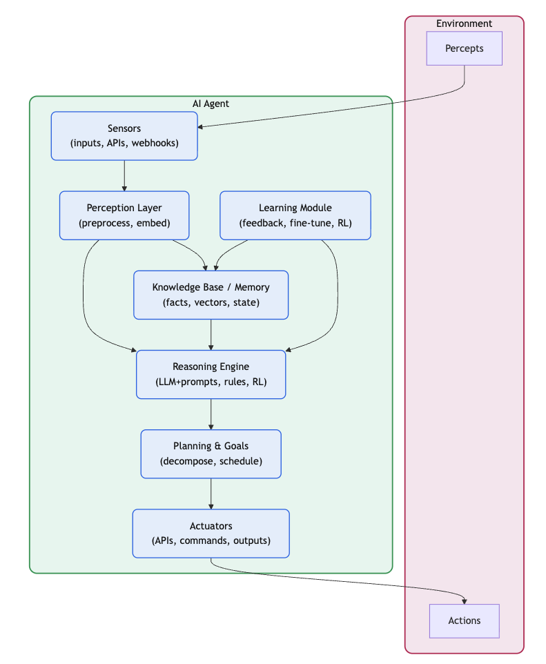

# Agent Definition

## What is an AI Agent?

An AI agent is an autonomous software entity that can perceive its environment, make decisions, and take actions to achieve specific goals. Unlike traditional software programs that follow predetermined instructions, AI agents exhibit intelligent behavior by:

- **Autonomy**: Operating independently without constant human intervention
- **Reactivity**: Responding to changes in their environment
- **Proactivity**: Taking initiative to achieve goals
- **Social Ability**: Interacting with other agents and humans

## Key Characteristics

### 1. Goal-Oriented Behavior
AI agents are designed with specific objectives and work towards achieving them through a series of actions and decisions.

### 2. Environmental Awareness
Agents can perceive and understand their operating environment, whether it's digital data, physical sensors, or user interactions.

### 3. Decision-Making Capabilities
Using various AI techniques (LLMs, machine learning, rule-based systems), agents can make informed decisions about their next actions.

### 4. Learning and Adaptation
Modern AI agents can learn from experience and adapt their behavior to improve performance over time.

## Agent Architecture Components

The typical AI agent architecture includes:
- **Perception Module**: Processes environmental inputs
- **Decision Engine**: Determines appropriate actions
- **Action Module**: Executes decisions in the environment
- **Memory System**: Stores experiences and knowledge
- **Learning Component**: Improves performance over time

## See Also
- [Agent Types](agent-types.md)
- [Architecture and Design Patterns](../Architecture/components-selection.md)