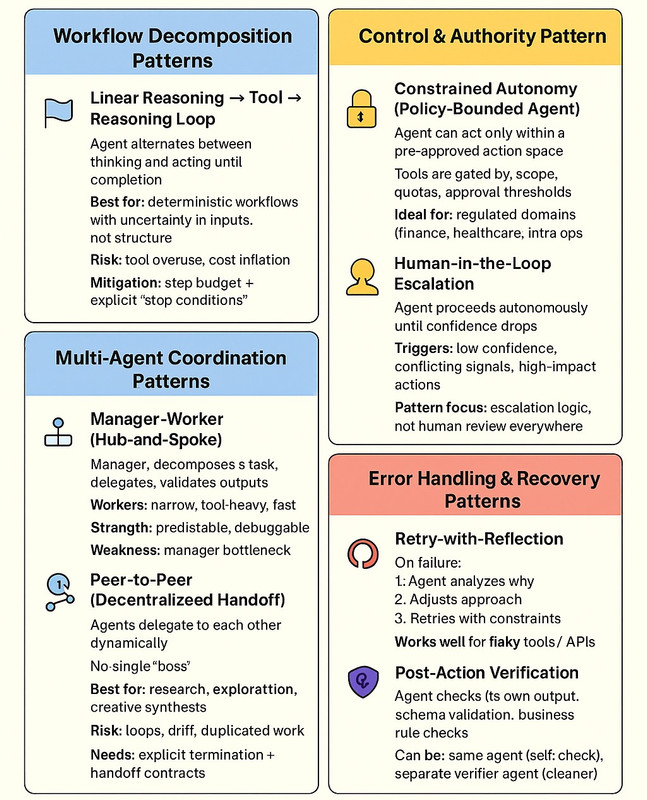

# OpenAI Agent Design Patterns

## Overview

OpenAI's practical guide to building agents distills insights from numerous customer deployments into actionable patterns for product and engineering teams. The guide covers how to identify promising agent use cases, design agent logic and orchestration, and run agents safely in production. These patterns apply whether you use the OpenAI Agents SDK or build from scratch with any library.


*OpenAI's comprehensive agentic design patterns overview*

## When to Build an Agent

Agents are suited to workflows where traditional deterministic approaches fall short. Validate against these three criteria before committing:

| Criterion | Description | Example |
|---|---|---|
| Complex decision-making | Workflows requiring nuanced judgment, exceptions, or context-sensitive decisions | Refund approval in customer service |
| Difficult-to-maintain rules | Systems with extensive rulesets where updates are costly or error-prone | Vendor security reviews |
| Heavy reliance on unstructured data | Scenarios involving natural language interpretation, document extraction, or conversational interaction | Processing a home insurance claim |

Applications that integrate LLMs without using them to control workflow execution — simple chatbots, single-turn LLMs, sentiment classifiers — are **not** agents. If a deterministic solution suffices, use it.

## Core Agent Structure

### Three-Part Foundation
Every agent is built on three minimal building blocks:

- **Model**: The LLM powering reasoning and decision-making
- **Tools**: External functions or APIs the agent uses to take action
- **Instructions**: Explicit guidelines and guardrails defining how the agent behaves

### Single Orchestration Loop
Every orchestration approach requires a "run" — typically a loop that lets the agent operate until an exit condition is reached:
- A final-output tool is invoked (specific output type)
- The model returns a response without any tool calls
- An error state is reached
- Maximum number of turns is hit

## Model Selection

| Step | Principle |
|---|---|
| 1. Establish baseline | Build the prototype with the most capable model for every task |
| 2. Hit accuracy target | Focus on meeting accuracy requirements before optimizing |
| 3. Optimize cost/latency | Swap in smaller models where capability holds; simple retrieval or intent classification tasks can use fast, cheap models; complex judgment tasks (e.g., refund approval) benefit from more capable models |

## Tool Definitions

Tools extend agent capabilities via APIs or, for legacy systems without APIs, via computer-use models that interact through web and application UIs. Each tool should have a standardized definition enabling flexible many-to-many relationships between tools and agents.

| Tool Type | Purpose | Examples |
|---|---|---|
| Data | Retrieve context and information needed to execute the workflow | Query transaction databases, read PDF documents, search the web |
| Action | Interact with systems to take action — add records, update state, send messages | Send emails, update CRM records, hand off customer tickets |
| Orchestration | Agents themselves as tools for other agents | Refund agent, Research agent, Writing agent |

## Instructions Configuration

| Practice | Description |
|---|---|
| Use existing documents | Convert SOPs, support scripts, and policy documents into LLM-friendly routines |
| Break down tasks | Provide smaller, clearer steps from dense resources to minimize ambiguity |
| Define clear actions | Map each routine step to a specific action or output — be explicit about wording for user-facing messages |
| Capture edge cases | Anticipate common variations with conditional steps or branches (e.g., what to do when required info is missing) |

Advanced models (o1, o3-mini) can automatically generate instructions from existing policy documents.

## Orchestration Patterns

Orchestration patterns fall into two categories. **Start with single-agent** and evolve to multi-agent only when needed.

### Single-Agent Pattern

One agent with tools handles workflows in a loop. Preferred for simplicity and easier evaluation. Manage complexity without multiple agents by using **prompt templates** — a single flexible base prompt with policy variables that adapts to different contexts, rather than maintaining many separate prompts.

### When to Split into Multiple Agents

| Signal | Description |
|---|---|
| Complex logic | Prompts contain many conditional branches that are difficult to scale |
| Tool overload | Tools are similar or overlapping; improving tool descriptions doesn't resolve selection errors (note: 15+ well-defined distinct tools can outperform <10 overlapping tools) |

### Multi-Agent Patterns

#### Manager Pattern (Agents as Tools)

A central "manager" LLM orchestrates specialized agents via tool calls. The manager delegates tasks, synthesizes results, and maintains a unified user interface. Ideal when only one agent should control workflow execution and interact with the user.

```
User → Manager Agent → [Spanish Agent, French Agent, Italian Agent]
```

Each specialized agent is exposed as a tool via `agent.as_tool(tool_name=..., tool_description=...)`. The manager decides which tools to call based on the request.

**Best for**: Translation pipelines, research workflows, any scenario requiring result synthesis across domains.

#### Decentralized Pattern (Agent Handoffs)

Agents operate as peers, transferring control via one-way handoffs. When an agent calls a handoff function, execution immediately transfers to the target agent along with the current conversation state. No central controller; each agent fully takes over its domain.

```
User → Triage Agent → [Technical Support Agent | Sales Agent | Order Management Agent]
```

**Best for**: Customer service triage, domain-specialized flows where the receiving agent should own the interaction completely.

#### Declarative vs. Code-First Graphs

Some frameworks (LangGraph) require developers to pre-define all branches and loops as explicit graphs. The OpenAI Agents SDK takes a code-first approach — workflow logic is expressed in familiar programming constructs without pre-defining the entire graph, enabling more dynamic orchestration.

## Guardrail Patterns

Guardrails are a layered defense mechanism — no single guardrail provides sufficient protection. Stack multiple specialized guardrails together.

### Guardrail Types

| Type | Purpose | Example |
|---|---|---|
| Relevance classifier | Flags off-topic queries | "How tall is the Empire State Building?" to a customer service agent |
| Safety classifier | Detects jailbreaks and prompt injection attempts | Requests designed to extract system instructions |
| PII filter | Prevents unnecessary exposure of personally identifiable information | Scrubs PII from model output before logging or returning to user |
| Moderation | Flags harmful or inappropriate inputs (hate speech, harassment, violence) | OpenAI Moderation API |
| Tool safeguards | Risk-rates each tool (low/medium/high) based on reversibility, access level, and financial impact; triggers pauses or HITL before high-risk calls | Pausing before executing a large refund |
| Rules-based protections | Simple deterministic measures | Blocklists, input length limits, regex filters for SQL injection or prohibited terms |
| Output validation | Ensures responses align with brand values | Prompt engineering + content checks before delivery |

### Implementation Approach

The Agents SDK treats guardrails as first-class concepts using **optimistic execution**: the primary agent proactively generates outputs while guardrails run concurrently. If a guardrail trips (e.g., a churn-detection tripwire detects a cancellation risk), an exception halts the flow and triggers the appropriate response path.

Build guardrails in this order:
1. Focus on data privacy and content safety first
2. Add guardrails based on real-world edge cases and failures as they surface
3. Optimize for both security and user experience as the agent matures

## Human-in-the-Loop Patterns

Human intervention is critical early in deployment for identifying failures, uncovering edge cases, and building an evaluation cycle.

### Trigger Conditions

| Trigger | Description |
|---|---|
| Exceeding failure thresholds | Agent fails to accomplish a task beyond a set retry limit (e.g., fails to understand intent after multiple attempts) → escalate to human |
| High-risk actions | Sensitive, irreversible, or high-stakes actions (cancel orders, authorize large refunds, make payments) → require human confirmation until confidence grows |

### Escalation Design
- Customer service: escalate to human agent
- Coding agent: transfer control back to the user
- Always preserve conversation history and state through the handoff

## Implementation Best Practices

| Area | Recommendation |
|---|---|
| Start simple | Single-agent with tools first; add complexity only when performance requires it |
| Evals first | Set up evaluations before optimizing — you need a baseline to know if a swap helps or hurts |
| Incremental deployment | Start small, validate with real users, grow capabilities over time |
| Tool design | Well-documented, thoroughly tested, reusable tool definitions improve discoverability and prevent redundant definitions |
| Prompt templates | One flexible base prompt with variables rather than many individual prompts for distinct use cases |

## See Also

- [Agent Definition](../Concepts/agent-definition.md)
- [Agent Types](../Concepts/agent-types.md)
- [Multi-Agent Architecture](../Architecture/multi-agent-system.md)
- [Gartner Design Patterns](gartner-patterns.md)
- [Security — Guardrails](../ProductionBestPractices/security.md)
- [Agent Harness Engineering](../AgentHarness/harness-engineering.md)

## References

- [A Practical Guide to Building Agents (OpenAI)](https://cdn.openai.com/business-guides-and-resources/a-practical-guide-to-building-agents.pdf) — Comprehensive guide covering agent definition, orchestration patterns, guardrails, and HITL; derived from OpenAI customer deployments
