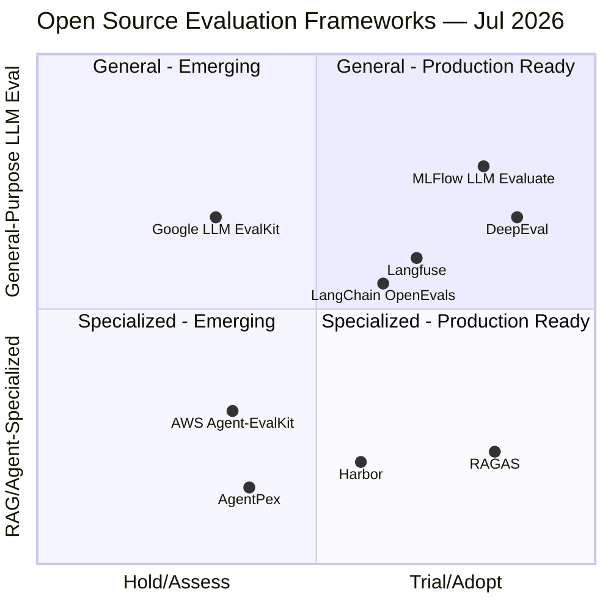
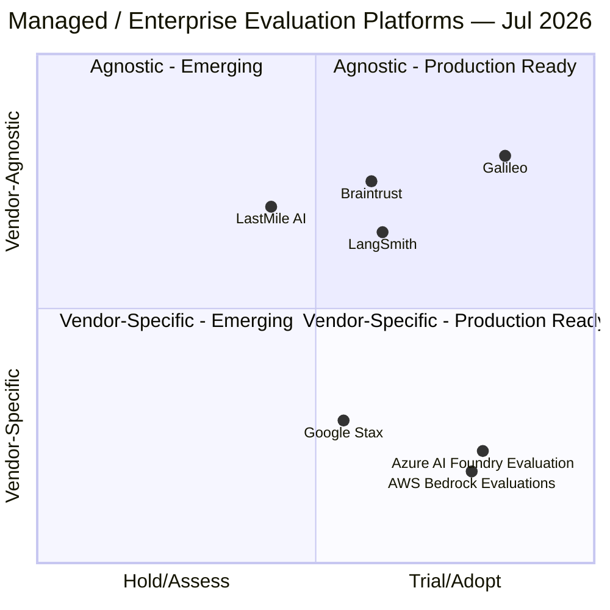

# Evaluation Tech Radar

## Overview

This page consolidates **LLM and agent evaluation tools** — open-source frameworks/toolkits and managed enterprise platforms — and maps them to a **Technology Radar** adapted from the [Thoughtworks Technology Radar](https://www.thoughtworks.com/radar) methodology, following the same approach used in the [Agent Development Frameworks radar](../AgenticFrameworks/solutions.md) and the [Agent Observability radar](../Observability/tech-radar.md). It is intended as a practical selection aid: start with **Adopt** where possible, use **Trial** for targeted pilots, keep **Assess** on your watchlist, and place items in **Hold** when the fit is poor for most evaluation needs.

The four radar rings:

| Ring | Meaning |
|---|---|
| **Adopt** | Proven and widely used. Recommended as a default starting point when it fits your stack. |
| **Trial** | Worth piloting in projects that can tolerate some risk or integration work. |
| **Assess** | Promising, but still needs validation for your production constraints. |
| **Hold** | Avoid as a default choice; use only with clear justification (e.g., existing enterprise standardization). |

---

## Technology Radar

Solutions are split across two charts to avoid label clutter. Both share the same x-axis (ring position: Hold/Assess → Trial/Adopt). The y-axis differs per chart.

**How to read:**
- **Right side** (x > 0.5) = Trial/Adopt — production-ready, stronger default candidates
- **Left side** (x < 0.5) = Assess/Hold — situational, niche, or less validated

### Chart 1 — Open Source Evaluation Frameworks & Toolkits

Y-axis: RAG/agent-specialized (bottom) → general-purpose LLM evaluation (top)

### Chart 2 — Managed & Enterprise Evaluation Platforms

Y-axis: cloud/vendor-specific (bottom) → cloud/vendor-agnostic (top)

---

## Ring Guidance (Why it's placed there)

### Adopt

| Item | Why here (brief) | When it's a fit |
|---|---|---|
| **DeepEval** | Most widely adopted open-source LLM eval framework; 14+ metrics, pytest-native CI/CD integration. | Default choice for RAG/fine-tuning evaluation in Python codebases. |
| **RAGAS** | Purpose-built, widely cited metric set for RAG (8+ metrics) and agent workflows (3 metrics). | When RAG or agent-goal/tool-call accuracy is the primary evaluation target. |
| **MLFlow LLM Evaluate** | Backed by the mature, broadly adopted MLFlow ecosystem; works with any LLM provider via MLFlow's model abstraction. | Teams already standardized on MLFlow for experiment tracking. |
| **Galileo** | Established enterprise evaluation platform with pre-built + custom metrics and CLHF-driven Autotune. | Enterprise teams needing production-grade evaluation with human feedback loops, vendor-agnostic. |
| **AWS Bedrock Evaluations** | GA since March 2025 (RAG + LLM-as-a-judge); combines model comparison, RAG evaluation, LLM-as-judge, and human review in one managed service. | Teams already on Amazon Bedrock who want evaluation without standing up a separate platform. |
| **Azure AI Foundry Evaluation** | Mature, GA evaluator suite spanning quality, NLP, and risk/safety metrics with direct Observability dashboard integration. | Azure AI Foundry teams needing built-in risk/safety guardrail evaluation feeding production observability. |

### Trial

| Item | Why here (brief) | When it's a fit |
|---|---|---|
| **LangChain OpenEvals** | Pre-built LLM-as-judge prompts for common criteria (conciseness, fairness, hallucination); newer than DeepEval/RAGAS. | Teams on LangChain/LangSmith wanting quick, pre-built judge evaluators. |
| **Langfuse** | OSS + managed LLM/agent observability with built-in eval scoring pipelines; v3 architecture on ClickHouse+Redis+S3. (Consistent Trial placement with the [Observability radar](../Observability/tech-radar.md).) | When you want AI-native tracing and evaluation together, with OSS control. |
| **Harbor** | Official Terminal-Bench 2.0/2.1 harness; strong for distributed agent benchmark execution, less mature as a general metrics library. | Teams running agent benchmarks at scale across cloud sandbox providers. |
| **LangSmith** | Strong trace + evaluation UX; best fit when already on LangChain/LangGraph rather than a fully vendor-agnostic default. | When your agent stack is LangChain/LangGraph-heavy. |
| **Braintrust** | Evaluation-first platform (regression detection against production baselines, prompt playground with eval integration) — core focus is evaluation, so placed a tier higher here than in the Observability radar's Assess. | Teams that need to iterate quickly on production AI systems with regression gates. |
| **Google Stax** | Managed SaaS for LLM evaluation with managed datasets and custom evaluators; tightly coupled to Google Cloud. | Teams using Google Cloud / Vertex AI infrastructure. |

### Assess

| Item | Why here (brief) | When it's a fit |
|---|---|---|
| **AgentPex** | Novel spec-derived evaluation from system prompts/tool schemas, but new and narrowly scoped to trace-based agent evaluation. | Post-hoc agent trace evaluation integrated with existing Langfuse/Langtrace pipelines. |
| **AWS Agent-EvalKit** | New (Apache-2.0) six-phase workflow toolkit; narrowly targeted at coding-agent CLIs (Claude Code, Kiro CLI, Kilo Code) rather than general LLM evaluation. | Teams already inside an agentic coding CLI wanting a lightweight, code-first eval toolkit. |
| **Google LLM EvalKit** | New open-source, no-code prompt engineering/eval hub on Vertex AI; promising but unproven at scale relative to Stax or DeepEval. | Google Cloud teams wanting a self-hostable, no-code front end for prompt evaluation. |
| **LastMile AI** | Enterprise-grade evaluation tooling, but weaker public adoption signal than Galileo, LangSmith, or Braintrust. | Enterprise teams already evaluating LastMile as part of a platform bake-off. |

### Hold

No entries currently identified — every tool assessed here has at least a defensible niche production use case. Revisit as the evaluation tooling market consolidates.

---

## Radar Summary Table

| Item | Ring | Category | Open Source | Notes |
|---|---|---|---|---|
| **DeepEval** | Adopt | LLM eval framework | ✅ | 14+ metrics, pytest-native |
| **RAGAS** | Adopt | RAG/agent eval framework | ✅ | 8+ RAG metrics, 3 agent metrics |
| **MLFlow LLM Evaluate** | Adopt | LLM eval framework | ✅ | Integrated into MLFlow ecosystem |
| **Galileo** | Adopt | Enterprise eval platform | ❌ | CLHF + Autotune |
| **AWS Bedrock Evaluations** | Adopt | Managed cloud eval service | ❌ | GA Mar 2025; LLM-as-judge + RAG + human eval |
| **Azure AI Foundry Evaluation** | Adopt | Managed cloud eval service | ❌ | Quality + NLP + risk/safety evaluators |
| **LangChain OpenEvals** | Trial | LLM-as-judge prompts | ✅ | Pre-built criteria evaluators |
| **Langfuse** | Trial | LLM/agent observability + eval | ✅ | OSS + managed |
| **Harbor** | Trial | Agent benchmark harness | ✅ | Official Terminal-Bench 2.0/2.1 harness |
| **LangSmith** | Trial | LLM/agent eval + observability | ❌ | Best with LangChain/LangGraph |
| **Braintrust** | Trial | Evaluation platform | ❌ | Regression detection focus |
| **Google Stax** | Trial | Managed eval SaaS | ❌ | GCP/Vertex AI-integrated |
| **AgentPex** | Assess | Agent trace evaluation | ✅ | Spec-derived criteria |
| **AWS Agent-EvalKit** | Assess | Coding-agent eval toolkit | ✅ | Six-phase workflow |
| **Google LLM EvalKit** | Assess | No-code prompt eval hub | ✅ | Vertex AI SDKs |
| **LastMile AI** | Assess | Enterprise eval platform | ❌ | Weaker adoption signal |

---

## Best Practices

| Challenge / Area | Description | Solution / Recommendation |
|---|---|---|
| **Choosing framework vs. platform** | Open-source frameworks (DeepEval, RAGAS) give code-level control; managed platforms (Galileo, Bedrock Evaluations, Foundry Evaluation) reduce operational overhead. | Start with a framework if you already have CI/CD and dataset infrastructure; choose a managed platform if you want dataset management, dashboards, and human review out of the box. |
| **Avoiding cloud lock-in** | AWS Bedrock Evaluations and Azure AI Foundry Evaluation are deeply integrated with — and scoped to — their respective clouds. | If multi-cloud portability matters, prefer vendor-agnostic options (Galileo, LangSmith, Braintrust, DeepEval, RAGAS) or keep evaluation logic decoupled from the cloud-native service. |
| **Risk/safety vs. quality metrics** | Not all tools cover responsible-AI dimensions (harmfulness, jailbreak, protected material) alongside quality metrics. | Use Azure AI Foundry's risk-and-safety evaluators or Bedrock's responsible-AI metrics as a baseline safety gate; layer quality-focused frameworks (RAGAS, DeepEval) on top. |
| **New/narrow tools** | Several 2026-era entrants (AgentPex, AWS Agent-EvalKit, Google LLM EvalKit) are promising but scoped to specific workflows (trace-based eval, coding CLIs, no-code prompt eval). | Pilot these for their specific niche rather than as a general-purpose evaluation backbone; re-assess as they mature. |

---

## See Also

- [LLM Evaluation Frameworks](llm-frameworks.md)
- [AI as a Judge — Deep Dive](ai-as-judge.md)
- [Agent Evaluation Platforms](platforms.md)
- [Agent Development Frameworks Tech Radar](../AgenticFrameworks/solutions.md)
- [Agent Observability Tech Radar](../Observability/tech-radar.md)
- [Benchmarks](../Benchmarks/Readme.md)
- [AWS — Agentic AI Overview](../AllThingsAWS/README.md)
- [Google — Agentic AI Overview](../AllThingsGoogle/README.md)
- [Microsoft — Agentic AI Overview](../AllThingsMicrosoft/README.md)
- [Production Best Practices — Testing & Evaluations](../ProductionBestPractices/testing-evaluations.md)

## References

- [Thoughtworks Technology Radar](https://www.thoughtworks.com/radar) — radar methodology reference
- [Amazon Bedrock Evaluations](https://aws.amazon.com/bedrock/evaluations/) — product page for Bedrock's model comparison, RAG, and human evaluation capabilities
- [Amazon Bedrock Model Evaluation LLM-as-a-judge is now generally available (AWS What's New)](https://aws.amazon.com/about-aws/whats-new/2025/03/amazon-bedrock-model-evaluation-llm-as-a-judge/) — GA announcement, March 2025
- [Evaluate Generative AI Models and Apps with Microsoft Foundry](https://learn.microsoft.com/en-us/azure/foundry/how-to/evaluate-generative-ai-app) — describes the three evaluator metric families and evaluation workflow
- [Risk and Safety Evaluators for Generative AI (Microsoft Foundry)](https://learn.microsoft.com/en-us/azure/foundry/concepts/evaluation-evaluators/risk-safety-evaluators) — details the risk/safety evaluator taxonomy
- [Confident AI DeepEval](https://docs.confident-ai.com/) — open-source LLM evaluation framework
- [RAGAS](https://www.ragas.io/) — RAG and agent evaluation metrics
- [MLFlow LLM Evaluate](https://mlflow.org/docs/latest/llms/llm-evaluate/) — MLFlow's evaluation module
