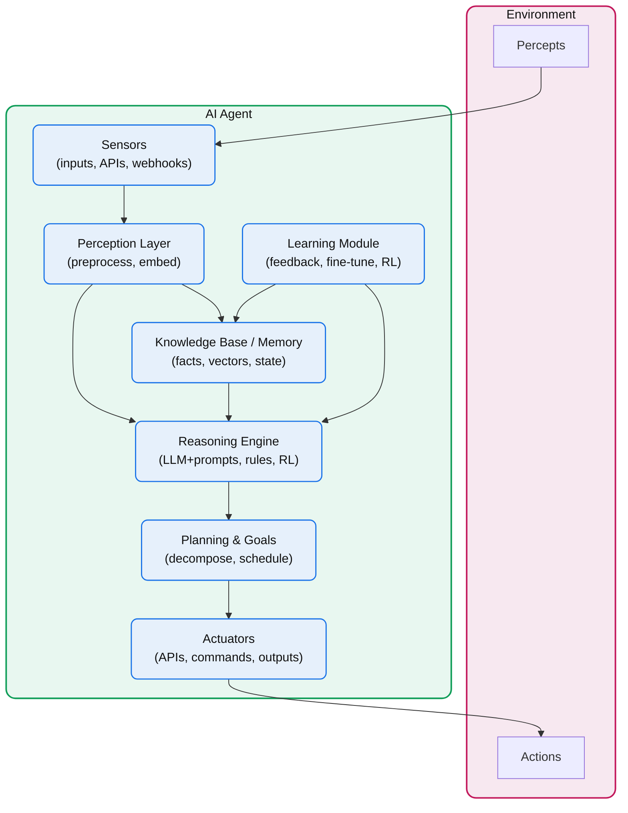

## Definition

- [AI Agents by Berkley Book](https://aima.cs.berkeley.edu/). [N8N Blog](https://blog.n8n.io/ai-agents/) on AI Agent Flows.

- [Definition by Harrison, LangChain Founder](https://blog.langchain.dev/what-is-an-agent/)
- [Ambient Agents](https://blog.langchain.dev/introducing-ambient-agents/): Ambient agents listen to an event stream and act on it accordingly, potentially acting on multiple events at a time)
- [12-Factor Agents - Principles for building reliable LLM applications](https://github.com/humanlayer/12-factor-agents/)

## Agentic Architecture

- [Agents Intro - a Google Whitepaper](https://www.kaggle.com/whitepaper-agents)
- [Building Effective Agents - Anthropic](https://www.anthropic.com/research/building-effective-agents)
- [Cohere - How enterprises can start building Agentic AI](https://cohere.com/blog/how-enterprises-can-start-building-agentic-ai)
- [AI Agents vs. Agentic AI White paper](https://arxiv.org/abs/2505.10468)

## Agentic Workflows

- [Intro to Agentic Workflows by N8N](https://blog.n8n.io/ai-agentic-workflows/)

## Retrieval Strategies for Agents

- [Generative Retrieval including traditional retrieval, hybrid retrieval, semantic retrieval, knowledge-based retrieval, and agentic contextual retrieval](https://arxiv.org/abs/2502.16866)

## LLM Foundation

- [Foundations of Large Language Models](https://arxiv.org/pdf/2501.09223)

## Architecture Layers

