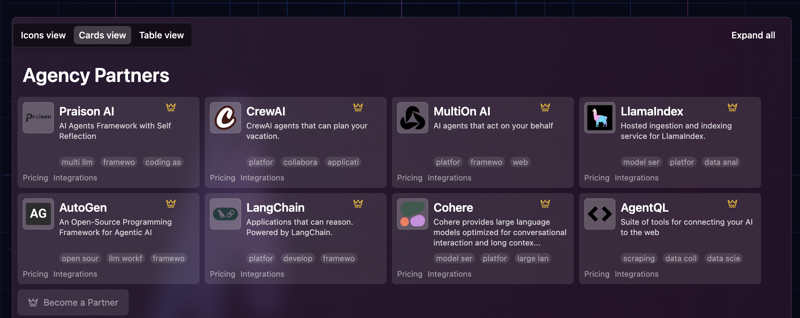

# AgentOps Marketplace

## Overview

The AgentOps Marketplace is a specialized platform that focuses on operational tools, monitoring solutions, and management capabilities for AI agents. It serves as a central hub for discovering and deploying solutions that enhance the operational aspects of agentic AI systems.

## Marketplace Platform

The AgentOps Marketplace is accessible at [marketplace.agen.cy](https://marketplace.agen.cy) and provides a curated collection of tools and solutions specifically designed for AI agent operations, monitoring, and management.

*Screenshot of the AgentOps Marketplace interface showing available solutions and tools*

## Core Focus Areas

### Operational Excellence
The marketplace emphasizes solutions that improve the operational aspects of AI agents:

- **Monitoring and Observability**: Real-time tracking of agent performance and behavior
- **Performance Optimization**: Tools for improving agent efficiency and effectiveness
- **Error Handling**: Solutions for robust error detection and recovery
- **Scalability Management**: Tools for managing agent deployments at scale

### Development and Deployment
- **Development Tools**: IDEs and frameworks optimized for agent development
- **Testing Frameworks**: Specialized testing tools for agent behavior validation
- **Deployment Automation**: CI/CD solutions for agent deployment pipelines
- **Version Management**: Tools for managing agent versions and updates

### Analytics and Intelligence
- **Performance Analytics**: Deep insights into agent performance metrics
- **Usage Analytics**: Understanding of agent utilization patterns
- **Business Intelligence**: Connecting agent performance to business outcomes
- **Predictive Analytics**: Forecasting agent performance and resource needs

## Solution Categories

### Monitoring and Observability Solutions
- **Real-time Dashboards**: Live monitoring of agent activities and performance
- **Alert Systems**: Intelligent alerting for agent anomalies and issues
- **Log Management**: Comprehensive logging and analysis capabilities
- **Trace Analysis**: Detailed tracing of agent decision-making processes

### Performance Management Tools
- **Resource Optimization**: Tools for optimizing agent resource utilization
- **Load Balancing**: Solutions for distributing agent workloads effectively
- **Capacity Planning**: Tools for planning agent infrastructure capacity
- **Performance Tuning**: Solutions for optimizing agent response times and accuracy

### Security and Compliance
- **Security Monitoring**: Specialized security tools for agent environments
- **Compliance Tracking**: Tools for ensuring regulatory compliance
- **Access Control**: Fine-grained access control for agent systems
- **Audit Logging**: Comprehensive audit trails for agent activities

### Integration and Connectivity
- **API Management**: Tools for managing agent APIs and integrations
- **Data Connectors**: Solutions for connecting agents to various data sources
- **Workflow Integration**: Tools for integrating agents into existing workflows
- **Multi-Agent Coordination**: Solutions for managing multi-agent systems

## Key Features and Benefits

### For Operations Teams
- **Centralized Management**: Single pane of glass for agent operations
- **Automated Monitoring**: Reduce manual monitoring overhead
- **Proactive Alerting**: Early detection of potential issues
- **Performance Insights**: Data-driven optimization opportunities

### For Development Teams
- **Development Acceleration**: Tools that speed up agent development cycles
- **Quality Assurance**: Comprehensive testing and validation capabilities
- **Deployment Automation**: Streamlined deployment processes
- **Debugging Support**: Advanced debugging and troubleshooting tools

### for Business Stakeholders
- **Business Metrics**: Clear visibility into agent business impact
- **ROI Tracking**: Measurement of agent return on investment
- **Compliance Assurance**: Confidence in regulatory compliance
- **Risk Management**: Proactive risk identification and mitigation

## Vendor Ecosystem

### Solution Providers
The marketplace features solutions from various types of providers:

- **AgentOps Specialists**: Companies focused specifically on agent operations
- **Monitoring Vendors**: Traditional monitoring companies with agent-specific solutions
- **AI Platform Providers**: Comprehensive AI platforms with operational components
- **Open Source Projects**: Community-driven operational tools and solutions

### Quality Standards
The marketplace maintains quality through:

- **Technical Validation**: Rigorous testing of operational capabilities
- **Performance Benchmarking**: Standardized performance testing
- **Integration Testing**: Validation of integration capabilities
- **Documentation Quality**: Comprehensive documentation standards

## Integration Capabilities

### Platform Integration
Solutions in the marketplace integrate with major platforms:

- **Cloud Platforms**: AWS, Google Cloud, Microsoft Azure
- **Container Orchestration**: Kubernetes, Docker Swarm
- **Monitoring Platforms**: Prometheus, Grafana, DataDog
- **CI/CD Platforms**: Jenkins, GitLab, GitHub Actions

### Agent Framework Integration
- **LangChain/LangGraph**: Native integration with LangChain ecosystem
- **AutoGen**: Support for Microsoft AutoGen agents
- **CrewAI**: Integration with CrewAI multi-agent systems
- **Custom Frameworks**: Flexible integration with custom agent frameworks

## Getting Started

### For Organizations
1. **Assess Operational Needs**: Identify specific operational challenges
2. **Explore Solutions**: Browse marketplace categories and solutions
3. **Evaluate Fit**: Assess solution compatibility with existing infrastructure
4. **Pilot Testing**: Implement proof-of-concept deployments
5. **Production Rollout**: Scale successful pilots to full production

### For Solution Providers
1. **Platform Registration**: Register as a marketplace solution provider
2. **Solution Certification**: Complete technical validation process
3. **Marketplace Listing**: Create comprehensive solution documentation
4. **Go-to-Market Support**: Leverage marketplace marketing channels
5. **Customer Success**: Provide ongoing support and optimization

## Pricing Models

### Common Pricing Approaches
- **Usage-Based**: Pricing based on agent monitoring volume or activity
- **Subscription**: Monthly or annual subscription models
- **Freemium**: Basic features free with premium upgrades
- **Enterprise**: Custom pricing for large-scale deployments

### Value Considerations
- **Operational Efficiency**: Reduced operational overhead and costs
- **Risk Mitigation**: Reduced risk of agent failures and issues
- **Performance Improvement**: Enhanced agent performance and reliability
- **Compliance Assurance**: Reduced compliance risk and audit costs

## Cross-References

- **Section 12**: Agent Observability - Comprehensive observability frameworks
- **Section 13**: Agentic AI Operations (AgentOps) - Operational best practices
- **Section 11**: Agentic AI Security - Security considerations for operational tools
- **Section 4**: Agent Development Frameworks - Integration with development tools

## Resources

- [AgentOps Marketplace](https://marketplace.agen.cy/)
- [AgentOps Platform Documentation](https://www.agentops.ai/)
- [Agent Monitoring Best Practices](https://docs.agentops.ai/best-practices)
- [Community Forums and Support](https://community.agentops.ai/)