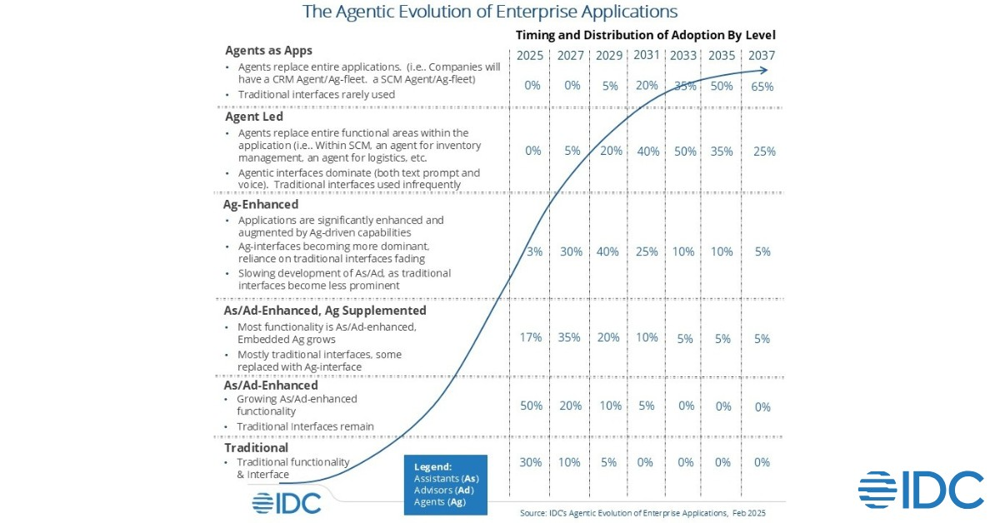

# Agentic AI Maturity Models

## Overview

Agentic AI maturity models provide frameworks for organizations to assess their current capabilities and plan their journey toward advanced AI agent implementations. These models help enterprises understand the progression from initial experimentation to large-scale, production-ready agentic systems.

This section consolidates maturity perspectives from leading industry analysts and cloud providers, offering comprehensive guidance for organizations at different stages of their agentic AI journey.

## Key Maturity Dimensions

Across different maturity models, several common dimensions emerge:

### Technical Maturity
- **Infrastructure Readiness**: Cloud-native architecture and scalable compute resources
- **Platform Capabilities**: Comprehensive development and deployment platforms
- **Integration Capabilities**: Seamless integration with existing enterprise systems
- **Security and Governance**: Robust security controls and compliance frameworks

### Organizational Maturity
- **Skills and Expertise**: AI/ML capabilities and agent development expertise
- **Process and Governance**: Established processes for agent lifecycle management
- **Culture and Change Management**: Organizational readiness for AI-human collaboration
- **Strategic Alignment**: Clear business objectives and success metrics

### Operational Maturity
- **Monitoring and Observability**: Comprehensive tracking of agent performance
- **Quality Assurance**: Testing frameworks and quality control processes
- **Scalability**: Ability to handle enterprise-scale deployments
- **Continuous Improvement**: Mechanisms for ongoing optimization and innovation

## Maturity Assessment Benefits

Organizations benefit from maturity assessments by:

- **Strategic Planning**: Clear roadmap for agentic AI adoption and scaling
- **Resource Allocation**: Informed decisions about investments and priorities
- **Risk Management**: Identification and mitigation of implementation risks
- **Capability Building**: Targeted development of necessary skills and processes
- **Performance Measurement**: Benchmarking progress and success metrics

## Industry Perspectives

### Gartner's Perspective
Focuses on strategic and organizational readiness for agentic AI adoption, emphasizing governance, risk management, and business value realization.

### AWS's Perspective
Provides a practical four-level maturity model (Envision, Experiment, Launch, Scale) with detailed implementation guidance and technical considerations.

### Google's Perspective
Emphasizes technical capabilities, platform integration, and systematic approaches to agent development and deployment.

### IDC's Perspective
Analyzes the evolution of enterprise applications toward agentic capabilities and the organizational transformation required.

*IDC's perspective on the agentic evolution of enterprise applications showing the progression from traditional applications to fully agentic systems*

## Getting Started with Maturity Assessment

Organizations beginning their agentic AI journey should:

1. **Assess Current State**: Evaluate existing AI/ML capabilities and infrastructure
2. **Define Target State**: Establish clear goals and success criteria
3. **Identify Gaps**: Determine areas requiring investment and development
4. **Create Roadmap**: Develop phased approach to capability building
5. **Implement Governance**: Establish frameworks for risk management and compliance
6. **Measure Progress**: Define KPIs and tracking mechanisms

## Cross-References

- **Section 3**: Architecture & Design Patterns - Technical foundation considerations
- **Section 4**: Agent Development Frameworks - Implementation tools and platforms
- **Section 11**: Agentic AI Security - Security and governance frameworks
- **Section 16**: AI Agents Best Practices - Implementation guidance from industry leaders

## Resources

- [Gartner Research on AI Agent Maturity](https://www.gartner.com/en/documents/6142159)
- [AWS Generative AI Maturity Model](https://docs.aws.amazon.com/prescriptive-guidance/latest/strategy-gen-ai-maturity-model/)
- [IDC: The Agentic Evolution of Enterprise Applications](https://www.idc.com/resource-center/blog/the-agentic-evolution-of-enterprise-applications/)
- [Google Cloud AI Maturity Resources](https://cloud.google.com/ai)

## See Also

- **[Evaluation Frameworks](../EvaluationFrameworks/Readme.md)**: Assessment and evaluation approaches
- **[Best Practices](../BestPractices/README.md)**: Maturity-driven best practices
- **[Agent Ops](../AgentOps/README.md)**: Operational maturity considerations
- **[Standards](../Standards/README.md)**: Standards compliance and maturity
