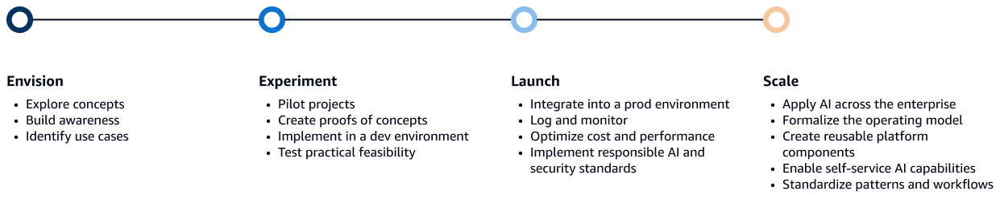
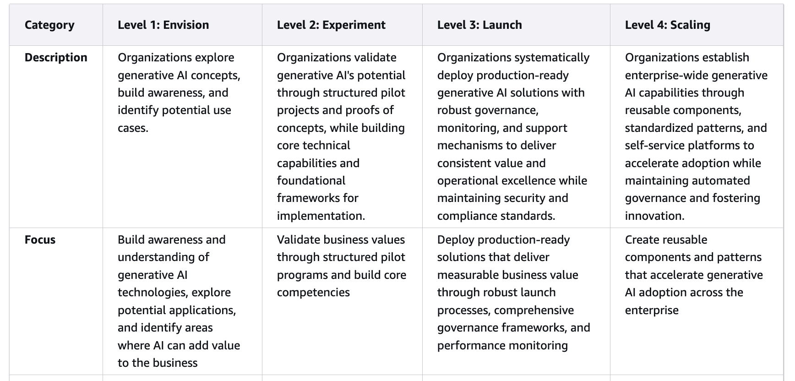
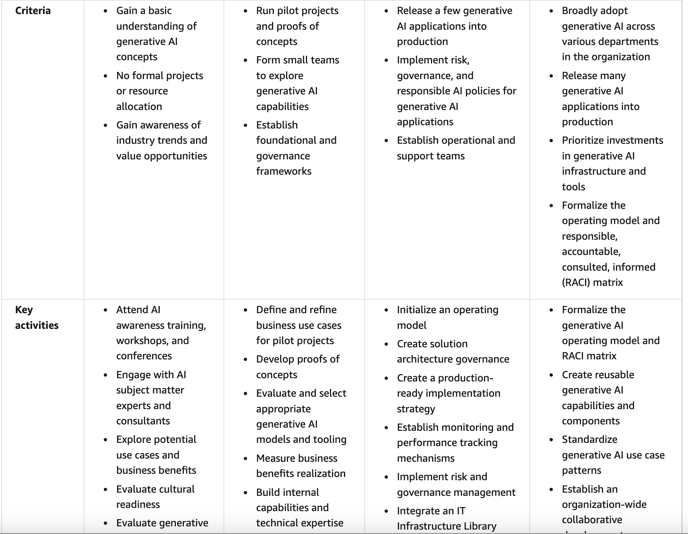
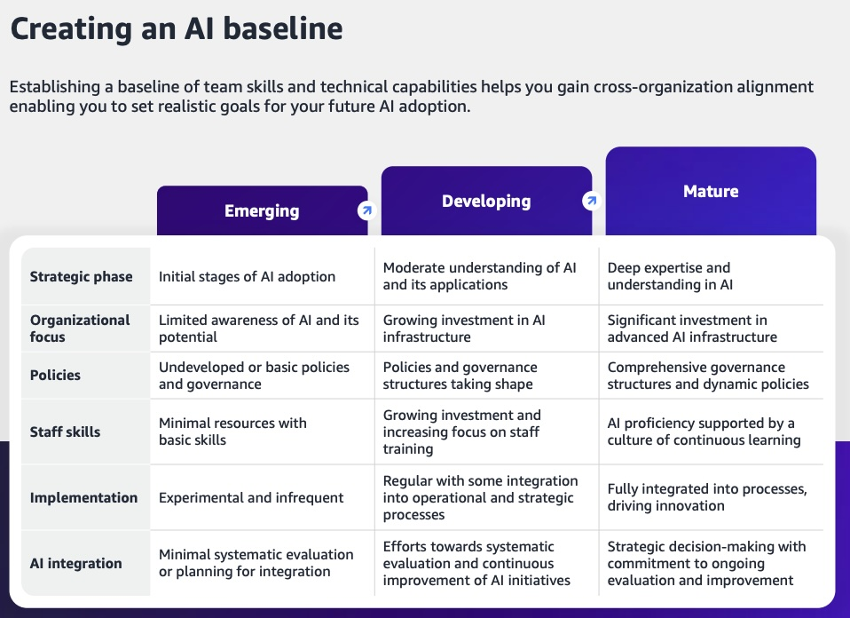

# AWS's Perspective on Agentic AI Maturity

## Overview

AWS provides a comprehensive maturity model for generative AI that organizations can use to assess their current capabilities and plan their journey toward advanced agentic AI implementations. This model focuses on practical implementation stages and provides clear guidance for enterprise adoption.

## Maturity Model for Generative AI

AWS defines four distinct levels in their generative AI maturity model, each representing a progressive stage of organizational capability and implementation sophistication.

*The four levels of the generative AI maturity model: envision, experiment, launch, and scale.*

### Level 1: Envision
- **Focus**: Strategy development and use case identification
- **Characteristics**: Initial exploration of AI possibilities
- **Key Activities**: Business case development, stakeholder alignment, initial proof of concepts

### Level 2: Experiment
- **Focus**: Pilot implementations and learning
- **Characteristics**: Controlled experimentation with AI agents
- **Key Activities**: Prototype development, skill building, risk assessment

### Level 3: Launch
- **Focus**: Production deployment of AI agents
- **Characteristics**: Operational AI systems with defined governance
- **Key Activities**: Production deployment, monitoring implementation, user training

### Level 4: Scale
- **Focus**: Enterprise-wide optimization and innovation
- **Characteristics**: Mature AI operations with continuous improvement
- **Key Activities**: Performance optimization, advanced use cases, strategic innovation

## Detailed Maturity Assessment

*Detailed assessment criteria across different organizational dimensions*

## Comprehensive Maturity Framework

*Comprehensive view of maturity progression across multiple organizational capabilities*

## Capabilities and Implementation Areas

*Detailed breakdown of capabilities and implementation considerations across maturity levels*

## Key Implementation Considerations

### Technical Readiness
- **Infrastructure**: Cloud-native architecture and scalable compute resources
- **Data Management**: Robust data pipelines and governance frameworks
- **Security**: Comprehensive security controls and compliance measures
- **Integration**: Seamless integration with existing enterprise systems

### Organizational Readiness
- **Skills and Training**: AI/ML expertise and continuous learning programs
- **Change Management**: Structured approach to organizational transformation
- **Governance**: Clear policies and procedures for AI agent deployment
- **Culture**: Innovation mindset and acceptance of AI-human collaboration

### Business Alignment
- **Strategy**: Clear business objectives and success metrics
- **Investment**: Appropriate funding and resource allocation
- **Risk Management**: Comprehensive risk assessment and mitigation strategies
- **Value Measurement**: Defined KPIs and ROI tracking mechanisms

## AWS Services and Tools

AWS provides comprehensive services to support each maturity level:

- **Amazon Bedrock**: Foundation model access and customization
- **Amazon SageMaker**: ML model development and deployment
- **AWS Lambda**: Serverless compute for agent functions
- **Amazon ECS/EKS**: Container orchestration for agent workloads
- **AWS Step Functions**: Workflow orchestration for complex agent processes

## Cross-References

- **Section 4.4**: AWS Strands Agents - Technical implementation framework
- **Section 5.2.2**: AWS AgentCore - Platform capabilities
- **Section 11.3**: AWS Security Perspective - Security considerations
- **Section 15.1**: AWS AI Agents Marketplace - Available solutions

## Resources

- [AWS Prescriptive Guidance: Strategy for Generative AI Maturity Model](https://docs.aws.amazon.com/prescriptive-guidance/latest/strategy-gen-ai-maturity-model/overview-levels.html)
- [AWS Generative AI Best Practices](https://aws.amazon.com/ai/generative-ai/)
- [AWS AI Services Documentation](https://docs.aws.amazon.com/ai-services/)