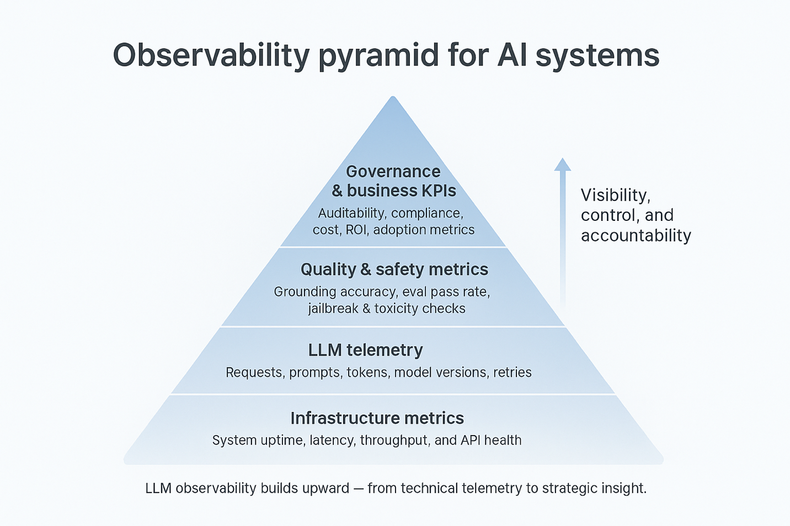
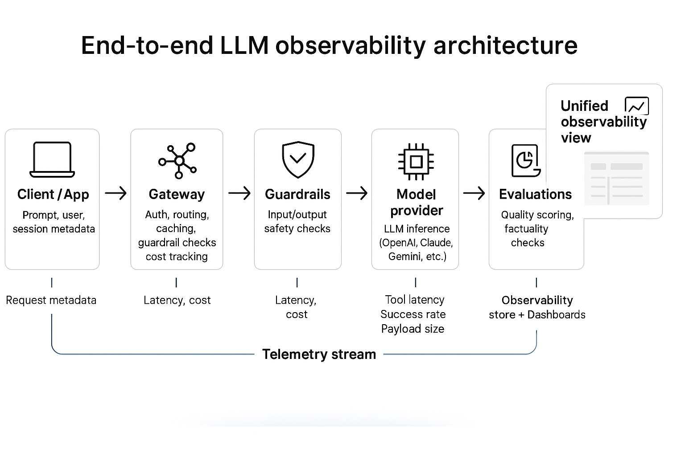

# Agent Observability

This section provides comprehensive coverage of observability solutions, best practices, and methodologies for monitoring and understanding agentic AI systems in production. From goals and objectives to specific tools and platforms, this collection offers the essential guidance needed to maintain visibility into AI agent behavior, performance, and reliability.

## Overview

Observability for agentic AI systems goes beyond traditional application monitoring to include AI-specific metrics, behavior tracking, and decision transparency. This section covers:

- **Goals & Objectives**: Core principles and objectives for AI observability
- **Observability Solutions**: Tools and platforms for monitoring AI systems
- **Best Practices and Guidelines**: Industry recommendations and implementation guidance
- **Implementation Strategies**: Practical approaches to deploying observability

## Goals & Objectives

*Source: [Portkey - The Complete Guide to LLM Observability](https://portkey.ai/blog/the-complete-guide-to-llm-observability/)*

### Core Observability Objectives

**Performance Monitoring**
- Track response times, throughput, and resource utilization
- Monitor model inference latency and token processing rates
- Measure system availability and reliability metrics

**Behavior Analysis**
- Understand agent decision-making processes
- Track conversation flows and interaction patterns
- Monitor tool usage and API call patterns

**Quality Assurance**
- Detect hallucinations and factual errors
- Monitor output quality and relevance
- Track user satisfaction and feedback metrics

**Cost Management**
- Monitor token usage and associated costs
- Track resource consumption across different models
- Optimize cost-performance ratios

**Security and Compliance**
- Monitor for sensitive data exposure
- Track access patterns and authentication events
- Ensure compliance with data protection regulations

### Key Metrics for AI Observability

**Operational Metrics**
- Request volume and rate
- Response latency (P50, P95, P99)
- Error rates and failure modes
- Resource utilization (CPU, memory, GPU)

**AI-Specific Metrics**
- Token consumption and costs
- Model accuracy and confidence scores
- Hallucination detection rates
- Tool call success rates

**Business Metrics**
- User engagement and satisfaction
- Task completion rates
- Business outcome correlation
- ROI and value realization

## Observability Solutions

### Development Platforms with Observability

**[AgentOps](https://www.agentops.ai)**
- Comprehensive development platform with built-in observability
- Agent-specific monitoring and analytics
- Real-time performance tracking
- Cost optimization insights

**[LangSmith](https://www.langchain.com/langsmith)**
- Development platform with integrated observability
- Trace visualization and debugging
- Performance analytics and optimization
- Integration with LangChain ecosystem

### Specialized Observability Platforms

**[Comet Opik](https://www.comet.com/docs/opik/)**
- Enterprise-grade ML observability platform
- Experiment tracking and model monitoring
- Performance analytics and visualization
- Team collaboration features

**[Langfuse](https://langfuse.com/)**
- YC W23 company specializing in LLM observability
- Comprehensive traces, evaluations, and prompt management
- Metrics collection and analysis for debugging and optimization
- Open-source with enterprise features

**[Openlit](https://openlit.io/)**
- Open-source platform for AI Engineering
- OpenTelemetry-native LLM Observability
- GPU Monitoring capabilities
- Integrated Guardrails, Evaluations, Prompt Management, Vault, and Playground

**[Weights & Biases (W&B) Weave](https://weave-docs.wandb.ai/)**
- Framework for tracking, experimenting, evaluating, deploying, and improving LLM-based applications
- Comprehensive experiment tracking
- Model performance monitoring
- Collaborative development environment

**[Braintrust](https://www.braintrust.dev/)**
- AI observability platform for measuring, evaluating, and improving AI in production
- Model comparison capabilities
- Prompt iteration tracking
- Regression detection using real user data
- Continuous improvement workflows

### Key Platform Features Comparison

| Platform | Open Source | Enterprise | Real-time Monitoring | Cost Tracking | Evaluation Tools |
|----------|-------------|------------|---------------------|---------------|------------------|
| AgentOps | ❌ | ✅ | ✅ | ✅ | ✅ |
| LangSmith | ❌ | ✅ | ✅ | ✅ | ✅ |
| Langfuse | ✅ | ✅ | ✅ | ✅ | ✅ |
| Openlit | ✅ | ✅ | ✅ | ✅ | ✅ |
| W&B Weave | ❌ | ✅ | ✅ | ✅ | ✅ |
| Braintrust | ❌ | ✅ | ✅ | ✅ | ✅ |

## Best Practices and Guidelines

### Industry Resources

**[LLM Observability Guide by Confident AI](https://www.confident-ai.com/blog/what-is-llm-observability-the-ultimate-llm-monitoring-guide)**
- Comprehensive guide to LLM monitoring strategies
- Best practices for production deployments
- Common pitfalls and how to avoid them

**[Portkey Guide to LLM Observability for 2026](https://portkey.ai/blog/the-complete-guide-to-llm-observability/)**
- Forward-looking observability strategies
- Emerging trends and technologies
- Implementation roadmaps for modern AI systems

### Implementation Best Practices

#### 1. Comprehensive Instrumentation

**Trace Everything**
- Instrument all AI model calls and responses
- Track tool usage and external API calls
- Monitor user interactions and feedback
- Capture context and conversation history

**Structured Logging**
- Use consistent log formats across all components
- Include correlation IDs for request tracking
- Log both successful operations and failures
- Implement appropriate log levels and filtering

#### 2. Real-time Monitoring

**Alert Configuration**
- Set up alerts for performance degradation
- Monitor for unusual error patterns
- Track cost threshold breaches
- Alert on security or compliance violations

**Dashboard Design**
- Create role-specific dashboards (developers, operations, business)
- Include both technical and business metrics
- Provide drill-down capabilities for investigation
- Ensure mobile-friendly access for on-call scenarios

#### 3. Performance Optimization

**Baseline Establishment**
- Establish performance baselines for all key metrics
- Track performance trends over time
- Identify seasonal or usage pattern variations
- Set realistic SLA targets based on historical data

**Continuous Improvement**
- Regularly review and optimize monitoring configurations
- Update alerting thresholds based on operational experience
- Implement automated remediation where appropriate
- Conduct regular observability reviews and improvements

#### 4. Security and Privacy

**Data Protection**
- Implement appropriate data masking for sensitive information
- Ensure compliance with data protection regulations
- Secure observability data with proper access controls
- Regular audit of observability data access and usage

**Retention Policies**
- Define appropriate data retention periods
- Implement automated data lifecycle management
- Balance observability needs with storage costs
- Ensure compliance with regulatory requirements

## Implementation Strategies

### For Startups and Small Teams

**Quick Start Approach**
1. **Choose an Integrated Platform**: Start with LangSmith or AgentOps for comprehensive coverage
2. **Focus on Core Metrics**: Monitor latency, error rates, and costs initially
3. **Implement Basic Alerting**: Set up alerts for critical failures and cost overruns
4. **Iterate and Expand**: Gradually add more sophisticated monitoring as needs grow

**Recommended Stack**
- **Primary Platform**: LangSmith or Langfuse (open-source option)
- **Alerting**: Platform-native alerting with Slack/email integration
- **Dashboards**: Platform-provided dashboards with custom business metrics

### For Enterprise Organizations

**Comprehensive Approach**
1. **Multi-Platform Strategy**: Combine specialized tools for different aspects
2. **Custom Metrics**: Implement business-specific KPIs and success metrics
3. **Advanced Analytics**: Use ML-powered anomaly detection and predictive analytics
4. **Integration**: Integrate with existing enterprise monitoring and ITSM tools

**Recommended Stack**
- **Core Observability**: Braintrust or W&B Weave for comprehensive coverage
- **Infrastructure Monitoring**: Integration with existing APM tools (DataDog, New Relic)
- **Security Monitoring**: Integration with SIEM and security tools
- **Business Intelligence**: Custom dashboards in existing BI tools

### For Research and Development

**Experiment-Focused Approach**
1. **Experiment Tracking**: Prioritize detailed experiment logging and comparison
2. **Model Performance**: Focus on model accuracy, bias detection, and fairness metrics
3. **Reproducibility**: Ensure all experiments are fully traceable and reproducible
4. **Collaboration**: Enable team collaboration and knowledge sharing

**Recommended Stack**
- **Primary Platform**: W&B Weave or Comet Opik for experiment tracking
- **Open Source Tools**: Langfuse for cost-effective comprehensive monitoring
- **Custom Analytics**: Jupyter notebooks with custom analysis workflows

## Advanced Observability Patterns

### Distributed Tracing for Multi-Agent Systems

**Trace Correlation**
- Implement distributed tracing across agent interactions
- Track request flows through multiple agents and services
- Correlate performance issues across the entire system
- Visualize complex interaction patterns

**Agent Interaction Monitoring**
- Monitor inter-agent communication patterns
- Track collaboration effectiveness and bottlenecks
- Identify optimization opportunities in agent workflows
- Measure coordination overhead and efficiency

### Predictive Observability

**Anomaly Detection**
- Implement ML-based anomaly detection for unusual patterns
- Predict potential failures before they occur
- Identify performance degradation trends
- Automate response to predicted issues

**Capacity Planning**
- Predict resource needs based on usage trends
- Optimize scaling decisions with data-driven insights
- Plan for seasonal variations and growth patterns
- Balance performance requirements with cost optimization

### Observability as Code

**Infrastructure as Code**
- Define monitoring configurations in version control
- Automate deployment of observability infrastructure
- Ensure consistency across environments
- Enable rapid disaster recovery and scaling

**Automated Testing**
- Test observability configurations and alerting
- Validate monitoring coverage for new features
- Ensure observability doesn't introduce performance overhead
- Maintain observability quality through CI/CD pipelines

This comprehensive observability framework provides the foundation for maintaining reliable, performant, and cost-effective agentic AI systems while ensuring transparency and accountability in AI decision-making processes.

## See Also

- **[Agent Development Frameworks](../AgenticFrameworks/README.md)**: Framework observability features
- **[Agent Ops](../AgentOps/README.md)**: Operational practices and methodologies
- **[Evaluation Frameworks](../EvaluationFrameworks/Readme.md)**: Evaluation and monitoring approaches
- **[Agent Platforms](../AgentPlatforms/README.md)**: Platform observability capabilities
