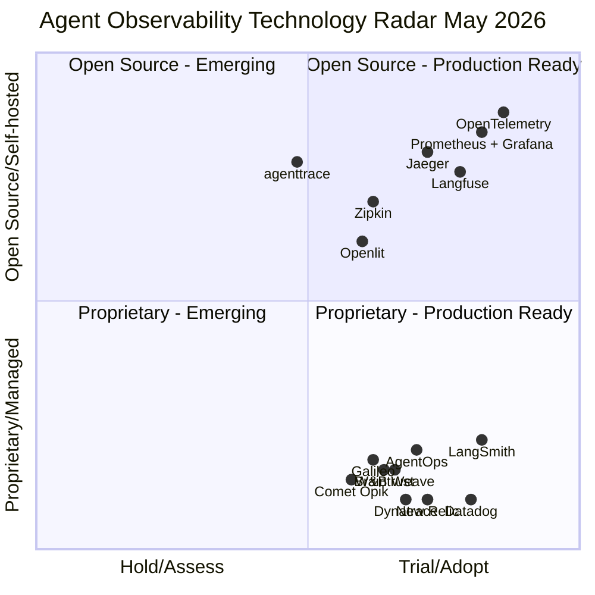

# Agent Observability Tech Radar

## Overview

This page consolidates **agent/LLM observability tools, standards, and adjacent APM platforms** and maps them to a **Technology Radar** adapted from the [Thoughtworks Technology Radar](https://www.thoughtworks.com/radar) methodology. It is intended as a practical selection aid: start with **Adopt** where possible, use **Trial** for targeted pilots, keep **Assess** on your watchlist, and place items in **Hold** when the fit is poor for most agent deployments.

The four radar rings:

| Ring | Meaning |
|---|---|
| **Adopt** | Proven and widely used. Recommended as a default starting point when it fits your stack. |
| **Trial** | Worth piloting in projects that can tolerate some risk or integration work. |
| **Assess** | Promising, but still needs validation for your production constraints. |
| **Hold** | Avoid as a default choice; use only with clear justification (e.g., existing enterprise standardization). |

---

## Technology Radar

The chart below maps solutions across two axes: **Adoption Readiness** (x-axis, left=Hold/Assess → right=Trial/Adopt) and **Openness** (y-axis, bottom=Proprietary/Managed → top=Open Source/Self-hosted). Quadrants separate OSS/self-hostable stacks from managed/proprietary platforms.

**How to read this chart:**
- **Right side** (x > 0.5) = Trial/Adopt (more production-ready; stronger default candidates)
- **Left side** (x < 0.5) = Assess/Hold (more situational, less validated for agent workloads, or niche)
- **Top half** (y > 0.5) = Open source / self-hostable
- **Bottom half** (y < 0.5) = Proprietary / managed services

---

## Ring Guidance (Why it’s placed there)

### Adopt

| Item | Why here (brief) | When it’s a fit |
|---|---|---|
| **OpenTelemetry** | Vendor-neutral standard for traces/metrics/logs; supports interoperability with common backends. | When you want portable instrumentation and the option to switch vendors. |
| **Prometheus + Grafana** | Widely adopted OSS metrics + dashboards; integrates well with OpenTelemetry pipelines. | When you need a strong baseline for infra + app metrics around agent systems. |
| **Datadog** | Common enterprise APM baseline; used to unify app + infra monitoring (often includes AI add-ons). | When your org already standardizes on Datadog and wants one pane of glass. |

### Trial

| Item | Why here (brief) | When it’s a fit |
|---|---|---|
| **Langfuse** | OSS LLM/agent observability (traces + evals + prompt mgmt) with self-host/cloud options. | When you want AI-native visibility plus OSS control. |
| **LangSmith** | Strong trace UX and evaluation workflows; best fit when you’re already on LangChain/LangGraph. | When your agent stack is LangChain/LangGraph-heavy. |
| **AgentOps** | Agent-focused monitoring + cost analytics; typically proprietary. | When you want agent-native dashboards quickly without building your own stack. |
| **Galileo** | Agent reliability platform with multi-agent trace/graph views. | When you need multi-agent workflow debugging and reliability analysis. |
| **W&B Weave** | Strong for experiment tracking + iterative prompt/model comparisons. | When your team already uses W&B workflows for experiments and wants production visibility too. |

### Assess

| Item | Why here (brief) | When it’s a fit |
|---|---|---|
| **Openlit** | OSS, OpenTelemetry-native “AI engineering” platform spanning observability + related workflows. | When you want OTel-native AI observability but need to validate feature depth for your use case. |
| **Jaeger / Zipkin** | Solid OSS tracing backends; adoption varies by org and existing OTel pipeline choices. | When you want OSS tracing without adopting a broader commercial suite. |
| **Braintrust** | Production iteration and regression detection oriented, but fit depends on workflow maturity. | When you’re ready to operationalize continuous evaluation from real traffic. |
| **Comet Opik** | Extends established ML tracking into LLM/agent workloads; validate workflows and integrations. | When your org already uses Comet and wants continuity across ML + LLM. |
| **New Relic / Dynatrace** | Often enterprise-standard APM choices; validate depth of AI/agent instrumentation and UX for traces/evals. | When you’re standardizing on existing APM tooling and adding AI layers. |

### Hold

| Item | Why here (brief) | When it might still be justified |
|---|---|---|
| **agenttrace** | Great local-first coding-agent trace reporting, but not a general production observability backend. | When you specifically need CI-friendly summaries from local coding-agent logs (developer workflows). |

---

## Radar Summary Table

| Item | Ring | Category | Open Source | Notes |
|---|---|---|---|---|
| **OpenTelemetry** | Adopt | Standard / instrumentation | ✅ | Vendor-neutral traces/metrics/logs |
| **Prometheus + Grafana** | Adopt | Metrics & dashboards | ✅ | Common OSS baseline |
| **Datadog** | Adopt | Enterprise APM | ❌ | Often org-standard APM |
| **Langfuse** | Trial | LLM/agent observability | ✅ | OSS + managed options |
| **LangSmith** | Trial | LLM/agent observability | ❌ | Best with LangChain/LangGraph |
| **AgentOps** | Trial | Agent observability | ❌ | Agent-focused analytics/costs |
| **Galileo** | Trial | Agent reliability | ❌ | Multi-agent workflow tracing views |
| **W&B Weave** | Trial | Experiment + prod tracking | ❌ | Strong iteration workflows |
| **Openlit** | Assess | OTel-native AI engineering | ✅ | Validate breadth vs needs |
| **Jaeger** | Assess | Tracing backend | ✅ | Common in OSS tracing stacks |
| **Zipkin** | Assess | Tracing backend | ✅ | Common in OSS tracing stacks |
| **Braintrust** | Assess | AI observability | ❌ | Iteration/regression oriented |
| **Comet Opik** | Assess | ML/LLM observability | ❌ | Good if you already use Comet |
| **New Relic** | Assess | Enterprise APM | ❌ | Often org-standard APM |
| **Dynatrace** | Assess | Enterprise APM | ❌ | Often org-standard APM |
| **agenttrace** | Hold | Local trace reporting | ✅ | Best for coding-agent logs |

---

## Best Practices

| Challenge / Area | Description | Solution / Recommendation |
|---|---|---|
| **Correlating agent steps** | Debugging multi-step reasoning/tool calls requires consistent linkage across traces/logs/metrics. | Use a consistent correlation ID across LLM calls, tool invocations, memory ops, and sub-agent calls; prefer OpenTelemetry context propagation where possible. |
| **Balancing cost vs visibility** | Full-fidelity capture can get expensive at scale. | Sample successes, capture 100% of errors, and keep a high-fidelity “debug mode” for targeted investigations. |
| **Privacy in traces/logs** | Prompts and tool outputs often contain sensitive data. | Implement PII detection/masking before persistence; enforce strict RBAC on observability stores. |
| **Evaluations as part of observability** | “System is up” is not enough; quality and regressions matter. | Add lightweight automated evals (e.g., groundedness/relevance) and trend them over time; gate releases with regression sets where feasible. |

---

## See Also

- [Observability Goals](goals.md)
- [Observability Solutions](solutions.md)
- [Production Observability](../ProductionBestPractices/observability.md)
- [Evaluation Frameworks](../EvaluationFrameworks/Readme.md)

## References

- [Thoughtworks Technology Radar](https://www.thoughtworks.com/radar) — radar methodology reference
- [OpenTelemetry](https://opentelemetry.io/) — vendor-neutral observability standard
- [Langfuse](https://langfuse.com/) — LLM observability (OSS + managed)
- [Openlit](https://openlit.io/) — OpenTelemetry-native AI engineering platform
- [LangSmith](https://www.langchain.com/langsmith) — LangChain/LangGraph observability & evals
- [AgentOps](https://www.agentops.ai) — agent observability platform
- [Galileo](https://galileo.ai) — agent reliability platform
- [W&B Weave](https://weave-docs.wandb.ai/) — LLM app tracking and evaluation framework
- [Braintrust](https://www.braintrust.dev/) — AI observability platform
- [Comet Opik](https://www.comet.com/docs/opik/) — ML/LLM observability (Comet)
- [agenttrace](https://github.com/luoyuctl/agenttrace) — local-first coding-agent trace reporting
