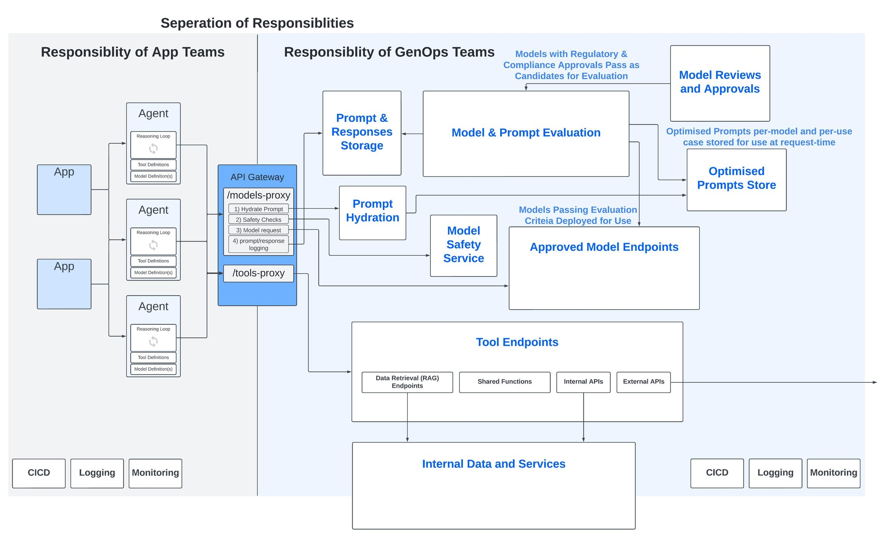

# Deployment

Deploying agentic AI systems requires practices that go beyond standard software deployment. Agents are non-deterministic, stateful, and can take real-world actions — which means deployment failures have higher blast radius than typical services.

## Overview



GenOps (Generative Operations) is the evolution of MLOps for agentic systems. Key differences from traditional MLOps:

| Dimension | Traditional MLOps | GenOps |
|---|---|---|
| Output type | Deterministic predictions | Non-deterministic, generative responses |
| Evaluation | Accuracy, F1, AUC | Relevance, coherence, safety, alignment |
| Versioning | Model weights + data | Model + prompt + context + tools |
| Rollback trigger | Accuracy regression | Quality regression, safety violation, cost spike |
| Scaling unit | Inference replicas | Agent instances + tool capacity + memory stores |

## Best Practices

| Key Challenge | Description | Lessons Learned & Alternatives Considered | Solution Applied |
|---|---|---|---|
| Big-bang deployments | Releasing agent changes to all users at once risks widespread quality regressions | Tried feature flags only; still exposed too many users to broken prompts | Use canary deployments — route 5% of traffic to new version, monitor quality metrics before full rollout |
| Prompt versioning | Prompt changes are as impactful as code changes but often untracked | Stored prompts in code comments; no history or rollback | Treat prompts as versioned artifacts in source control; tie prompt version to deployment version |
| Environment parity | Agents behave differently in dev vs prod due to different tool configs or model versions | Used different model versions per environment; bugs only appeared in prod | Pin model versions and tool configurations per environment; use infrastructure-as-code for agent config |
| Stateful agent restarts | Restarting an agent mid-task loses in-progress state | Relied on client retry; users lost work | Implement checkpointing (LangGraph checkpointers, durable execution via Restate) so agents resume from last known state |
| Runaway agent loops | Agents can enter infinite tool-call loops consuming unbounded tokens and time | Set only a global timeout; agents still burned budget before stopping | Enforce per-invocation step limits and token budgets; implement circuit breakers on tool call frequency |
| Multi-agent coordination failures | In multi-agent systems, one agent's failure cascades silently | Assumed agents would self-correct; they compounded errors instead | Define explicit handoff contracts between agents; validate outputs at each handoff boundary |
| Orchestration loops | Orchestrators that repeatedly delegate tasks in a cycle run up unbounded costs | Set only a global timeout; agents still burned budget before stopping | Implement explicit step counters, loop detection, and forced termination conditions; AWS Step Functions enforces maximum execution time and step limits natively — set these from day one |
| Schema-free handoffs | Free-form inter-agent prose at handoff boundaries causes silent failures and context corruption | Passed natural language summaries between agents for flexibility; downstream agents misinterpreted them | Require JSON-schema-validated outputs at every handoff; return a structured error to the orchestrator on validation failure — never proceed with a potentially corrupt payload |
| Handoff payload bloat | Verbose payloads forwarded between agents bloat context windows and degrade reasoning quality | Forwarded full intermediate results in task objects for completeness | Include only what the next agent needs; store intermediate results in S3 and reference them by pointer in DynamoDB task state |
| Scaling tool dependencies | Agent scale-out is bottlenecked by downstream tool API rate limits | Scaled agent replicas without scaling tool capacity; hit rate limits immediately | Model tool capacity as a first-class constraint; implement queuing and backpressure for tool calls |
| Deployment rollback | Rolling back an agent deployment is complex when memory stores have been mutated | Rolled back code but not memory; agents behaved inconsistently | Implement memory versioning or append-only memory with rollback markers; test rollback procedures regularly |

## Planning Mode

Planning mode is a runtime mode enforced by the harness, not a paragraph in a prompt. Use it for non-trivial, ambiguous, multi-step, high-impact, or high-risk tasks.

**Planning mode allows:** reading, searching, asking clarifying questions, comparing approaches, drafting a plan artifact, estimating risks.

**Planning mode blocks:** writes, sends, deletes, payments, permission changes, deployments, external commitments, and other irreversible side effects.

Enter planning mode when: more than one valid strategy exists; the work touches multiple systems; side effects are hard to undo; tool execution is expensive; the task will exceed one context window.

Store the plan as a durable artifact outside the prompt. Before executing risky steps, request approval that includes the summary, exact actions, risk class, expected outcome, rollback path, and scope. If the plan changes materially, request approval again.

## Step Budgets

Every loop-based agent needs explicit budgets enforced in harness code:

| Budget | Description |
|---|---|
| `max_model_turns` | Maximum model calls per run |
| `max_tool_calls` | Maximum total tool invocations |
| `max_parallel_tool_calls` | Cap on concurrent tool calls |
| `max_wall_time_seconds` | Hard wall-clock timeout |
| `max_input_tokens` | Context budget per call |
| `max_output_tokens` | Output length cap |
| `max_total_cost` | Cost ceiling in dollars/credits |
| `max_tool_result_chars` | Bound on result size per tool call |
| `max_retries_per_tool_call` | Retry ceiling before structured failure |

When any budget is reached, stop with a structured status: `{ "status": "stopped", "reason": "step_limit_reached", "completed": false, "next_safe_action": "..." }`. Never silently exhaust the budget.

## Goal-Like Loop

A goal is a durable objective with a measurable done condition. Use a goal-like loop when the agent should continue making progress across many steps, tool calls, or sessions.

Goal state should be persisted outside the prompt:

```yaml
objective: "..."
status: active | paused | completed | blocked | cancelled
scope: "..."
done_condition: "..."
budget:
  max_steps: 30
  max_cost: "..."
  max_wall_time: "..."
checkpoints:
  - "..."
validation:
  - "..."
forbidden_actions:
  - "..."
approval_required_for:
  - "..."
progress_log_ref: "..."
```

**Good goal:** "Analyze the last 200 support escalations, classify the top five repeatable causes with evidence, propose one operational fix per cause, and stop when the report passes the source-check and PII-redaction checklist."

**Bad goal:** "Improve support operations."

A good goal has one objective, bounded scope, source materials, allowed tools, forbidden actions, budget, checkpoints, validation method, and a stopping condition.

## MVP Build Sequence

For a new domain agent, follow this order. Each step should pass evals before moving to the next:

1. Build the manual model-tool-observation loop
2. Add strict tool schemas and local validation
3. Add runtime permission checks
4. Add structured tool results and error observations
5. Add step and cost budgets
6. Add trace logging
7. Add prompt-cache-aware context ordering
8. Add planning mode for high-risk tasks
9. Add context compaction
10. Add skills for reusable workflows
11. Add MCP/external connectors with scoped permissions
12. Add goal-like loops only after the base agent passes evals
13. Add subagents only when decomposition improves measured results
14. Add recurring entropy cleanup workflows

## Operational Maturity Levels

| Level | Characteristics |
|---|---|
| 1 – Basic | Manual deployment, basic logging, manual scaling |
| 2 – Automated | CI/CD pipelines, comprehensive monitoring, auto-scaling |
| 3 – Intelligent | Self-healing, predictive analytics, multi-agent coordination |
| 4 – Autonomous | Fully autonomous operational decisions, self-optimizing ecosystems |

## Core Infrastructure Stack

**Container Orchestration**: Kubernetes for agent deployment, Docker for containerization, service mesh for inter-agent communication

**CI/CD**: GitHub Actions / GitLab CI for pipelines, ArgoCD for GitOps-based deployment, Helm for Kubernetes management

**Durable Execution**: [Restate](https://restate.dev/) for retries, fault tolerance, timers, and scheduling — acts as a reverse-proxy handling durable async execution for agent workflows

**Cloud Platforms**: Google Vertex AI, AWS Bedrock / AgentCore, Azure AI Foundry — each provides managed agent runtimes with built-in scaling and observability

## Evaluation-Gated Deployment

The core pre-production principle from Google's AgentOps practice: **no agent version should reach users without first passing a comprehensive evaluation that proves its quality and safety**. This trades manual uncertainty for automated confidence.

Two implementation patterns:

| Approach | When to Use | Mechanics |
|---|---|---|
| Manual Pre-PR Gate | Teams beginning their evaluation journey | AI/Prompt Engineer runs eval locally before PR; performance report linked in PR; reviewer assesses behavioral changes and guardrail violations |
| Automated In-Pipeline Gate | Mature teams | Evaluation harness integrated into CI/CD; failing evaluation automatically blocks deployment; thresholds defined by ML Governance |

The evaluation harness must assess **behavioral quality** — not just functional correctness. An agent can pass 100 unit tests but still fail by choosing the wrong tool or hallucinating a response.

## Three-Phase CI/CD Pipeline (Google AgentOps)

A robust agent CI/CD pipeline is structured as a funnel — catching errors early and cheaply ("shifting left"):

**Phase 1 — Pre-Merge Integration (CI)**
Triggered on every pull request. Runs fast checks: unit tests, code linting, dependency scanning, and — critically — the **agent quality evaluation suite** against a golden dataset. Failures block the merge. Infrastructure: Google Cloud Build with PR checks configuration template.

**Phase 2 — Post-Merge Validation in Staging (CD)**
Once merged, the CD process packages the agent and deploys it to a staging environment (high-fidelity replica of production). Runs load testing, integration tests against remote services, and internal user testing ("dogfooding"). The staging environment validates the agent as an *integrated system* under production-like conditions.

**Phase 3 — Gated Deployment to Production**
Almost never fully automatic. Requires a **Product Owner sign-off** (human-in-the-loop). The exact artifact validated in staging is promoted — not rebuilt. Infrastructure: Terraform for IaC, production deployment configuration with appropriate safeguards.

**Infrastructure enablers**:
- **Infrastructure as Code (IaC)**: Terraform defines environments programmatically — identical, repeatable, version-controlled. Prevents environment drift.
- **Automated Testing Frameworks**: Pytest-based frameworks handle agent-specific artifacts: conversation histories, tool invocation logs, dynamic reasoning traces.
- **Secrets Management**: API keys injected at runtime via Secret Manager — never hardcoded in repository or prompts.

## GitOps for Agent Deployments

Treat the git repository as the single source of truth for deployment state:
- Every deployment = a git commit
- Every rollback = a git revert
- Platforms: Agent Engine or Cloud Run + Cloud Load Balancing for traffic management across versions

## Fault Tolerance and Robustness Patterns

Arsanjani & Bustos (2026) define a five-level robustness maturity spectrum. The following patterns extend existing deployment practices for production-grade agentic systems:

| Key Challenge | Description | Lessons Learned & Alternatives Considered | Solution Applied |
|---|---|---|---|
| Stalled/hanging agents | An agent interacting with a slow external API enters an infinite wait, freezing the entire workflow | Set only a global timeout; stalled agent consumed the full budget before terminating | **Watchdog Timeout Supervisor**: wrap every agent call in a timed execution block (Python `asyncio.wait_for`); if agent does not respond within deadline, forcefully cancel and trigger fallback (backup agent, simplified analysis, or escalation) |
| Deterministic LLM failure loops | An agent repeatedly returns malformed output on the same input; simple retry reproduces the same failure | Resent the same prompt on retry — same error every time, wasted tokens | **Adaptive Retry with Prompt Mutation**: on failure, mutate the prompt before retrying — rephrase, add few-shot examples, inject chain-of-thought instructions ("Think step by step"), or tighten format constraints; mutated prompts often recover accuracy while resolving the failure |
| Agent crash mid-task | An agent process crashes and all in-progress state is lost; full restart required | Relied on client retry to restart from scratch — users lost minutes of work | **Auto-Healing Agent Resuscitation**: health monitor detects crash, retrieves last checkpointed state from durable store, restarts agent process with that state restored |
| Long-running pipeline interruptions | Multi-step pipelines lose all progress when interrupted mid-execution | Stored state in memory only; any infrastructure event meant starting over | **Incremental Checkpointing**: persist workflow state to durable storage (e.g., LangGraph checkpointers, DynamoDB) after each completed step; on restart, resume from last checkpoint rather than the beginning |
| API rate limit exhaustion | Agents calling shared external APIs exhaust rate limits, causing cascading failures | No throttling; bursts from parallel agents triggered 429 errors across the system | **Rate-Limited Invocation**: wrap all external API calls in a rate limiter enforcing per-agent and per-API quotas; excess requests are queued or rejected with graceful degradation |
| Primary model unavailability | The primary LLM becomes unavailable or cost threshold is breached mid-workflow | No fallback; agent halted and returned an error | **Fallback Model Invocation**: maintain a fallback hierarchy; on primary model failure or cost trigger, route to a smaller, faster, or cheaper model for continuity |
| Human escalation fatigue | Immediate escalation for every agent failure overwhelms operators and creates alert noise | Escalated every low-confidence result to a human reviewer; reviewers became a bottleneck | **Delayed Escalation Strategy**: attempt automated recovery first (retry → backup agent → simplified scope); only escalate to a human operator after automated paths are exhausted, with a full context packet for efficient review |

## See Also
- [Observability](./observability.md)
- [Cost Management](./cost-management.md)
- [Agent Testing & Evaluations](./testing-evaluations.md)
- [A2A Protocol](../Standards/agent2agent.md) — registry architectures for multi-agent deployments
- [Agentic Architectural Patterns — Arsanjani & Bustos](../DesignPatterns/arsanjani-patterns.md) — full fault tolerance and robustness pattern catalog

## References
- [agents-best-practices — DenisSergeevitch (2025)](https://github.com/DenisSergeevitch/agents-best-practices) — source for planning mode runtime model, step budgets, goal-like loop structure, and MVP build sequence
- Arsanjani, A., & Bustos, J.P. (2026). *Agentic Architectural Patterns for Building Multi-Agent Systems*. Packt Publishing. ISBN 978-1-80602-957-0. — Source for robustness patterns: Watchdog Timeout, Adaptive Retry with Prompt Mutation, Auto-Healing, Incremental Checkpointing, Rate-Limited Invocation, Fallback Model Invocation, Delayed Escalation.
