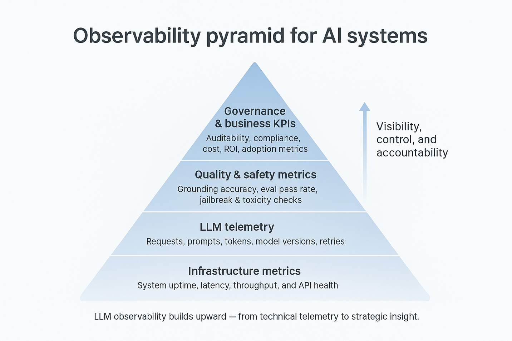

# Observability

Observability for agentic AI goes beyond traditional APM. You need visibility into LLM calls, tool invocations, reasoning chains, token costs, and output quality — not just latency and error rates.

## Overview

*Source: [Portkey - The Complete Guide to LLM Observability](https://portkey.ai/blog/the-complete-guide-to-llm-observability/)*

The four pillars of agent observability are **Traces** (full execution paths including LLM calls, tool use, memory reads), **Metrics** (aggregated time-series for dashboards and alerting), **Logs** (structured event records for debugging and audit), and **Evaluations** (automated quality scoring via LLM-as-judge, hallucination detection, and regression tests).

## Best Practices

| Key Challenge | Description | Lessons Learned & Alternatives Considered | Solution Applied |
|---|---|---|---|
| Retrofitting observability | Adding monitoring after deployment is costly and incomplete | Considered post-hoc log scraping; found it misses intermediate reasoning steps | Instrument agent architecture from day one using OpenTelemetry-compatible SDKs |
| Trace correlation in multi-agent systems | Requests span multiple agents, tools, and services making debugging hard | Tried per-service logging; couldn't reconstruct full execution paths | Propagate a consistent trace ID through every agent and tool call — it is the only way to correlate logs into a single execution graph; use distributed tracing (Jaeger, Langfuse, Amazon CloudWatch Traces) |
| Multi-agent cost attribution | In multi-agent systems, it is unclear which agent is responsible for the majority of inference costs | Tracked total cost per workflow; couldn't identify which agent to optimize | Use LangFuse token cost tracking across agents — it shows per-agent cost attribution for optimization decisions |
| 100% trace capture cost | Full tracing at production scale is expensive | Evaluated always-on tracing; storage and egress costs were prohibitive | Sample intelligently — 100% of errors, 10–20% of successful requests |
| PII in traces | User inputs logged verbatim expose sensitive data | Considered not logging inputs; lost too much debugging value | Implement PII detection and masking before writing to observability store |
| Token cost visibility | Costs compound silently across sessions and models | Relied on monthly billing reports; caught overruns too late | Track token usage per trace in real time; set budget alerts at 70% and 90% thresholds |
| Hallucination detection | Hard to know when agent outputs are factually wrong | Manual spot-checking doesn't scale | Integrate LLM-as-judge evaluation on sampled outputs; track hallucination rate as a KPI |
| Tool call failure visibility | Tool failures silently degrade agent quality | Checked only final output quality; missed upstream tool errors | Log every tool invocation with input, output, latency, and success/failure status |
| Business metric correlation | Technical metrics don't reflect actual agent value | Tracked only P99 latency; missed that task completion rate was declining | Define business KPIs (task completion rate, escalation rate, resolution rate) and correlate with technical traces |

## Tooling

| Platform | Open Source | Cost Tracking | Evaluations | Best For |
|---|---|---|---|---|
| [Langfuse](https://langfuse.com/) | ✅ | ✅ | ✅ | Self-hosted, cost-conscious teams |
| [Openlit](https://openlit.io/) | ✅ | ✅ | ✅ | OpenTelemetry-native stacks |
| [LangSmith](https://www.langchain.com/langsmith) | ❌ | ✅ | ✅ | LangChain/LangGraph ecosystems |
| [Braintrust](https://www.braintrust.dev/) | ❌ | ✅ | ✅ | Regression detection on real user data |
| [W&B Weave](https://weave-docs.wandb.ai/) | ❌ | ✅ | ✅ | Research and experiment-heavy teams |
| [AgentOps](https://www.agentops.ai) | ❌ | ✅ | ✅ | Agent-specific monitoring and analytics |

## Key Metrics Reference

**Operational**: request volume, response latency (P50/P95/P99), error rate, resource utilization

**AI-Specific**: token consumption and cost, tool call success rate, context window utilization %, retrieval relevance score (RAG), hallucination detection rate

**Business**: task completion rate, human escalation rate, user satisfaction score, ROI per interaction

## The Observe → Act → Evolve Production Loop (Google AgentOps)

Managing an autonomous agent in production requires a continuous operational cycle rather than static monitoring:

- **Observe**: Understand the system's behavior in real time via logs, traces, and metrics. This is the sensory system for everything downstream.
- **Act**: Pull real-time levers to maintain performance, safety, and cost. Think of this as the system's automated reflexes — not strategic improvements.
- **Evolve**: Use production insights to make the agent fundamentally better. Turn raw observability data into durable improvements in architecture, logic, and behavior.

The critical distinction: "Act" is tactical (circuit breakers, traffic rerouting, HITL escalation); "Evolve" is strategic (prompt refinements, new tools, updated guardrails deployed through the CI/CD pipeline).

### Evolution Workflow

Production data becomes the engine of improvement:
1. **Analyze** production logs for trends — user behavior, task success rates, security incidents
2. **Update evaluation datasets** — transform production failures into test cases, augmenting the golden dataset
3. **Refine and deploy** — commit improvements (prompt changes, new tools, guardrail updates) to trigger the automated pipeline

This creates a virtuous cycle where every user interaction is a potential improvement signal. With a mature CI/CD pipeline, the loop from observation to deployed improvement can close in hours or days, not weeks.

### Evolving Security via the Production Loop

Security is not a one-time setup. The Observe → Act → Evolve loop applies directly to security posture:
1. **Observe**: Monitoring detects a new threat vector (e.g., a novel prompt injection technique)
2. **Act**: Immediate containment via circuit breaker / feature flag to disable the affected capability
3. **Evolve**: The new attack is added as a permanent test case; Prompt/AI Engineer refines filters or system prompt; change goes through full CI/CD pipeline, validated against the expanded eval set

Every production incident makes the agent's defenses stronger.

## Google Cloud Observability Stack

For agents running on Google Cloud (Vertex AI Agent Engine, ADK):
- **Cloud Trace**: Each user request gets a unique trace ID linking Agent Engine invocation, model calls, and tool executions with visible durations
- **Cloud Logging**: Detailed logs for every tool call, error, and decision
- **Cloud Monitoring**: Dashboard alerts when latency thresholds are exceeded
- **ADK**: Built-in Cloud Trace integration for automatic instrumentation of agent operations

## Google Cloud Observability Stack

For agents running on Google Cloud (Vertex AI Agent Engine, ADK):
- **Cloud Trace**: Each user request gets a unique trace ID linking Agent Engine invocation, model calls, and tool executions with visible durations
- **Cloud Logging**: Detailed logs for every tool call, error, and decision
- **Cloud Monitoring**: Dashboard alerts when latency thresholds are exceeded
- **ADK**: Built-in Cloud Trace integration for automatic instrumentation of agent operations

## AWS Multi-Agent Observability Stack

For multi-agent systems on AWS, a layered approach is required:

| Tool | Role |
|---|---|
| Amazon CloudWatch Traces | Distributed tracing across Lambda, Amazon Bedrock agent invocations, and Step Functions. Renders the full execution graph as a single navigable trace. |
| LangSmith | Purpose-built LLM tracing — hierarchical tree view from orchestrator down to individual tool calls. Evaluation dataset management for per-agent and multi-agent testing. |
| LangFuse | Token cost tracking across agents — shows which agent is responsible for the majority of inference costs. Strong cost attribution for optimization decisions. |

Layered evaluation strategy for multi-agent systems: per-agent evaluations (isolated datasets) + full workflow evaluation (`Builtin.GoalSuccessRate`) + differential analysis correlating per-agent scores against system-level outcomes.

## See Also
- [Deployment](./deployment.md)
- [Cost Management](./cost-management.md)
- [Agent Testing & Evaluations](./testing-evaluations.md)
