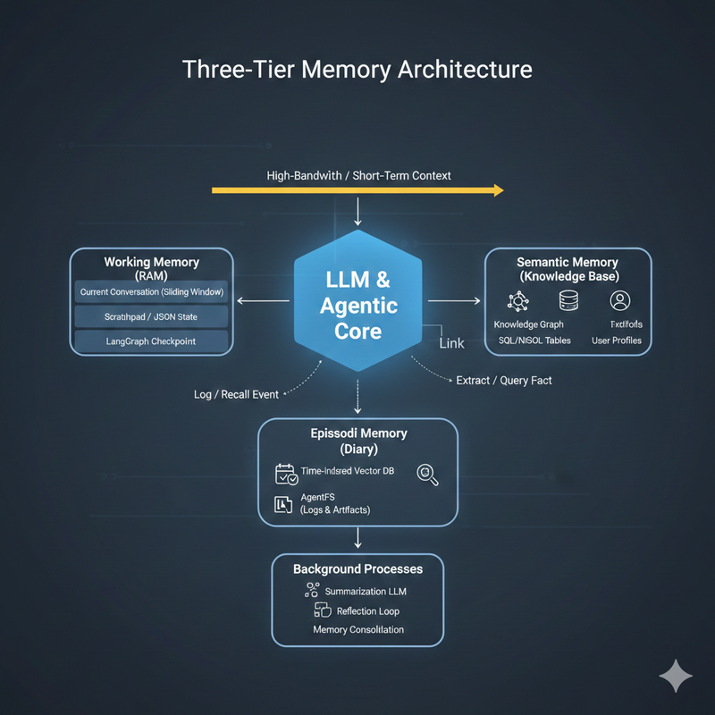

# State & Memory Management

Effective memory management determines whether an agent feels like a persistent, intelligent system or a stateless chatbot. The core challenge is deciding what to keep in the expensive context window versus what to offload to external storage.

## Overview

Agent memory operates across three functional tiers:

| Tier | Purpose | Storage | Analogy |
|---|---|---|---|
| Short-term (Working Memory) | Current task context and conversation flow | In-memory / checkpointer | RAM |
| Episodic Memory | Searchable log of past events and outcomes | Vector DB / structured logs | Journal |
| Long-term (Semantic Memory) | Persistent facts, preferences, and learned rules | Knowledge graph / SQL | Hard drive |

## Best Practices

| Key Challenge | Description | Lessons Learned & Alternatives Considered | Solution Applied |
|---|---|---|---|
| Context window overflow | Long sessions exceed model token limits, causing truncation or errors | Tried increasing context window size; costs scaled quadratically | Implement sliding window or recursive summarization to compress old history |
| State loss between sessions | Agents forget user preferences and prior decisions across sessions | Stored full conversation history; retrieval became slow and noisy | Extract and persist key facts (entity extraction) to a structured store; retrieve on demand |
| Conflicting memory updates | Multiple agents writing to shared memory create inconsistencies | Used a single shared vector DB; concurrent writes caused stale reads | Implement optimistic locking or event-sourced memory with a temporal knowledge graph (Zep/Graphiti) |
| Memory retrieval relevance | Fetching too much irrelevant context degrades response quality | Retrieved top-K by embedding similarity alone; pulled in unrelated facts | Combine semantic search with metadata filters (recency, entity type, session ID) |
| Memory privacy and isolation | User A's memory leaking into User B's context | Shared embedding space across users; namespace collisions occurred | Enforce strict tenant/user namespacing in all memory stores; audit access patterns |
| Implicit vs explicit memory | Agents miss important facts not explicitly stated by users | Relied on users to say "remember this"; most didn't | Run a background extraction LLM to monitor conversations and auto-save key facts |
| Memory staleness | Stored facts become outdated as user context changes | Kept all facts indefinitely; agents acted on stale preferences | Attach TTLs to volatile facts; use temporal graphs to track how facts evolve over time |
| Working memory for tool-heavy tasks | Complex multi-step tool chains lose intermediate state | Passed all state through the context window; hit token limits | Use a scratchpad / AgentFS for intermediate tool outputs; reference by pointer in context |

## Memory Solutions Reference

| Solution | Provider | Core Technology | Key Strength |
|---|---|---|---|
| [Mem0](https://mem0.ai/) | Independent | Vector + Graph | Auto-extracts and refines user facts across sessions |
| [Zep](https://www.getzep.com/) | Independent | Temporal Knowledge Graph | Tracks how facts evolve over time |
| [AgentFS](https://github.com/tursodatabase/agentfs) | Turso | SQLite-backed virtual FS | Filesystem-like persistence in a single portable .db file |
| [Letta (MemGPT)](https://letta.com/) | Independent | Virtual Context | Self-managed RAM/disk for autonomous context swapping |
| [LangMem](https://blog.langchain.dev/langmem/) | LangChain | Managed SaaS | Deep integration with LangGraph nodes |
| Bedrock Memory | AWS | Managed AWS | Enterprise scaling and compliance for Bedrock agents |

## LTM Strategy Selection

| Strategy | Best For | Storage |
|---|---|---|
| Vector RAG | Fuzzy/semantic search over large knowledge bases | Pinecone, Chroma, pgvector |
| Knowledge Graph | Relational reasoning, multi-hop questions | Neo4j, FalkorDB |
| Entity Extraction | Personalization, fixed attributes (allergies, preferences) | Postgres, Redis |
| Incremental Summary | Long-term narrative without storing every message | Markdown / text files |
| Reflection / Consolidation | Self-correction, learning from past failures | AgentFS / specialized DB |

## Stateless Agent Design for Horizontal Scaling

Since LLMs are themselves stateless, persisting memory externally is **non-negotiable** for production agents. The payoff: any agent instance can handle any request, enabling serverless horizontal scaling.

**Google Cloud pattern**: Design agent logic as a stateless, containerized service with external state — deployable on Cloud Run (auto-scaling) or Vertex AI Agent Engine.

**Key architectural choice**:
- **Vertex AI Agent Engine**: Provides a built-in, durable session and memory service. Managed, but less flexible.
- **Cloud Run + external DB**: More flexibility — integrate directly with AlloyDB or Cloud SQL. Requires managing the persistence layer yourself.

**Handling long-running tasks**: For complex jobs, use asynchronous/event-driven patterns. A service publishes a task to Pub/Sub, which triggers a Cloud Run worker for asynchronous processing. The agent stays responsive while the job runs in the background.

**Reliability for stateful tools**: When a tool call fails (network issue, transient error), agents must retry safely. This requires:
- **Idempotent tools**: Tools designed so calling them twice with the same inputs doesn't cause duplicate side effects (e.g., duplicate charges, duplicate messages). Critical for tools involving financial transactions or external writes.
- **Exponential backoff**: Automatically retry with increasing delays, giving the downstream service time to recover.

## See Also
- [Context Engineering](./context-engineering.md)
- [Observability](./observability.md)
- [Deployment](./deployment.md)
