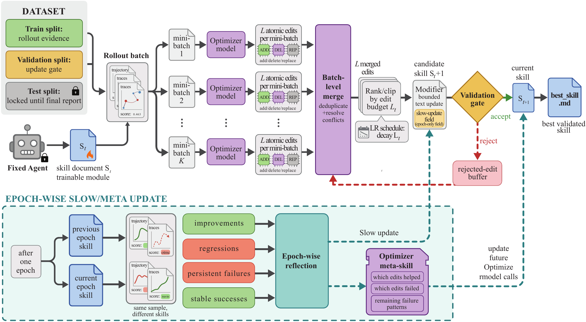
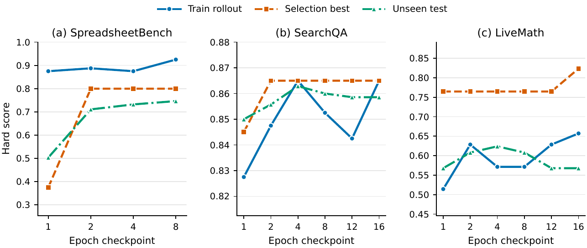

# SkillOpt: Executive Strategy for Self-Evolving Agent Skills

## Overview

SkillOpt (Yang et al., Microsoft, 2026) is a **text-space optimizer** that trains reusable natural-language skill documents for frozen LLM agents — without updating model weights. Instead of fine-tuning, SkillOpt treats a compact Markdown file (`skill.md`) as the sole trainable parameter and learns it through scored trajectory rollouts, reflection-driven edits, and held-out validation gates. The final artifact is a `best_skill.md` file (typically 300–2,000 tokens) that is prepended to any frozen target model at inference time with zero additional model calls.

The approach was introduced in arXiv:2605.23904 and demonstrated best-or-tied-best results across all 52 evaluated (model, benchmark, harness) cells.

*Figure 1: The optimization landscape for skill documents. Bounded edits with a held-out selection gate produce stable convergence (blue path), whereas ad hoc updates make large, unstable jumps (red path). The right panel maps neural-network training concepts to their text-space equivalents. Source: [microsoft/SkillOpt](https://github.com/microsoft/SkillOpt) (MIT license)*

## Key Concepts

### Skill Document as Trainable State

SkillOpt treats the skill document as an **external parameter** of a frozen agent. The document contains:
- Task-level instructions and tool-use guidelines
- Few-shot examples derived from successful trajectories
- Domain-specific heuristics refined through optimization

This separates agent behavior improvement from model weight updates, enabling skill reuse across different model scales, providers, and execution harnesses.

### Text-Space Optimization Loop

The training loop mirrors gradient-based optimization but operates entirely in natural language:

| Weight-Space Concept | SkillOpt Text-Space Equivalent |
|---|---|
| Parameter | Skill document |
| Gradient direction | Trajectory-derived edit direction |
| Learning rate | Edit budget (bounds edit scope per round) |
| Validation check | Held-out selection gate |
| Stable training setting | Batch / minibatch / schedule / gate |
| Momentum / slow update | Rejected-edit buffer; epoch-wise meta update |

### Training Hyperparameters (Text-Space)

- **Epochs**: multiple passes over the training split
- **Batch size**: number of trajectories sampled per round
- **Textual learning rate**: controls how large a structural change a single accepted edit can make
- **Rejected-edit buffer**: prevents oscillation by tracking previously discarded edits

### Deployable Artifact

At the end of training, only `best_skill.md` persists. It:
- Adds zero inference-time model calls
- Transfers across model scales (tested 7 target models)
- Transfers across harnesses (direct chat, Codex CLI, Claude Code CLI)
- Transfers to nearby benchmarks without further optimization

## Architecture

*Figure 2: The full SkillOpt training pipeline. Top: mini-batches of rollout evidence are sent to parallel optimizer model instances, which propose atomic edits; these are merged, ranked under the textual learning-rate budget, and passed through the validation gate. Bottom: after each epoch, improvements, regressions, persistent failures, and stable successes are reflected on by an optimizer meta-skill that updates future optimizer calls. Source: [microsoft/SkillOpt](https://github.com/microsoft/SkillOpt) (MIT license)*

**Training phase step-by-step:**

1. The frozen target agent runs on a scored task batch (train split rollouts).
2. A separate frontier optimizer model receives each mini-batch and proposes structured `add / delete / replace` edits.
3. Edits are aggregated, ranked under the textual learning-rate budget, and applied as a bounded candidate skill.
4. The candidate is evaluated on the held-out selection split — accepted only if the score strictly improves; otherwise added to the rejected-edit buffer.
5. After each epoch, an epoch-wise reflection step analyzes patterns in improvements, regressions, and persistent failures, producing a meta-skill update that shapes future optimizer model calls.
6. The best validated skill across all epochs is emitted as `best_skill.md`.

**Deployment phase:** `best_skill.md` is prepended to the unchanged target model. No additional model calls are added.

## Performance Results

Evaluated across 6 benchmarks, 7 target models, and 3 execution harnesses:

| Harness | GPT-5.5 Average Accuracy Gain |
|---|---|
| Direct chat | +23.5 points over no-skill baseline |
| Codex agentic loop | +24.8 points |
| Claude Code CLI | +19.1 points |

**Benchmarks**: SearchQA, ALFWorld, DocVQA, SpreadsheetBench, LiveMath, and one additional agentic task.

**Comparison**: 52/52 wins against Trace2Skill, TextGrad, GEPA, EvoSkill, hand-crafted human skills, and one-shot skills.

*Figure 3: Learning curves across epoch checkpoints for three benchmarks. The held-out selection gate (orange, "Selection best") reliably tracks generalization performance (green, "Unseen test") while suppressing the noisier train-rollout signal (blue). Source: [microsoft/SkillOpt](https://github.com/microsoft/SkillOpt) (MIT license)*

## Suitable For

- Teams using frozen production LLMs that cannot be fine-tuned (cost, compliance, or model-access constraints)
- Agents that must operate across multiple model providers with a shared behavioral baseline
- Scenarios where inference-time prompt overhead must be minimized
- Cross-harness deployment (same skill file works in direct chat, Codex, Claude Code)

## Limitations

- Requires an optimizer frontier model (separate from the target model) to propose edits during training
- Training cost is proportional to rollout volume and optimizer model calls — not zero-cost offline
- Skill documents may not capture deeply procedural behaviors that require structured state or tool memory
- Transferability to significantly out-of-distribution benchmarks not established

## Relation to Existing Agent Skill Conventions

SkillOpt's `skill.md` artifact is conceptually adjacent to the **SKILLS.md** convention (Anthropic, 2025) where markdown files encode on-demand agent workflows. SkillOpt automates the authoring of such documents through data-driven optimization rather than manual curation. The two are complementary: SKILLS.md defines the interface; SkillOpt can fill the content.

## Best Practices

| Area | Recommendation |
|---|---|
| Optimizer model selection | Use a frontier model (e.g., GPT-4-class) as the optimizer even when the target model is smaller — edit quality drives validation gain |
| Batch size | Larger batches reduce edit noise but increase training cost; start with 8–16 trajectories per round |
| Textual learning rate | Keep edits bounded per round; large structural rewrites early in training tend to overfit to batch artifacts |
| Validation split | Use a held-out split distinct from both training and test; cross-benchmark transfer requires diverse validation coverage |
| Skill length | 300–2,000 tokens is the practical range; longer documents see diminishing returns and higher prepend cost |
| Transferability | Validate on a secondary benchmark before declaring cross-domain transfer; gains are not guaranteed for out-of-distribution tasks |

## See Also

- [Agent Skills / SKILLS.md](../Standards/skills.md)
- [Prompt Engineering Overview](../PromptEngineering/README.md)
- [Context Engineering Strategies](../ContextEngineering/strategies.md)
- [Efficiency Frontier — LLM Context Optimization](../ContextEngineering/efficiency-frontier.md)
- [Agent Memory — Functional Tiers](../AgentMemory/functional-tiers.md)
- [Evaluation Frameworks](../EvaluationFrameworks/Readme.md)
- [Microsoft — Agentic AI Overview](../AllThingsMicrosoft/README.md)

## References

- [SkillOpt: Executive Strategy for Self-Evolving Agent Skills (arXiv:2605.23904)](https://arxiv.org/abs/2605.23904) — primary paper by Yifan Yang et al., Microsoft and collaborating universities, May 2026
- [SkillOpt Project Page](https://microsoft.github.io/SkillOpt/) — official site with benchmark results
- [microsoft/SkillOpt GitHub Repository](https://github.com/microsoft/SkillOpt) — open-source implementation (MIT license); images reproduced under MIT license
