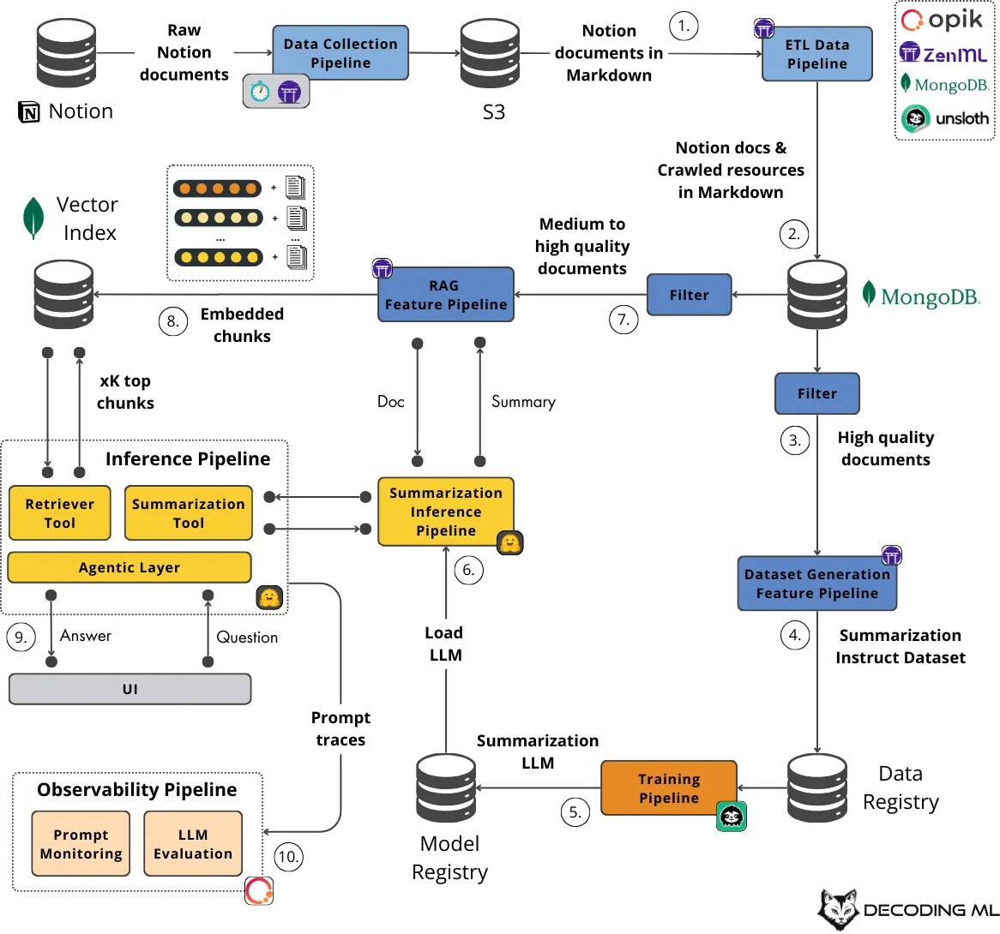

# AI Assistant Reference Architecture

## Overview

AI Assistant architectures provide comprehensive patterns for building intelligent assistant systems that can understand context, maintain conversations, perform complex tasks, and integrate seamlessly with users' workflows. These architectures emphasize user experience, contextual understanding, and reliable task execution.

## Second Brain AI Assistant Architecture

### Architectural Overview

The Second Brain AI Assistant represents a sophisticated approach to building personal AI assistants that can serve as an extension of human cognition, helping users organize, retrieve, and process information effectively.



*Second Brain AI Assistant Agentic Flow Architecture*

The architecture integrates multiple components to create a robust knowledge-augmented AI system capable of handling complex queries, maintaining context, and providing accurate, source-attributed responses. This system is powered by RAG (Retrieval-Augmented Generation), LLMs, and agents working in concert.

### Core Components

#### 1. User Interface Layer
- **Conversational Interface**: Natural language interaction capabilities
- **Multi-Modal Input**: Support for text, voice, and visual inputs
- **Context-Aware Responses**: Understanding user intent and context
- **Personalization Engine**: Adaptive behavior based on user preferences

#### 2. Cognitive Processing Layer
- **Intent Recognition**: Understanding user goals and objectives
- **Task Decomposition**: Breaking complex requests into manageable steps
- **Decision Making**: Intelligent routing and action selection
- **Learning Integration**: Continuous improvement from interactions

#### 3. Knowledge Management Layer
- **Information Retrieval**: Efficient access to relevant information
- **Knowledge Organization**: Structured storage and categorization
- **Context Preservation**: Maintaining conversation and task history
- **Memory Systems**: Short-term, episodic, and long-term memory integration

#### 4. Action Execution Layer
- **Tool Integration**: Seamless connection to external systems
- **Workflow Automation**: Automated task execution and orchestration
- **Quality Assurance**: Result validation and error handling
- **Feedback Loops**: Continuous improvement mechanisms

### Implementation Patterns

#### Conversational Flow Management

```yaml
Conversation Management:
  1. Input Processing:
     - Natural language understanding
     - Intent classification and extraction
     - Context integration from history
     - Ambiguity resolution
  
  2. Response Generation:
     - Contextual response formulation
     - Personality and tone consistency
     - Multi-turn conversation handling
     - Clarification and confirmation requests
  
  3. Action Coordination:
     - Task planning and decomposition
     - Resource allocation and scheduling
     - Progress monitoring and updates
     - Result presentation and explanation
```

#### Memory Architecture

```yaml
Memory Systems:
  Working Memory:
    - Current conversation context
    - Active task information
    - Temporary data and calculations
    - Real-time user preferences
  
  Episodic Memory:
    - Conversation history and outcomes
    - Task execution records
    - User interaction patterns
    - Success and failure cases
  
  Semantic Memory:
    - User profile and preferences
    - Domain knowledge and facts
    - Learned patterns and rules
    - Relationship mappings
```

### Technical Implementation

#### Architecture Components

**1. Natural Language Processing**
- **Language Understanding**: Intent recognition and entity extraction
- **Context Management**: Conversation state and history tracking
- **Response Generation**: Contextual and personalized responses
- **Multi-Language Support**: Internationalization capabilities

**2. Knowledge Integration**
- **Information Retrieval**: Efficient search and retrieval systems
- **Knowledge Graphs**: Structured relationship mapping
- **External APIs**: Integration with third-party services
- **Real-Time Data**: Live information access and updates

**3. Task Execution Engine**
- **Workflow Orchestration**: Complex task coordination
- **Tool Management**: External tool integration and control
- **Error Handling**: Robust error recovery and reporting
- **Performance Monitoring**: Execution tracking and optimization

**4. Learning and Adaptation**
- **User Modeling**: Behavioral pattern recognition
- **Preference Learning**: Adaptive personalization
- **Performance Optimization**: Continuous improvement
- **Feedback Integration**: User feedback processing

### Use Cases and Applications

#### Personal Productivity
- **Task Management**: Intelligent task planning and execution
- **Calendar Integration**: Smart scheduling and time management
- **Email Management**: Automated email processing and responses
- **Document Organization**: Intelligent filing and retrieval systems

#### Knowledge Work
- **Research Assistance**: Information gathering and analysis
- **Content Creation**: Writing and editing support
- **Data Analysis**: Automated insights and reporting
- **Decision Support**: Evidence-based recommendation systems

#### Learning and Development
- **Personalized Learning**: Adaptive educational content
- **Skill Assessment**: Progress tracking and gap analysis
- **Resource Recommendation**: Curated learning materials
- **Practice and Feedback**: Interactive learning experiences

#### Communication and Collaboration
- **Meeting Assistance**: Automated note-taking and follow-ups
- **Team Coordination**: Project management and status updates
- **Information Sharing**: Knowledge distribution and access
- **Relationship Management**: Contact and interaction tracking

### Implementation Guidelines

#### System Setup

**1. Core Infrastructure**
```python
from ai_assistant import AssistantFramework, MemoryManager, ToolRegistry

# Initialize core components
memory_manager = MemoryManager(
    working_memory_size=1000,
    episodic_retention_days=90,
    semantic_update_frequency="daily"
)

tool_registry = ToolRegistry()
tool_registry.register_tools([
    "calendar_integration",
    "email_client",
    "document_processor",
    "web_search"
])

# Create assistant framework
assistant = AssistantFramework(
    memory_manager=memory_manager,
    tool_registry=tool_registry,
    personality_config="helpful_professional"
)
```

**2. Conversation Management**
```python
# Handle user interactions
async def process_user_input(user_input, session_id):
    # Retrieve conversation context
    context = await memory_manager.get_context(session_id)
    
    # Process input and generate response
    response = await assistant.process_input(
        input_text=user_input,
        context=context,
        user_preferences=await get_user_preferences(session_id)
    )
    
    # Update memory with interaction
    await memory_manager.store_interaction(
        session_id=session_id,
        input=user_input,
        response=response,
        timestamp=datetime.now()
    )
    
    return response
```

**3. Task Execution**
```python
# Execute complex tasks
async def execute_task(task_description, user_id):
    # Decompose task into steps
    steps = await assistant.decompose_task(task_description)
    
    # Execute steps with monitoring
    results = []
    for step in steps:
        result = await assistant.execute_step(
            step=step,
            user_context=await get_user_context(user_id),
            available_tools=tool_registry.get_available_tools()
        )
        results.append(result)
    
    # Aggregate and return results
    return await assistant.aggregate_results(results)
```

#### Best Practices

**1. User Experience Design**
- **Natural Interaction**: Design for conversational, intuitive interactions
- **Transparency**: Clearly communicate assistant capabilities and limitations
- **Control**: Provide users with control over assistant behavior and data
- **Privacy**: Implement strong privacy protection and data security

**2. Performance Optimization**
- **Response Time**: Optimize for fast, responsive interactions
- **Accuracy**: Ensure high-quality, reliable responses and actions
- **Scalability**: Design for growing user base and increasing complexity
- **Efficiency**: Minimize resource usage and computational overhead

**3. Continuous Improvement**
- **Feedback Collection**: Gather and analyze user feedback systematically
- **Performance Monitoring**: Track key metrics and performance indicators
- **Model Updates**: Regularly update and improve underlying models
- **Feature Evolution**: Continuously add new capabilities and improvements

### Security and Privacy Considerations

#### Data Protection
- **Encryption**: End-to-end encryption for all user data
- **Access Control**: Role-based permissions and authentication
- **Data Minimization**: Collect and store only necessary information
- **Retention Policies**: Clear data retention and deletion policies

#### Privacy by Design
- **User Consent**: Explicit consent for data collection and usage
- **Transparency**: Clear communication about data handling practices
- **User Control**: Tools for users to manage their data and preferences
- **Compliance**: Adherence to relevant privacy regulations and standards

### Integration Patterns

#### External System Integration
- **API Management**: Standardized interfaces for external services
- **Authentication**: Secure authentication and authorization mechanisms
- **Data Synchronization**: Real-time data sync with external systems
- **Error Handling**: Robust error handling for external dependencies

#### Multi-Platform Support
- **Cross-Platform Compatibility**: Support for multiple devices and platforms
- **Synchronization**: Seamless experience across different interfaces
- **Offline Capabilities**: Functionality when network connectivity is limited
- **Progressive Enhancement**: Graceful degradation of features

## Related Architectures

- [RAG Reference Architecture](rag-architecture.md): For knowledge-intensive applications
- [AI Automation](ai-automation.md): For workflow automation integration
- [Context Engineering](../ContextEngineering/README.md): For advanced context management