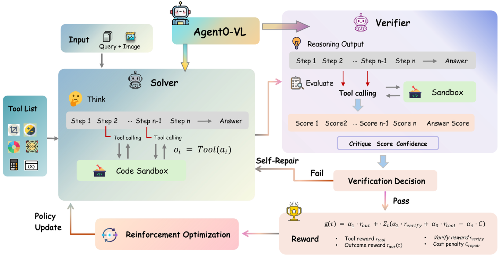

# Self-Learning Agents Reference Architecture

## Overview

Self-learning agents represent the next evolution in AI systems - agents that can autonomously improve their capabilities, learn from experience, and evolve without requiring human-annotated data. These systems implement sophisticated feedback loops and co-evolutionary frameworks to continuously enhance their performance.

## Agent0 Series: Self-Evolving Agents from Zero Data

### Framework Overview

**Agent0** is a reference framework built by Stanford Research that demonstrates a fully autonomous, iterative co-evolutionary approach to enhancing LLM agent capabilities without relying on any human-annotated data.


*Agent0 Co-evolutionary Framework Architecture*

### Core Architecture

#### Dual-Agent Co-Evolution System

Agent0 implements a sophisticated two-agent system where both agents evolve together:

**1. Curriculum Agent (π_θ)**
- **Purpose**: Generate frontier tasks that are appropriately challenging
- **Technology**: Reinforcement Learning (RL) based optimization
- **Objective**: Create progressively more complex tasks for the Executor Agent
- **Evolution**: Learns to generate tasks at the optimal difficulty level

**2. Executor Agent (π_φ)**
- **Purpose**: Solve increasingly complex tasks proposed by Curriculum Agent
- **Technology**: Task-specific learning and adaptation
- **Objective**: Maximize success rate on generated tasks
- **Evolution**: Improves problem-solving capabilities through practice

#### Co-Evolutionary Feedback Loop

At the core of this framework are two functionally distinct agents initialized from the same base LLM:

1. **Curriculum Agent (π_θ)**: Using RL, aims to generate frontier tasks that are appropriately challenging for the current Executor Agent
2. **Executor Agent (π_φ)**: Aims to solve the increasingly complex tasks proposed by the Curriculum Agent

The agents engage in a continuous co-evolutionary process where the Curriculum Agent learns to create tasks at the optimal difficulty level while the Executor Agent develops enhanced problem-solving capabilities.

### Agent0-VL: Multimodal Extension

#### Enhanced Capabilities

Agent0-VL extends the self-evolution paradigm to multimodal reasoning tasks by incorporating tool usage into multiple aspects of the learning process:



*Agent0-VL Multimodal Self-Evolution Architecture*

#### Key Innovations

**1. Tool-Integrated Reasoning**
- Tools are used not just for task execution but also for reasoning
- Multimodal tool integration for vision and language tasks
- Dynamic tool selection based on task requirements

**2. Self-Evaluation with Tools**
- Agents use tools to evaluate their own performance
- Automated quality assessment without human intervention
- Continuous feedback loop for improvement

**3. Self-Repair Mechanisms**
- Automatic error detection and correction
- Tool-assisted debugging and problem resolution
- Iterative refinement of solutions

Agent0-VL incorporates tool usage not only into reasoning but also into self-evaluation and self-repair, creating a comprehensive self-improving system for multimodal tasks.

### Implementation Patterns

#### Curriculum Generation Strategy

```yaml
Task Generation Process:
  1. Difficulty Assessment:
     - Analyze current executor capabilities
     - Identify skill gaps and improvement areas
     - Generate tasks at optimal challenge level
  
  2. Task Diversification:
     - Create varied task types and domains
     - Ensure comprehensive skill development
     - Maintain engagement and learning momentum
  
  3. Progressive Complexity:
     - Gradually increase task difficulty
     - Build upon previously mastered skills
     - Introduce new concepts systematically
```

#### Executor Learning Process

```yaml
Learning Cycle:
  1. Task Reception:
     - Receive task from curriculum agent
     - Analyze requirements and constraints
     - Plan solution approach
  
  2. Solution Execution:
     - Apply current capabilities and tools
     - Implement solution strategies
     - Monitor progress and adapt as needed
  
  3. Performance Evaluation:
     - Assess solution quality and effectiveness
     - Identify areas for improvement
     - Update internal knowledge and strategies
  
  4. Capability Enhancement:
     - Integrate lessons learned
     - Refine problem-solving approaches
     - Prepare for more complex challenges
```

### Technical Specifications

#### Framework Components

**1. Task Generation Engine**
- Dynamic difficulty adjustment algorithms
- Multi-domain task creation capabilities
- Performance-based curriculum adaptation
- Diversity maintenance mechanisms

**2. Execution Environment**
- Sandboxed task execution space
- Tool integration and management
- Performance monitoring and logging
- Safety and security controls

**3. Evaluation System**
- Automated performance assessment
- Multi-criteria evaluation metrics
- Progress tracking and analytics
- Feedback generation for both agents

**4. Learning Infrastructure**
- Model parameter optimization
- Experience replay and storage
- Knowledge transfer mechanisms
- Continuous improvement pipelines

### Use Cases and Applications

#### Research and Development
- **Automated Research**: Self-improving research agents
- **Scientific Discovery**: Autonomous hypothesis generation and testing
- **Literature Analysis**: Evolving understanding of research domains
- **Experimental Design**: Self-optimizing experimental protocols

#### Software Development
- **Code Generation**: Self-improving coding capabilities
- **Bug Detection**: Evolving debugging and testing skills
- **Architecture Design**: Autonomous system design improvement
- **Performance Optimization**: Self-tuning optimization strategies

#### Problem Solving
- **Complex Reasoning**: Multi-step logical problem solving
- **Creative Tasks**: Evolving creative and innovative capabilities
- **Strategic Planning**: Long-term planning and strategy development
- **Adaptive Decision Making**: Context-aware decision optimization

### Implementation Guidelines

#### Setup and Configuration

**1. Environment Preparation**
```bash
# Install required dependencies
pip install agent0-framework torch transformers

# Configure base models
export CURRICULUM_MODEL="gpt-4"
export EXECUTOR_MODEL="gpt-4"
export EVALUATION_MODEL="gpt-4"
```

**2. Framework Initialization**
```python
from agent0 import CurriculumAgent, ExecutorAgent, CoEvolutionFramework

# Initialize agents
curriculum_agent = CurriculumAgent(model="gpt-4")
executor_agent = ExecutorAgent(model="gpt-4")

# Create co-evolution framework
framework = CoEvolutionFramework(
    curriculum_agent=curriculum_agent,
    executor_agent=executor_agent,
    evolution_cycles=1000
)
```

**3. Training Process**
```python
# Start co-evolution process
results = framework.evolve(
    initial_tasks=seed_tasks,
    evaluation_metrics=["accuracy", "efficiency", "creativity"],
    convergence_criteria={"min_improvement": 0.01}
)
```

#### Best Practices

**1. Curriculum Design**
- Start with simple, well-defined tasks
- Ensure gradual difficulty progression
- Maintain task diversity across domains
- Include both success and failure cases

**2. Evaluation Metrics**
- Define clear, measurable success criteria
- Include both quantitative and qualitative measures
- Monitor learning progress and convergence
- Implement safety and ethical constraints

**3. Safety Considerations**
- Implement robust sandboxing for task execution
- Monitor for harmful or unintended behaviors
- Include human oversight and intervention capabilities
- Maintain audit trails for all learning activities

### Research Foundation

#### Academic Papers
- **Original Paper**: [Agent0: Self-Evolving Agents from Zero Data](https://arxiv.org/abs/2511.16043)
- **Stanford Research**: [AIMING Lab Agent0 Project](https://aiming-lab.github.io/Agent0/)
- **Multimodal Extension**: Agent0-VL research and implementation

#### Key Contributions
- Demonstration of zero-data self-evolution
- Co-evolutionary framework for agent improvement
- Multimodal reasoning with tool integration
- Automated curriculum generation and adaptation

### Future Directions

#### Emerging Capabilities
- **Multi-Agent Co-Evolution**: Extending to multiple interacting agents
- **Domain Transfer**: Learning across different problem domains
- **Meta-Learning**: Learning how to learn more effectively
- **Emergent Behaviors**: Discovering novel problem-solving approaches

#### Research Opportunities
- **Scalability**: Handling larger and more complex problem spaces
- **Efficiency**: Reducing computational requirements for evolution
- **Interpretability**: Understanding the learning and evolution process
- **Safety**: Ensuring beneficial and aligned self-improvement

## Related Architectures

- [AI Automation](ai-automation.md): For structured workflow automation
- [AI Assistant Architecture](ai-assistant-architecture.md): For interactive assistant systems
- [Multi-Agent Systems](../Architecture/multi-agent-system.md): Advanced coordination patterns