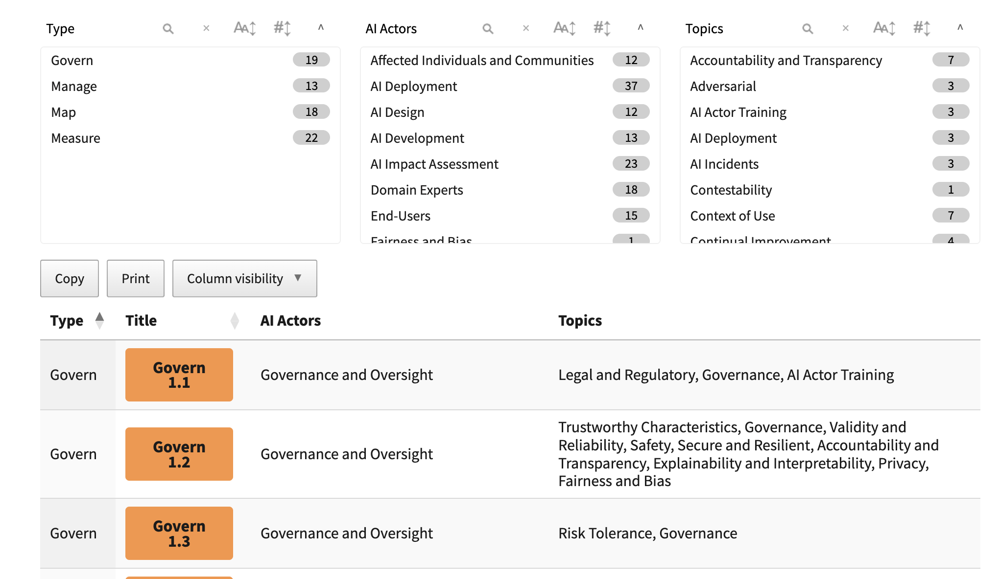
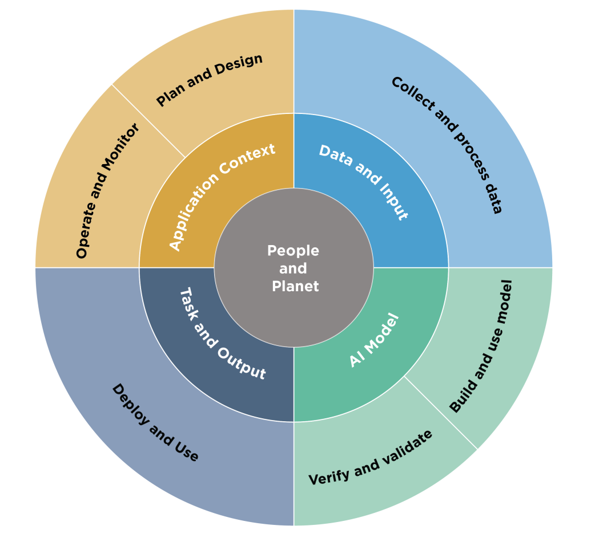
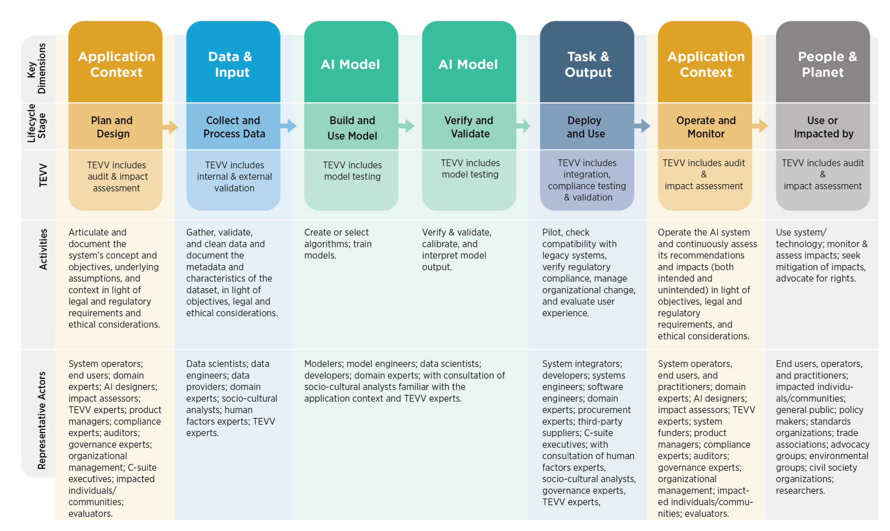
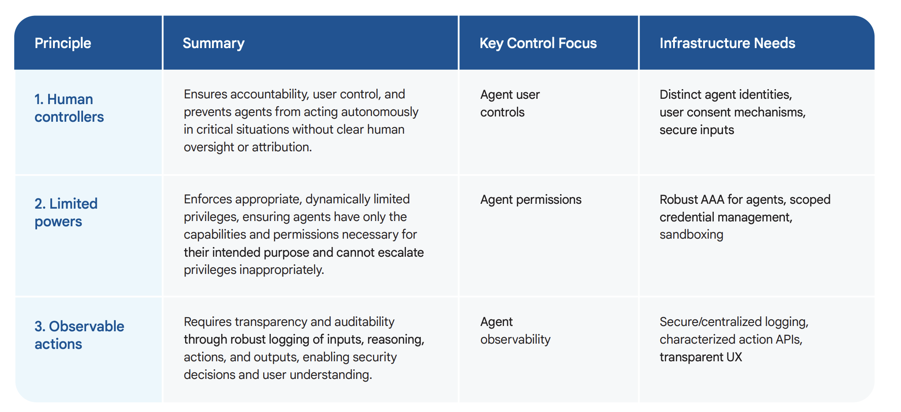
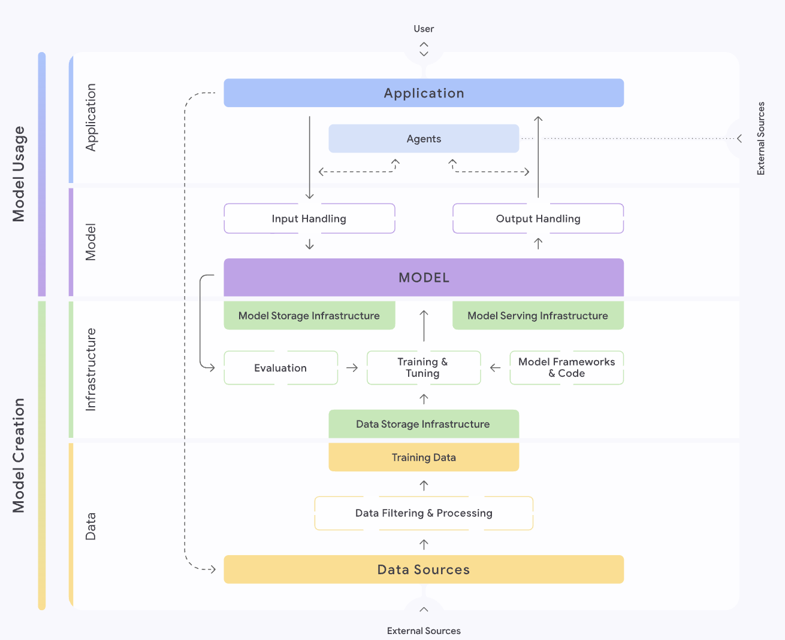
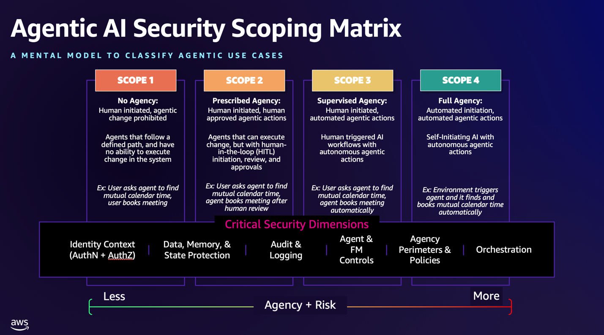

# Agentic AI Security

This section provides comprehensive coverage of security frameworks, standards, and best practices for building secure agentic AI systems. From industry standards like NIST AI RMF to vendor-specific security approaches from Google and AWS, this collection offers the essential security guidance needed to deploy AI agents safely in production environments.

## Overview

Securing agentic AI systems requires specialized approaches that address unique risks such as rogue actions, sensitive data disclosure, and autonomous decision-making. This section covers:

- **Security Standards**: Industry-standard frameworks and guidelines
- **Vendor Perspectives**: Security approaches from major cloud providers
- **Risk Management**: Frameworks for identifying and mitigating AI-specific risks
- **Implementation Guidance**: Practical approaches to securing AI agents

## Security Standards

### NIST AI RMF (Risk Management Framework)

The **[NIST AI Risk Management Framework (AI RMF)](https://doi.org/10.6028/NIST.AI.100-1)** provides a comprehensive approach to managing risks associated with artificial intelligence systems.

**Key Resources:**
- **Framework Document**: [NIST AI RMF 1.0](https://doi.org/10.6028/NIST.AI.100-1)
- **Implementation Guide**: [NIST Playbook](https://airc.nist.gov/airmf-resources/playbook/)

The NIST AI RMF provides a structured approach to AI risk management through four core functions:

**Framework Components:**

**Key Features:**
- **Risk-based approach** to AI system governance
- **Lifecycle integration** from design to deployment
- **Stakeholder engagement** across organizational levels
- **Continuous monitoring** and improvement processes
- **Flexible implementation** adaptable to various organizational contexts

**Implementation Benefits:**
- Systematic identification of AI-related risks
- Structured approach to risk mitigation
- Compliance with regulatory requirements
- Enhanced stakeholder confidence
- Improved AI system reliability and safety

## Google Perspective

### Agentic Security Operations Center (SOC)

Google's **[Agentic SOC](https://cloud.google.com/solutions/security/agentic-soc?hl=en)** represents a modernized security operations model that moves beyond traditional automation to a system powered by autonomous AI agents. These agents can reason, make decisions, and execute complex security tasks independently while keeping human analysts in control.

### Google's Secure AI Framework (SAIF)

**[Google's Secure AI Framework (SAIF)](https://safety.google/safety/saif/)** provides comprehensive security guidance for AI systems.

**Additional Resources:**
- **[Google's Approach for Secure AI Agents](https://research.google/pubs/an-introduction-to-googles-approach-for-secure-ai-agents/)**

### AI Agent Security Risks and Principles

**Key Risks Identified:**
- **Risk 1: Rogue actions** - Agents taking unauthorized or harmful actions
- **Risk 2: Sensitive data disclosure** - Unintended exposure of confidential information

**Security Principles:**
- **Principle 1**: Agents must have well-defined human controllers
- **Principle 2**: Agent powers must have limitations
- **Principle 3**: Agent actions and planning must be observable

### Three Layers of Defense

Google's security approach implements three complementary layers:

#### 1. Policy Definition and System Instructions (The Agent's Constitution)
The process begins by defining policies for desired and undesired agent behavior. These are engineered into System Instructions (SIs) that act as the agent's core constitution.

#### 2. Guardrails, Safeguards, and Filtering (The Enforcement Layer)
This layer acts as the hard-stop enforcement mechanism:

- **Input Filtering**: Use classifiers and services like the Perspective API to analyze prompts and block malicious inputs before they reach the agent
- **Output Filtering**: Vertex AI's built-in safety filters provide a final check for harmful content, PII, or policy violations
- **Human-in-the-Loop (HITL) Escalation**: For high-risk or ambiguous actions, the system must pause and escalate to human oversight

#### 3. Monitoring and Response
Continuous monitoring of agent behavior with automated response capabilities for detected anomalies.

### SAIF Framework Implementation

**Google's Secure AI Framework**: [https://saif.google/](https://saif.google/)

**Interactive Implementation Map**: [https://saif.google/secure-ai-framework/saif-map](https://saif.google/secure-ai-framework/saif-map)

**SAIF Framework Components:**
- **Secure Foundation**: Establishing secure infrastructure and development practices
- **Secure Development**: Implementing security throughout the AI development lifecycle
- **Secure Deployment**: Ensuring secure deployment and operational practices
- **Secure Operations**: Maintaining security through ongoing operations and monitoring

## AWS Perspective

### Generative AI Security Scoping Matrix

AWS launched the **[Generative AI Security Scoping Matrix](https://aws.amazon.com/ai/security/generative-ai-scoping-matrix/)** to help organizations understand and address the unique security challenges of foundation model (FM)-based applications.

The **AI Security Scoping Matrix** is a comprehensive framework designed to help organizations assess and implement security controls throughout the AI lifecycle. It breaks down security considerations into specific categories, enabling a focused approach to securing AI applications.

**Key Features:**
- **Lifecycle Coverage**: Security considerations from development to deployment
- **Risk Categorization**: Structured approach to identifying and addressing risks
- **Control Mapping**: Specific security controls for different AI application types
- **Compliance Alignment**: Framework alignment with regulatory requirements

**Implementation Areas:**
- **Data Security**: Protection of training data and model inputs/outputs
- **Model Security**: Securing the AI models themselves
- **Infrastructure Security**: Securing the underlying compute and storage infrastructure
- **Application Security**: Securing the applications that use AI models
- **Operational Security**: Ongoing security monitoring and incident response

## Implementation Best Practices

### For Development Teams
1. **Implement Defense in Depth**: Use multiple security layers as demonstrated in Google's approach
2. **Follow NIST AI RMF**: Adopt structured risk management practices
3. **Use Vendor Frameworks**: Leverage cloud provider security tools and frameworks
4. **Continuous Monitoring**: Implement ongoing security monitoring and alerting

### For Enterprise Organizations
1. **Adopt Comprehensive Frameworks**: Implement NIST AI RMF or similar comprehensive frameworks
2. **Vendor-Specific Security**: Utilize cloud provider security services (Google SAIF, AWS Security Matrix)
3. **Human Oversight**: Maintain human-in-the-loop controls for critical decisions
4. **Regular Assessments**: Conduct regular security assessments and penetration testing

### For Compliance and Governance
1. **Risk Documentation**: Maintain comprehensive risk registers and mitigation plans
2. **Policy Development**: Develop clear AI governance policies and procedures
3. **Stakeholder Engagement**: Ensure cross-functional involvement in AI security
4. **Regulatory Alignment**: Align security practices with relevant regulatory requirements

## Security Considerations by Use Case

### High-Risk Applications
- Financial services and trading systems
- Healthcare and medical diagnosis
- Critical infrastructure control
- Autonomous vehicle systems

**Additional Controls:**
- Enhanced human oversight requirements
- Stricter access controls and authentication
- Real-time monitoring and alerting
- Comprehensive audit trails

### Medium-Risk Applications
- Customer service and support
- Content generation and marketing
- Business process automation
- Data analysis and reporting

**Standard Controls:**
- Regular security assessments
- Standard access controls
- Monitoring and logging
- Incident response procedures

### Lower-Risk Applications
- Internal productivity tools
- Research and development
- Non-critical automation
- Educational applications

**Basic Controls:**
- Basic access controls
- Standard monitoring
- Regular updates and patches
- User training and awareness

## Emerging Security Challenges

### AI-Specific Threats
- **Prompt Injection**: Malicious inputs designed to manipulate AI behavior
- **Model Poisoning**: Attacks on training data or model parameters
- **Data Extraction**: Attempts to extract sensitive training data
- **Adversarial Examples**: Inputs designed to cause misclassification

### Mitigation Strategies
- **Input Validation**: Comprehensive validation of all inputs to AI systems
- **Output Filtering**: Filtering and validation of AI-generated outputs
- **Model Monitoring**: Continuous monitoring of model behavior and performance
- **Secure Training**: Secure practices for model training and data handling

This security framework provides the foundation for building trustworthy, secure, and compliant agentic AI systems that can operate safely in production environments while maintaining the flexibility and capabilities that make AI agents valuable.

## See Also

- **[Agent Development Frameworks](../AgenticFrameworks/README.md)**: Security considerations for frameworks
- **[Agent Platforms](../AgentPlatforms/README.md)**: Platform security features
- **[Standards](../Standards/README.md)**: Security standards and protocols
- **[Best Practices](../BestPractices/README.md)**: Security best practices
