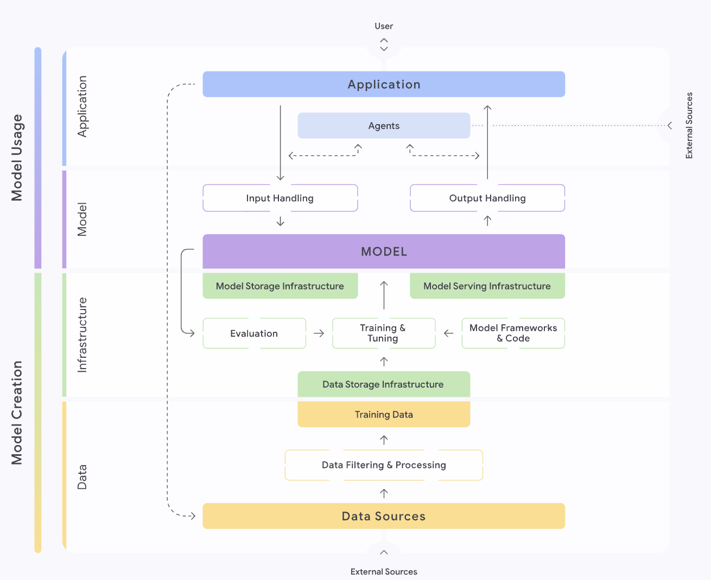
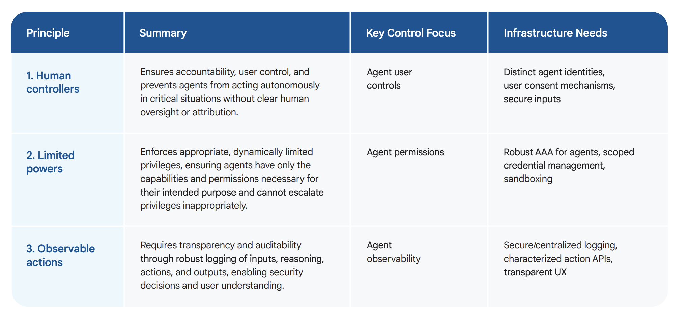
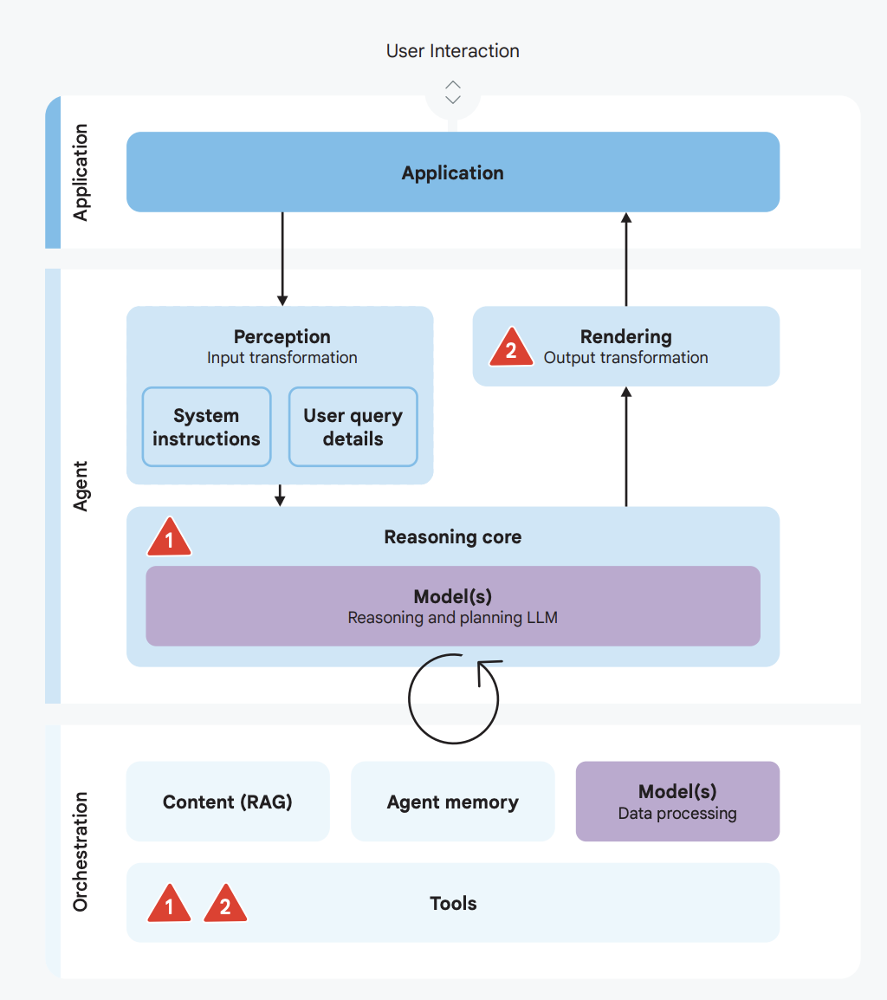

# Google Secure AI Framework (SAIF)

## Overview

Google's [Secure AI Framework (SAIF)](https://safety.google/safety/saif/), published in June 2023, provides practical security principles and implementation guidance for building and operating AI systems securely. Unlike governance-level frameworks such as NIST AI RMF, SAIF focuses on the technical and operational controls that engineering and security teams apply directly to AI systems. For agentic AI deployments — where systems act autonomously, use external tools, and chain multiple models — SAIF's defense-in-depth approach is a central reference.

## Six Core Principles

| Principle | Description | Agentic AI Relevance |
|---|---|---|
| **1. Expand strong security foundations** | Apply existing security best practices (zero trust, least privilege, supply chain integrity) to AI infrastructure | Agents inherit all traditional application security risks in addition to AI-specific ones |
| **2. Extend detection and response** | Expand threat detection and incident response capabilities to cover the AI ecosystem, including models and pipelines | Agent actions and tool calls require dedicated behavioral monitoring beyond standard application logs |
| **3. Automate defenses** | Use AI itself to scale defenses — automated threat detection, response, and testing — to match adversary automation | Automated red-teaming and policy enforcement can keep pace with rapid agent capability expansion |
| **4. Harmonize platform-level controls** | Implement security controls at the platform level so they apply uniformly across all AI workloads | Centralized guardrails (input/output filters, HITL triggers) applied at the platform layer cover all agents by default |
| **5. Adapt controls to adjust mitigations** | Treat AI risk as continuously evolving; feedback loops from production improve security posture dynamically | Agent behavior drifts over time (model updates, new tools); controls must be re-evaluated on each change |
| **6. Contextualize AI risks** | Understand AI system risks in the context of the surrounding business processes and their real-world impact | Agentic risks (rogue actions, data disclosure) must be evaluated against the specific workflows the agent operates in |

## Three-Layer Defense Model

Google's approach to agentic AI security specifically implements three defense layers applied in sequence:

### Layer 1: Policy Definition and System Instructions (The Agent's Constitution)

The process begins with defining explicit policies for desired and undesired agent behavior. These are encoded into System Instructions (SIs) that act as the agent's core operating contract — the first and highest-priority control layer.

- Define permitted tool categories and specific tool restrictions
- Specify escalation triggers (actions requiring HITL confirmation)
- Encode data handling policies (PII, secrets, confidential content)
- Articulate the agent's scope of authority within the broader system

### Layer 2: Guardrails, Safeguards, and Filtering (The Enforcement Layer)

This layer provides hard-stop enforcement that operates independently of the model's own judgment:

| Control | Description | Implementation |
|---|---|---|
| Input filtering | Classify and block malicious prompts before they reach the model | Perspective API, custom classifiers, semantic similarity checks against known attack patterns |
| Output filtering | Screen all agent responses for PII, toxic content, or policy violations before delivery | Vertex AI safety filters, regex-based PII masking, structured output validation |
| HITL escalation | Pause execution and route to human review for high-risk or ambiguous actions | Define risk thresholds per tool; implement confirmation gates for irreversible actions |

### Layer 3: Continuous Assurance and Testing (The Adaptive Layer)

Safety is not a one-time deployment decision. This layer maintains assurance over time:

- **Evaluation pipelines**: Any change to the model, system prompt, or safety system triggers a full re-run of the evaluation suite before promotion
- **RAI testing**: Neutral Point of View (NPOV) evaluations and parity assessments across demographic groups
- **Proactive red-teaming**: Manual and AI-driven persona-based simulation to discover novel attack vectors before adversaries do

## AI Agent Security Risks and Principles

Google identifies two primary risk categories for agentic systems:

| Risk Category | Description | Example |
|---|---|---|
| **Rogue actions** | Agent takes unauthorized, harmful, or unintended actions in external systems | Agent deletes files, sends emails, or executes financial transactions outside intended scope |
| **Sensitive data disclosure** | Agent inadvertently exposes confidential information through outputs, tool calls, or logs | PII appears in traces; API keys passed in tool payloads get logged |

**Three core security principles for agents:**
1. Agents must have well-defined human controllers with clear escalation paths
2. Agent powers must have explicit limitations — every tool capability should be justified
3. Agent actions and planning must be observable — full audit trail of decisions and tool calls

## Security Incident Response

When a threat is detected in production, Google's response pattern is: **contain → triage → resolve**.

1. **Immediate Containment**: Use a circuit breaker (feature flag) to instantly disable the affected tool or capability — stops the bleeding before investigation
2. **Triage**: Route suspicious requests to a HITL review queue; investigate exploit scope and impact
3. **Permanent Resolution**: Develop a patch (updated input filter or system instruction), validate through CI/CD pipeline, then promote to production

## Agentic SOC

Google's [Agentic Security Operations Center](https://cloud.google.com/solutions/security/agentic-soc) extends SAIF principles into security operations. The Agentic SOC model uses autonomous AI agents for threat detection, investigation, and response — while keeping human analysts in control of high-stakes decisions. This represents both an application of SAIF and a reference architecture for how to deploy agentic AI within a security-critical context.

## SAIF in Practice: Implementation Map

Google provides an interactive [SAIF Implementation Map](https://saif.google/secure-ai-framework/saif-map) that lets teams trace which SAIF controls apply at each stage of their AI lifecycle (data collection, model training, evaluation, deployment, operations). Key mapping points:

- **Development stage**: Supply chain integrity (dependency provenance, model cards), secure training data pipelines
- **Deployment stage**: Input/output filtering, access controls, system instruction validation
- **Operations stage**: Behavioral monitoring, red-team scheduling, feedback loops into evaluation

## Best Practices

| Challenge | Description | Recommendation |
|---|---|---|
| Prompt injection in multi-agent systems | Malicious content processed by one agent is forwarded to downstream agents | Treat all externally-originated content as untrusted at every agent boundary, regardless of how many agents have already processed it; apply guardrails at each hop |
| System instruction drift | SIs evolve informally and lose coherence over time | Version-control system instructions; require review and eval re-run for any SI change |
| Guardrail bypass via indirect injection | Adversarial content arrives through tool outputs (web pages, database records) rather than direct user input | Apply input filtering to all context sources, not just user-facing inputs; treat tool results as untrusted |
| Monitoring gaps in async agent pipelines | Agent actions occur outside the synchronous request-response path | Instrument every tool call and decision step; alert on behavioral anomalies asynchronously |
| Red-team coverage | Manual red-teaming doesn't scale with agent capability growth | Supplement manual red-teaming with automated persona-based simulation; maintain a regression suite of known attack patterns |

## Relationship to Other Frameworks

| Framework | Relationship |
|---|---|
| [NIST AI RMF](./nist-ai-rmf.md) | Governance and risk management structure; SAIF provides the technical controls that satisfy NIST's MEASURE and MANAGE functions |
| [AWS Generative AI Security Scoping Matrix](../AllThingsAWS/README.md) | Complementary vendor perspective; both apply defense-in-depth at the platform layer |
| [Google ADK Security](../AgenticFrameworks/google-adk.md) | SAIF principles are the security foundation for ADK-built agent deployments |

## See Also

- [NIST AI RMF](./nist-ai-rmf.md) — Governance and risk management framework
- [Agent Security (Production Best Practices)](../ProductionBestPractices/security.md) — Security controls, threat model, and response playbook
- [SecurityFrameworks Overview](./Readme.md) — All security frameworks and cross-vendor comparison
- [Observability](../ProductionBestPractices/observability.md) — Monitoring infrastructure that supports SAIF's continuous assurance layer

## References

- [Google Secure AI Framework (SAIF)](https://safety.google/safety/saif/) — Primary framework overview
- [SAIF Interactive Map](https://saif.google/secure-ai-framework/saif-map) — Lifecycle-mapped implementation guidance
- [Google's Approach for Secure AI Agents](https://research.google/pubs/an-introduction-to-googles-approach-for-secure-ai-agents/) — Research publication on agent-specific security principles
- [Google Agentic SOC](https://cloud.google.com/solutions/security/agentic-soc?hl=en) — Agentic security operations center reference architecture
