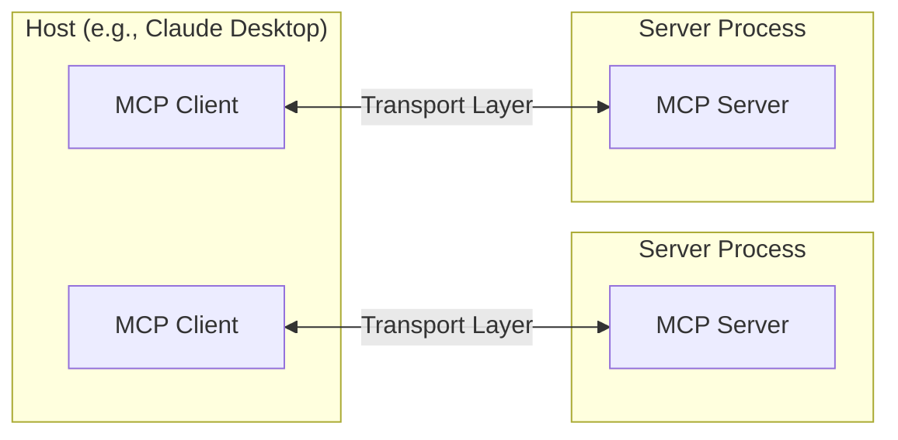

## Model Context Protocol

- [MCP](https://modelcontextprotocol.io/introduction) is an open protocol, built by Anthropic, that standardizes how applications provide context to LLMs.
- MCP helps you build agents and complex workflows on top of LLMs. LLMs frequently need to integrate with data and tools, and MCP provides a standardization with primarily 3 components:
    - Hosts (e.g. LLM Apps)
    - Servers (providing unified interface to LLM Apps)
    - Clients (Hosts uses Client protocol to maintain connections with Servers )
    - Local Data Sources (such as databases, etc. in local env accessed by Servers)
    - Remote Services (such as APIs to be accessed by Servers)

