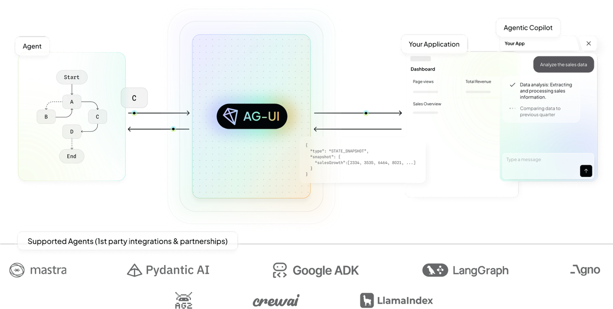

# AG-UI Protocol

## Overview

**AG-UI** is an open, lightweight, event-based protocol that standardizes how AI agents connect to user-facing applications. Built for simplicity and flexibility, it enables seamless integration between AI agents, real-time user context, and user interfaces.



*Source: [AG-UI Documentation](https://docs.ag-ui.com/introduction)*

## Development and Collaboration

### Original Development
- **Originally Built by**: Rocket Science team
- **Collaborative Contributors**: Pydantic AI and CopilotKit teams
- **Repository**: [ag-ui-protocol/ag-ui](https://github.com/ag-ui-protocol/ag-ui)
- **License**: Open source protocol

### Design Philosophy
AG-UI was designed with a focus on simplicity and developer experience, making it easy for developers to integrate AI agents with user interfaces without complex setup or configuration.

## Technical Architecture

### Core Principles

**Event-Based Communication**:
- **Lightweight Protocol**: Minimal overhead for real-time communication
- **Event-Driven**: Based on event-driven architecture patterns
- **Real-Time**: Support for real-time user context and interactions
- **Bidirectional**: Two-way communication between agents and UIs

**Simplicity and Flexibility**:
- **Easy Integration**: Simple integration process for developers
- **Flexible Architecture**: Adaptable to different UI frameworks and agent systems
- **Minimal Configuration**: Minimal setup and configuration requirements
- **Developer-Friendly**: Designed with developer experience in mind

### Protocol Components

**Agent Interface**:
- **Agent Registration**: Agents register their capabilities and interfaces
- **Event Handling**: Agents handle events from user interfaces
- **Context Management**: Agents maintain and update user context
- **Response Generation**: Agents generate responses to user interactions

**UI Interface**:
- **Event Emission**: UIs emit events for agent processing
- **Context Provision**: UIs provide real-time user context to agents
- **Response Handling**: UIs handle and display agent responses
- **State Synchronization**: UIs synchronize state with agent systems

**Communication Layer**:
- **Message Routing**: Intelligent routing of messages between agents and UIs
- **Event Serialization**: Standardized serialization of events and data
- **Error Handling**: Robust error handling and recovery mechanisms
- **Performance Optimization**: Optimized for low-latency communication

## Key Features

### Real-Time User Context
- **Context Streaming**: Real-time streaming of user context to agents
- **Context Updates**: Dynamic updates of user context as interactions occur
- **Context Filtering**: Intelligent filtering of relevant context information
- **Context Persistence**: Persistence of context across sessions and interactions

### Seamless Integration
- **Framework Agnostic**: Works with any UI framework or agent system
- **Plugin Architecture**: Plugin-based architecture for easy extension
- **API Compatibility**: Compatible with existing agent and UI APIs
- **Migration Support**: Easy migration from existing integration approaches

### Developer Experience
- **Simple Setup**: Quick and easy setup process for new integrations
- **Clear Documentation**: Comprehensive documentation and examples
- **Debugging Tools**: Built-in debugging and monitoring tools
- **Community Support**: Active community support and contributions

## Use Cases and Applications

### Conversational Interfaces
- **Chatbots**: Integration of AI agents with chat interfaces
- **Voice Assistants**: Voice-based agent interactions with UI feedback
- **Virtual Assistants**: Comprehensive virtual assistant implementations
- **Customer Support**: AI-powered customer support with rich UI interactions

### Interactive Applications
- **Collaborative Tools**: AI agents integrated with collaborative work tools
- **Creative Applications**: AI-assisted creative tools with real-time feedback
- **Educational Platforms**: Interactive educational platforms with AI tutoring
- **Gaming**: AI agents integrated with gaming interfaces and experiences

### Enterprise Applications
- **Business Intelligence**: AI agents integrated with BI dashboards and tools
- **Workflow Automation**: AI-powered workflow automation with user interfaces
- **Decision Support**: AI decision support systems with interactive interfaces
- **Data Analysis**: AI-powered data analysis tools with visualization interfaces

### Development Tools
- **Code Editors**: AI coding assistants integrated with code editors
- **Design Tools**: AI design assistants integrated with design applications
- **Testing Tools**: AI testing assistants integrated with testing interfaces
- **Documentation**: AI documentation assistants integrated with documentation tools

## Implementation Guide

### Getting Started

**Basic Setup**:
1. **Install AG-UI Library**: Install the AG-UI library for your platform
2. **Configure Agent**: Configure your AI agent to use AG-UI protocol
3. **Set Up UI Integration**: Integrate AG-UI with your user interface
4. **Test Communication**: Test communication between agent and UI
5. **Deploy and Monitor**: Deploy the integration and monitor performance

**Example Integration**:
```javascript
// Agent-side integration
import { AGUIAgent } from 'ag-ui-protocol';

const agent = new AGUIAgent({
  name: 'MyAgent',
  capabilities: ['chat', 'analysis', 'recommendations']
});

agent.on('user-message', async (event) => {
  const response = await processUserMessage(event.message);
  agent.emit('agent-response', { response });
});

// UI-side integration
import { AGUIClient } from 'ag-ui-protocol';

const client = new AGUIClient({
  agentEndpoint: 'ws://localhost:8080/agent'
});

client.on('agent-response', (event) => {
  displayResponse(event.response);
});

client.emit('user-message', { message: userInput });
```

### Best Practices

**Performance Optimization**:
- **Event Batching**: Batch events when appropriate to reduce overhead
- **Context Filtering**: Filter context to include only relevant information
- **Caching**: Implement appropriate caching strategies for better performance
- **Connection Management**: Manage connections efficiently for scalability

**Security Considerations**:
- **Input Validation**: Validate all inputs from both agents and UIs
- **Authentication**: Implement proper authentication mechanisms
- **Authorization**: Use fine-grained authorization controls
- **Data Protection**: Protect sensitive data in transit and at rest

**Error Handling**:
- **Graceful Degradation**: Handle errors gracefully without breaking user experience
- **Retry Logic**: Implement retry logic for transient failures
- **Error Reporting**: Provide clear error reporting and debugging information
- **Fallback Mechanisms**: Implement fallback mechanisms for critical failures

## Integration with Other Protocols

### AG-UI and MCP
- **Complementary Roles**: AG-UI handles UI integration, MCP handles context provision
- **Combined Benefits**: Rich user interfaces with comprehensive context access
- **Integration Patterns**: Use both protocols together for complete agent solutions
- **Best Practices**: Recommended patterns for using AG-UI with MCP

### AG-UI and A2A
- **Multi-Agent UIs**: Use AG-UI for UI integration in multi-agent systems
- **Coordination**: Coordinate multiple agents through single UI interface
- **User Experience**: Provide unified user experience for multi-agent workflows
- **Scalability**: Scale UI interactions across multiple coordinated agents

## Community and Ecosystem

### Development Community
- **Open Source**: Fully open source with community contributions
- **GitHub Repository**: Active development on GitHub with issue tracking
- **Community Forums**: Dedicated forums for community discussions
- **Regular Updates**: Regular updates and feature releases

### Ecosystem Partners
- **Pydantic AI**: Native integration with Pydantic AI framework
- **CopilotKit**: Integration with CopilotKit development tools
- **Rocket Science**: Original development and ongoing support
- **Community Contributions**: Growing ecosystem of community contributions

### Tools and Resources
- **Documentation**: Comprehensive documentation and tutorials
- **Examples**: Example implementations and use cases
- **Templates**: Templates for common integration patterns
- **Debugging Tools**: Tools for debugging and monitoring AG-UI integrations

## Future Development

### Roadmap
- **Enhanced Features**: Additional features for richer agent-UI interactions
- **Performance Improvements**: Continued performance optimization and scaling
- **Ecosystem Growth**: Expansion of ecosystem partners and integrations
- **Standardization**: Potential standardization through industry bodies

### Research Areas
- **Advanced Context**: Research on advanced context management techniques
- **Multi-Modal**: Support for multi-modal interactions (voice, vision, text)
- **Personalization**: Personalized agent-UI interactions based on user preferences
- **Accessibility**: Enhanced accessibility features for inclusive design

## Resources and Documentation

### Official Resources
- **Documentation**: [AG-UI Documentation](https://docs.ag-ui.com/introduction)
- **GitHub Repository**: [ag-ui-protocol/ag-ui](https://github.com/ag-ui-protocol/ag-ui)
- **Examples**: Official examples and tutorials
- **Community**: Community forums and support channels

### Learning Materials
- **Getting Started Guide**: Step-by-step guide for new developers
- **Best Practices**: Comprehensive best practices documentation
- **Case Studies**: Real-world case studies and implementations
- **Video Tutorials**: Video tutorials and demonstrations

## Related Sections

- **Section 6.1**: Agentic AI Foundation (standardization ecosystem)
- **Section 6.2**: Model Context Protocol (complementary protocol)
- **Section 4**: Agent Development Frameworks (integration with development tools)
- **Section 5.2**: Agentic AI Platforms (platform integration considerations)