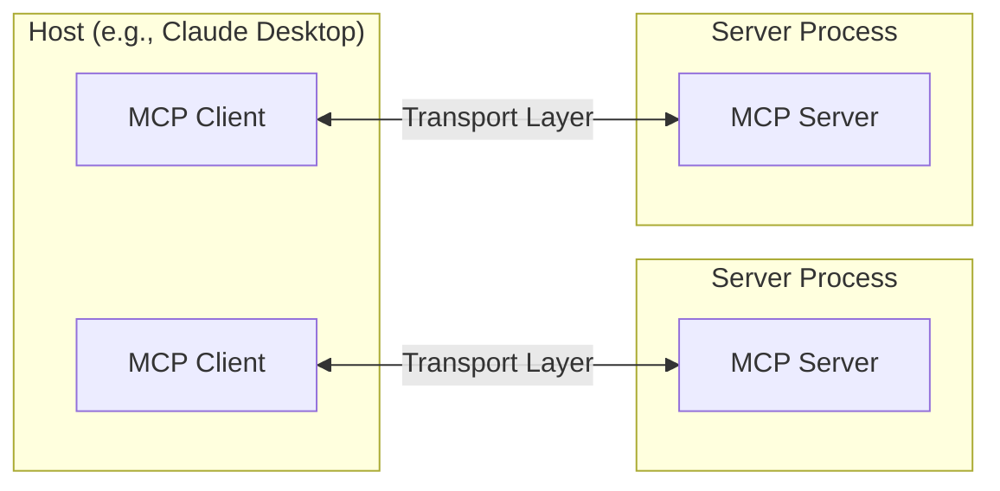

# Industry Standards

## Model Context Protocol

- [MCP](https://modelcontextprotocol.io/introduction) is an open protocol, built by Anthropic, that standardizes how applications provide context to LLMs.
- MCP helps you build agents and complex workflows on top of LLMs. LLMs frequently need to integrate with data and tools, and MCP provides a standardization with primarily 3 components:
    - Hosts (e.g. LLM Apps)
    - Servers (providing unified interface to LLM Apps)
    - Clients (Hosts uses Client protocol to maintain connections with Servers )
    - Local Data Sources (such as databases, etc. in local env accessed by Servers)
    - Remote Services (such as APIs to be accessed by Servers)

## Agent2Agent (A2A) Protocol

- [Launched by Google](https://developers.googleblog.com/en/a2a-a-new-era-of-agent-interoperability/), A2A is becoming an standard for agent interoperability focusing on agent-to-agent communication.
- [GitHub](https://google.github.io/A2A/) Repository

- [Building A Secure Agentic AI Application Leveraging Google’s A2A Protocol](https://arxiv.org/html/2504.16902v1)

## Agent Protocol

- [Agent Protocol](https://blog.langchain.dev/agent-protocol-interoperability-for-llm-agents/): a standard way for agents to communicate by LangChain
- [Agent Protocol](https://github.com/langchain-ai/agent-protocol): a common interface for agent communication. This standardizes how agents (LangGraph or otherwise) can interact.

## Emerging Standards 

- [OpenSpecs](https://openspec.dev/): Spec-driven development, plans over multiple sessions, spec's living in the codebase, universal planning across multiple coding agents