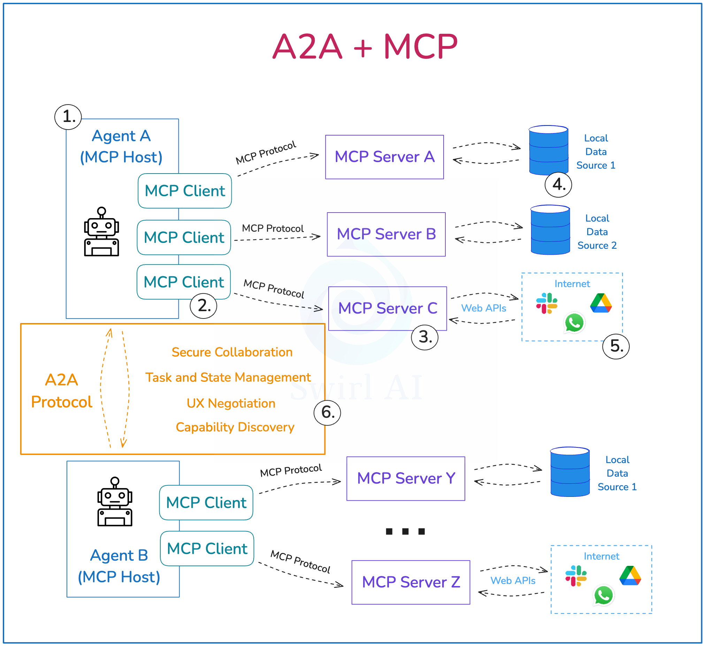

# Agent2Agent (A2A) Protocol

## Overview

The **Agent2Agent (A2A) Protocol** is a standard for agent interoperability launched by Google, focusing on direct agent-to-agent communication and coordination. A2A complements other protocols like MCP by providing standardized mechanisms for agents to discover, communicate, and collaborate with each other.


*Source: [A2A Protocol Documentation](https://a2a-protocol.org/)*

## Protocol Announcement

### Launch Details
- **Announced by**: Google
- **Launch Platform**: [Google Developers Blog](https://developers.googleblog.com/en/a2a-a-new-era-of-agent-interoperability/)
- **Official Website**: [A2A-Protocol.org](https://a2a-protocol.org/)
- **Focus**: Agent interoperability and multi-agent coordination

### Strategic Vision
A2A represents Google's vision for a standardized ecosystem where AI agents can seamlessly interact, share capabilities, and coordinate complex workflows across different platforms and vendors.

## Key Design Principles

### Agent Interoperability
- **Cross-platform Communication**: Agents from different platforms can communicate seamlessly
- **Vendor Neutrality**: Protocol designed to work across different agent implementations
- **Capability Discovery**: Standardized mechanisms for agents to discover each other's capabilities
- **Service Registration**: Common registry patterns for agent service discovery

### Standardized Communication
- **Message Formats**: Standardized message formats for agent communication
- **Protocol Semantics**: Clear semantics for different types of agent interactions
- **Error Handling**: Standardized error handling and recovery mechanisms
- **Security Model**: Built-in security and authentication mechanisms

### Scalable Architecture
- **Distributed Systems**: Designed for distributed, multi-agent environments
- **Performance Optimization**: Optimized for high-throughput agent communication
- **Fault Tolerance**: Resilient to individual agent failures
- **Load Balancing**: Support for load balancing across multiple agent instances

## Technical Architecture

### Core Components

#### Agent Registry
- **Service Discovery**: Centralized or distributed agent discovery mechanisms
- **Capability Advertisement**: Agents advertise their capabilities and services
- **Health Monitoring**: Monitor agent health and availability
- **Load Balancing**: Distribute requests across available agent instances

#### Communication Layer
- **Message Routing**: Intelligent routing of messages between agents
- **Protocol Translation**: Translation between different communication protocols
- **Quality of Service**: QoS guarantees for different types of communications
- **Monitoring**: Communication monitoring and analytics

#### Security Framework
- **Authentication**: Agent identity verification and authentication
- **Authorization**: Fine-grained access control for agent interactions
- **Encryption**: End-to-end encryption for sensitive communications
- **Audit Logging**: Comprehensive audit trails for security compliance

### Protocol Stack



*Source: A2A Protocol Documentation*

**Application Layer**:
- **Agent Applications**: High-level agent applications and workflows
- **Business Logic**: Domain-specific business logic and rules
- **User Interfaces**: Interfaces for human interaction with agent systems

**A2A Protocol Layer**:
- **Agent Communication**: Standardized agent-to-agent communication
- **Workflow Coordination**: Multi-agent workflow orchestration
- **Capability Negotiation**: Dynamic capability discovery and negotiation

**Transport Layer**:
- **Network Protocols**: HTTP/HTTPS, WebSockets, gRPC
- **Message Queuing**: Asynchronous message queuing systems
- **Event Streaming**: Real-time event streaming platforms

## Integration with Other Protocols

### A2A and MCP Relationship


*A2A and MCP Complementary Architecture*

**Complementary Roles**:
- **A2A Focus**: Agent-to-agent communication and coordination
- **MCP Focus**: Context provision from external resources to LLMs
- **Combined Benefits**: Comprehensive agent ecosystem with both coordination and context

**Integration Patterns**:
- **Hybrid Architectures**: Use A2A for agent coordination, MCP for context
- **Protocol Bridging**: Bridge between A2A and MCP protocols
- **Unified Platforms**: Platforms supporting both protocols simultaneously
- **Layered Approach**: A2A at coordination layer, MCP at context layer

### Google ADK Integration


*Google ADK with MCP Integration*

**Native Integration**:
- **ADK Support**: Google Agent Development Kit natively supports A2A
- **MCP Compatibility**: ADK also supports MCP for context provision
- **Unified Development**: Single development environment for both protocols
- **Best Practices**: Google-recommended patterns for protocol usage

## Use Cases and Applications

### Multi-Agent Workflows
- **Task Decomposition**: Break complex tasks into subtasks for different agents
- **Parallel Processing**: Coordinate parallel execution across multiple agents
- **Result Aggregation**: Combine results from multiple agents into unified outputs
- **Error Recovery**: Handle failures and recovery in multi-agent scenarios

### Agent Marketplaces
- **Service Discovery**: Agents discover and consume services from other agents
- **Capability Matching**: Match agent capabilities with task requirements
- **Dynamic Composition**: Dynamically compose agent workflows based on availability
- **Quality Assurance**: Ensure quality and reliability of agent services

### Enterprise Integration
- **Legacy System Integration**: Integrate agents with existing enterprise systems
- **Cross-Department Coordination**: Coordinate agents across different departments
- **Compliance and Governance**: Ensure compliance in multi-agent environments
- **Audit and Monitoring**: Monitor and audit multi-agent interactions

### Cloud-Native Deployments
- **Microservices Architecture**: Deploy agents as microservices with A2A communication
- **Container Orchestration**: Use Kubernetes and similar platforms for agent deployment
- **Service Mesh**: Integrate with service mesh technologies for advanced networking
- **Auto-scaling**: Automatically scale agent deployments based on demand

## Implementation Guide

### Getting Started

**For Agent Developers**:
1. **Protocol Implementation**: Implement A2A protocol in your agent framework
2. **Service Registration**: Register your agent's capabilities with A2A registry
3. **Communication Setup**: Set up communication channels with other agents
4. **Testing**: Test interoperability with other A2A-compliant agents

**For Platform Providers**:
1. **Registry Setup**: Set up A2A-compliant agent registry
2. **Protocol Gateway**: Implement protocol gateway for A2A communication
3. **Security Configuration**: Configure authentication and authorization
4. **Monitoring**: Set up monitoring and analytics for agent communications

### Development Best Practices

**Protocol Compliance**:
- **Specification Adherence**: Follow A2A protocol specifications exactly
- **Version Compatibility**: Ensure compatibility across protocol versions
- **Error Handling**: Implement robust error handling and recovery
- **Testing**: Comprehensive testing with other A2A implementations

**Performance Optimization**:
- **Connection Pooling**: Use connection pooling for better performance
- **Caching**: Implement appropriate caching strategies
- **Async Communication**: Use asynchronous communication patterns
- **Load Balancing**: Distribute load across multiple agent instances

**Security Considerations**:
- **Authentication**: Implement strong agent authentication mechanisms
- **Authorization**: Use fine-grained authorization controls
- **Encryption**: Encrypt all sensitive communications
- **Audit Logging**: Log all agent interactions for security auditing

## Comparison with Other Protocols

### A2A vs. MCP

| Aspect | A2A Protocol | MCP Protocol |
|--------|--------------|--------------|
| **Primary Focus** | Agent-to-agent communication | Context provision to LLMs |
| **Communication Pattern** | Peer-to-peer agent interaction | Client-server resource access |
| **Use Cases** | Multi-agent coordination | External resource integration |
| **Complexity** | Higher (distributed systems) | Lower (client-server) |
| **Scalability** | Horizontal agent scaling | Vertical resource scaling |

### A2A vs. Traditional APIs

**A2A Advantages**:
- **Semantic Understanding**: Rich semantic understanding of agent capabilities
- **Dynamic Discovery**: Dynamic discovery and composition of agent services
- **Workflow Coordination**: Built-in support for multi-agent workflows
- **Standardization**: Industry-standard protocol for agent communication

**Traditional API Advantages**:
- **Simplicity**: Simpler request-response patterns
- **Maturity**: Mature ecosystem and tooling
- **Performance**: Optimized for high-performance scenarios
- **Compatibility**: Wide compatibility with existing systems

## Future Roadmap

### Short-term Development
- **Specification Finalization**: Complete formal protocol specification
- **Reference Implementations**: Develop reference implementations
- **Ecosystem Building**: Build ecosystem of A2A-compliant agents
- **Interoperability Testing**: Comprehensive interoperability testing

### Long-term Vision
- **Industry Adoption**: Widespread adoption across the agent ecosystem
- **Advanced Features**: Advanced features like agent learning and adaptation
- **Integration Standards**: Integration with other emerging standards
- **Global Standardization**: International standardization through standards bodies

## Community and Ecosystem

### Development Community
- **Open Development**: Open development process with community input
- **Working Groups**: Technical working groups for different aspects
- **Feedback Mechanisms**: Regular community feedback and input sessions
- **Contribution Guidelines**: Clear guidelines for community contributions

### Industry Partnerships
- **Technology Partners**: Partnerships with major technology companies
- **Standards Bodies**: Collaboration with international standards organizations
- **Academic Research**: Partnerships with academic research institutions
- **Open Source Projects**: Integration with major open source projects

## The Critical Distinction: A2A vs. MCP

A2A and MCP are **complementary, not competing** — they operate at different levels of abstraction.

| Protocol | Domain | Interaction type | Analogy |
|---|---|---|---|
| **MCP** | Tools and resources | Stateless function call with structured inputs/outputs | "Do this specific thing" |
| **A2A** | Intelligent agents | Stateful collaboration between systems that can reason, plan, and maintain state | "Achieve this complex goal" |

**When to use MCP**: Need a simple, stateless function like fetching weather data or querying a database.

**When to use A2A**: Need to delegate a complex goal such as "analyze last quarter's customer churn and recommend three intervention strategies" — requiring reasoning, planning, and multi-turn interaction.

**Best suited for formal, cross-team integrations** that require a durable service contract. For tightly coupled tasks within a single application, lightweight local sub-agents are often more efficient.

## A2A Protocol: Implementation

### Agent Cards (Service Discovery)

An **Agent Card** is a standardized JSON specification — the "business card" for each agent. It describes what an agent can do, its security requirements, its skills, and how to reach it (URL). Any agent in the ecosystem can discover peers using Agent Cards.

```json
{
  "name": "check_prime_agent",
  "version": "1.0.0",
  "description": "An agent specialized in checking whether numbers are prime",
  "capabilities": {},
  "securitySchemes": {
    "agent_oauth2_0": { "type": "oauth2" }
  },
  "defaultInputModes": ["text/plain"],
  "defaultOutputModes": ["application/json"],
  "skills": [
    {
      "id": "prime_checking",
      "name": "Prime Number Checking",
      "description": "Check if numbers are prime using efficient algorithms",
      "tags": ["mathematical", "computation", "prime"]
    }
  ],
  "url": "http://localhost:8001/a2a/check_prime_agent"
}
```

Agent Cards are served at `/.well-known/agent-card.json` on the agent's URL.

### ADK Implementation

**Exposing an existing agent via A2A** (single function call):

```python
from google.adk.a2a.utils.agent_to_a2a import to_a2a

root_agent = Agent(name='hello_world_agent', ...)
a2a_app = to_a2a(root_agent, port=8001)

# Serve with uvicorn: uvicorn agent:a2a_app --host localhost --port 8001
# Or via Vertex AI Agent Engine runtime
```

**Consuming a remote agent via A2A**:

```python
from google.adk.agents.remote_a2a_agent import RemoteA2aAgent

prime_agent = RemoteA2aAgent(
    name="prime_agent",
    description="Agent that handles checking if numbers are prime.",
    agent_card="http://localhost:8001/a2a/check_prime_agent/.well-known/agent-card.json"
)
```

**Hierarchical composition** — a root orchestrator using both a local sub-agent and a remote A2A agent:

```python
# Local sub-agent
roll_agent = Agent(name="roll_agent", instruction="You are an expert at rolling dice.")

# Remote A2A agent
prime_agent = RemoteA2aAgent(
    name="prime_agent",
    agent_card="http://localhost:8001/.well-known/agent-card.json"
)

# Root orchestrator combining both
root_agent = Agent(
    name="root_agent",
    instruction="Delegate rolling dice to roll_agent, prime checking to prime_agent.",
    sub_agents=[roll_agent, prime_agent]
)
```

### Non-Negotiable Technical Requirements for A2A

A2A interactions are inherently stateful and distributed. Two requirements become mandatory:

1. **Distributed Tracing**: Every request must carry a unique trace ID to maintain a coherent audit trail across multiple agents. Essential for debugging multi-agent workflows.
2. **Robust State Management**: A sophisticated persistence layer is required to track progress and ensure transactional integrity across agent boundaries.

## Registry Architectures

At scale, discovering and managing agents and tools requires centralized registries.

### Tool Registry

A **Tool Registry** catalogs all tools using a protocol like MCP. Instead of giving agents access to thousands of tools, it enables curated access lists:

| Agent Type | Access Pattern |
|---|---|
| Generalist agents | Full catalog — trading speed/accuracy for scope |
| Specialist agents | Predefined subsets — higher performance on specific tasks |
| Dynamic agents | Query registry at runtime to adapt to new tools |

Primary benefit: **human discovery** — developers find existing tools before rebuilding, security teams audit tool access, product owners understand capabilities.

### Agent Registry

An **Agent Registry** applies the same concept to agents, using formats like A2A's AgentCards. It helps teams discover and reuse existing agents, reducing redundant work and laying the groundwork for automated agent-to-agent delegation.

**Decision framework:**

| Registry | Build when... |
|---|---|
| Tool Registry | Tool discovery becomes a bottleneck, or security requires centralized auditing |
| Agent Registry | Multiple teams need to discover and reuse specialized agents without tight coupling |

Start without a registry and build it only when ecosystem scale demands centralized management.

## AWS Guidance: MCP vs. A2A in Multi-Agent Systems

AWS explicitly distinguishes the two protocols and warns against misuse:

| Protocol | Interface | Pattern | AWS Guidance |
|---|---|---|---|
| MCP | Agent → Tool | Client-server; agent is always the client, tool server is always the responder | Multi-agent MCP: server must implement per-agent access controls at the server level — not in system prompts. Tool schema quality directly determines agent behavior quality. Version-control MCP server versions in each agent's config; test before updating in prod. |
| A2A | Agent → Agent | Peer protocol; any agent can initiate or receive — symmetric, unlike MCP's client-server model | A2A expands the attack surface: validate task objects against schema; apply Amazon Bedrock Guardrails at every A2A boundary. Do not use MCP for agent-to-agent delegation — it is the wrong abstraction. |

## See Also

- [MCP Protocol](./mcp.md) — Complementary protocol for tool/resource access
- [ProductionBestPractices/deployment.md](../ProductionBestPractices/deployment.md) — Deployment of A2A-compatible agents
- [AgentOps](../AgentOps/README.md) — AgentOps lifecycle including multi-agent operations
- [AllThingsGoogle](../AllThingsGoogle/README.md) — Google ADK, Gemini Enterprise Agent Platform