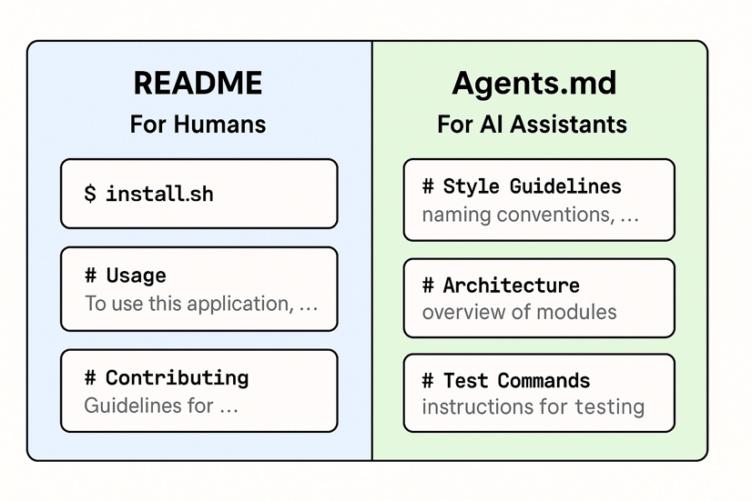

# AGENTS.md Standard

## Overview

The **AGENTS.md** open standard was created through a collaborative effort by an industry working group that includes companies like Google, OpenAI, Sourcegraph, Factory, and Cursor. On December 9, 2025, OpenAI and Anthropic donated AGENTS.md to the Linux Foundation, co-founding the new Agentic AI Foundation (AAIF) to promote open standards for safe, interoperable AI agents.



*Source: [Weights & Biases AGENTS.md Introduction](https://wandb.ai/wandb_fc/genai-research/reports/Introduction-to-Agents-md--VmlldzoxNDEwNDI2Ng)*

## Foundation Donation

### Historical Development
- **Created by**: Industry working group collaboration
- **Key Contributors**: Google, OpenAI, Sourcegraph, Factory, Cursor
- **Donation Date**: December 9, 2025
- **Donated by**: OpenAI and Anthropic jointly
- **Recipient**: Agentic AI Foundation (AAIF) under Linux Foundation

### Strategic Significance
The donation of AGENTS.md to AAIF represents a commitment to open standards for AI agent instructions and behavior specification. This ensures the standard will evolve under community governance rather than single-vendor control.

## Standard Purpose and Scope

### Primary Objectives
- **Agent Instruction Standardization**: Provide standardized format for AI agent instructions
- **Behavior Specification**: Define how agents should interpret and execute instructions
- **Interoperability**: Enable agents from different vendors to understand common instruction formats
- **Safety and Compliance**: Establish safety guidelines and compliance frameworks

### Target Audience
- **Agent Developers**: Developers building AI agent systems
- **Platform Providers**: Companies providing agent development platforms
- **Enterprise Users**: Organizations deploying agents in production environments
- **Tool Builders**: Developers creating tools and integrations for agent ecosystems

## Technical Specification

### File Format and Structure

**Standard File Name**: `AGENTS.md`  
**Format**: Markdown with structured sections  
**Location**: Root directory of agent projects or repositories

**Core Sections**:
1. **Agent Identity**: Name, version, and basic identification
2. **Capabilities**: Detailed description of agent capabilities and limitations
3. **Instructions**: Structured instructions for agent behavior
4. **Safety Guidelines**: Safety constraints and operational boundaries
5. **Integration**: Integration points and API specifications
6. **Compliance**: Compliance requirements and certifications

### Instruction Format

**Structured Instructions**:
```markdown
# Agent Instructions

## Core Behavior
- Primary objectives and goals
- Decision-making frameworks
- Response patterns and styles

## Capabilities
- Available tools and functions
- Data access permissions
- Integration capabilities

## Constraints
- Safety boundaries and limitations
- Ethical guidelines and restrictions
- Performance and resource constraints

## Error Handling
- Error detection and reporting
- Recovery procedures
- Escalation protocols
```

### Metadata Schema

**Agent Metadata**:
```yaml
agent:
  name: "Agent Name"
  version: "1.0.0"
  description: "Agent description"
  capabilities:
    - "capability1"
    - "capability2"
  safety_level: "enterprise"
  compliance:
    - "SOC2"
    - "GDPR"
```

## Implementation Guidelines

### For Agent Developers

**Creating AGENTS.md Files**:
1. **Template Usage**: Use standard templates for consistency
2. **Capability Documentation**: Thoroughly document all agent capabilities
3. **Safety Specification**: Clearly specify safety constraints and boundaries
4. **Version Control**: Maintain version control for AGENTS.md files
5. **Validation**: Validate files against standard schema

**Best Practices**:
- **Clear Language**: Use clear, unambiguous language for instructions
- **Comprehensive Coverage**: Cover all aspects of agent behavior
- **Regular Updates**: Keep AGENTS.md files updated with agent changes
- **Testing**: Test agent behavior against documented instructions
- **Community Review**: Engage community for review and feedback

### For Platform Providers

**Standard Support**:
1. **Parser Implementation**: Implement AGENTS.md parsers in platforms
2. **Validation Tools**: Provide validation tools for standard compliance
3. **Template Libraries**: Offer template libraries for common use cases
4. **Integration APIs**: Provide APIs for programmatic access to AGENTS.md data
5. **Compliance Checking**: Implement compliance checking against standards

**Platform Integration**:
- **Automatic Discovery**: Automatically discover and parse AGENTS.md files
- **Capability Matching**: Match agent capabilities with task requirements
- **Safety Enforcement**: Enforce safety constraints specified in AGENTS.md
- **Compliance Monitoring**: Monitor compliance with specified requirements
- **Version Management**: Handle versioning and compatibility checking

## Use Cases and Applications

### Agent Marketplaces
- **Agent Discovery**: Help users discover and understand agent capabilities
- **Capability Matching**: Match agents with specific task requirements
- **Safety Assessment**: Assess agent safety and compliance before deployment
- **Quality Assurance**: Ensure agents meet marketplace quality standards

### Enterprise Deployment
- **Governance**: Provide governance framework for enterprise agent deployment
- **Compliance**: Ensure agents meet enterprise compliance requirements
- **Risk Management**: Assess and manage risks associated with agent deployment
- **Audit Trails**: Maintain audit trails for agent behavior and decisions

### Development Workflows
- **Documentation**: Standardized documentation for agent development
- **Testing**: Test agent behavior against documented specifications
- **Integration**: Facilitate integration between different agent systems
- **Maintenance**: Simplify maintenance and updates of agent systems

### Safety and Security
- **Safety Boundaries**: Clearly define safety boundaries and constraints
- **Security Policies**: Specify security policies and requirements
- **Incident Response**: Define incident response procedures and protocols
- **Compliance Verification**: Verify compliance with regulatory requirements

## Industry Collaboration

### Working Group Structure

**Core Contributors**:
- **Google**: Technical leadership and platform integration
- **OpenAI**: Agent instruction frameworks and safety guidelines
- **Sourcegraph**: Code intelligence and developer tooling integration
- **Factory**: Enterprise deployment and governance frameworks
- **Cursor**: Developer experience and tooling integration

**Collaboration Process**:
- **Regular Meetings**: Regular working group meetings and discussions
- **Open Development**: Open development process with community input
- **Consensus Building**: Decisions made through consensus-building processes
- **Public Review**: Public review periods for major specification changes

### Community Engagement

**Feedback Mechanisms**:
- **GitHub Discussions**: Open discussions on GitHub repositories
- **Community Forums**: Dedicated forums for community discussions
- **Working Group Meetings**: Open working group meetings with community participation
- **Survey and Feedback**: Regular surveys and feedback collection

**Contribution Process**:
- **Specification Contributions**: Process for contributing to specification development
- **Implementation Feedback**: Feedback on implementation experiences
- **Use Case Sharing**: Sharing of use cases and implementation patterns
- **Best Practice Development**: Collaborative development of best practices

## Compliance and Certification

### Compliance Framework

**Compliance Levels**:
- **Basic Compliance**: Minimum requirements for AGENTS.md implementation
- **Standard Compliance**: Full compliance with all specification requirements
- **Enhanced Compliance**: Additional safety and security requirements
- **Enterprise Compliance**: Enterprise-grade compliance and governance

**Certification Process**:
- **Self-Assessment**: Self-assessment tools and checklists
- **Third-Party Validation**: Third-party validation and certification services
- **Continuous Monitoring**: Ongoing compliance monitoring and reporting
- **Audit Support**: Support for compliance audits and assessments

### Safety and Security Standards

**Safety Requirements**:
- **Boundary Specification**: Clear specification of agent operational boundaries
- **Risk Assessment**: Comprehensive risk assessment and mitigation strategies
- **Incident Reporting**: Standardized incident reporting and response procedures
- **Safety Monitoring**: Continuous safety monitoring and alerting

**Security Requirements**:
- **Access Control**: Fine-grained access control and permission management
- **Data Protection**: Data protection and privacy requirements
- **Audit Logging**: Comprehensive audit logging and monitoring
- **Vulnerability Management**: Vulnerability assessment and management procedures

## Tools and Ecosystem

### Development Tools

**Validation Tools**:
- **Schema Validators**: Tools to validate AGENTS.md files against standard schema
- **Linting Tools**: Linting tools for AGENTS.md file quality and consistency
- **Testing Frameworks**: Testing frameworks for agent behavior validation
- **Documentation Generators**: Tools to generate documentation from AGENTS.md files

**Integration Tools**:
- **Parser Libraries**: Libraries for parsing AGENTS.md files in various languages
- **API Generators**: Tools to generate APIs from AGENTS.md specifications
- **Deployment Tools**: Tools for deploying agents based on AGENTS.md specifications
- **Monitoring Tools**: Tools for monitoring agent compliance with AGENTS.md specifications

### Platform Support

**Supported Platforms**:
- **Agent Development Frameworks**: Integration with major agent development frameworks
- **Cloud Platforms**: Support in major cloud platforms and services
- **Enterprise Platforms**: Integration with enterprise agent management platforms
- **Developer Tools**: Support in popular developer tools and IDEs

**Community Resources**:
- **Template Library**: Library of AGENTS.md templates for common use cases
- **Best Practice Guides**: Comprehensive guides for implementing AGENTS.md
- **Example Implementations**: Example implementations and case studies
- **Community Forums**: Active community forums for support and discussion

## Future Development

### Roadmap and Evolution

**Short-term Goals**:
- **Specification Finalization**: Complete formal specification documentation
- **Tool Development**: Develop comprehensive tooling ecosystem
- **Platform Integration**: Integrate with major agent development platforms
- **Community Building**: Build active developer and user community

**Long-term Vision**:
- **Industry Standard**: Establish as de facto industry standard for agent instructions
- **Advanced Features**: Add advanced features like agent learning and adaptation
- **International Standards**: Work toward international standardization
- **Ecosystem Maturity**: Mature ecosystem with comprehensive tooling and support

### Research and Development

**Active Research Areas**:
- **Instruction Optimization**: Research on optimal instruction formats and structures
- **Safety Enhancement**: Advanced safety mechanisms and verification techniques
- **Interoperability**: Enhanced interoperability with other agent standards
- **Automation**: Automated generation and validation of AGENTS.md files

**Academic Collaboration**:
- **Research Partnerships**: Partnerships with academic research institutions
- **Publication**: Academic publications on AGENTS.md research and development
- **Conference Presentations**: Presentations at major AI and software conferences
- **Student Projects**: Support for student projects and research initiatives

## Related Sections

- **Section 6.1**: Agentic AI Foundation (governance and standardization)
- **Section 6.2**: Model Context Protocol (complementary standard)
- **Section 6.3**: Agent2Agent Protocol (interoperability standard)
- **Section 4**: Agent Development Frameworks (AGENTS.md integration)
- **Section 16**: AI Agents Best Practices (alignment with AGENTS.md standards)