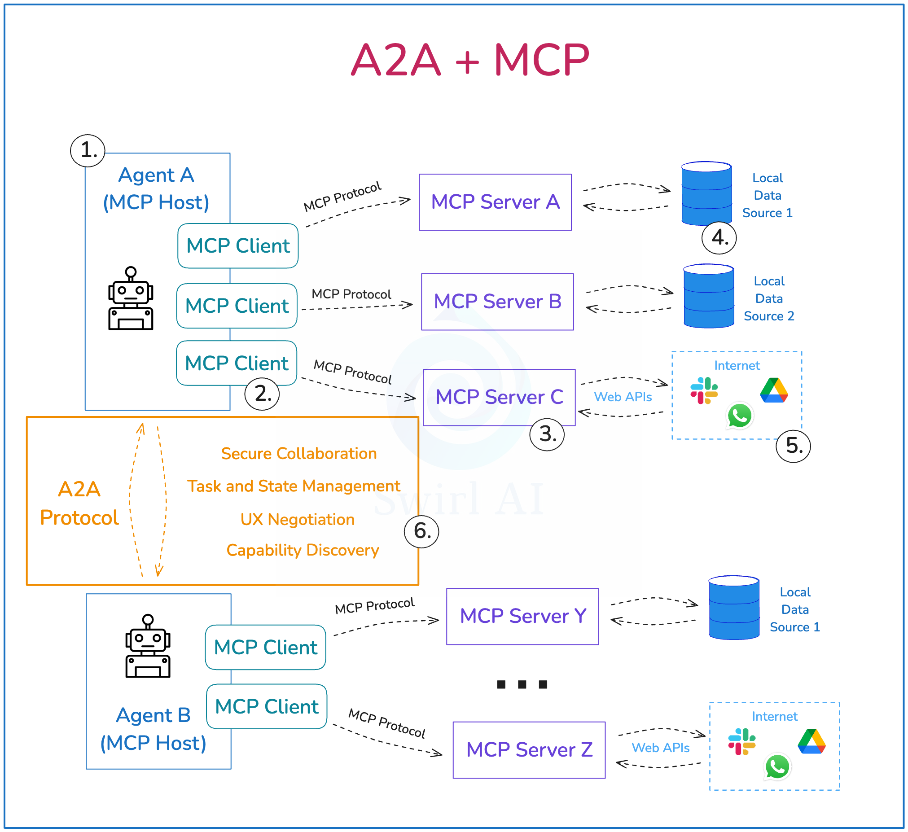

# Model Context Protocol (MCP)

## Overview

The **Model Context Protocol (MCP)** is an open protocol built by Anthropic that standardizes how applications provide context to Large Language Models (LLMs). On December 9, 2025, Anthropic donated MCP to the Agentic AI Foundation (AAIF), marking a significant milestone in open standards for agentic AI.

*Source: [Model Context Protocol Documentation](https://modelcontextprotocol.io/)*

## Foundation Donation

### Historical Context
- **Original Developer**: Anthropic
- **Donation Date**: December 9, 2025
- **Recipient**: Agentic AI Foundation (AAIF)
- **Governance**: Now under Linux Foundation governance structure

### Strategic Importance
The donation of MCP to AAIF represents Anthropic's commitment to open standards and interoperability in the agentic AI ecosystem. This move ensures that MCP will continue to evolve as a vendor-neutral standard under community governance.

## Technical Architecture

### Core Components

MCP helps build agents and complex workflows on top of LLMs through three primary components:

#### 1. Hosts (LLM Applications)
- **Definition**: Applications that use LLMs and need access to external context
- **Examples**: AI assistants, chatbots, agent frameworks
- **Role**: Initiate connections to MCP servers to access external resources

#### 2. Servers (Context Providers)
- **Definition**: Services that provide unified interfaces to external resources
- **Role**: Expose data sources and tools through standardized MCP protocol
- **Examples**: Database connectors, API wrappers, file system interfaces

#### 3. Clients (Protocol Implementation)
- **Definition**: Protocol implementation that hosts use to communicate with servers
- **Role**: Manage connections, handle protocol communication, route requests
- **Implementation**: Built into host applications or provided as libraries

#### 4. Local Data Sources
- **Examples**: Databases, file systems, configuration files
- **Access**: Accessed by servers in local environment
- **Security**: Direct access with appropriate permissions and security controls

#### 5. Remote Services
- **Examples**: REST APIs, GraphQL endpoints, third-party services
- **Access**: Accessed by servers via network protocols
- **Integration**: Standardized through MCP server implementations

*MCP Component Architecture and Data Flow*

## Protocol Specifications

### Communication Protocol
- **Transport**: JSON-RPC over various transport mechanisms
- **Serialization**: JSON for all data exchange
- **Versioning**: Semantic versioning for protocol evolution
- **Extensions**: Extensible protocol for custom capabilities

### Standard Operations
- **Resource Discovery**: Enumerate available resources and capabilities
- **Resource Access**: Read and write operations on external resources
- **Tool Invocation**: Execute tools and functions through MCP servers
- **Streaming**: Support for streaming data and real-time updates

### Security Model
- **Authentication**: Configurable authentication mechanisms
- **Authorization**: Fine-grained access control and permissions
- **Encryption**: Support for encrypted communication channels
- **Sandboxing**: Isolation of MCP server operations

## MCP Ecosystem

### MCP Servers

**Community Repositories**:
- [Awesome MCP Servers by Glamma.ai](https://github.com/punkpeye/awesome-mcp-servers)
- [AWS MCP Servers](https://github.com/awslabs/mcp/): Specialized MCP servers for cloud-native development, infrastructure management, and development workflows

**Specialized Platforms**:
- [PulseMCP](https://www.pulsemcp.com/): Comprehensive resource for MCP use cases, servers, clients, and news

### MCP Extensions and Third-party Tools

**Enterprise Solutions**:
- [Enterprise Governance Layer by Microsoft](https://github.com/ithena-one/mcp-governance-sdk): Enterprise-grade governance and compliance for MCP deployments
- [MCPI](https://mcpintegrate.com/): Extends MCP to create bridges between AI and web services

### MCP-Native Frameworks

**Agent Frameworks**:
- [Fastagent](https://fast-agent.ai/): MCP-native agent framework designed for seamless integration with MCP servers

### MCP Platforms

**Hosted Solutions**:
- [KlavisAI](https://www.klavis.ai/): YC-backed MCP platform providing hosted MCP servers and management capabilities

## Integration with A2A Protocol

### Complementary Protocols

*Source: [A2A and MCP Analysis](https://www.newsletter.swirlai.com/p/mcp-vs-a2a-friends-or-foes)*

**MCP Focus**:
- **Context Provision**: Standardizes how applications provide context to LLMs
- **Resource Access**: Unified access to external data sources and tools
- **Host-Server Communication**: Communication between LLM applications and context providers

**A2A Focus**:
- **Agent Interoperability**: Direct agent-to-agent communication
- **Workflow Coordination**: Multi-agent workflow orchestration
- **Service Discovery**: Agent capability discovery and routing

### Integration Patterns
- **Hybrid Architectures**: Use MCP for context and A2A for agent coordination
- **Protocol Bridging**: Bridge between MCP and A2A protocols
- **Unified Platforms**: Platforms supporting both protocols simultaneously
- **Migration Strategies**: Gradual migration between protocols

## Implementation Guide

### Getting Started

**For Host Applications**:
1. **Choose MCP Client Library**: Select appropriate client library for your platform
2. **Configure Servers**: Set up connections to required MCP servers
3. **Implement Context Flow**: Integrate MCP context into your LLM workflows
4. **Handle Errors**: Implement robust error handling and fallback mechanisms

**For Server Development**:
1. **Define Resources**: Identify resources and tools to expose via MCP
2. **Implement Protocol**: Use MCP SDK to implement server protocol
3. **Security Configuration**: Configure authentication and authorization
4. **Testing**: Thoroughly test server with various client implementations

### Best Practices

**Security Considerations**:
- **Principle of Least Privilege**: Grant minimal necessary permissions
- **Input Validation**: Validate all inputs from MCP clients
- **Audit Logging**: Log all MCP operations for security auditing
- **Network Security**: Use encrypted connections for sensitive data

**Performance Optimization**:
- **Caching**: Implement appropriate caching strategies
- **Connection Pooling**: Use connection pooling for database servers
- **Async Operations**: Use asynchronous operations for better performance
- **Resource Management**: Properly manage server resources and connections

**Reliability Patterns**:
- **Circuit Breakers**: Implement circuit breakers for external dependencies
- **Retry Logic**: Add retry logic with exponential backoff
- **Health Checks**: Implement health check endpoints
- **Graceful Degradation**: Handle server failures gracefully

## Research and Development

### Academic Research

**Whitepapers and Research**:
- [Model Context Protocol: Landscape, Security Threats, and Future Research Directions](https://arxiv.org/pdf/2503.23278v1)

**Research Areas**:
- **Security Analysis**: Comprehensive security threat modeling and mitigation
- **Performance Optimization**: Protocol optimization for high-throughput scenarios
- **Interoperability**: Integration with other agent communication protocols
- **Standardization**: Formal specification and standardization efforts

### Future Directions

**Protocol Evolution**:
- **Enhanced Security**: Advanced security features and threat mitigation
- **Performance Improvements**: Protocol optimizations for better performance
- **Extended Capabilities**: New protocol features and capabilities
- **Ecosystem Growth**: Expanded ecosystem of servers and tools

**Industry Adoption**:
- **Enterprise Integration**: Enterprise-grade features and compliance
- **Cloud Platform Support**: Native support in major cloud platforms
- **Developer Tools**: Enhanced developer tools and documentation
- **Community Growth**: Expanded developer and user community

## Related Sections

- **Section 6.1**: Agentic AI Foundation (governance and standardization)
- **Section 6.3**: Agent2Agent (A2A) Protocol (complementary protocol)
- **Section 4**: Agent Development Frameworks (MCP integration)
- **Section 5**: Agent Technology Stack (MCP in technology stacks)