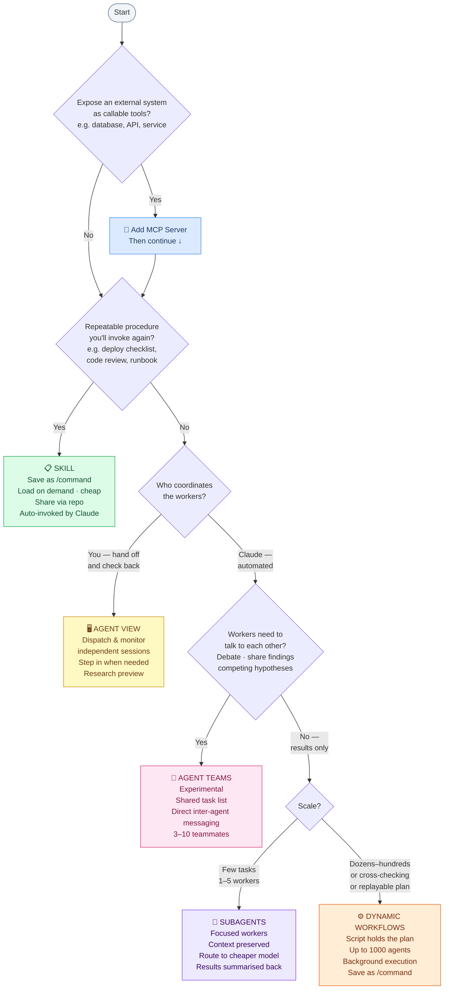

# Claude Code Orchestration Primitives — Decision Guide

## Overview

Claude Code provides five orchestration primitives (Skills, Subagents, Agent View, Agent Teams, Dynamic Workflows) and one capability-exposure protocol (MCP). Choosing the right combination is the single most consequential decision in a Claude Code integration: it affects context costs, agent coordination, repeatability, and how much the plan can be inspected and reused.

This guide provides a decision framework for each primitive and explains how MCP relates to all of them.

## The Primitives at a Glance

| Primitive | What it is | Who coordinates | Workers communicate? | Plan lives in |
|---|---|---|---|---|
| **MCP** | Standard for exposing tools/resources to agents | N/A — capability layer, not orchestration | N/A | N/A |
| **Skills** | Reusable `/command` instructions Claude follows | Claude, following the skill body | N/A — single agent | Skill file (SKILL.md) |
| **Subagents** | Delegated workers in their own context, spawned within a session | Claude, turn by turn | No — report to main agent only | Claude's context window |
| **Agent View** | Dispatcher screen for background sessions you manage | You, directly | No — sessions are independent | Your decisions |
| **Agent Teams** | Lead-coordinated worker sessions with shared task list + messaging | Lead agent, autonomously | Yes — direct inter-agent messaging | Lead's task list |
| **Dynamic Workflows** | A JS script the runtime executes across hundreds of subagents | The script | No — results in script variables | The script |

---

## MCP: The Capability Layer (Not an Orchestration Choice)

MCP is orthogonal to the orchestration primitives above. Its job is to expose external systems — databases, APIs, filesystems, services — as callable tools that any Claude agent can use.

```
External System → MCP Server → Agent (subagent, skill runner, teammate, workflow agent)
```

**Use MCP when** you need to give agents access to capabilities outside Claude's built-in tools: querying a database, calling a proprietary REST API, reading from a cloud storage bucket, or triggering an external workflow.

**MCP does not replace** an orchestration primitive. Once you've decided how to coordinate agents (Skills, Subagents, Agent Teams, or Workflows), MCP determines what those agents can *call*. All orchestration primitives can consume MCP tools simultaneously.

| MCP question | Answer |
|---|---|
| Should I use MCP instead of subagents? | No — use both. MCP gives capabilities; subagents coordinate workers. |
| Can a workflow agent call MCP tools? | Yes — workflow subagents inherit the session's tool allowlist including MCP servers. |
| Can a skill invoke an MCP tool? | Yes — a skill can call any MCP tool available in the session. |
| When is MCP *not* the right answer? | When Claude's built-in tools (file read/write, bash, web search) already cover the need. Adding an MCP server for capabilities Claude already has is unnecessary indirection. |

---

## Decision Flowchart



---

## When to Use Each Primitive

### Skills — "I have a procedure I run repeatedly"

**Use when:**
- You keep pasting the same instructions, checklist, or multi-step process into chat
- A section of CLAUDE.md has grown into a procedure (skills load on demand; CLAUDE.md always loads)
- You want to package an engineering workflow and share it via the repo (`.claude/skills/`)
- You need Claude to invoke a procedure automatically when it recognizes the context (`invoke: auto` frontmatter)

**Don't use when:**
- The task is unique — just prompt Claude directly
- You need parallel execution — combine with subagents (skills can run in a subagent)

**Token cost**: Low. The skill body loads only when invoked; it does not occupy the context window permanently.

---

### Subagents — "I have focused side tasks that would flood my context"

**Use when:**
- A research task, log analysis, or file scan would dump large outputs into your main conversation
- You want to enforce different tool access for a worker (e.g., read-only researcher, no-shell auditor)
- You want to route low-complexity tasks to a smaller, cheaper model (Haiku) while keeping the main agent on Opus/Sonnet
- You need a few (1–5) parallel workers whose only job is to return a summary

**Don't use when:**
- Workers need to message each other — use Agent Teams
- The task needs dozens of workers or cross-checking — use Dynamic Workflows
- You want the orchestration to be repeatable as a script — use Dynamic Workflows

**Token cost**: Medium. Each subagent has its own context window; results are summarized back to the main agent, not fed back verbatim.

---

### Agent View — "I want to dispatch tasks and check on them myself"

**Use when:**
- You have several independent tasks and want to hand them off to background sessions
- You want to step in, redirect, or take over individual sessions yourself
- You want one screen showing all running sessions and which ones need your input

**Don't use when:**
- You want Claude to coordinate workers automatically — use Agent Teams or Workflows
- Research preview limitations are a concern

**Token cost**: High (each session has its own context), but sessions are user-managed, so you control the scope.

---

### Agent Teams — "I want workers that discuss and challenge each other"

**Use when:**
- Workers need to share findings, challenge each other's hypotheses, or build on each other's output
- Parallel exploration is the primary value: different reviewers on different axes, competing hypotheses for a bug, cross-layer implementation (frontend/backend/tests each owned by one teammate)
- You want Claude to autonomously split a project into tasks, assign them, and manage dependencies

**Don't use when:**
- Workers are writing to the same files — partition the work so each teammate owns distinct files, or use worktrees
- Sequential work — single session or subagents are more efficient; coordination overhead exceeds benefit
- You need session resumption — currently not supported for in-process teammates
- You need more than ~10 workers — coordination overhead escalates; consider Dynamic Workflows

**Token cost**: High and linear — each teammate is a full Claude session. Budget 3–5 teammates for most workflows.

**Status**: Experimental, disabled by default. Enable via `CLAUDE_CODE_EXPERIMENTAL_AGENT_TEAMS=1`.

---

### Dynamic Workflows — "I need scale, cross-checking, or a replayable orchestration script"

**Use when:**
- The task needs more agents than a conversation can coordinate (codebase audit, 500-file migration)
- You want independent agents to adversarially cross-check each other's findings before reporting
- You want the orchestration codified as a script you can save, rerun, and diff between runs
- The plan should live in code (the script), not in Claude's context window

**Don't use when:**
- A handful of subagents or a skill is sufficient — workflows consume meaningfully more tokens
- Workers need real-time user input mid-run — workflows do not support mid-run interaction (design each stage as its own workflow instead)

**Token cost**: High and task-dependent. Run on a small slice first (one directory, one narrow question) to gauge spend. The `/workflows` view shows per-agent token usage as the run progresses.

---

## Capability × Orchestration Composition Patterns

The primitives compose. Common patterns:

| Pattern | How it works | When to use |
|---|---|---|
| **MCP + Skills** | Expose a tool via MCP; invoke a multi-step procedure via a skill that calls that tool | Repeatably calling a proprietary API with a fixed procedure (e.g., run deployment checklist against staging environment) |
| **MCP + Subagents** | Subagents call MCP tools in their isolated context | Research agents that query a database without polluting the main context with raw results |
| **MCP + Workflows** | Workflow spawns hundreds of subagents, each calling MCP tools (e.g., querying a search API) | Large-scale research that fans out across an external API — analogous to [Perplexity Search as Code](../RAG/search-as-code.md) at the retrieval layer |
| **Skills + Subagents** | A skill's body runs inside a subagent (`subagent: true` frontmatter) | Repeatable but context-heavy procedures (e.g., a code review skill that scans large files) |
| **Subagents + Worktrees** | Each subagent gets an isolated git checkout | Parallel implementation tasks that touch the same files; prevents overwrites |
| **Workflows + Saved Commands** | After a workflow run succeeds, save it as a `/command` | Turn a one-off orchestration into a repeatable engineering tool (e.g., `/audit-endpoints`, `/migrate-module`) |

---

## Summary Decision Table

| If you want to… | Use |
|---|---|
| Expose an external system as callable tools | **MCP** |
| Package a repeatable procedure as a slash command | **Skill** |
| Offload a focused side task to preserve main context | **Subagent** |
| Route a low-complexity task to a cheaper model | **Subagent** (with `model: haiku` in definition) |
| Dispatch tasks yourself and monitor them | **Agent View** |
| Let agents debate and share findings directly | **Agent Teams** |
| Coordinate dozens–hundreds of agents with a replayable script | **Dynamic Workflow** |
| Cross-check findings across independent agents | **Dynamic Workflow** |
| Run a large migration or codebase-wide audit | **Dynamic Workflow** |
| Any of the above, plus an external tool or API | Add **MCP** to whichever approach above fits |

---

## Best Practices

| Challenge | Recommendation |
|---|---|
| Choosing too powerful a primitive | Start with the simplest option: Skill → Subagent → Agent Team → Workflow. Upgrade only when the simpler primitive genuinely can't do the job. |
| Token overruns | Subagents summarize back (moderate cost); agent teams and workflows multiply cost linearly. Benchmark on a small slice before committing to scale. |
| MCP sprawl | Add MCP servers only for capabilities Claude lacks natively. Every MCP server in the allowlist is available to all agents in a workflow run; keep the surface minimal. |
| Repeatability gaps | Any orchestration you run more than twice should be a saved skill or saved workflow command. Ad hoc prompts that grow complex are a maintenance risk. |
| File conflicts in parallel work | Use worktrees to isolate file access. Agent Teams don't auto-isolate; explicitly partition file ownership per teammate. |
| Mid-run interruptions | Dynamic workflows can't accept user input mid-run. For tasks needing human sign-off between stages, break them into separate workflows run in sequence. |

---

## See Also

- [Dynamic Workflows (Claude Code)](./dynamic-workflows.md)
- [Workflow Orchestration](./orchestration.md)
- [Model Context Protocol (MCP)](../Standards/mcp.md)
- [Agent Skills / SKILLS.md Standard](../Standards/skills.md)
- [Multi-Agent Systems](../Architecture/multi-agent-system.md)
- [Search as Code (Perplexity)](../RAG/search-as-code.md) — parallel "primitives as code" pattern at the retrieval layer
- [Code as Agent Harness](../AgentHarness/code-as-agent-harness.md) — theoretical foundation for why code-centric orchestration outperforms natural-language orchestration
- [Production Best Practices: Cost Management](../ProductionBestPractices/cost-management.md)
- [Claude Managed Agents](../AgentPlatforms/claude-managed-agents.md)

## References

- [Run agents in parallel — Claude Code Docs](https://code.claude.com/docs/en/agents) — official comparison of subagents, agent view, agent teams, and workflows; includes the authoritative "choose an approach" framework
- [Create custom subagents — Claude Code Docs](https://code.claude.com/docs/en/sub-agents) — subagent definition, scopes, tool access, context isolation, cost routing
- [Extend Claude with skills — Claude Code Docs](https://code.claude.com/docs/en/skills) — skill creation, frontmatter options (invoke control, subagent execution, dynamic context), bundled skills
- [Orchestrate teams of Claude Code sessions — Claude Code Docs](https://code.claude.com/docs/en/agent-teams) — agent teams architecture, task list, mailbox, limitations
- [Orchestrate subagents at scale with dynamic workflows — Claude Code Docs](https://code.claude.com/docs/en/workflows) — workflow runtime, ultracode mode, bundled workflows, save/reuse
