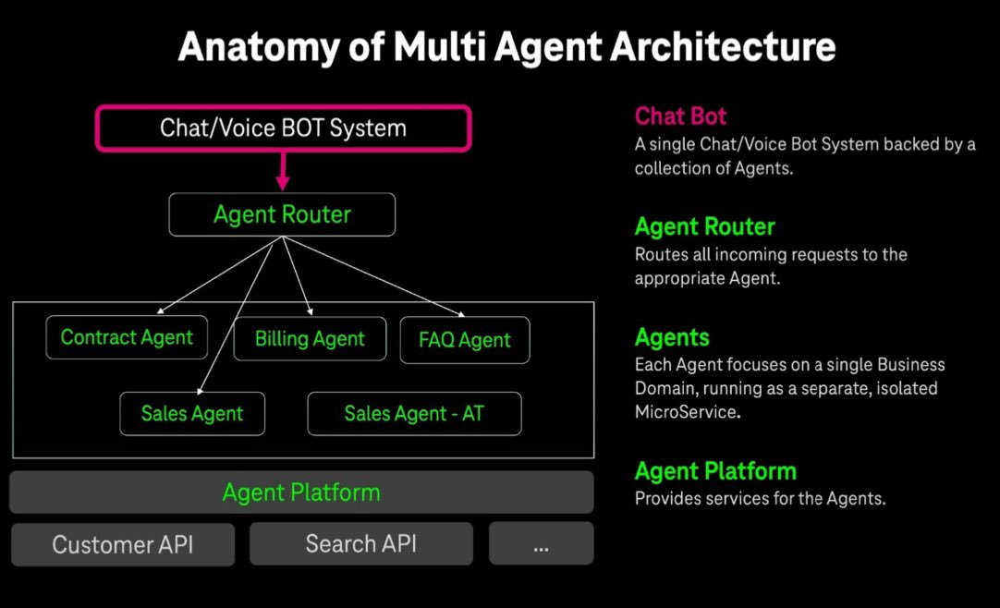

# Open Source Workflow Engines (MIT or Apache)

## Overview

Open source workflow engines provide the foundation for building scalable, customizable agent orchestration systems. These platforms offer the flexibility of open source licensing (MIT or Apache) while providing enterprise-grade capabilities for agent workflow management.

## Major Open Source Platforms

### Flowise

**Repository**: [FlowiseAI/Flowise](https://github.com/FlowiseAI/Flowise)  
**License**: MIT License  
**Technology Stack**: React, NodeJS

**Key Features**:
- Developer-friendly platform for building LLM flows
- Particularly strong for chat flow development
- Visual drag-and-drop interface
- Extensive integration capabilities
- Active community development

**Architecture**:
- **Frontend**: React-based visual flow builder
- **Backend**: NodeJS runtime engine
- **Database**: Support for multiple database backends
- **Integrations**: Extensive third-party service connectors

**Use Cases**:
- Chat application development
- Customer service automation
- Educational AI applications
- Rapid prototyping of conversational agents

**Getting Started**:
```bash
# Installation via npm
npm install -g flowise
npx flowise start

# Or via Docker
docker run -d --name flowise -p 3000:3000 flowiseai/flowise
```

### Flowgram

**Platform**: [Flowgram.ai](https://flowgram.ai/)  
**Developer**: ByteDance  
**License**: Open Source

**Key Features**:
- Node-based flow building engine
- Support for both fixed layout and free connection layout modes
- Enterprise-grade scalability
- Multi-language support
- Advanced workflow orchestration capabilities

**Architecture Components**:
- **Visual Editor**: Drag-and-drop workflow designer
- **Execution Engine**: High-performance workflow runtime
- **Node Library**: Extensive collection of pre-built workflow nodes
- **Integration Layer**: APIs and connectors for external systems

**Use Cases**:
- Complex business process automation
- Multi-step agent workflows
- Enterprise integration scenarios
- Large-scale workflow orchestration

### Sim.ai

**Repository**: [simstudioai/sim](https://github.com/simstudioai/sim)  
**License**: Open Source

**Key Features**:
- Open-source platform for building and deploying AI agent workflows
- Local and cloud hosting options
- Integrated vector database capabilities
- Comprehensive development environment

**Technical Capabilities**:
- **Local Development**: Full local development environment
- **Cloud Deployment**: Seamless cloud deployment options
- **Vector Database**: Built-in vector storage and retrieval
- **Agent Orchestration**: Multi-agent workflow coordination

**Use Cases**:
- AI agent development and testing
- Vector-based knowledge systems
- Hybrid cloud deployments
- Research and development projects

### Eclipse LMOS

**Platform**: [Eclipse LMOS](https://eclipse.dev/lmos/)  
**License**: Eclipse Public License  
**Technology**: Kotlin (with multi-framework support)

**Key Features**:
- Open-source, cloud-native platform for Multi-Agent Systems (MAS)
- Started with Kotlin but supports multiple frameworks
- Enterprise-grade architecture and scalability
- Strong governance and community support through Eclipse Foundation

**Architecture**:


*Multi-Agent System Reference Architecture*

**Technical Components**:
- **Agent Runtime**: Cloud-native agent execution environment
- **Communication Layer**: Inter-agent communication protocols
- **Service Mesh**: Microservices-based architecture
- **Orchestration**: Kubernetes-native deployment and scaling

**Use Cases**:
- Enterprise multi-agent systems
- Cloud-native agent deployments
- Microservices-based agent architectures
- Large-scale distributed agent systems

**Getting Started**:
- **Documentation**: [Eclipse LMOS Documentation](https://eclipse.dev/lmos/documentation/)
- **Community**: Active Eclipse Foundation community
- **Reference**: [InfoQ Multi-Agent Systems Guide](https://www.infoq.com/minibooks/from-chatbots-to-ai-agents/)

## Comparison Matrix

| Platform | License | Primary Language | Strengths | Best For |
|----------|---------|------------------|-----------|----------|
| Flowise | MIT | JavaScript/NodeJS | Chat flows, Visual development | Conversational agents, Rapid prototyping |
| Flowgram | Open Source | Multi-language | Enterprise scale, Flexible layouts | Complex workflows, Enterprise integration |
| Sim.ai | Open Source | Python/JavaScript | Vector DB integration, Hybrid deployment | AI research, Knowledge systems |
| Eclipse LMOS | EPL | Kotlin/Multi | Cloud-native, Enterprise governance | Enterprise MAS, Microservices |

## Technical Considerations

### Deployment Options

**Local Development**:
- All platforms support local development environments
- Docker containers for consistent development experience
- IDE integrations and debugging capabilities
- Local testing and simulation environments

**Cloud Deployment**:
- Kubernetes-native deployment options
- Container orchestration support
- Auto-scaling and load balancing
- Multi-region deployment capabilities

**Hybrid Approaches**:
- Development locally, deploy to cloud
- Multi-cloud deployment strategies
- Edge computing integration
- On-premises and cloud hybrid setups

### Integration Capabilities

**API Integration**:
- RESTful API support across all platforms
- GraphQL support where applicable
- Webhook integration for event-driven workflows
- Custom connector development capabilities

**Database Integration**:
- SQL and NoSQL database support
- Vector database integration (especially Sim.ai)
- Real-time data streaming capabilities
- Data transformation and processing

**Third-party Services**:
- Cloud service provider integrations
- SaaS platform connectors
- Authentication and authorization systems
- Monitoring and observability tools

## Best Practices

### Platform Selection

**Evaluation Criteria**:
1. **License Compatibility**: Ensure license aligns with your project requirements
2. **Community Activity**: Active development and community support
3. **Technical Requirements**: Match platform capabilities with your needs
4. **Scalability**: Consider current and future scaling requirements
5. **Integration Needs**: Evaluate integration capabilities with existing systems

**Decision Framework**:
- **For Chat Applications**: Consider Flowise for rapid development
- **For Enterprise Workflows**: Evaluate Flowgram or Eclipse LMOS
- **For AI Research**: Sim.ai offers strong vector database integration
- **For Microservices**: Eclipse LMOS provides cloud-native architecture

### Implementation Strategy

**Development Approach**:
1. **Start with Proof of Concept**: Build small prototypes to validate approach
2. **Iterative Development**: Implement features incrementally
3. **Community Engagement**: Participate in platform communities
4. **Contribution Strategy**: Consider contributing back to open source projects
5. **Documentation**: Maintain comprehensive documentation for your implementations

**Operational Considerations**:
1. **Monitoring**: Implement comprehensive monitoring and logging
2. **Security**: Follow security best practices for open source deployments
3. **Updates**: Plan for regular platform updates and security patches
4. **Backup and Recovery**: Implement robust backup and disaster recovery
5. **Performance Optimization**: Monitor and optimize performance regularly

## Community and Support

### Community Resources

**Documentation and Tutorials**:
- Official platform documentation
- Community-contributed tutorials and guides
- Video tutorials and webinars
- Best practices and case studies

**Community Channels**:
- GitHub discussions and issues
- Discord/Slack community channels
- Stack Overflow and technical forums
- Regular community meetings and events

**Contribution Opportunities**:
- Bug reports and feature requests
- Code contributions and pull requests
- Documentation improvements
- Community support and mentoring

## Related Sections

- **Section 4**: Agent Development Frameworks
- **Section 5.3.2**: Self-hosted & Limited Open Source
- **Section 6**: Industry Standards (for protocol compatibility)
- **Section 12**: Observability (for monitoring open source deployments)