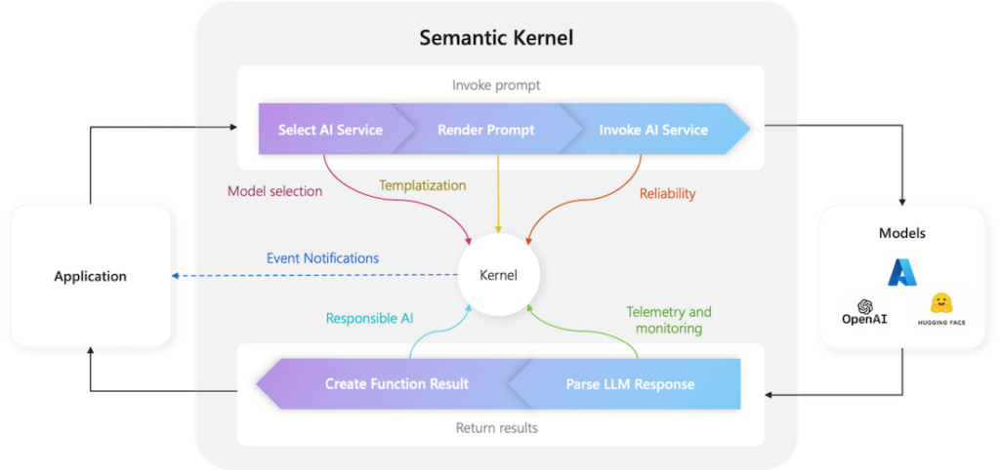

# Agent Development Frameworks

## LangChain

**High-level Architecture**:

{width="5.824535214348207in"
height="3.9135148731408576in"}Source: [LangChain
Documentation](https://python.langchain.com/docs/concepts/architecture/)

**Key Features:**

- [LangChain](https://www.langchain.com/) became a de facto standard for
  building AI Apps with **1M+ builders **with** \~100K GitHub Stars.**

- Comprehensive vendor integration, cloud-vendor support, third-party
  libraries integration, diverse vector databases, and many more.

- Wider community knowledge and developer awareness make it the most
  commonly used framework.

**Suitable for (Pros):**

- Most applicable for enterprise development with wider adoption as a
  standard and community-driven support.

- Building the foundational building blocks of the enterprise
  applications for GenAI---LangChain is best suited for creating
  enterprise-specific frameworks.

- It is best suitable where compatibility with third-party vendors is
  required with a forward-looking view of integration with different
  solutions or products considering the wider adoption of the LangChain
  framework.

- LangChain has inspired developer community to built similar frameworks
  in other languages such as [LangChain4J for
  Java](https://docs.langchain4j.dev/), [LangChainGo for
  Golang](https://tmc.github.io/langchaingo/docs/), and [LangChain for
  C#](https://github.com/tryAGI/LangChain).

**Where other frameworks flare better (Cons):**

- Complexity and increased learning cycle with too many integrations and
  code complexity. For simplicity and specific purposes, other
  frameworks can be considered as per the context.

- Continuous features/changes require developers to keep the code
  updated along with the possibility of breaking changes, incompatible
  libraries, etc.

## LangGraph

**High-level Architecture**:

{width="4.737412510936133in"
height="2.641511373578303in"}

Source: [LangGraph Platform
Architecture](https://langchain-ai.github.io/langgraphjs/concepts/langgraph_platform/#overview)

**Key Features:**

- [LangGraph
  framework](https://langchain-ai.github.io/langgraphjs/concepts/high_level/) is
  an open-source framework provided by the LangChain team
  supporting [agentic
  architecture](https://blog.langchain.dev/what-is-a-cognitive-architecture/).
  LangGraph Platform is a commercial solution for deploying agentic
  applications to production.

- Stateful design, graph-based workflow, multi-agent capabilities,
  native integration with LangChain, enhanced observability with
  LangSmith, IDE support, and wider community support are key features
  of the platform.

**Suitable for (Pros):**

- Most applicable for enterprise multi-agent framework development with
  wider adoption as a standard and community-driven support.

- A wide variety of compatibility is required with a forward-looking
  view of integration with different solutions or products.

- Best suitable within the ecosystem of LangChain combination avoiding
  many frameworks in the enterprise.

**Where other frameworks flare better (Cons):**

- Enterprise-required features such as security, visual development,
  enhanced observability, etc. are supported in the commercial version.

- Like LangChain, the developers have identified handling dependencies
  and the framework's complexity as major obstacles.

## Google ADK

Agent Development Kit (ADK) is a flexible and modular framework
for **developing and deploying AI agents**. While optimized for Gemini
and the Google ecosystem, ADK
is **model-agnostic**, **deployment-agnostic**, and is built
for **compatibility with other frameworks**. ADK was designed to make
agent development feel more like software development, to make it easier
for developers to create, deploy, and orchestrate agentic architectures
that range from simple tasks to complex workflows.

**High-level Architecture:**

{width="6.5in"
height="5.102777777777778in"}

Source: <https://google.github.io/adk-docs/get-started/about/>

**Key Features:**

- Native framework for building and orchestrating agentic workflows on
  Google Cloud

- Tight integration with Vertex AI and Gemini models

- Built-in support for multi-agent coordination and task decomposition

- First-class tool invocation and function calling

- Enterprise-grade security, policy enforcement, and IAM integration

- Observability hooks aligned with Google Cloud logging and monitoring

- Managed deployment and scaling using GCP infrastructure

**Suitable for (Pros):**

- When you are looking for a framework across multiple languages as ADK
  supports **Golang, Java, Python, TypeScript**

- Organizations standardized on Google Cloud and Vertex AI

- Enterprise use cases requiring governed and secure agent deployments

- Large-scale, production-grade multi-agent systems

- Regulated industries needing strong compliance and auditability

- Teams prioritizing managed services over custom infrastructure

- Scenarios benefiting from tight coupling with Gemini model
  capabilities

**Where other frameworks flare better (Cons):**

- Limited flexibility for multi-cloud or on-prem deployments

- Strong dependency on Google Cloud services and ecosystem

- Less suitable for rapid experimentation or research-heavy workflows

- Reduced control over low-level agent state compared to graph-based
  rameworks

- Smaller open-source ecosystem compared to LangGraph, CrewAI, or
  AutoGen

- Slower iteration for teams seeking lightweight, model-agnostic
  frameworks

## AWS Strands Agents

**High-level Architecture:**

{width="6.5in"
height="3.2256944444444446in"}

Reference: <https://strandsagents.com/>

Blog:
<https://aws.amazon.com/blogs/opensource/introducing-strands-agents-an-open-source-ai-agents-sdk/>

**Key Features:**

- **Model-driven, autonomous agent loop** that leverages a foundation
  model for planning, reasoning, tool selection, and execution. [[AWS
  Documentation]{.underline}](https://docs.aws.amazon.com/prescriptive-guidance/latest/agentic-ai-frameworks/strands-agents.html?utm_source=chatgpt.com)

- Lightweight, code-first SDK **with simple Python/TypeScript APIs for
  agent creation and execution.** [[Strands
  Agents]{.underline}](https://strandsagents.com/latest/documentation/docs/?utm_source=chatgpt.com)

- **Model and provider agnostic** --- supports Amazon Bedrock, OpenAI,
  Anthropic, Llama, and other providers via flexible interfaces.
  [[Amazon Web Services,
  Inc.]{.underline}](https://aws.amazon.com/blogs/machine-learning/strands-agents-sdk-a-technical-deep-dive-into-agent-architectures-and-observability/?utm_source=chatgpt.com)

- **Native AWS ecosystem integration** (e.g., AWS Lambda, Step
  Functions, EC2/EKS) for seamless workflows and deployment. [[AWS
  Documentation]{.underline}](https://docs.aws.amazon.com/prescriptive-guidance/latest/agentic-ai-frameworks/strands-agents.html?utm_source=chatgpt.com)

- **Tooling support via Model Context Protocol (MCP)** enabling
  standardized connection to external tools and resources. [[AWS
  Documentation]{.underline}](https://docs.aws.amazon.com/prescriptive-guidance/latest/agentic-ai-frameworks/strands-agents.html?utm_source=chatgpt.com)

- **Multi-agent coordination primitives** including agents-as-tools,
  swarms, graphs, and meta-agents for complex workflows. [[Amazon Web
  Services,
  Inc.]{.underline}](https://aws.amazon.com/blogs/opensource/strands-agents-and-the-model-driven-approach/?utm_source=chatgpt.com)

- **Production-ready observability** with OpenTelemetry support for
  tracing, logging, and metrics. [[Amazon Web Services,
  Inc.]{.underline}](https://aws.amazon.com/blogs/machine-learning/amazon-strands-agents-sdk-a-technical-deep-dive-into-agent-architectures-and-observability/?utm_source=chatgpt.com)

- **Flexible deployment targets** from local development to cloud
  production environments. [[Strands
  Agents]{.underline}](https://strandsagents.com/latest/documentation/docs/?utm_source=chatgpt.com)

**Suitable for (Pros):**

- Ideal for **AWS-centric development teams** seeking deep integration
  with cloud services and infrastructure. [[AWS
  Documentation]{.underline}](https://docs.aws.amazon.com/prescriptive-guidance/latest/agentic-ai-frameworks/strands-agents.html?utm_source=chatgpt.com)

- Excellent choice for **enterprise use cases** requiring security,
  compliance, and controlled deployment patterns. [[AWS
  Documentation]{.underline}](https://docs.aws.amazon.com/prescriptive-guidance/latest/agentic-ai-frameworks/strands-agents.html?utm_source=chatgpt.com)

- Strong option for **autonomous agent workflows** that need flexible
  model selection across providers. [[AWS
  Documentation]{.underline}](https://docs.aws.amazon.com/prescriptive-guidance/latest/agentic-ai-frameworks/strands-agents.html?utm_source=chatgpt.com)

- Simplifies **production readiness** with observability and telemetry
  built into the SDK. [[Amazon Web Services,
  Inc.]{.underline}](https://aws.amazon.com/blogs/machine-learning/amazon-strands-agents-sdk-a-technical-deep-dive-into-agent-architectures-and-observability/?utm_source=chatgpt.com)

- Supports **multi-modal interactions** and collaboration between agents
  for complex problem solving. [[AWS
  Documentation]{.underline}](https://docs.aws.amazon.com/prescriptive-guidance/latest/agentic-ai-frameworks/strands-agents.html?utm_source=chatgpt.com)

- Offers **scalable deployment paths** (Lambda, Fargate, EC2/EKS,
  containerized environments). [[Strands
  Agents]{.underline}](https://strandsagents.com/latest/documentation/docs/?utm_source=chatgpt.com)

**Where other frameworks flare better (Cons):**

- **AWS ecosystem focus** can feel restrictive if you want a truly
  cloud-agnostic or hybrid environment; other frameworks like LangGraph
  or AutoGen may be more neutral. [[AWS
  Documentation]{.underline}](https://docs.aws.amazon.com/prescriptive-guidance/latest/agentic-ai-frameworks/strands-agents.html?utm_source=chatgpt.com)

- **Model-first autonomous loop** may introduce non-determinism that
  complicates debugging and reproducibility compared to frameworks with
  explicit orchestration logic.
  [[Medium]{.underline}](https://germainowono.medium.com/aws-strands-agents-the-model-first-revolution-in-ai-agent-development-27d07d2cbcb9?utm_source=chatgpt.com)

- **Newer ecosystem** with a smaller community and tooling ecosystem
  compared to mature open frameworks like LangChain or CrewAI.
  [[Medium]{.underline}](https://germainowono.medium.com/aws-strands-agents-the-model-first-revolution-in-ai-agent-development-27d07d2cbcb9?utm_source=chatgpt.com)

- Potential for **higher development costs and complexity** early on due
  to model-driven reasoning and reliance on LLM loops.
  [[SelectHub]{.underline}](https://www.selecthub.com/p/ai-agent-frameworks/strands-agents/?utm_source=chatgpt.com)

- Some teams might prefer frameworks with **more explicit workflow
  orchestration** or specialized tools like LangGraph's graph execution
  patterns

## Microsoft Agent Framework

[Microsoft Agent
Framework](https://github.com/microsoft/agent-framework) is an
open-source development kit for building **AI agents** and **multi-agent
workflows** for .NET and Python. It brings together and extends ideas
from [Semantic
Kernel](https://github.com/microsoft/semantic-kernel) and [AutoGen](https://github.com/microsoft/autogen) projects,
combining their strengths while adding new capabilities. Built by the
same teams, it is the unified foundation for building AI agents going
forward.

{width="6.5in" height="2.6875in"}

Source: <https://aka.ms/AgentFrameWork>

{width="6.5in"
height="3.3243055555555556in"}

Source: <https://www.youtube.com/watch?v=JlzteydCK_Q>

**High-level Architecture:**

{width="6.5in"
height="4.331944444444445in"}

**Doc:** <https://learn.microsoft.com/en-us/agent-framework/>

**Key Features:**

- **Unified open-source framework** for building, orchestrating, and
  deploying AI agents and multi-agent workflows in **.NET and Python**
  environments. [[Microsoft
  Learn]{.underline}](https://learn.microsoft.com/en-us/agent-framework/overview/agent-framework-overview?utm_source=chatgpt.com)

- **Combines strengths of Semantic Kernel and AutoGen**, offering
  enterprise grade features (thread-based state management, type safety,
  telemetry, model/embedding support) with intuitive multi-agent
  patterns. [[Microsoft
  Learn]{.underline}](https://learn.microsoft.com/en-us/agent-framework/overview/agent-framework-overview?utm_source=chatgpt.com)

- **AI agents** that process user inputs with LLMs, call tools and MCP
  servers, and generate responses; supports providers such as Azure
  OpenAI and OpenAI. [[Microsoft
  Learn]{.underline}](https://learn.microsoft.com/en-us/agent-framework/overview/agent-framework-overview?utm_source=chatgpt.com)

- **Graph-based workflow orchestration** enabling complex, multi-step
  processes with nesting, conditional routing, parallel execution, and
  human-in-the-loop integration. [[Microsoft
  Learn]{.underline}](https://learn.microsoft.com/en-us/agent-framework/overview/agent-framework-overview?utm_source=chatgpt.com)

- **Foundational building blocks** such as model clients, context
  providers (memory), middleware, and agent threads for state and action
  management. [[Microsoft
  Learn]{.underline}](https://learn.microsoft.com/en-us/agent-framework/overview/agent-framework-overview?utm_source=chatgpt.com)

- **Strong developer infrastructure** with tooling, samples, migration
  guides (from AutoGen / Semantic Kernel), and community contributions.
  [[GitHub]{.underline}](https://github.com/microsoft/agent-framework?utm_source=chatgpt.com)

- **Preview status with open feedback and GitHub ecosystem
  participation** for ongoing improvements. [[Microsoft
  Learn]{.underline}](https://learn.microsoft.com/en-us/agent-framework/overview/agent-framework-overview?utm_source=chatgpt.com)

**Suitable for (Pros):**

- Teams building **enterprise-grade AI agent systems** that need robust
  state management, telemetry, and type safety. [[Microsoft
  Learn]{.underline}](https://learn.microsoft.com/en-us/agent-framework/overview/agent-framework-overview?utm_source=chatgpt.com)

- Organizations standardizing on **.NET or Python** stacks with seamless
  integration into Azure and Microsoft developer tooling.
  [[GitHub]{.underline}](https://github.com/microsoft/agent-framework?utm_source=chatgpt.com)

- Projects requiring **explicit workflow orchestration** with clear
  execution control and coordinator components. [[Microsoft
  Learn]{.underline}](https://learn.microsoft.com/en-us/agent-framework/overview/agent-framework-overview?utm_source=chatgpt.com)

- Use cases where **modularity, reuse, and composability**
  matter---thanks to graph-based workflows, strong typing, and nested
  execution. [[Microsoft
  Learn]{.underline}](https://learn.microsoft.com/en-us/agent-framework/overview/agent-framework-overview?utm_source=chatgpt.com)

- Scenarios involving **long-running processes or human-in-the-loop
  interactions**, supported by checkpoints and flexible flow management.
  [[Microsoft
  Learn]{.underline}](https://learn.microsoft.com/en-us/agent-framework/overview/agent-framework-overview?utm_source=chatgpt.com)

- Developers who want a **single unified framework** instead of piecing
  together multiple agent libraries. [[Microsoft
  Learn]{.underline}](https://learn.microsoft.com/en-us/agent-framework/overview/agent-framework-overview?utm_source=chatgpt.com)

**Where other frameworks flare better (Cons):**

- **Less cloud-agnostic:** Tighter coupling with Microsoft ecosystems
  may be suboptimal compared to more neutral or multi-cloud frameworks
  (e.g., LangGraph, CrewAI) for heterogeneous deployments.
  [[GitHub]{.underline}](https://github.com/microsoft/agent-framework?utm_source=chatgpt.com)

- **Still in preview:** Production-critical applications may prefer more
  mature frameworks with wider community adoption and stability.
  [[Microsoft
  Learn]{.underline}](https://learn.microsoft.com/en-us/agent-framework/overview/agent-framework-overview?utm_source=chatgpt.com)

- **Complexity for simple tasks:** High-level orchestration and strong
  typing may be overkill for lightweight or quick proof-of-concept
  agents compared to simpler SDKs. [[Microsoft
  Learn]{.underline}](https://learn.microsoft.com/en-us/agent-framework/overview/agent-framework-overview?utm_source=chatgpt.com)

- **Smaller ecosystem:** Emerging community and tooling base relative to
  long-standing open frameworks like LangChain or standalone agent SDKs
  with larger contributor networks.
  [[GitHub]{.underline}](https://github.com/microsoft/agent-framework?utm_source=chatgpt.com)

- **Azure influence:** While supporting multiple providers, developers
  seeking **full control over model and runtime choices outside
  Azure/Azure AI** may find constraints or extra integration work.
  [[Microsoft
  Learn]{.underline}](https://learn.microsoft.com/en-us/agent-framework/overview/agent-framework-overview?utm_source=chatgpt.com)

## Autogen

**High-level Architecture:**

{width="6.5in"
height="4.309722222222222in"}Source: [Autogen
(0.4)](https://www.microsoft.com/en-us/research/project/autogen/)

**Key Features:**

- [Autogen](https://microsoft.github.io/autogen/0.2/) is a programming
  framework, developed by Microsoft, for building Agentic AI agents and
  applications. It provides a multi-agent conversation framework as a
  high-level abstraction.

- Asynchronous messaging, modular and extensible, observability and
  debugging, scalable and distributed, built-in and community
  extensions, cross-language support, and full-type support are key
  features of the Autogen framework.

- AutoGen supports enhanced LLM inference APIs, which can be used to
  improve inference performance and reduce cost.

**Suitable for (Pros)**:

Software

- When alignment with open-source and Microsoft ecosystems is prevalent,
  Autogen is a suitable solution for building agentic applications and
  AI agents.

- AutoGen offers an evolving ecosystem to support a wide range of
  applications from various domains and complexities. It also has
  an [Autogen studio UI
  application](https://www.microsoft.com/en-us/research/blog/introducing-autogen-studio-a-low-code-interface-for-building-multi-agent-workflows/) for
  prototyping and managing agents without writing code.

**Where other frameworks flare better (Cons):**

- Autogen continues to be experimental (not completely production-ready)
  and not production-ready. If you are researching complex agent
  interactions, prototyping new multi-agent systems, or want to
  experiment with advanced AI agent designs.

- While Autogen is an open-source solution, dependency on Microsoft
  solutions can be a consideration based on the organizational
  context. [Magentic-One](https://www.microsoft.com/en-us/research/articles/magentic-one-a-generalist-multi-agent-system-for-solving-complex-tasks/) is
  a commercial solution, built on top of Autogen, offering advanced
  capabilities such as a high-performing generalist agentic system for
  enterprises.

- The complexity of setting up Autogen, particularly within an
  enterprise has been observed as a key concern.

## Semantic Kernel

**High-level Architecture:**

{width="6.5in"
height="3.058333333333333in"}Source: [Semantic Kernel
Docs](https://learn.microsoft.com/en-us/semantic-kernel/concepts/kernel)

**Key Features:**

- [Semantic
  Kernel ](https://learn.microsoft.com/en-us/semantic-kernel/overview/)(by
  Microsoft) is designed for creating stable, enterprise-ready
  applications with strong integration capabilities.

- As per Microsoft -- Semantic Kernel is a production-ready SDK that
  integrates large language models (LLMs) and data stores into
  applications, enabling the creation of product-scale GenAI solutions.
  Semantic Kernel supports multiple programming languages: C#, Python,
  and Java. Semantic Kernel has an Agent and Process Frameworks in
  preview, enabling customers to build single-agent and multi-agent
  solutions.

- It has inbuilt core frameworks as Agent Framework and Process
  Framework. *The* *Semantic Kernel Agent Framework* provides a platform
  within the Semantic Kernel ecosystem that allows for the creation of
  AI **agents** and the ability to incorporate **agentic patterns** into
  any application. *The* *Semantic Kernel Process Framework* provides an
  approach to optimize AI integration with your business processes.

**Suitable for (Pros):**

Mobile Apps & Add-Ons

- If you need to build a reliable AI agent for a production environment
  with strong enterprise-level support and integration with existing
  systems.

- When SDKs are needed in multiple languages as Semantic Kernel supports
  Python, C#, .Net, and Java.

- Developer training support with enterprise support is available,
  particularly in the Microsoft Azure environment. Check out the course
  on using Semantic Kernel with Azure by [clicking
  here](https://learn.microsoft.com/en-us/training/paths/develop-ai-agents-azure-open-ai-semantic-kernel-sdk/?source=recommendations).

**Where other frameworks flare better (Cons):**

- Semantic Kernel falls into the category of SDK whereas the competitive
  frameworks provide higher-level abstractions and user interfaces for
  simpler agents.

- Agent framework is still evolving (Agents are currently not available
  for Java).

- When vendor dependency on Microsoft needs to be avoided, other options
  can be considered as per the context.

## LlamaIndex

**High-level Architecture:**

{width="6.5in"
height="4.7340277777777775in"}Source: [LlamaIndex
Framework](https://www.llamaindex.ai/framework)

**Key Features:**

- [LlamaIndex](https://www.llamaindex.ai/) started with data framework
  capabilities for LLM applications and has evolved to cover AI agents,
  document parsing & indexing, workflow, connectors-based integration,
  modularity & extensibility, and many more capabilities.

- It offers a SaaS capability
  as [LlamaCloud](https://cloud.llamaindex.ai/) as a knowledge
  management hub for AI
  Agents. [LlamaParse](https://www.llamaindex.ai/llamaparse) is a
  differentiated offering for transforming instructed data into
  LLM-optimized formats.

- [LlamaHub](https://llamahub.ai/) is a great initiative as a
  centralized place to explore Agents, LLMs, Vector Stores, Data
  Loaders, etc.

**Suitable for (Pros):**

Development Tools

- As an alternative to LangChain, LlamaIndex has evolved as a compelling
  alternative, particularly for data-intensive LLM applications.

- The ability to parse and index complex documents efficiently with
  LlamaCloud makes it a compelling option for enterprises seeking
  quicker time-to-market.

- Building knowledge-intensive AI systems like chatbots and
  question-answering systems.

**Where other frameworks flare better (Cons):**

- Primarily focused on data indexing and retrieval, with less emphasis
  on complex agent behaviors and decision-making. However, the evolution
  of the framework towards building Agentic apps provides promising
  capabilities.

## AutoGPT

**High-level Architecture:**

{width="6.5in"
height="4.80625in"}AutoGPT Platform Components

**Key Features:**

- [AutoGPT](https://github.com/Significant-Gravitas/AutoGPT), built by
  Significant Gravitas, is a powerful platform that allows you to
  create, deploy, and manage continuous AI agents that automate complex
  workflows. It was originally built on top of OpenAI's GPT but extended
  to support additional LLMs (Anthropic, Groq, Llama).

- Key features: Seamless Integration and Low-Code Workflows, Autonomous
  Operation and Continuous Agents, Intelligent Automation and Maximum
  Efficiency, Reliable Performance and Predictable Execution

**Suitable for (Pros):**

Educational Resources

- No code or low-code-centric approach for building agents is preferred
  with the ability to build the agents in the Cloud (while it offers a
  self-hosted solution, the setup complexity is higher).

**Where other frameworks flare better (Cons):**

- Vendor dependency and lock-in to access advanced features can be key
  concerns for enterprises. The cloud-hosted solution is in the roadmap
  and currently being offered to waitlist consumers.

- The complexity of licensing support -- currently it has dual licensing
  support while the majority is being offered as an MIT license.

- Additional LLM support such as Google's Gemini and more will continue
  to be be a key challenge along with community support.

## CrewAI

**High-level Architecture:**

{width="6.5in"
height="4.457638888888889in"}Source: [CrewAI
Documentation](https://docs.crewai.com/introduction)

**Key Features:**

- [CrewAI](https://www.crewai.com/) emerged as a promising multi-agent
  framework to build and deploy workflow-based applications with support
  from a wide array of LLMs and Cloud providers.

- Multi-agent collaboration, structured workflow design, user-friendly
  interface, integration flexibility, and community support are salient
  features of CrewAI.

**Suitable for (Pros):**

Software

- CrewAI has emerged as the fastest growing AI agents ecosystem and
  raised [funding of
  \$18M](https://siliconangle.com/2024/10/22/agentic-ai-startup-crewai-closes-18m-funding-round/) in
  Oct 2024. The simplicity of creating business-friendly agents has made
  it easy to understand realizing the value of GenAI quickly.

- Quicker time-to-market with out-of-the-box customization and more
  suitable for building lightweight agents such as marketing agents.

**Where other frameworks flare better (Cons):**

- The ability to handle large enterprise-specific complex scenarios with
  data integration has not been production-tested and will need to be
  assessed in the future.

- The vendor dependency and lock-in have been a key consideration and
  the possibility of CrewAI to be acquired by one of the hyperscalers or
  other players remains an open question.

## PydanticAI

**High-level Architecture:**

{width="6.5in"
height="4.680555555555555in"}PydanticAI Components

**Key Features:**

- [**PydanticAI**](https://ai.pydantic.dev/): Built by the Pydantic team
  to bring that FastAPI feeling to GenAI app development. Integration
  with [Pydantic Logfire](https://pydantic.dev/logfire) for GenAI
  application's observability along with the support for multiple LLMs
  and ecosystem support.

- The salient features are the Pydantic approach, model agnostic
  implementation, real-time observability, type-safety, graph-support
  with [Pydantic Graph](https://ai.pydantic.dev/graph/), dependency
  injection, and simplicity.

**Suitable for (Pros):**

Machine Learning & Artificial Intelligence

- Applications leveraging Pydantic and FastAPI approach and looking for
  simple framework aligned with associated enterprise technology stack.

- It is suitable for simple scenarios as the framework is still
  evolving.

**Where other frameworks flare better (Cons):**

- This framework is still in the early stages (beta) and is expected to
  introduce many changes as it progresses.

## Spring AI

**High-level Architecture:**

{width="6.5in"
height="4.295833333333333in"}Source: [Spring AI for Building Agentic
Systems](https://spring.io/blog/2025/01/21/spring-ai-agentic-patterns)

**Key Features:**

- [**Spring AI**](https://spring.io/projects/spring-ai) is inspired by
  LangChain, Spring AI leverages Spring ecosystems to build GenAI
  applications in Java ecosystem.

- Key features include support for multiple
  LLMs, [observability](https://docs.spring.io/spring-ai/reference/observability/index.html) features
  in the Spring ecosystem, model evaluation, [Advisors
  API](https://docs.spring.io/spring-ai/reference/api/advisors.html) for
  encapsulating recurring Generative AI patterns, chat conversations,
  and RAG.

**Suitable for (Pros):**

Development Tools

- With enterprise GenAI applications leveraging the Spring ecosystem, it
  alleviates the need for learning additional frameworks or languages.

- It provides seamless integration with the broader Spring ecosystem to
  leverage the libraries available for data connectivity, asynchronous
  processing, system integration, and more.

**Where other frameworks flare better (Cons):**

- Spring AI is relatively novel and still in the early stages -- it
  needs to be compared with features required in a complex business
  scenario to consider alternative frameworks.

## Haystack

**High-level Architecture:**

{width="6.5in"
height="3.9090277777777778in"}Source: [Haystack](https://haystack.deepset.ai/overview/intro)

**Key Features:**

- [**Haystack**](https://haystack.deepset.ai/) (built by deepset) is an
  open-source framework or building production-ready LLM
  applications, RAG pipelines, and complex search applications for
  enterprises.

- It has been built applying modular architecture principles combining
  technology from  OpenAI, Chroma, Marqo, and other open-source
  projects, like Hugging Face's Transformers or Elasticsearch.

**Suitable for (Pros):**

Mobile Apps & Add-Ons

- It is suitable for building LLM applications for any Cloud with
  deepsetCloud as an LLM AI platform, which provides in-built LLMOps
  capabilities.

- A custom RAG pipeline with Jinja templates for components.

- deepset Studio is a free AI application development environment
  for [Haystack](https://haystack.deepset.ai/), which augments the
  development lifecycle.

**Where other frameworks flare better (Cons):**

- Multi-agent capabilities are yet to be battle-tested and the roadmap
  needs to be reflected to understand the bigger picture.

## Other Frameworks

- [**OpenAI Swarm**](https://github.com/openai/swarm): An educational
  framework (not production-ready) exploring ergonomic, lightweight
  multi-agent orchestration.

- [**MetaGPT**](https://github.com/geekan/MetaGPT): A multi-agent
  framework of AI agents, built by researchers ([research
  paper)](https://arxiv.org/abs/2308.00352), promotes the idea of
  meta-programming.

- [**Flowise**](https://flowiseai.com/): An open-source framework
  providing drag-and-drop UI to build agents with customized LLM flows.

- [**Langflow**](https://www.langflow.org/): An open-source framework
  (acquired by DataStax) to build flow-based GenAI apps interactively.

- [**OpenAGI**](https://openagi.aiplanet.com/): A simple framework,
  built by AI Planet, for building human-like agents.

- [**Camel-AI.org**](http://camel-ai.org/): An open-source multi-agent
  framework to build customizable agents, inspired by a research
  paper [CAMEL](https://arxiv.org/abs/2303.17760) (Communicative Agents
  for "Mind" Exploration of Large Language Model Society).

- DAPR Agents:

- **PraisonAI**: a production-ready Multi AI Agents framework, designed
  to create AI Agents to automate and solve problems ranging from simple
  tasks to complex tasks.

- [**BroadAI**](https://broad-ai.github.io): A Multi-Agent Framework for
  building powerful & intelligent AI Systems

- [**Vellum**](https://www.vellum.ai/): A platform with products for
  Orchestration, Evaluation, Prompting, Retrieval, and Deployment - as a
  GUI tool for building and testing complex workflows.

- [**Rivet**](https://rivet.ironcladapp.com/): a drag and drop GUI LLM
  workflow builder

- Solace Agent Mesh

- Akka Agent Platform
